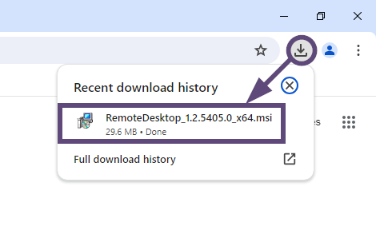
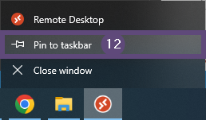
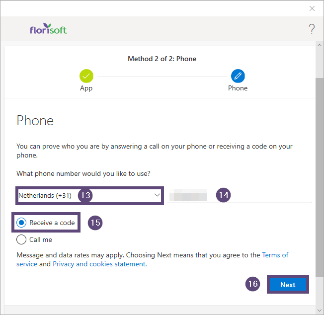
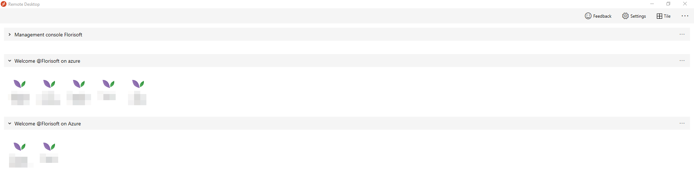
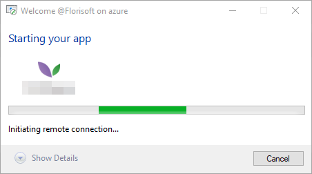

# Florisoft handleiding connectie naar Azure werkomgeving

Welkom bij de florisoft handleiding over het verbinden naar uw Azure werkomgeving. Azure is een webserver hosting platform wat wij gebruiken om onze Florisoft applicatie op te draaien. De Azure omgeving waarin uw Florisoft draait wordt ook wel een Workspace genoemd. 

Voordat uw gebruikers Florisoft kunnen starten moeten ze eerst inloggen op hun Azure workspace zodat vanuit daar Florisoft gestart kan worden. 

Deze handleiding beschrijft de nodige stappen voor het opzetten van een remote desktop connectie naar uw Azure workspace. 

Na deze introductie, legt hoofdstuk 1 uit hoe u de remote desktop applicatie installeert. Vervolgens legt hoofdstuk 2 uit welke instellingen u moet aanapassen in de remote desktop applicatie. 

Hoofdstuk beschrijft daarna hoe u Florisoft start in uw Remote desktop connectie. 

Tenslotte leest in u in hoofdstuk 4 hoe inlogt op de Azure workspace vanuit uw webbrowser

## Inhoudsopgave

[Installeren van Remote Desktop](#1-installeren-van-de-remote-desktop-applicatie)  
[Configureren van remote desktop voor Azure](#2-configureren-van-remote-desktop-voor-azure)  
[Start de Florisoft software via de Remote Desktop applicatie](#3-start-de-florisoft-software-via-de-remote-desktop-applicatie)  
[Het starten van de Florisoft applicatie vanuit de webbrowser](#4-het-starten-van-de-florisoft-applicatie-vanuit-de-webbrowser)  

## 1. Installeren van de Remote Desktop Applicatie

Remote desktop is een Windows applicatie dat gebruikt wordt om in te loggen op Azure workspaces, vanuit hier opent u dan weer Florisoft. Volg de onderstaande stappen om de Remote Desktop applicatie te installeren. 

|Stap|Uitleg|
|:-:|:--|
|**1**|Open uw webbrowser (bijv. Google Chrome of Edge).|
|**2**|Kopieer en plak de onderstaande URL in de adres balk: https://go.microsoft.com/fwlink/?linkid=2139369 (no. 1)

<b>Klik hier voor uw voorbeeld!</b>

|
|**3**|Druk op de Enter toets op uw toetsenbord  Verolgens opent een Windows dialoog **opslaan als:**|
|**4**|Kies de locatie waarin u het installatiebestand (2) wilt opslaan.  Standaard is dit de downloads map maar dit mag elke locatie op uw computer zijn.

<b>Klik hier voor uw voorbeeld!</b>

|
|**5**|Klik op de **Opslaan** knop om het installatiebestand op de gekozen locatie op te slaan.

<b>Klik hier voor uw voorbeeld!</b>

|
|**6**|Via de Windows verkenner navigeert u naar de door uw gekozen download locatie (stap 4), in deze map vindt u dus het installatiebestand.|
|**7**|Klik tweemaal (linker muisknop) op het installatiebestand om de installatie te starten.

<b>Klik hier voor uw voorbeeld!</b>

|
|**8**|Klik op de next **volgende** knop in het eerste scherm om door te gaan.

<b>Klik hier voor uw voorbeeld!</b>

|
|**9**|Accepteer de condities en de licentie overeenkomst.

<b>Klik hier voor uw voorbeeld!</b>

|
|**10**|Klik nogmaals op de **volgende** knop om door te gaan met de installatie.|
|**11**|Kies hier voor de keuze **Intallatie voor de huidige gebruiker**|
|**12**|Klik op de knop **Installeren** om de daadwerkelijke installatie te starten, deze installatie kan enkele minuten duren.

<b>Klik hier voor uw voorbeeld!</b>

|
|**13**|Zet vervolgens een vinkje neer bij de optie **Start Remote Desktop wanneer installatie voltooid is**.|
|**14**|Klik vervolgens op de afronden knop om de installatie te voltooien, vervolgens zal na een aantal seconden de remote desktop applicatie starten. 

<b>Klik hier voor uw voorbeeld!</b>

|
|**15**|Klik met de rechtermuisknop op het Remote Desktop applicatie icoon op taakbalk (onderin het scherm) en klik op de optie vastmaken aan taakbalk.

<b>Klik hier voor uw voorbeeld!</b>

|

Vanaf nu zal de Remote Desktop applicatie vast zitten aan de talkbalk zodat u het de volgende keer eenvoudig en snel kan starten. 

Lees nu verder in hoofdstuk twee hoe de remote desktop applicatie correct configureert zodat u in kan loggen op uw Azure workspace. 

## 2. Configureren van Remote Desktop voor Azure

*Volg de onderstaande stappen om de correcte instellingen aan te passen voor logboekadministratie in uw Azure werkomgeving.* 

|Stap|Uitleg|
|:-:|:--|
|**1**|Start de remote desktop applicatie (indien dit het nog niet draaide). De applicatie kan geopend worden door op het icoon op de taakbalk te klikken.

<b>Click here for the example image!</b>

|
|**2**|Indien de applicatie al draaide zal het venster zichtbaar worden. 

<b>Klik hier voor uw voorbeeld!</b>

|
|**3**|Vul de onderstaande URL in het Email Workspace URL veld: https://rdweb.wvd.microsoft.com (nr. 2)

<b>Klik hier voor uw voorbeeld!</b>

|
|**4**|Klik vervolgens op de **volgende** knop om door te gaan (nr. 3).|
|**5**|Vul vervolgens het Azure gebruikersnaam, Email, telefoonnummer of SkypeId veld in.

<b>Klik hier voor uw voorbeeld!</b>

|
|**6**|Klik vervolgens op de **Volgende** knop (nr. 5)|
|**7**|Vul vervolgens het **Wachtwoord** veld voor de desbetreffende gebruiker in (nr. 6).

<b>Klik hier voor uw voorbeeld!</b>

|
|**8**|Klik op de **Log in** knop om door te gaan (nr. 7). Een nieuw scherm opent met een melding dat meer informatie nodig is.

<b>Klik hier voor uw voorbeeld!</b>

|
|**9**|Klik vervolgens op de **volgende** knop om door te gaan.

<b>Klik hier voor uw voorbeeld!</b>

|

Vanaf hier is het veeist dat u gebruik maakt van de Microsoft Authenticator app op uw smart telefoon. Deze app heeft u nodig om in te kunnen loggen in uw Azure werkomgeving.

*Volg de onderstaande stappen om de Microsoft authenticator te installeren*: 

|Stap|Uitleg|
|:-:|:--|
|**1**|Open de App store of Play store (afhankelijk van uw smartphone fabrikant)|
|**2**|Zoek voor de Microsoft Authenticator app.|
|**3**|Klik op het juiste zoekresultaat (**Microsoft Authneticator) app uitgever Microsoft**.|
|**4**|Klik op de installatie kop om de app te installeren, klik verolgens de nodige bevestigingsmeldingen weg.   Wanneer de app klaar is met installeren staat deze in de applicatielijst(scherm) van uw telefoon.|
|**5**|Open de Microsoft Authenticator door op het App icoon te klikken.|
|**6**|Klik vervolgens op de **Accepteer** knop om akkoord te gaan met de nodige privacy instellingen.   U kan de instelling **help de Authenticator app te verbeteren door het delen en gebruik van data uit**.|
|**7**|Klik vervolgens op de **doorgaan** knop om door te gaan.|
|**8**|Klik vervolgens op de **Overslaan** knop (rechts bovenin in de app) om door te gaan.|
|**9**|Klik op de account toevoegen knop in het eerste account toevoegen scherm.|
|**10**|Kies nu voor de optie: Werk- of schoolaccount optie.|
|**11**|Kies nu voor de optie om een QR-code te scannen.|
|**12**|Sta vervolgens de authenticator app toe om gebruik te maken van de camera van uw telefoon.|
|**13**|Scan vervolgens de QR code op uw scherm (no.11)

<b>Klik hier voor uw voorbeeld!</b>

|
|**14**|Geef vervolgens de authetnicator app de rechten om notificatie berichten te versturen. Als de QR-code correct gescand word zal het onderstaande nu op uw scherm te zien zijn:

<b>Klik hier voor uw voorbeeld!</b>

|
|**15**|Klik vervolgens op de **Volgende** knop om door te gaan (nr. 12)  **Het onderstaande scherm komt niet altijd voor, indien het niet opkomt klikt u op de knop VOLGENDE om door te gaan**.

<b>Klik hier voor uw voorbeeld!</b>

|
|**16**|Kies vervolgens voor het juiste land in de dropdown lijst (nr. 13).|
|**17**|Vul vervolgens uw mobiele telefoonnumer in (nr. 14)|
|**18**|Kies voor de optie **Code ontvangen** (nr. 15)|
|**19**|Klik op de **Volgende** knop om door te gaan (nr. 16)   Indien alles goed gaat zal u binnen enkele ogenblikken een code ontvangen op het door u doorgegeven telefoonnummer.|
|**20**|Vul deze code vervolgens in bij het bijhorende veld op uw Telefoon of in de Remote Desktop applicatie.  Als alles goed gegaan is zal uw account nu zichtbaar worden in de Authenticator app.|

Na het doorlopen van deze stappen staat uw account gekoppeld aan uw Microsoft Authenticator. 

 Daarnaast is uw Florisoft Azure workspace ook gelijk ingeladen in uw Remote Desktop app. Wanneer dit goed voltooid is zal dit er ongeveer zo uit zien:

 

Alle stappen van hoodstukken 1 & 2 moeten voltooid zijn op het apparaat waarop u van plan bent Florisoft bent te gebruiken. Dit hoeft echter maar eenmaal gedaan te worden. 

## 3. Start de Florisoft software via de Remote Desktop applicatie

*Dit hoofdstuk beschrijft de nodige stappen om de Florisoft software te starten vanuit de Azure workspace.*

|Stap|Uitleg|
|:-:|:--|
|**1**|Open de Remote Desktop app door op het taakbalk icoon te drukken. (nr. 1)

<b>Klik hier voor uw voorbeeld!</b>

|
|**2**|Klik tweemaal (linkermuisknop) op het Florisoft icoon om het loginproces te starten.

<b>Klik hier voor uw voorbeeld!</b>

Het login proces wordt nu gestart:

<b>Klik hier voor uw voorbeeld!</b>

Vervolgens zal na een aantal seconden een loginprompt zichtbaar worden:

<b>Klik hier voor uw voorbeeld!</b>

|
|**3**|Vul nu uw gebruikersnaam in (zelfde als in hoodstuk 1) bij het gebruikersnaamveld.|
|**4**|Vul nu uw wachtwoord in (zelfde in hoofdstuk 2) bij het wachtwoordveld.|
|**5**|Klik vervolgens op de **Oke** knop om door te gaan (nr. 4). De verbinding wordt ondertussen opgezet.

<b>Klik hier voor uw voorbeeld!</b>

 Na een aantal seconden zal het Flporisoft laadscherm openen, nadat dit klaar is met laden ziet u het volgende scherm:

<b>Klik hier voor uw voorbeeld!</b>

|
|**6**|Vul nu uw userid in bij het **userId** veld (nr. 5)|
|**7**|Vul nu uw wachtwoord in bij het **wachtwoord** veld (nr 6.)|
|**8**|Klik nu op de **Ok** knop om in te loggen (nr. 7), nadat u dit gedaan heeft zal de Florisoft navigator op uw scherm openen.

<b>Klik hier voor uw voorbeeld!</b>

|

Vanaf hier kan u Florisoft vrij uit gebruiken.

## 4. Het starten van de Florisoft applicatie vanuit de webbrowser

Een andere mogelijkheid is om Florisoft te opennen in uw browser. Volg de onderstaande stappen om te loggen op Florisoft via uw browser.

|Stap|Uitleg|
|:-:|:--|
|**1**|Start een webbrowser (bijv. Google Chrome of Microsoft Edge).|
|**2**|Kopieër en plak de Azure Workspace URL in de adresbalk van de browser en druk op Enter: **URL:** ttps://client.wvd.microsoft.com/arm/webclient/|
|**3**|Vul uw gebruikersnaam in bij het **Email of Telefoon** veld (nr. 2)|
|**4**|Klik vervolgens op de **Volgende** knop (nr. 3)|
|**5**|Vul vervolgens het wachtwoord in bij het **wachtwoord** veld(nr. 4).

<b>Klik hier voor uw voorbeeld!</b>

 |
|**6**|Klik op de **login** knop om in te loggen op uw worksapce (nr. 5) Een getal wordt nu op uw scherm zichtbaar wat gebruikt moet worden om de gebruiker in te loggen.

<b>Klik hier voor uw voorbeeld!</b>

|
|**7**|The authenticator app zal nu een popup scherm openen waarin het nummer van de vorige stap ingevuld moet worden.|
|**8**|Bevestig het popup scherm in de authenticator app.   In de browser wordt u nu gevraagd om ingelogd te blijven of dat deze login maar voor één sessie is. |
|**9**|Kies voor de optie om maar voor één sessie wit inloggen, vanuit een beveiligingsperspectief is dit de veiligere optie.  Na een aantal seconden opent de workspace in de brower (dit ziet er hetzelfde uit als in de Remote Desktop applicatie).

<b>Klik hier voor uw voorbeeld!</b>

|
|**10**|Klik een keer op het Florisoft icoon (nr. 6) om de applicatie te starten.

<b>Klik hier voor uw voorbeeld!</b>

Een nieuw popup scherm opent met wat standaard instellingen (zie het onderstaande screenshot)

<b>Klik hier voor uw voorbeeld!</b>

|
|**11**|Klik op de **Toestaan** knop om de instellingen te bevestigen en door te gaan (nr. 7). Een nieuw login scherm opent

<b>Klik hier voor uw voorbeeld!</b>

|
|**12**|Vul uw gebruikersnaam en wachtwoord in bij de respectievelijke velden (nr. 11 & 12)|
|**13**|Klik op de **Login** knop om door te gaan (nr. 10).  Dit opent een klein popup scherm waarin de verbinding met de server wordt opgezet.

<b>Klik hier voor uw voorbeeld!</b>

|
|**14**|Vul het UserId en Wachtwoord en bij de respectievelijke velden (nr. 11 & 12)/|
|**15**|Klik op de **Ok** knop (of de Enter toets) om in te loggen op de Florisoft applicatie.(nr. 13)|

Na een aantal seconden opent het Florisoft startscherm:

Vanaf dit punt kan u Florisoft gebruiken zoals u dat gewend bent. 
