<!--
keywords: Windows App, Azure, Microsoft app, Microsoft, Azure Virtual Desktop, RDP, Remote Desktop
product: Windows app
type: Manual
-->

# Florisoft Manual Azure Workspace Connection Set-Up

Welcome to the setup manual for connecting to your Florisoft Azure workspace. Azure is a virtual server (cloud) environment on which your Florisoft client is hosted. 

Before we can access your Florisoft application we will need to set-up the client that lets you connect to the Azure environment. This manual covers the initial set-up for this client.

The manual is split in two parts: installation of the client and access by authenticating in the browser. We will soon add the option to authenticate from an android device, however this is currently in development. 

## Installation Windows App

|Step|Explanation|
|:-:|:--|
|**1**|Open the Microsoft store on your local Windows device.

<b>Click here for the example image!</b>
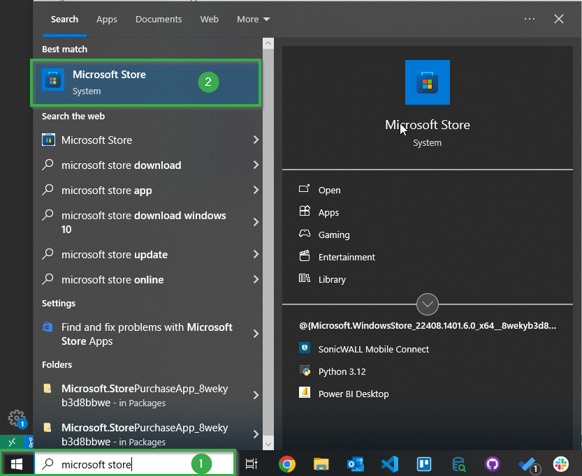
|
|**2**|In the Microsoft Store search for the following "Windows App", click on the search result.

<b>Click here for the example image!</b>
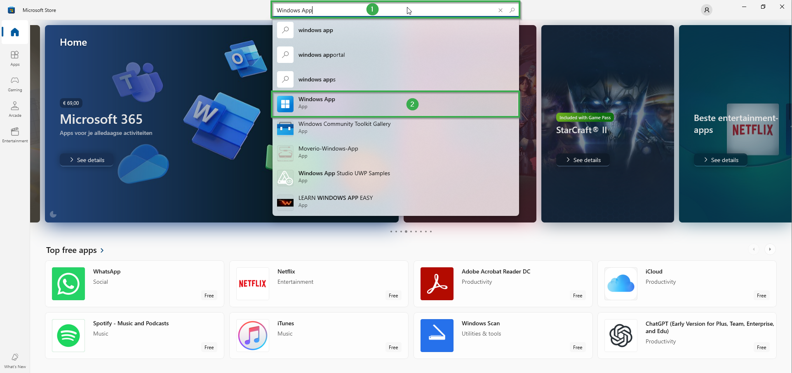
|
|**3**|Once on the app's page, click on the **Get** button, this installs the application for you on your local Windows device.

<b>Click here for the example image!</b>
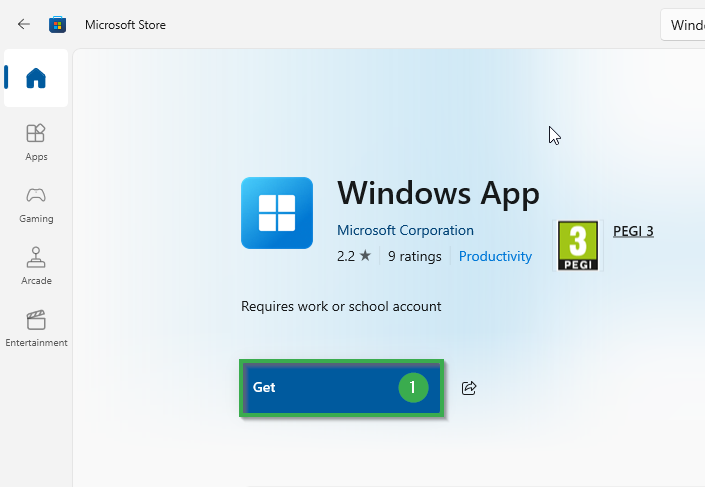
|
|**4**|Once the app is installed open it. When opened click on the **Sign in** button. 

<b>Click here for the example image!</b>
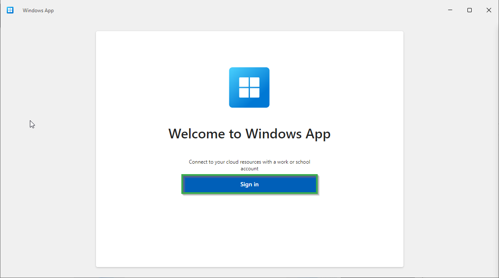
|
|**5**|You will now be prompted with a form asking you for your email address, enter the email of the account provided to you by Florisoft. Click on the **next** button.

<b>Click here for the example image!</b>
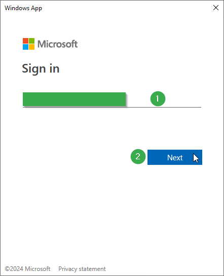
|
|**6**|You should now see a new prompted screen, this time with the entered email address and a Florisoft logo. In this screen you will need to enter your password (this has also been provided to you by Florisoft). Click on the **Sign in** button. 

<b>Click here for the example image!</b>
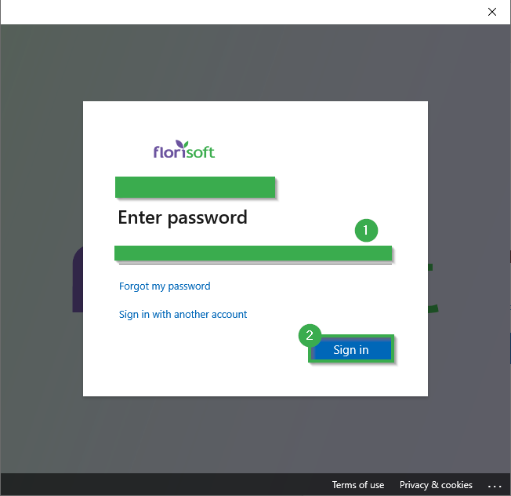
|
|**7**|If it is your first time logging into the Windows App application you will be prompted with a short tour. You can either click through it using the **next** button or skip it entirely using the **skip** button.|
|**8**|On the left taskbar, select either the tab **Devices** or **Apps** depending on your access level.  The difference between the two is that with device you will get an entire Windows environment (not unlike remote desktop), but with Apps you will open the Florisoft client like it is running on your local device.

<b>Click here for the example image!</b>
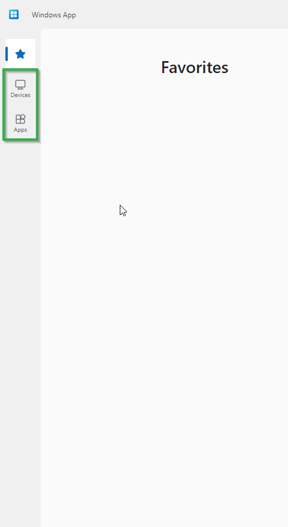
|
|**9**|To connect to an Azure virtual Desktop device simply click on the Connect button, in the device's card in the **Devices** section.

<b>Click here for the example image!</b>
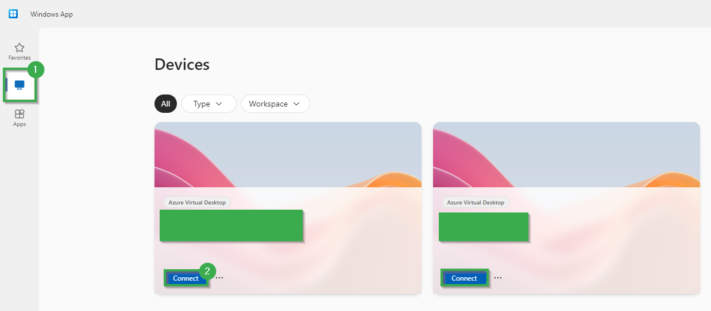
|
|**10**|To connect to an Azure Virtual app go to the **Apps** section and simply clik on an App's card.

<b>Click here for the example image!</b>
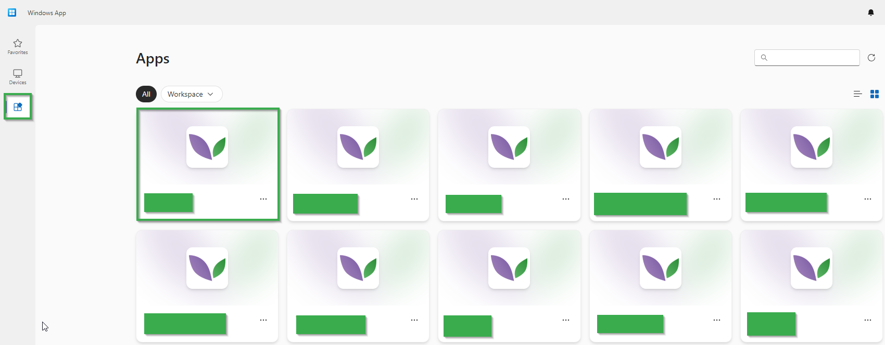
|
|**11**|Once you are starting a connection to either a virtual app or desktop you will once again be prompted with an authentication prompt. Simply enter your password again and click on **Ok**. 

<b>Click here for the example image!</b>
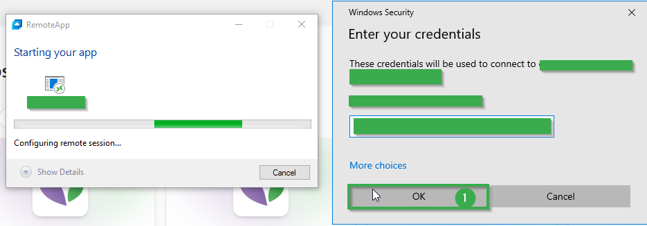
|
|**12**|You should now be prompted with either a virtual desktop environment or a Florisoft Login screen.

<b>Click here for the example image!</b>
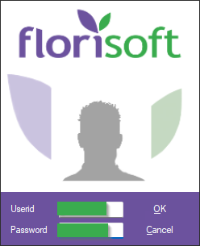
|

## Authenticating using the browser

|Step|Explanation|
|:-:|:--|
|**1**|Open your browser and go to: https://windows.cloud.microsoft/|
|**2**|Sign in using your Azure account email (provided to you by Florisoft) and click on the **next** button.

<b>Click here for the example image!</b>

|
|**3**|Enter your password (also provided by Florisoft) and click on the **Sign in** button.

<b>Click here for the example image!</b>
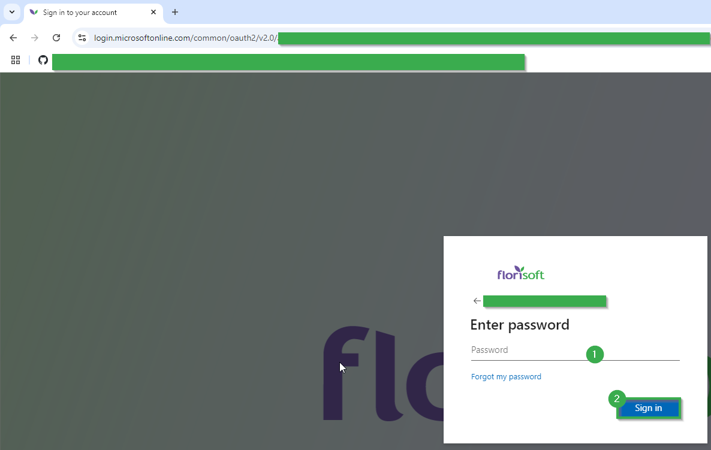
|
|**4**|After login a short tour of the webpage's workings will start, you can click through the steps using the next button or skip through it using the skip button.|
|**5**|On the left taskbar, select either the tab **Devices** or **Apps** depending on your access level.  The difference between the two is that with device you will get an entire Windows environment (not unlike remote desktop), but with Apps you will open the Florisoft client like it is running on your local device.

<b>Click here for the example image!</b>

|
|**9**|To connect to an Azure virtual Desktop device simply click on the Connect button, in the device's card in the **Devices** section.

<b>Click here for the example image!</b>

|
|**6**|To connect to an Azure Virtual app go to the **Apps** section and simply clik on an App's card.

<b>Click here for the example image!</b>

|
|**7**|Once you are starting a connection to either a virtual app or desktop you will once again be prompted with an authentication prompt. Simply enter your password again and click on **Ok**. 

<b>Click here for the example image!</b>

|
|**8**|You should now be prompted with either a virtual desktop environment or a Florisoft Login screen.

<b>Click here for the example image!</b>

|

## Authenticating using an Android device

TBD
