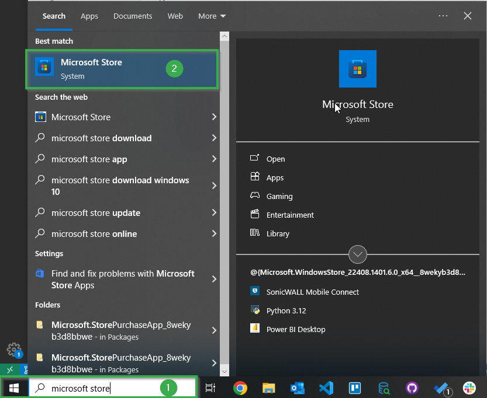
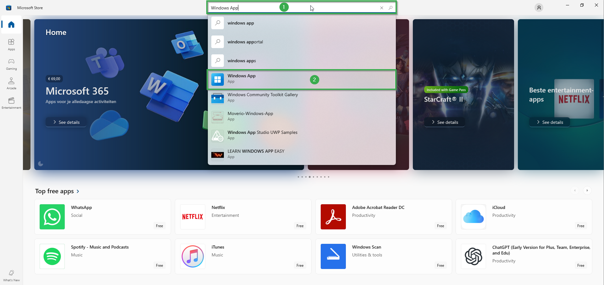
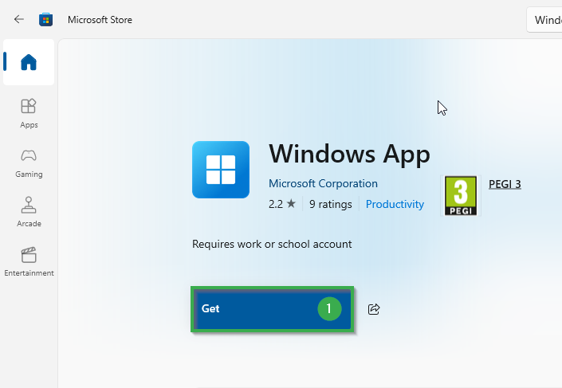
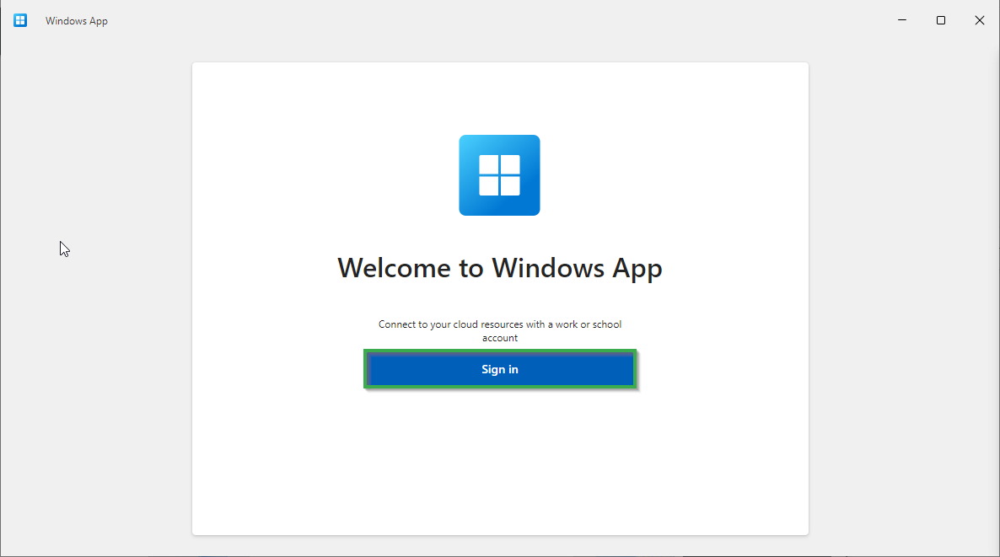
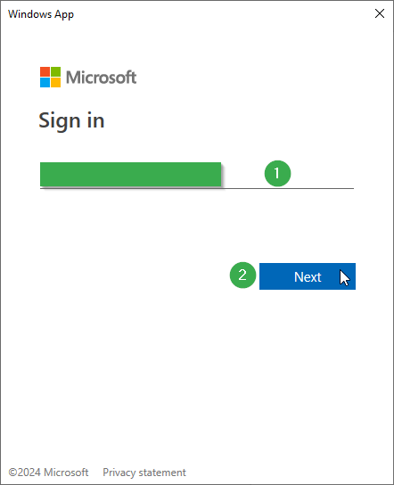
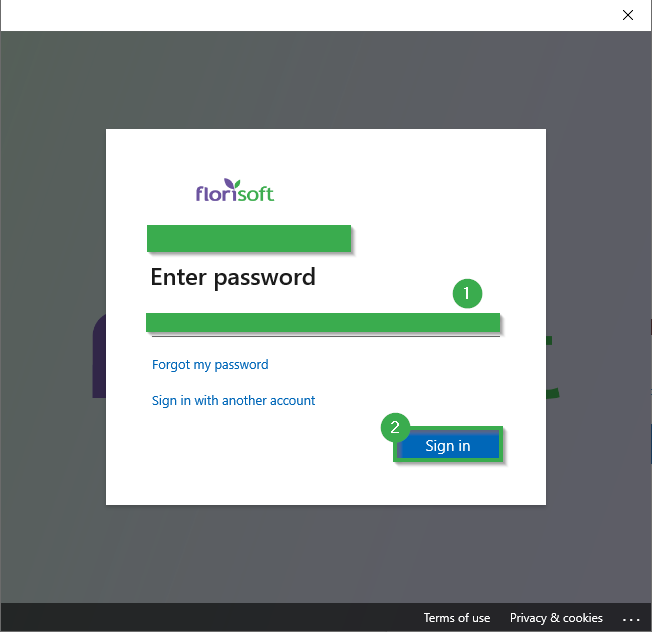
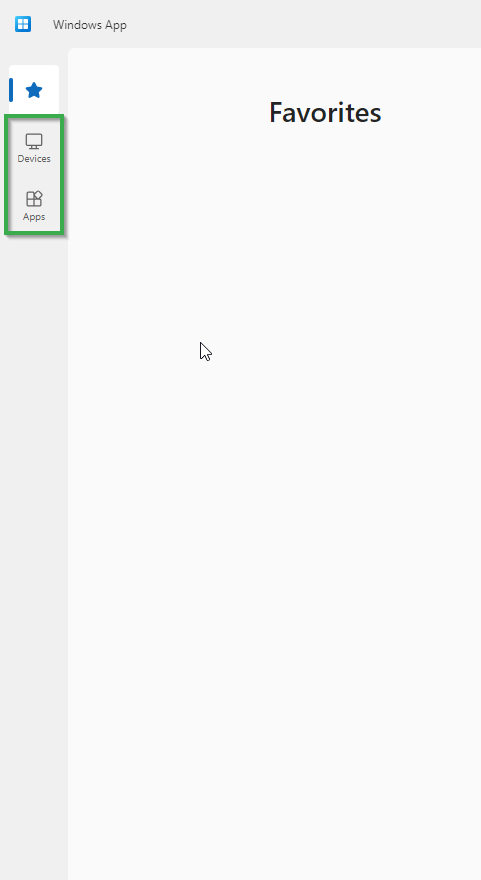
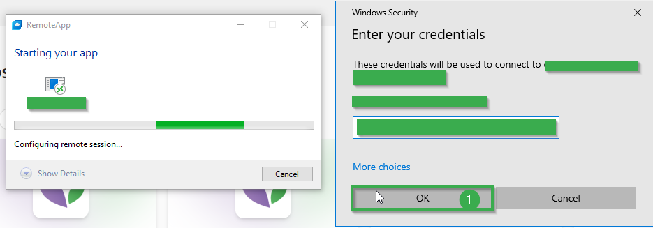
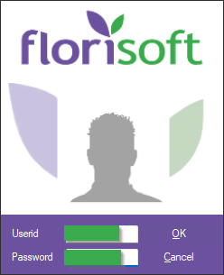
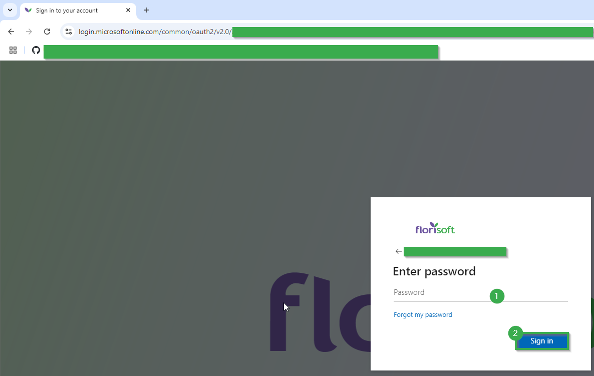

<!--
keywords: Windows App, Azure, Microsoft app, Microsoft, Azure Virtual Desktop, RDP, Remote Desktop
product: Windows app
type: Handleiding
-->

# Florisoft Handleiding voor Azure Workspace Verbinding Instellen

Welkom bij de handleiding voor het verbinden met je Florisoft Azure-werkruimte. Azure is een virtuele serveromgeving (cloud) waarop je Florisoft-client is gehost.

Voordat we toegang kunnen krijgen tot je Florisoft-applicatie, moeten we de client instellen die je laat verbinden met de Azure-omgeving. Deze handleiding beschrijft de eerste installatie van deze client.

De handleiding is opgedeeld in twee delen: installatie van de client en toegang verkrijgen via authenticatie in de browser. Binnenkort voegen we de optie toe om te authenticeren vanaf een Android-apparaat, maar dit is momenteel in ontwikkeling.

## Windows Installatie

|Stap|Uitleg|
|:-:|:--|
|**1**|Open de Microsoft Store op je lokale Windows-apparaat.

<b>Klik hier voor het voorbeeldafbeelding!</b>

|
|**2**|Zoek in de Microsoft Store naar de volgende "Windows App" en klik op het zoekresultaat.

<b>Klik hier voor het voorbeeldafbeelding!</b>

|
|**3**|Eenmaal op de pagina van de app, klik op de knop **Get** om de applicatie te installeren op je lokale Windows-apparaat.

<b>Klik hier voor het voorbeeldafbeelding!</b>

|
|**4**|Open de app na installatie. Klik op de knop **Sign in** wanneer de app geopend is.

<b>Klik hier voor het voorbeeldafbeelding!</b>

|
|**5**|Er wordt nu een formulier weergegeven waarin je om je e-mailadres wordt gevraagd. Voer het e-mailadres in dat door Florisoft is verstrekt. Klik op de knop **next**.

<b>Klik hier voor het voorbeeldafbeelding!</b>

|
|**6**|Je ziet nu een nieuw scherm waarin je e-mailadres en het Florisoft-logo worden weergegeven. Voer in dit scherm je wachtwoord in (ook verstrekt door Florisoft). Klik op de knop **Sign in**.

<b>Klik hier voor het voorbeeldafbeelding!</b>

|
|**7**|Als het de eerste keer is dat je inlogt in de Windows App, wordt er een korte rondleiding gegeven. Je kunt er doorheen klikken met de knop **next** of deze volledig overslaan met de knop **skip**.|
|**8**|Selecteer op de linker zijbalk de tab **Devices** of **Apps**, afhankelijk van je toegangsrechten.  Het verschil tussen de twee is dat je met **Devices** een volledige Windows-omgeving krijgt (vergelijkbaar met Remote Desktop), terwijl je met **Apps** de Florisoft-client opent alsof deze lokaal draait.

<b>Klik hier voor het voorbeeldafbeelding!</b>

|
|**9**|Om verbinding te maken met een Azure Virtual Desktop-apparaat, klik je eenvoudigweg op de knop Connect in het kaartje van het apparaat in de sectie **Devices**.

<b>Klik hier voor het voorbeeldafbeelding!</b>

|
|**10**|Om verbinding te maken met een Azure Virtual app, ga je naar de sectie **Apps** en klik je eenvoudig op een App-kaart.

<b>Klik hier voor het voorbeeldafbeelding!</b>

|
|**11**|Zodra je verbinding maakt met een virtuele app of desktop, wordt er opnieuw een authenticatieprompt weergegeven. Voer opnieuw je wachtwoord in en klik op **Ok**.

<b>Klik hier voor het voorbeeldafbeelding!</b>

|
|**12**|Je zou nu een virtuele desktopomgeving of een Florisoft inlogscherm moeten zien.

<b>Klik hier voor het voorbeeldafbeelding!</b>

|

<!-- ## Authenticatie via de browser

|Stap|Uitleg|
|:-:|:--|
|**1**|Open je browser en ga naar: https://windows.cloud.microsoft/|
|**2**|Log in met het e-mailadres van je Azure-account (verstrekt door Florisoft) en klik op de knop **next**.

<b>Klik hier voor het voorbeeldafbeelding!</b>

|
|**3**|Voer je wachtwoord in (ook verstrekt door Florisoft) en klik op de knop **Sign in**.

<b>Klik hier voor het voorbeeldafbeelding!</b>

|
|**4**|Na het inloggen start een korte rondleiding van de webpagina. Je kunt door de stappen klikken met de knop **next** of deze overslaan met de knop **skip**.|
|**5**|Selecteer op de linker zijbalk de tab **Devices** of **Apps**, afhankelijk van je toegangsrechten.  Het verschil tussen de twee is dat je met **Devices** een volledige Windows-omgeving krijgt (vergelijkbaar met Remote Desktop), terwijl je met **Apps** de Florisoft-client opent alsof deze lokaal draait.

<b>Klik hier voor het voorbeeldafbeelding!</b>

|
|**6**|Om verbinding te maken met een Azure Virtual Desktop-apparaat, klik je eenvoudigweg op de knop Connect in het kaartje van het apparaat in de sectie **Devices**.

<b>Klik hier voor het voorbeeldafbeelding!</b>

|
|**7**|Om verbinding te maken met een Azure Virtual app, ga je naar de sectie **Apps** en klik je eenvoudig op een App-kaart.

<b>Klik hier voor het voorbeeldafbeelding!</b>

|
|**8**|Zodra je verbinding maakt met een virtuele app of desktop, wordt er opnieuw een authenticatieprompt weergegeven. Voer opnieuw je wachtwoord in en klik op **Ok**.

<b>Klik hier voor het voorbeeldafbeelding!</b>

|
|**9**|Je zou nu een virtuele desktopomgeving of een Florisoft inlogscherm moeten zien.

<b>Klik hier voor het voorbeeldafbeelding!</b>

|

## Authenticatie via een Android-apparaat

Nog niet beschikbaar
-->
