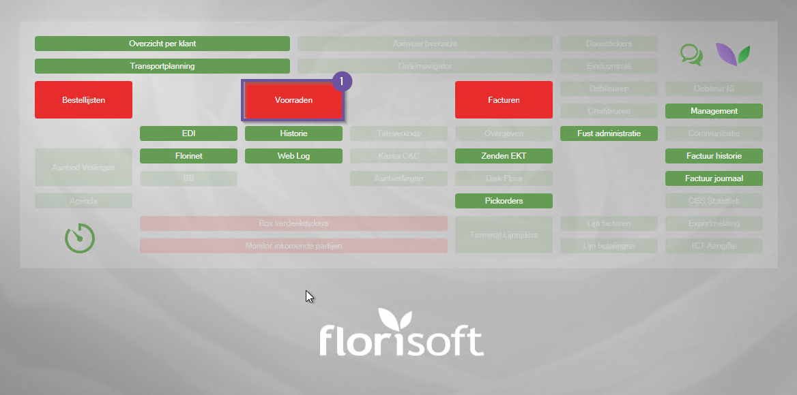
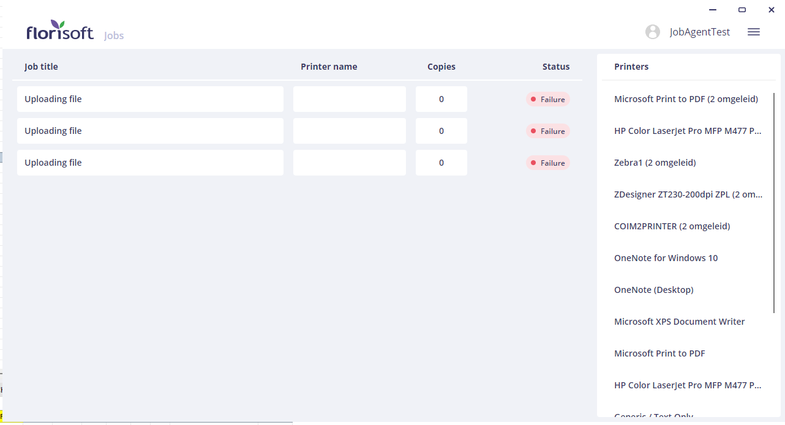

# Handleiding Florisoft Workspaces on Azure

Deze handleiding beschrijft hoe u Florisoft Workspaces instelt. 
Met deze workspaces kunt u lokale bestanden gebruiken binnen uw Florisoft Azure Remote App.

## Vereisten

Om deze handleiding te volgen, heeft u het volgende nodig:

- **Florisoft Remote App**: Uw Florisoft-omgeving moet draaien op een Azure Remote App.
- **Windows Hub-app**: Deze dient geïnstalleerd te zijn. De installatie-instructies vindt u [hier](https://github.com/florisoft/User.Manuals/blob/main/CLOUD%20APPLICATIONS/Hub%20App/Hub-App%20Installatie%20NL.md#installeren-van-de-windows-app).
- **Job-Agent**: Een correct gekoppelde Job-Agent-app die verbonden is met uw cloudserver, hoe dat opzet leest u [hier](https://github.com/florisoft/User.Manuals/blob/main/CLOUD%20APPLICATIONS/Windows%20Job-Agent%20application/Handleiding%20Job-Agent%20-%20NL.md).

## Inloggen op de Hub-app

Volg onderstaande stappen om een workspace op te zetten en te koppelen.

| Stap | Uitleg |
|:-:|:--|
| **1** | Start de Florisoft Hub-app en log in met de toegewijde Hub-app-gebruiker. |
| **2** | Open de Job-Agent vanuit de Hub-app en log in met de speciaal aangemaakte Florisoft-gebruiker die u ook in de backoffice gebruikt.

<b>Klik hier voor uw voorbeeld!</b>

|
| **3** | Laat de Job-Agent geopend staan nadat u bent ingelogd. |

## Instellen van Workspaces

Deze stappen voert u uit in uw Florisoft Azure Remote App (backoffice).

| Stap | Uitleg |
|:-:|:--|
| **1** | Open de **Constanten** vanuit de Florisoft Navigator.

<b>Klik hier voor uw voorbeeld!</b>

|
| **2** | Navigeer in het Constantenscherm naar:   **Systeem → Users → Workspaces**.

<b>Klik hier voor uw voorbeeld!</b>

|
| **3** | Maak een nieuwe workspace aan door op het **+**-icoon te klikken. 

<b>Klik hier voor uw voorbeeld!</b>

|
| **4** | Geef de workspace een duidelijke naam, bijvoorbeeld `"<Uw naam> thuiswerkplek"`.

<b>Klik hier voor uw voorbeeld!</b>

|
| **5** | Stel bij **Gebruiker** de Florisoft-gebruiker in die u gebruikt. |
| **6** | Selecteer bij **Jobagent** de gebruiker waarmee u in de Job-Agent-app bent ingelogd. |

## Gebruik van Workspaces

Met de ingestelde workspace kunt u bestanden van uw lokale pc selecteren in de Florisoft Remote App.
Hieronder volgt een voorbeeld van hoe u dit gebruikt binnen Florisoft.

| Stap | Uitleg |
|:-:|:--|
| **1** | Open het **Voorraadscherm** via de navigator. 

<b>Klik hier voor uw voorbeeld!</b>

|
| **2** | Selecteer een voorraad en klik met de rechtermuisknop op een partij.

<b>Klik hier voor uw voorbeeld!</b>

 |
| **3** | Kies in het contextmenu de optie **Afbeelding koppelen** en selecteer *Foto kiezen uit opgeslagen foto bestanden*. Klik vervolgens op **OK**.

<b>Klik hier voor uw voorbeeld!</b>

|
| **4** | Er opent een Windows Verkenner-venster waarin uw lokale bestandssysteem zichtbaar is. Hier kunt u een afbeelding selecteren en op **Openen** klikken. Voor nu kunt u dit annuleren. 

<b>Klik hier voor uw voorbeeld!</b>

|
| **5** | Open de Job-Agent opnieuw. U ziet onder **Jobs** een taak met de status **Uploading file - Failure**. Dit geeft aan dat er een uploadpoging is gedaan, maar geen bestand werd geselecteerd.

<b>Klik hier voor uw voorbeeld!</b>

 |

Door deze stappen te volgen, kunt u bestanden van uw lokale pc gebruiken in Florisoft Workspaces.
