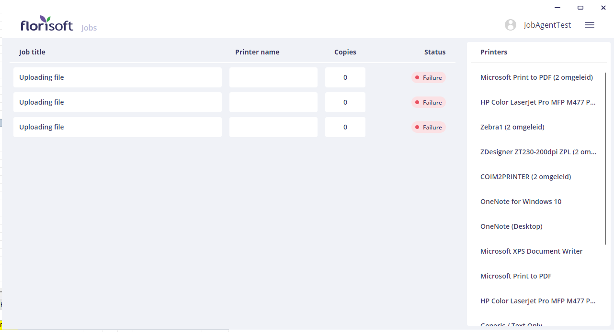

# Manual: Florisoft Workspaces on Azure

This manual explains how to configure Florisoft Workspaces.
By setting up these workspaces, you will be able to access local files within your Florisoft Azure Remote App.

## Prerequisites

To follow the steps in this manual, you will need the following:

- **Florisoft Remote App**: Your Florisoft environment must be hosted on an Azure Remote App.

- **Windows Hub-App**: This must be installed on your local Windows device. You can find installation instructions [here](https://github.com/florisoft/User.Manuals/blob/main/CLOUD%20APPLICATIONS/Hub%20App/Hub-App%20Installation%20EN.md#installing-the-windows-application).

- **Job-Agent**: A properly installed and connected Job-Agent application, started from the Hub-App, that is linked to your cloud server.

## Logging into the Hub-App

Follow the steps below to set up the Hub-App and connect to the workspace.

| Step | Explanation |
|:-:|:--|
| **1** | Start the Florisoft Hub-App and log in using the dedicated Hub-App user. |
| **2** | Open the Job-Agent from the Hub-App and log in with the dedicated Florisoft user for the Job-Agent App.

<b>Click here for an example image!</b>

 |
| **3** | Keep the Job-Agent open after logging in. |

## Setting Up Workspaces

These steps must be performed in your Florisoft Azure Remote App (Backoffice).

| Step | Explanation |
|:-:|:--|
| **1** | Open the **Constants** from the Florisoft Navigator. |
| **2** | In the Constants screen, navigate to: **System → Users → Workspaces** |
| **3** | Create a new workspace using the **+** button.

<b>Click here for an example image!</b>

 |
| **4** | Enter a descriptive name for the workspace in the top field. |
| **5** | Under **User**, select the Florisoft user account you use for back-office operations. |
| **6** | Under **Job-Agent**, select the user account you use to log into the cloud server via the Job-Agent App. |

## Using Workspaces

With the configured workspace, you can access local (Windows) files from within the Florisoft Remote App.  
The steps below illustrate an example use case in Florisoft.

| Step | Explanation |
|:-:|:--|
| **1** | Open the **Stock** screen from the Navigator. |
| **2** | Select a stock item and right-click on a parcel. |
| **3** | In the context menu, click **Assign Image**, then select *Choose picture from saved files*. Click **OK**. |
| **4** | A Windows Explorer window will open, showing your local file system. Here, you can select an image and confirm by clicking **Open** (for now, press **Cancel**). |
| **5** | After closing the Windows Explorer prompt, reopen the Job-Agent on your local device. Under **Jobs**, you will see a new task labeled **Uploading file**, with a status of **Failure**. This indicates that the system attempted to upload a file, but the upload was canceled.

<b>Click here for an example image!</b>

 |
