# Setup connection to Azure workspace

Welcome to the manual Setup connection to Azure workspace. Azure is a hosting platform built by Microsoft which is used to host Florisoft.
The Azure environment where Florisoft resides is also called a workspace.

Before running Florisoft every user needs to log in to the Azure workspace first before Florisoft can be started.

This manual describes the steps necassary to setp up a remote desktop connection to the Azure workspace.

After this introduction, chapter one explaines the installation of the Remote desktop application. Thereafter chapter two describes the steps needed for setting up the correct settings in the Remote Desktop app.

Chapter three describes the steps needed to start Florisoft from the Remote Desktop application.

Chapter four explains how to login to the Azure workspace from a webbrowser.

## Table of contents
[1. Installing Remote desktop app](#Installing-Remote-desktop-app) 
[2. Configure Remote Desktop for Azure](#user-process-overview-a-walkthrough) 
[3. Starting the Florisoft software from Remote Desktop](#3-starting-the-florisoft-software-from-remote-desktop) 
[4. Starting the Florisoft software from a webbrowser](#4-starting-the-florisoft-software-from-a-webbrowser)

## 1. Installing Remote Desktop application

Remote Desktop is a Windows application used for logging into the Azure workspace and start Florisoft. Follow the steps below to install the Remote Desktop application.

*Follow the steps below:*

|Step|Explanation|
|:-:|:--|
|**1**|Start a webbbrowser like Google Chrome or Microsoft Edge|
|**2**|Copy and past this URL into the address bar: https://go.microsoft.com/fwlink/?linkid=2139369 (no. 1)

<b>Click here for the example image!</b>
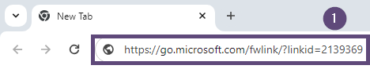
|
|**3**|Press the Enter key on the keyboard. A default Windows Save As window opens:|
|**4**|Choose a preferred location on the machine to save the installer file. (no. 2)  By default the Downloads folder is selected. The location may be any place on the computer.

<b>Click here for the example image!</b>
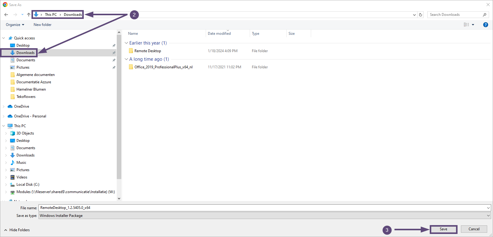
|
|**5**|Press the Save button to save the installer package to the chosen location. (no. 3)  The browser is going to download the installer package:

<b>Click here for the example image!</b>
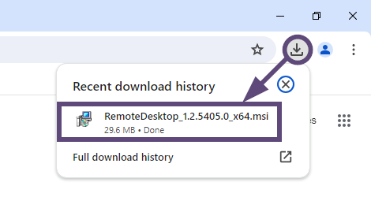
|
|**6**|Using File explorer navigate to the chosen save location (at step 4) to find the downloaded installer file.|
|**7**|Double click the installer file to start the installation. (no. 4)

<b>Click here for the example image!</b>
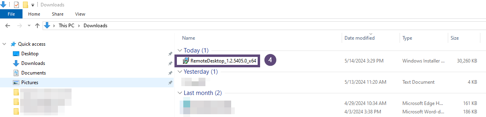
|
|**8**|Press the Next button in the first screen of the installation. (no. 5)

<b>Click here for the example image!</b>
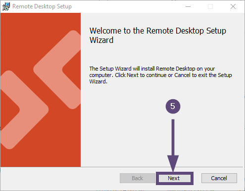
|
|**9**|Accept the license for using the software by setting the tickbox **I accept the terms in the License Agreement** (no. 6)

<b>Click here for the example image!</b>
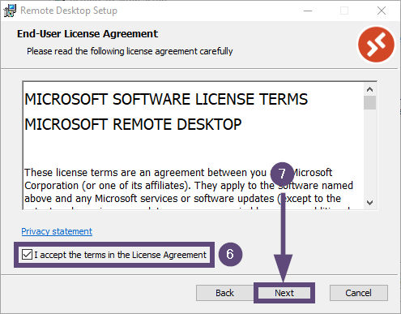
|
|**10**|Press the Next button to continue the installation. (no. 7)|
|**11**|Choose the **Install just for you (CURRENT_LOGGED_ON_USERNAME)** option in this screen. (no. 8)|
|**12**|Press the Install button to start the actual installation of Remote Desktop. (no. 9)

<b>Click here for the example image!</b>
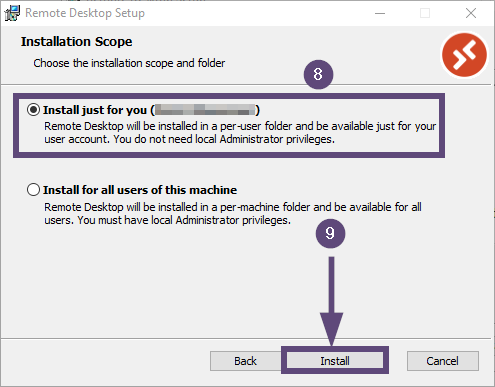
 **The installation takes a few seconds to a few minutes to complete** 

<b>Click here for the example image!</b>
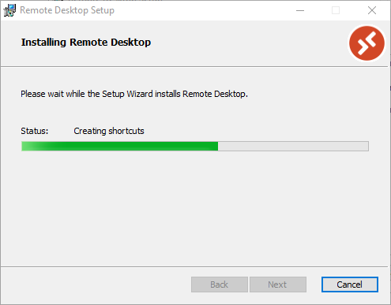
**When the installation is finished the window below shows:**

<b>Click here for the example image!</b>
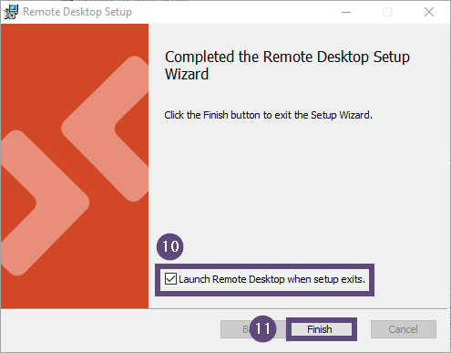
|
|**13**|Put a checkmark in the **Launch Remote Desktop when setup exits.** checkbox. (no. 10)|
|**14**|Press the Finish button to finish the installation of the Remote Desktop software. After a few seconds Remote Desktop starts to its start screen:

<b>Click here for the example image!</b>
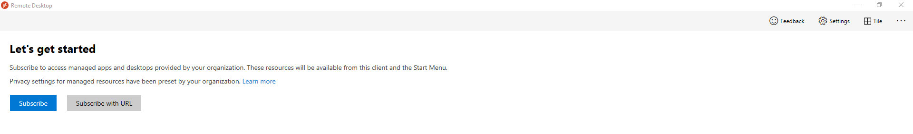
|
|**15**|Right click the Remote Desktop application icon on the taskbar and choose the Pin to taskbar option. (no. 12)

<b>Click here for the example image!</b>
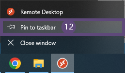
|

From now on the application icon is pinned to the taskbar so it can be easily started next time.

Read further in chapter two **Configure Remote Desktop for Azure** to setup the correct settings for logging onto the Azure workspace. 

## 2. Configure Remote Desktop for Azure

*Follow the steps below to setup the correct settings for logging in to the Azure workspace*

|Step|Explanation|
|:-:|:--|
|**1**|Start the Remote Desktop application if it is not running already. The application can be started by clicking the icon on the taskbar:

<b>Click here for the example image!</b>

|
|**2**|If the application is already running its window should be visible:

<b>Click here for the example image!</b>

|
|**3**|Fill in the following URL in the Email Workspace URL field: https://rdweb.wvd.microsoft.com (no. 2)

<b>Click here for the example image!</b>
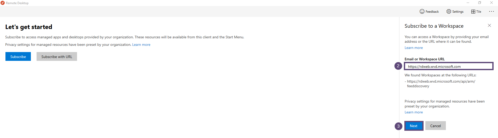
|
|**4**|Press the Next button to continue. (no. 3)|
|**5**|Fill in the Azure username in the Email, phone, or Skype field. (no. 4)

<b>Click here for the example image!</b>
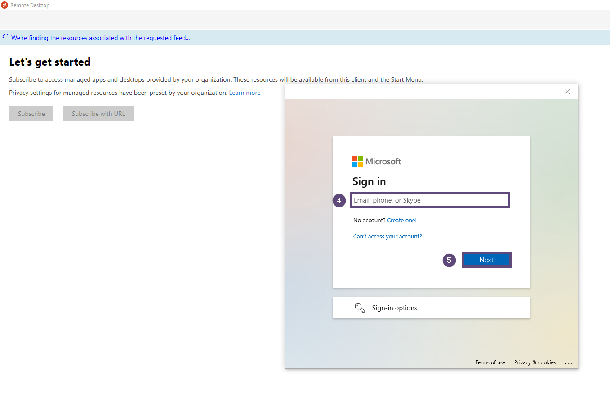
|
|**6**|Press the Next button. (no. 5)|
|**7**|Fill in the Password of the concerning user in the Password field. (no. 6)

<b>Click here for the example image!</b>
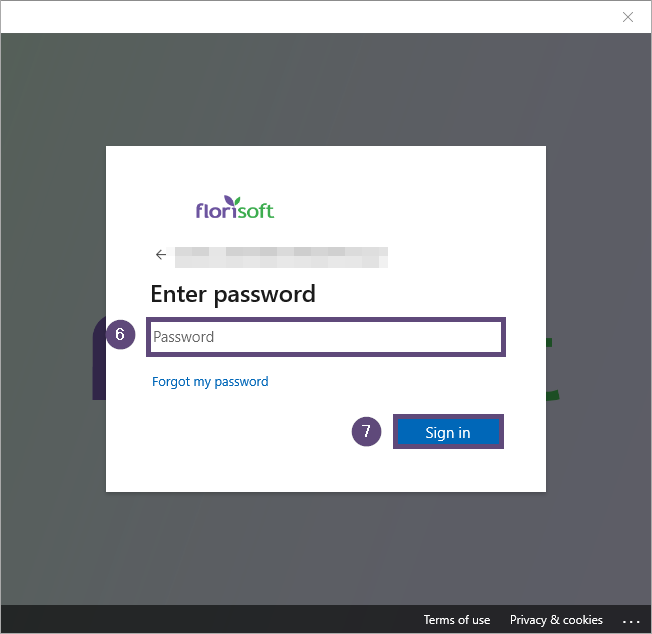
|
|**8**|Press the Sign in button to continue. (no. 7) A new Window appears with the message that More information is required. 

<b>Click here for the example image!</b>
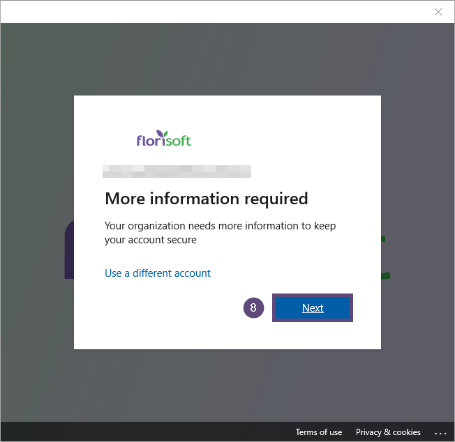
|
|**9**|Press the Next button to continue. (no. 8)

<b>Click here for the example image!</b>
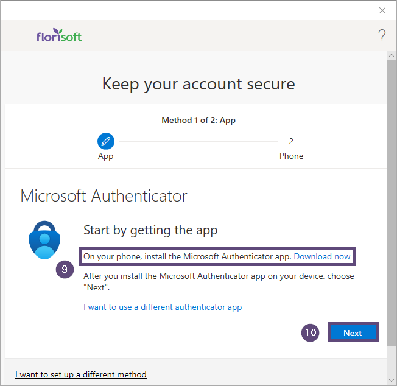
|

From now on it is needed to have acccess to the Microsoft Authenticator app on a smartphone. (no. 9) 

*Follow the steps below to install the Authenticator app:*

|Step|Explanation|
|:-:|:--|
|**1**|Open the App store (App Store in case of iPhone or Google Play Store in case of Android) on a smartphone.|
|**2**|Search for the Microsoft Authenticator app.|
|**3**|Press the app icon in the search results.|
|**4**|Press the install option to install the app. Probably there are any confirmation windows. Every time confirm any question to start the download.  When the download is finished the icon of the Authenticator app is placed on the app screen of the smartphone.|
|**5**|Open the Microsoft Authenticator by pressing its icon on the smartphone.|
|**6**|Press the Accept button in the Authenticator app to confirm the privacy settings.  Keep the toggle for **help improving the Authenticator app and share app use information** to its default setting: off.|
|**7**|Press the Continue button to proceed.|
|**8**|Press the Skip button (upper right corner of Authenticator app) to continue.|
|**9**|Press the Add account button in the **Are you ready to add your first account?** screen.|
|**10**|Choose the Business- or schoolaccount option.|
|**11**|Choose the QR-code scannen option.|
|**12**|Allow the Authenticator app to access the smartphone camera if needed.|
|**13**|Scan the QR code in the sceen. (no. 11)

<b>Click here for the example image!</b>
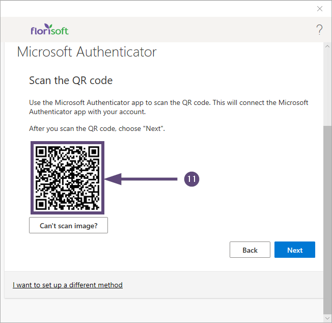
|
|**14**|Allow the Authenticator app to send notification messages if needed. If the QR-code scans correctly the screen below shows:

<b>Click here for the example image!</b>
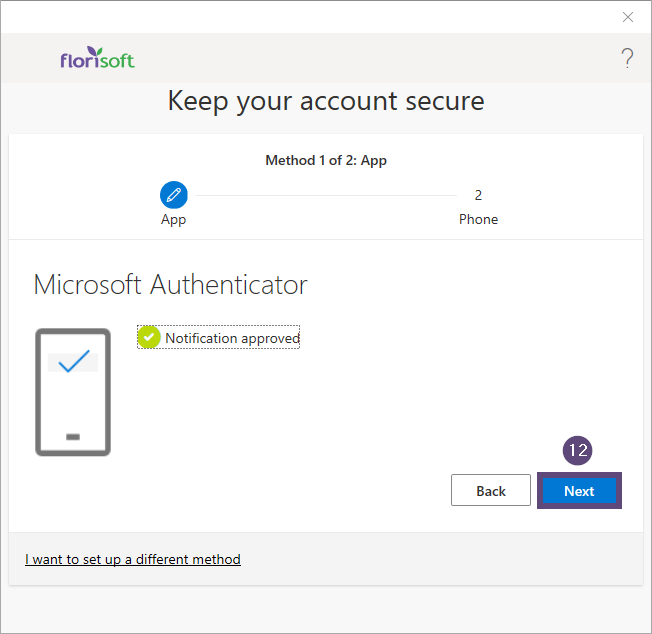
|
|**15**|Press the Next button to continue. (no. 12)  **The screen below does not always appear. If it does not appear, click the Next button(s) to continue.**

<b>Click here for the example image!</b>
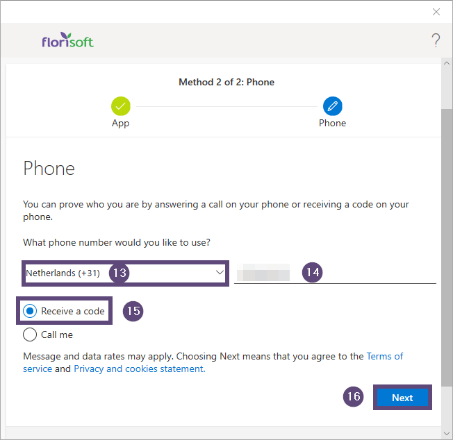
|
|**16**|Choose the correct country in the drop down list. (no. 13)|
|**17**|Fill in the mobile phone number in the adjacent field. (no. 14)|
|**18**|Choose the Receive a code option. (no. 15)|
|**19**|Click the Next button to continue. (no. 16).  If everything goes right a code will be sent to the phone number filled in at step 26.|
|**20**|Fill in the code in the concerning field on the smartphone or the Remote Desktop app.  If everything goes well the account becomes visibile in the Authenticator app.|

If everything goes well the account becomes visibile in the Authenticator app.

At the same time the Florisoft Azure workspace is loaded in the Remote Desktop app. When this is finished the Remote Desktop app looks something like this:

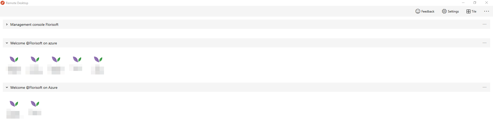

All steps from chapters one and two needs to be done on every computer/device where Florisoft is used. However, it only needs to be done once.

## 3. Starting the Florisoft software from Remote Desktop

*This chapter describes the steps neccesary to start the Florisoft software from the Azure Workspace.*

|Step|Explanation|
|:-:|:--|
|**1**|Open the Remote Desktop app by clicking its icon on the taskbar. (no. 1)

<b>Click here for the example image!</b>
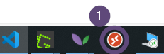
|
|**2**|Double click the Florisoft icon to start the login process.

<b>Click here for the example image!</b>
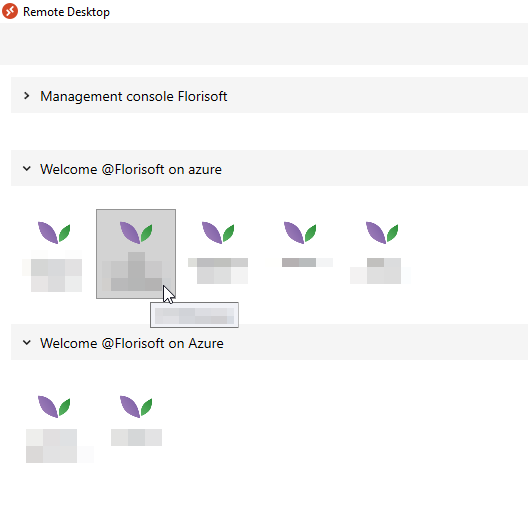
 The login process starts:

<b>Click here for the example image!</b>
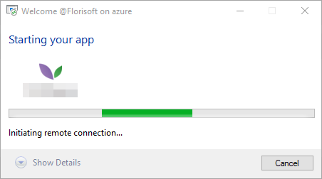
 After a few seconds the login screen appears:

<b>Click here for the example image!</b>
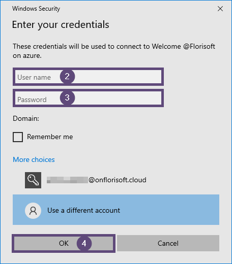
|
|**3**|Enter the username (same as the one used in chapter 1) in the User name field. (no. 2)|
|**4**|Enter the password (same as the one used in chapter 1) in the Password field. (no. 3)|
|**5**|Press the OK button to continue. (nr. 4) The connection is being established:

<b>Click here for the example image!</b>

 After a few seconds the splash (load) screen of Florisoft appears. When the software is completely loaded the login screen shows:

<b>Click here for the example image!</b>
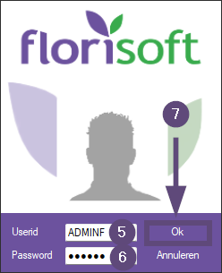
|
|**6**|Fill in the userid in the USERID field. (no. 5)|
|**7**|Fill in the password in the Password. (no. 6)|
|**8**|Press the Ok button to login. (no. 7) The startscreen (Navigator) of Florisoft appears:

<b>Click here for the example image!</b>
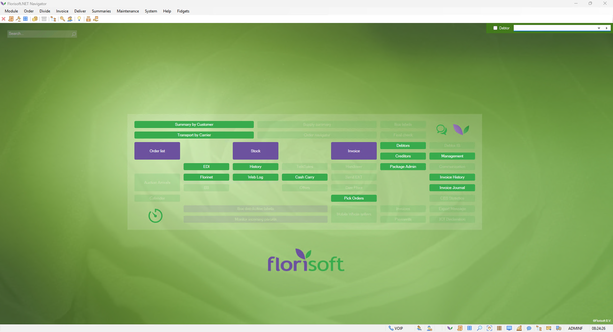
|

From this point Florisoft can be used

## 4. Starting the Florisoft software from a webbrowser

Another possibility to run Florisoft is from a webbrowser. Follow the steps below to login to Florisoft via a webbrowser.

|Step|Explanation|
|:-:|:--|
|**1**|Start a webbrowser like Google Chrome or Microsoft Edge.|
|**2**|Copy and paste the Azure workspace URL (https://client.wvd.microsoft.com/arm/webclient/) in the address bar of the browser and press Enter on your keyboard:

<b>Click here for the example image!</b>
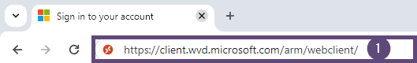
 The login screen of the workspace appears:

<b>Click here for the example image!</b>
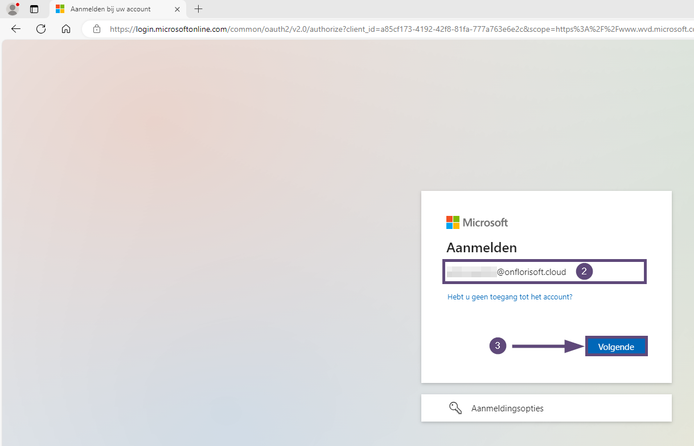
|
|**3**|Fill in the username in the Email or phone field. (no. 2)|
|**4**|Press the Next button to continue. (no. 3)|
|**5**|Fill in the password in the Password field. (no. 4)

<b>Click here for the example image!</b>
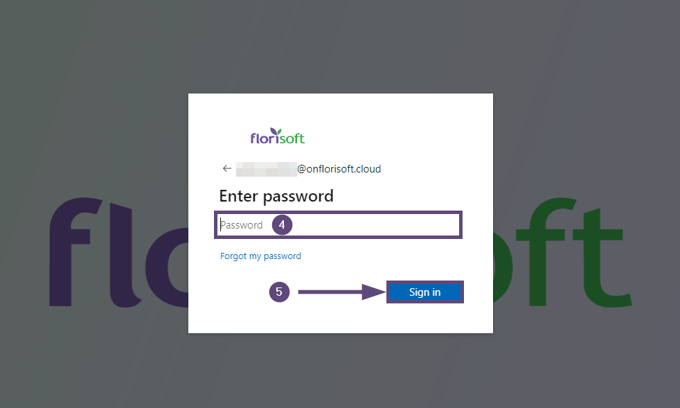
|
|**6**|Press the Sign in button to sign into the workspace. (no. 5) A number shows up to approve the sign in of this user.

<b>Click here for the example image!</b>
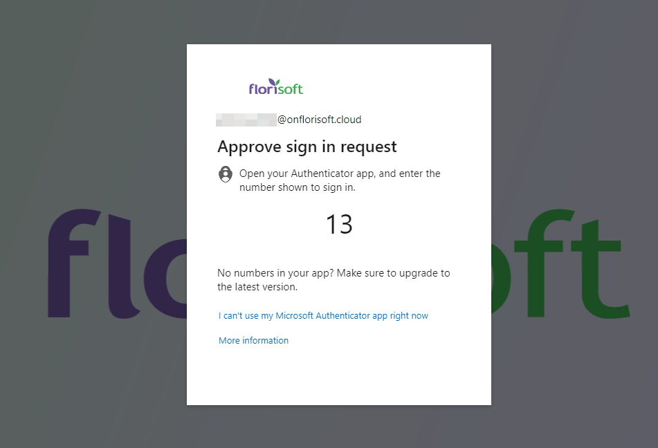
|
|**7**|The Authenticator app shows a popup screen where the number can be entered.  Fill in the number shown on the screen in the Microsoft Authenticator app.|
|**8**|Confirm the popup screen in the Authenticator app.  A question appears in the browser if you want to stay logged in or want to login only one session.|
|**9**|Choose the option to login one time. This is better for security purposes.  After a few seconds the workspace opens in the browser and looks the same as in the Remote Desktop application:

<b>Click here for the example image!</b>
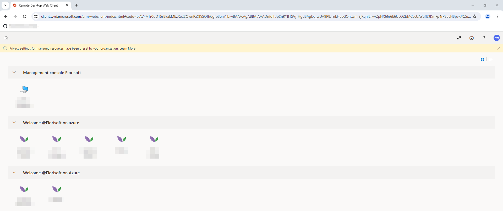
|
|**10**|Click one time on the Florisoft icon to start the software. (no. 6)

<b>Click here for the example image!</b>
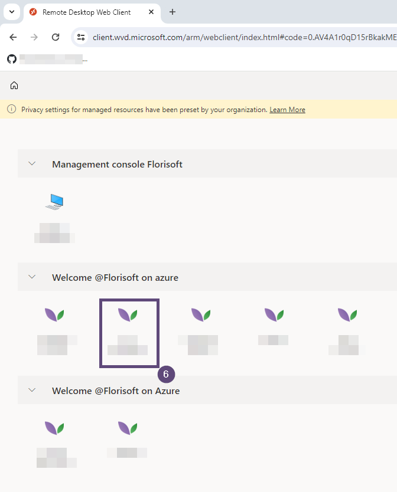
 A popup window appears with some default settings. See the screenshot below:

<b>Click here for the example image!</b>
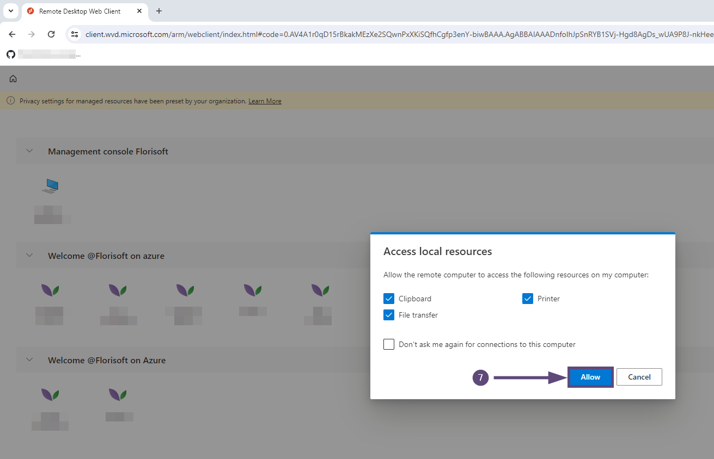
|
|**11**|Press the Allow button to confirm the settings and continue. (no. 7) A new login window appears:

<b>Click here for the example image!</b>
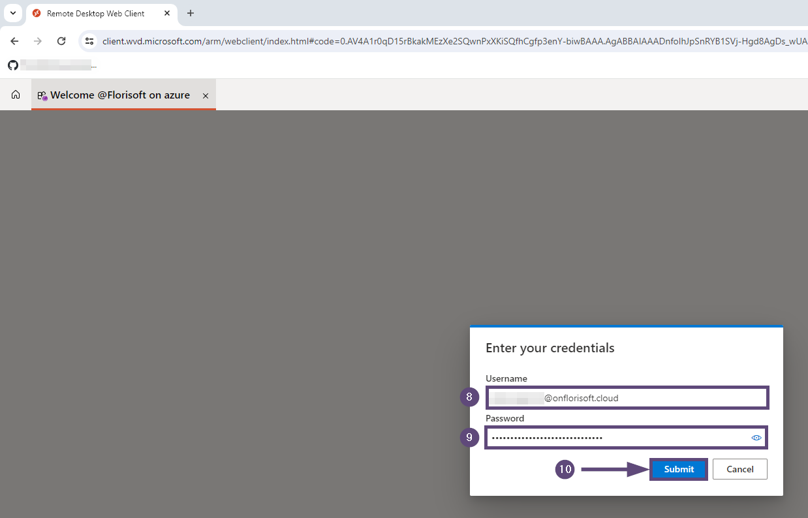
|
|**12**|Fill in the username in the Username field. (no. 8)|
|**13**|Fill in the password in the Password field. (no. 9)|
|**14**|Click the Submit button to continue. (no. 10)  A small screen pops up while the connection to the server is being established.  After a few seconds the Florisoft login screen appears on the screen:

<b>Click here for the example image!</b>
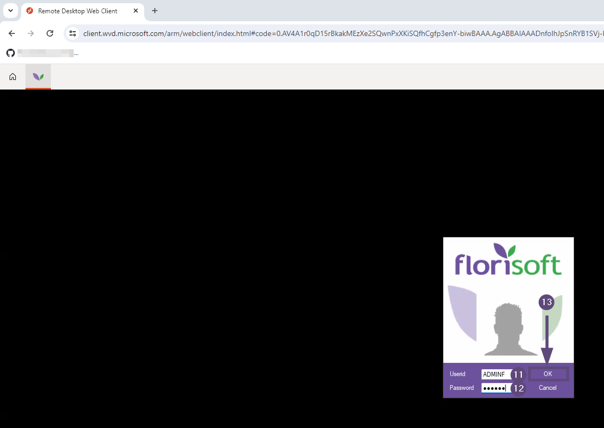
|
|**15**|Fill in the userid in the concerning field. (no. 11)|
|**16**|Fill in the password in the concerning field. (no. 12)|
|**17**|Click the OK button or press the Enter key on the keyboard to login to the software. (no. 13)|

After a few seconds the startscreen of Florisoft appears:
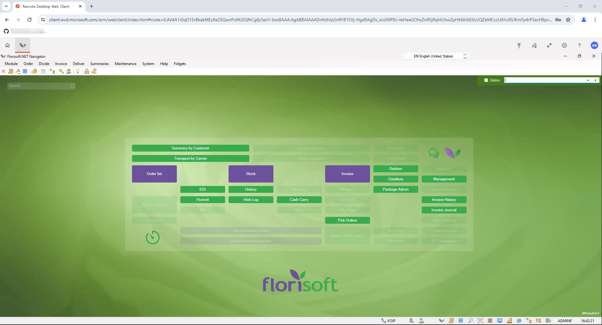

From this point Florisoft can be used as used to.