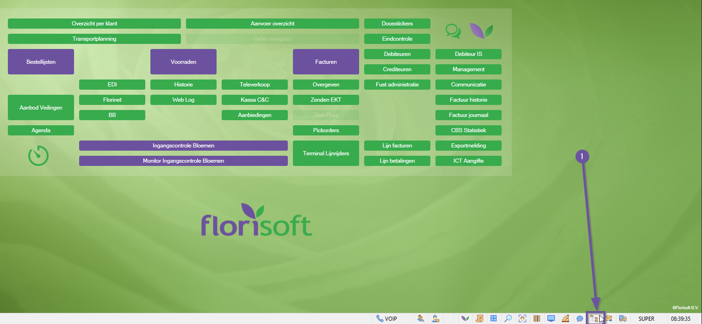
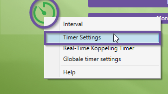
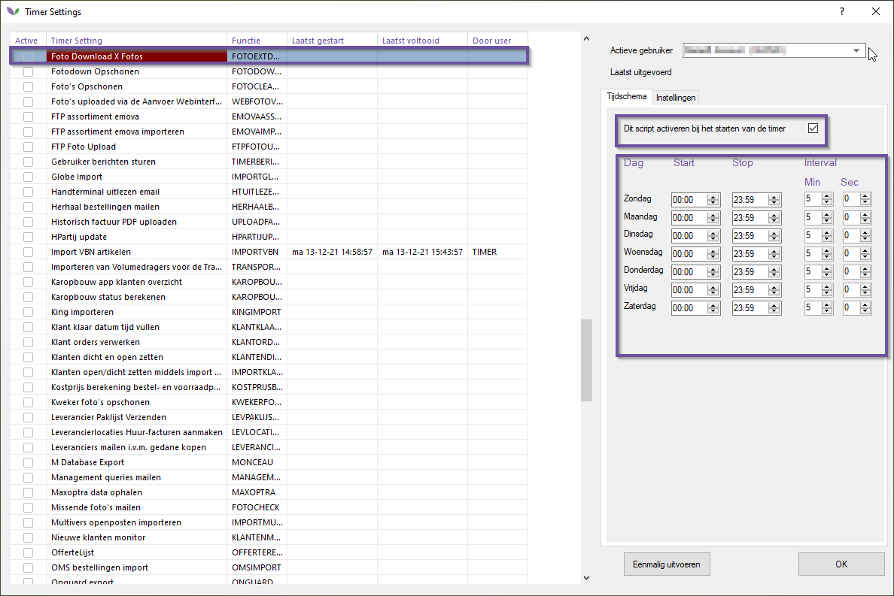
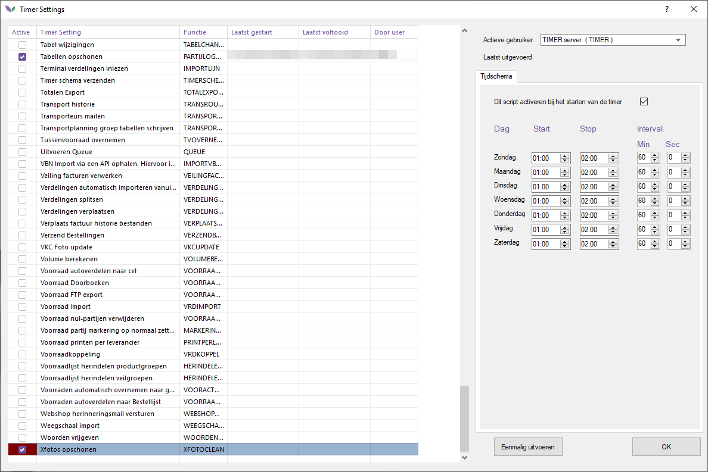
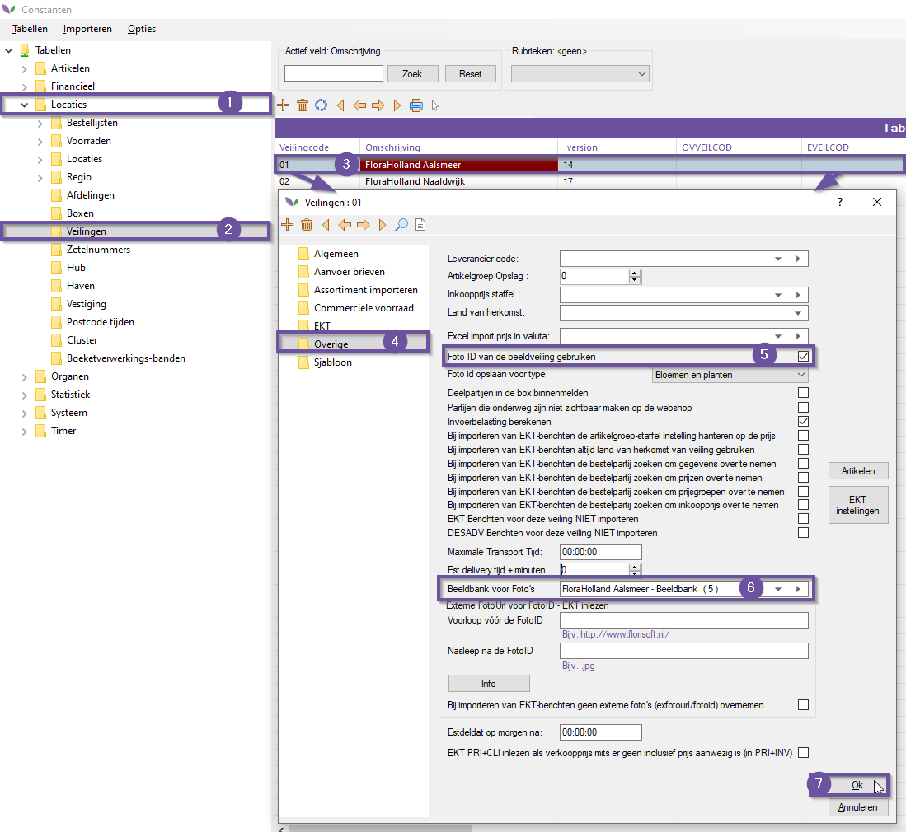

# Handleiding Auction Image Bank (M55)

Welkom bij de handleiding voor de module Auction Image Bank
## Opzet

Voordat er gebruik gemaakt kan worden van de Auction Image Bank module moeten er eerst een paar instellingen worden aangepast. Volg hiervoor de onderstaande stappen:

|Stap|Uitleg|
|:--|:--|
|**1**|Start Florisoft en open het constantenscherm.

<b>Klik hier voor uw voorbeeld afbeelding</b>

|
|**2**|In de constanten navigeer je naar het volgende pad: **Organen**→**Beeldbank**

<b>Klik hier voor uw voorbeeld afbeelding</b>

|
|**3**|Dubbelklik vervolgens op de desbetreffende Beeldbank. In het voorbeeld is er gekozen voor FloraHolland Aalsmeer.|
|**4**|Voer de Login-naam en Login-Wachtwoord in, deze zou verstrekt moeten zijn via (in dit geval) FloraHolland. Om zeker te maken dat de informatie klopt, kan je de URL gegeven volgen.  Een voorbeeld van zo'n URL is:  https://ccx-cbb-wes-prd.shared.royalfloraholland.com/commercialcustomerwebservice.asmx|
|**5**|Na het inloggen krijgt u een soortgelijk scherm te zien.|
|**6**|U kan nu terug gaan naar de Florisoft navigator door de constanten te sluiten.|
|**7**|Klik met de rechter muisknop op het timer icoon in de navigator en selecteer '*Timer settings*'.

<b>Klik hier voor uw voorbeeld afbeelding</b>

|
|**8**|In de timer willen we de instelling 'Foto Download X Fotos' aanzetten. Vind de instelling in de tabel. **Tip:** Klik op de tabel en druk dan de toetsencombinatie **CTRL + SHIFT +  F** in, dit opent het zoeken scherm.

<b>Klik hier voor uw voorbeeld afbeelding</b>

|
|**8.b**|Als de juiste instellingen niet worden weergegeven als normale gebruiker, log dan in als de Timer gebruiker!!|
|**9**|Als u de instelling eenmaal gevonden heeft klikt u er een keer op om de instelling te openen aan de rechterkant van het timer scherm. Stel de tijden in waar tussen het proces moet draaien en met welke interval het proces word uitgevoerd tijdens de start en stop tijd.|
|**10**|**Niet vergeten**: zet ook de checkbox "*Dit script activeren bij het starten van timer*" ook aan!|
|**11**|Doe hetzelfde voor het timerproces 'Xfotos opschonen' als deze nog niet aan staat.

<b>Klik hier voor uw voorbeeld afbeelding</b>

|
|**12**|Check voor controle ook of de geavanceerde instelling '*ImageDestination*' correct is ingevuld. Mocht u hier geen toegang tot hebben neem dan contact op met Florisoft om de instelling correct in te laten vullen.

<b>Klik hier voor uw voorbeeld afbeelding</b>

|
|**13**|Open nu het constantenscherm en navigeer naar het volgende pad:   **Locaties**→**Veilingen**

<b>Klik hier voor uw voorbeeld afbeelding</b>

|
|**14**|Klik nu tweemaal op een veiling om het te openen, navigeer in dit veilingscherm naar de map '*Overige*'.|
|**15**|Kijk in dit scherm of de volgende instellingen goed zijn ingesteld: **Foto ID van de beeldveiling gebruiken**: *Hoort aan te staan*.  **Beeldbank voor Foto's**: *Staat op de bijhorende beeldbank voor de veiling*

<b>Klik hier voor uw voorbeeld afbeelding</b>

|
|**16**|Sla de aangepaste instellingen op door op '**Ok**' te drukken. Ga terug naar de navigator.|
|**17**|Zet nu de timer aan dit doen we door op het stopwatch icoontje te drukken in de navigator.

<b>Klik hier voor uw voorbeeld afbeelding</b>

|
|**18**|Een lijst van alle actieve Timers wordt weergeven, klik hier op annuleren om de timer te stoppen. Nadat hij succesvol gestopt is, klik nogmaals op de stopwatch om hem opnieuw op te starten.

<b>Klik hier voor uw voorbeeld afbeelding</b>

|
