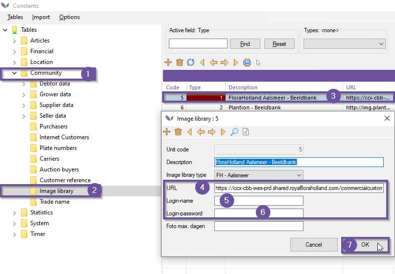
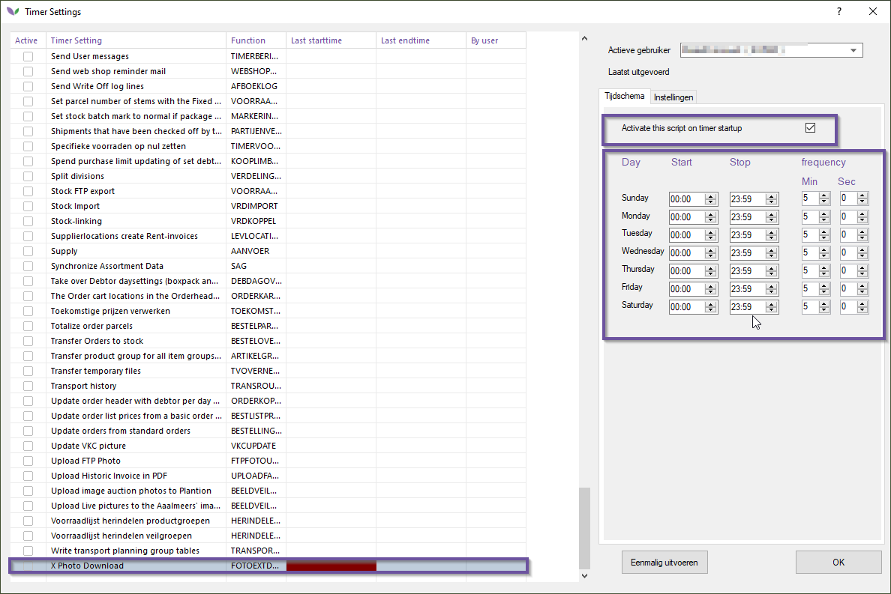
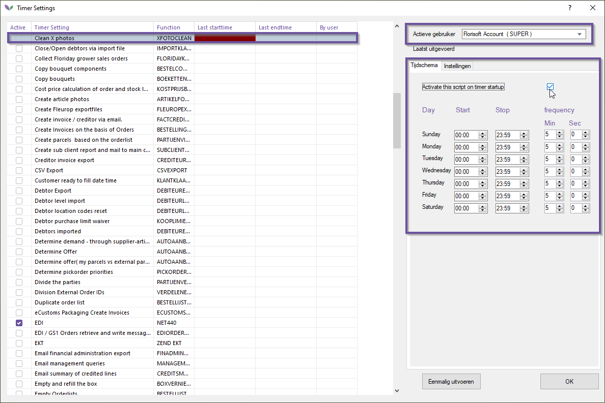
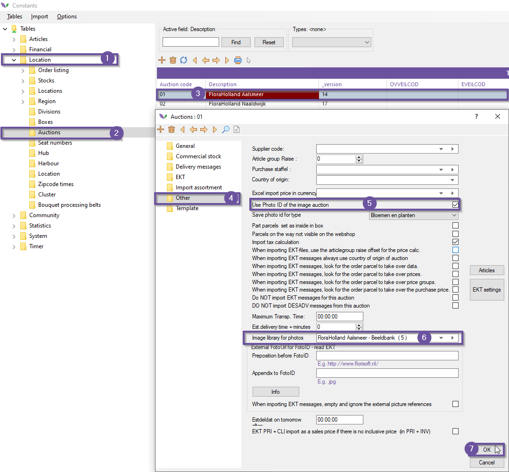

# Manual Auction Image Bank (M55)

Welcome to the Florisoft manual for the Auction Image Bank.

When buying on the KLOK (Clock) you should get a photoID number. With the Image Bank you are able to download the specific photo's for you purchase using this photoID. When dowloading the images Florisoft will scale them to 4 different formats.

## Setting up

In order to start using the Auction Image Bank module a couple of settings will need to be set up first. Follow the steps below to set it up:

|Step|Explanation|
|:--|:--|
|**1**|Launch the Florisoft application and open the constants screen

<b>Klik hier voor uw voorbeeld afbeelding</b>

|
|**2**|Navigate to the following path in the constants screen: **Community**→**Image library**

<b>Klik hier voor uw voorbeeld afbeelding</b>

|
|**3**|Double click an image library, in the example image the Auction FloraHolland Aalsmeer was chosen.|
|**4**|Enter the login username and password, the login credentials should have been provided.|
|**5**|The link below should be pasted in the '*URL*' field. To make sure the information that has been provided is correct, you can go to the URL given. An example of such a URL is: https://ccx-cbb-wes-prd.shared.royalfloraholland.com/commercialcustomerwebservice.asmx|
|**6**|Close the Image library setting screen and go back to the Florisoft Navigator.|
|**7**|Click on the timer icon with the right mouse button and select the option '*Timer Settings*'.

<b>Klik hier voor uw voorbeeld afbeelding</b>

|
|**8**|The setting X Photo Download should be turned on, the settings shown are recommended, but other intervals are also possible, but they could lead to longer loading times. Find the setting in the table by using the key combination: **CTRL + SHIFT + F**. This opens a search prompt that can be used to search for the setting.

<b>Klik hier voor uw voorbeeld afbeelding</b>

|
|**8.b**|If you can't find the setting even using the search screen you may want to log in as a different user such as the timer user.|
|**9**|Once you have found the right setting click it once to open the configuration screen on the right side of the window. Configure the time in which the timer process needs to be working and on which time interval it is executed.|
|**10**|**Do NOT forget**: check the checkbox **Activate this script on timer startup**.
|**11**|Do the same for the Timer setting **Clean X Photos** if it wasn't already configured.

<b>Klik hier voor uw voorbeeld afbeelding</b>

|
|**12**|Check if the advanced setting **ImageDestination** is configured right. If you do not have access to this setting contact Florisoft support so that they can check and or configure the property.

<b>Klik hier voor uw voorbeeld afbeelding</b>

|
|**13**|Open the constants screen once again and navigate to the following path:  **Locations**→**Auctions**

<b>Klik hier voor uw voorbeeld afbeelding</b>

|
|**14**|Click twice on a auction to open it, navigate to the folder called **Other**.|
|**15**|Check if the settings in this folder are set correctly:**Use Photo ID of the image auction**: *needs to enabled.* **Image library for photos**: *needs to be set to the corresponding auction*.

<b>Klik hier voor uw voorbeeld afbeelding</b>

|
|**16**|Save the changed settings by clicking on the **Ok** button and confirming the made changes. Go back to the navigator.|
|**17**|Turn the timer on by clicking on the timer icon in the navigator.

<b>Klik hier voor uw voorbeeld afbeelding</b>

|
|**18**|A list of active timers will show, click "Annuleren" or its English variant "Cancel" and restart the timer by clicking the stopwatch icon again.

<b>Klik hier voor uw voorbeeld afbeelding</b>

|
