# CBS Declaration Manual

As of 1 January 2022, CBS is implementing changes to the declaration for International Trade in Goods. These changes are partly the result of the new European regulation on business statistics.

From 2022 onward, it is mandatory to use the IDEP+ declaration module to submit the statistical declaration for international trade in goods. By now, you should have received the login details from CBS by post. From 2022 onward, the declaration obligation is imposed on the VAT fiscal entity.

Please read the information below if you are also required to submit the monthly ICL declaration in 2022.

From 2022 onward, the transaction type changes; all companies that are required to report international trade in goods must complete the new 2-digit `Transaction` field. This field replaces the former 1-digit `Transaction` field. In addition to the first digit, you must therefore also provide the second digit in the code list. Furthermore, the code list has been changed compared to the current list.

To support this, we have built a conversion step for when you submit your CBS declaration next year. This step also adjusts the transaction type. The notification also explains what you need to do when your company sells to consumers. If you are using the Florisoft version that includes the change mentioned above, the new method is enabled automatically. You can also enable the setting yourself by updating.

## 2022 Change - Include Country of Origin

The biggest change regarding sending data to CBS is that the `country of origin` must also be included. If you have a version dated 20 December or later, Florisoft will check when posting an invoice from 1 January onward whether the following checkboxes are enabled for the customer/debtor:

<b>Click here for an example!</b>
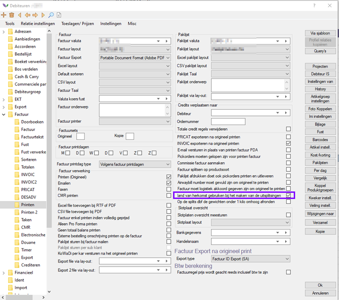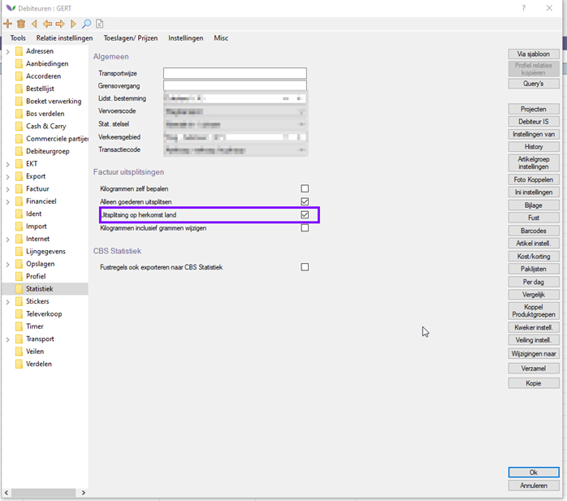

|:bulb:|NOTE: In versions from early December up to 2 January, you may still receive a message that posting is not possible. This is because that version also checked the setting below.|
|:-:|:--|

<b>Click here for an example!</b>

In principle, you can enable this checkbox. If you do not want to use this checkbox, you can update and Florisoft will no longer check this checkbox during posting.

If these settings are enabled, Florisoft will also fill in the country of origin in the CBS table. This data can then be sent to CBS.

This also affects the statistics on the invoice printout. These will now be grouped by country of origin. So, if you have 2 invoice lines for the same product with a different country of origin, they will appear as 2 separate lines on the layout.

<b>Click here for an example!</b>
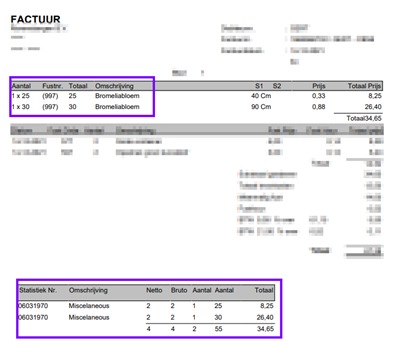

If necessary, you can display the country of origin separately or group by it in the layout. If you are unable to do this yourself or would prefer us to do it, please contact our support department. They can review the required change and provide you with an estimate.

## Country of Origin Breakdown

If you want to use separate breakdowns by country of origin, you can configure this as follows:

<b>Click here for an example!</b>
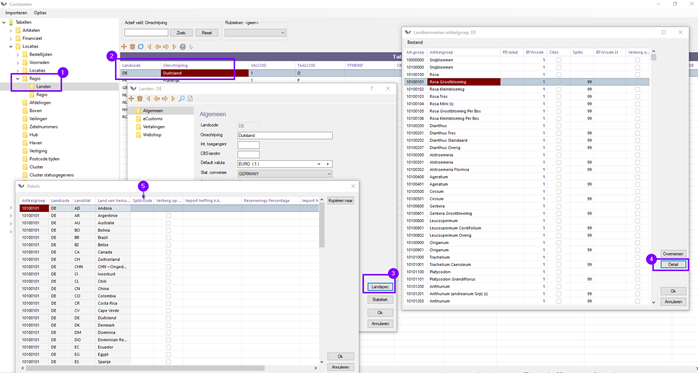

## Procedure

### Step 1 - Request CBS Login Details

To upload your data to CBS, you need specific credentials. You can request these from CBS by sending an email to: bedrijveninfo@cbs.nl

### Step 2 - Create the File

*Creating a CBS declaration via Florisoft works largely the same way as you are used to. Follow the steps below:*

|Step|Explanation|
|:-:|:--|
|**1**|In the navigator, click the **CBS Statistics** button.

<b>Click here for an example!</b>
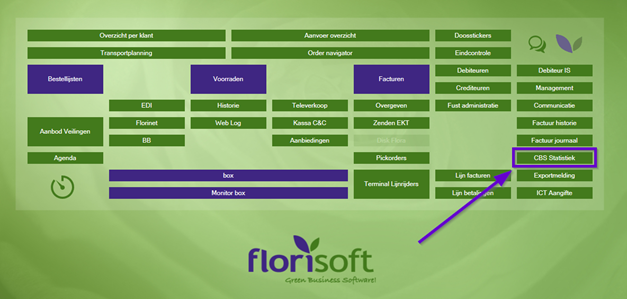
|
|**2**|Here, select the correct administrations and any additional filters if needed:

<b>Click here for an example!</b>
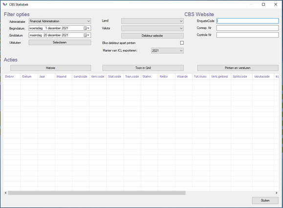
|
|**3**|Then click **OK**. The following screen appears:

<b>Click here for an example!</b>
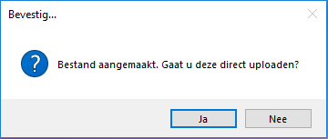
|
|**4**|After printing the CBS data or viewing it via the print screen, you will be asked whether you want to upload the data.

<b>Click here for an example!</b>

|
|**5**|If you choose **Yes**, the CBS website opens on the upload page and the folder containing the file is opened.|

### Step 3 - Upload the File

After completing Step 2 and answering the last question with **YES**, Florisoft opens the location on the computer/server where the file was created*. The CBS website will then appear on the correct page.  
*Location: `Dataadt\Archief\CBS`

<b>Click here for an example!</b>
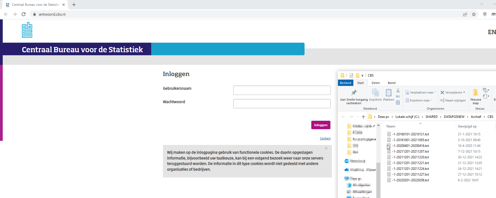

*Follow the steps below:*

|Step|Explanation|
|:-:|:--|
|**1**|After logging in, choose **Import** and then **Import** again:

<b>Click here for an example!</b>
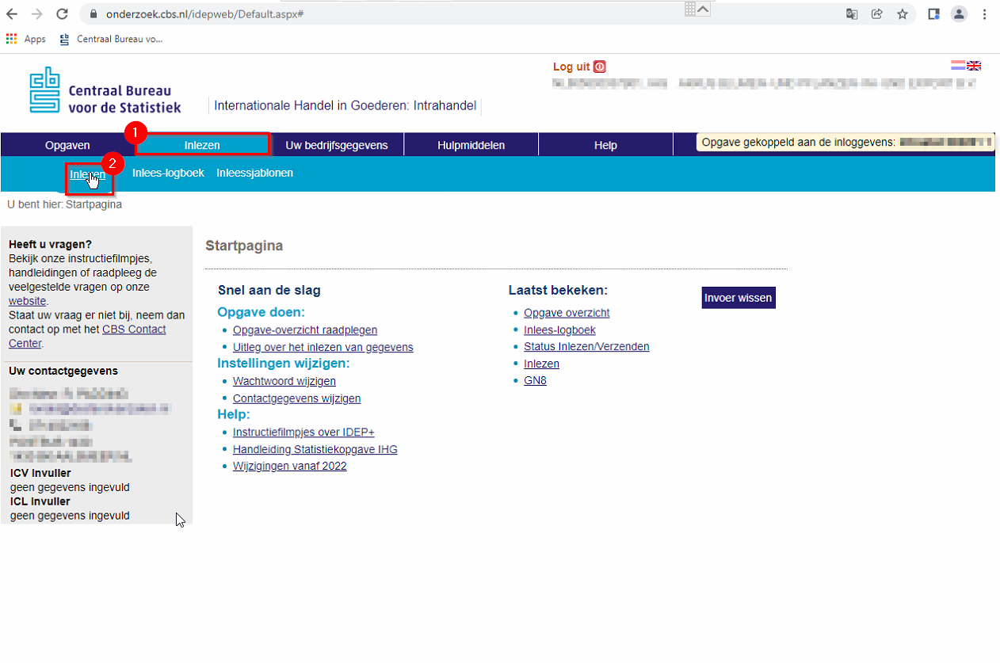
|
|**2**|Next, select **Multiple flows/periods**. You can choose to remove existing records from the declaration during the import action.

<b>Click here for an example!</b>
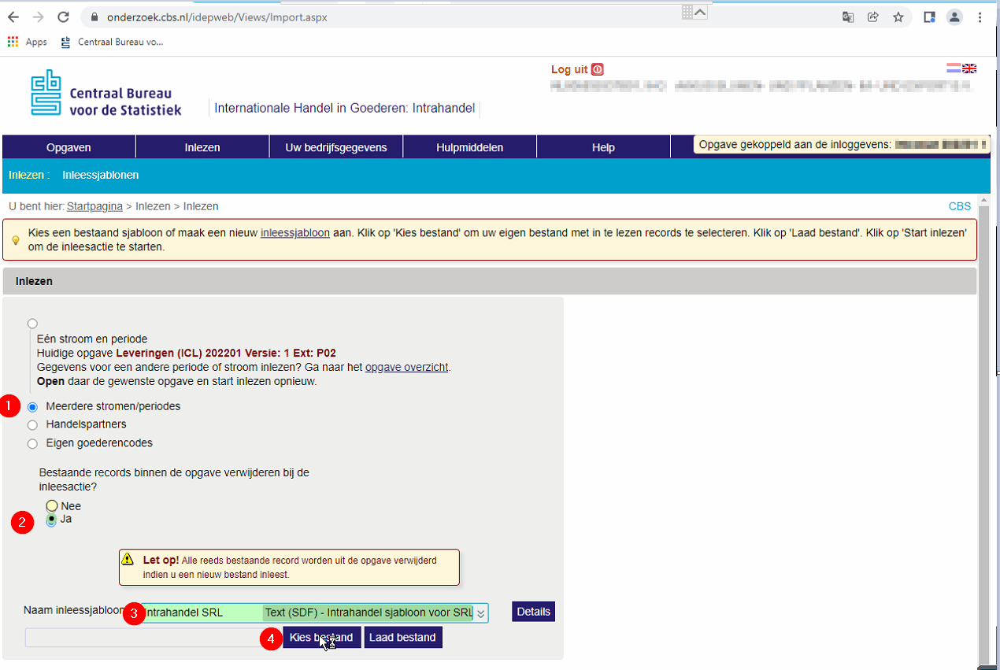
|
|**3**|Select a file on your computer.

<b>Click here for an example!</b>
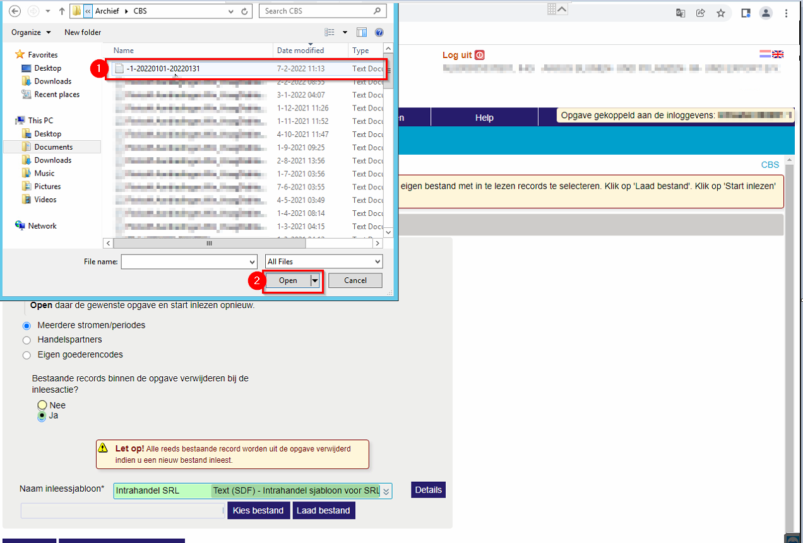
|
|**4**|Load the file by clicking the **Load file** button.

<b>Click here for an example!</b>
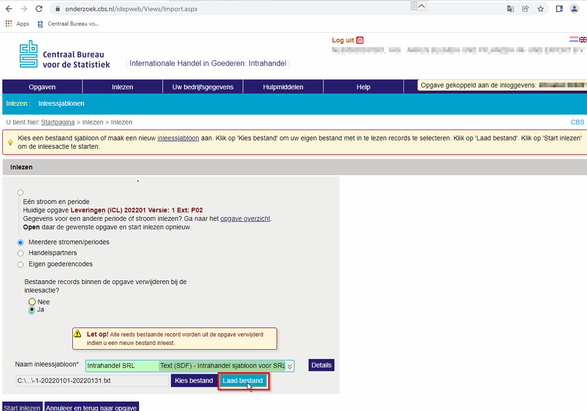
|
|**5**|Then click **Start import** to import the file.

<b>Click here for an example!</b>
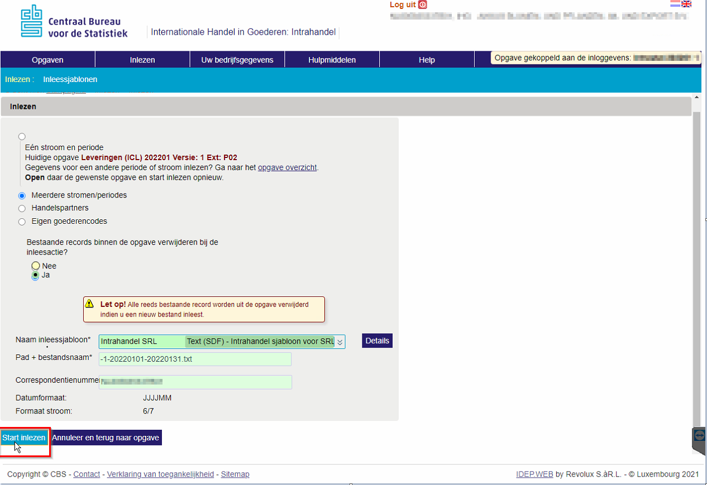
|

CBS will then show whether the file was processed successfully or contains errors.

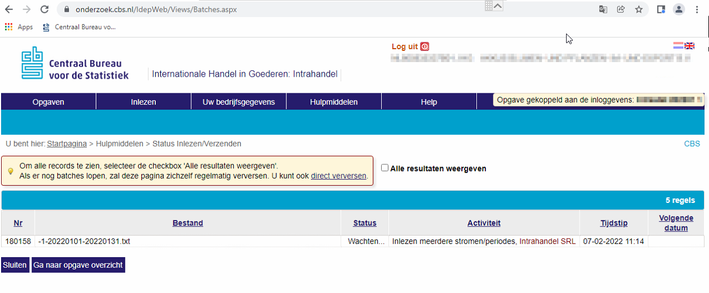
