# Handleiding CBS aangifte

## Inleiding

Per 1 januari 2022 voert het CBS veranderingen door in de opgave voor Internationale Handel in Goederen. De veranderingen komen onder andere voort uit de nieuwe Europese verordening voor bedrijfsstatistieken.
Met ingang van 2022 is het verplicht om de opgavemodule IDEP+ te gebruiken voor het insturen van de statistiekopgave over de internationale handel in goederen. Je hebt hiervoor inmiddels de inlogcodes per brief van het CBS ontvangen. De opgaveplicht wordt vanaf 2022 opgelegd aan de fiscale eenheid voor de btw/ omzetbelasting.
Lees hier alvast meer indien je ook in 2022 een verplichting hebt voor de maandelijkse opgave voor ICL.
Vanaf 2022 wijzigt de transactie-aard; alle bedrijven met een opgaveverplichting voor de internationale handel in goederen dienen het nieuwe 2-cijferige veld ‘Transactie’ in te vullen. Dit veld komt in plaats van het 1-cijferige veld ‘Transactie’. Naast de eerste dien je dus ook de tweede digit in de codelijst aan te leveren. Bovendien is de codelijst gewijzigd ten opzichte van de huidige lijst.
Hiervoor hebben we een conversiestap gebouwd wanneer je komend jaar CBS aangifte gaat doen. Deze stap past ook de transactie-aard aan. In de melding staat tevens uitgelegd wat je dient te doen wanneer jullie bedrijf verkoopt aan consumenten. Wanneer je de Florisoft versie hebt met bovenstaande aanpassing, staat de nieuwe manier automatisch aan. Je kunt de instelling ook zelf aanzetten door middel van een update.

# Verandering 2022: Land van herkomst meesturen

De grootste verandering m.b.t. het CBS versturen is het meesturen van het land van herkomst. Als u en versie heeft van 20 december of jonger dan zal Florisoft bij het doorboeken van een factuur vanaf 1 januari checken of de volgende vinkjes aanstaan bij de debiteur:

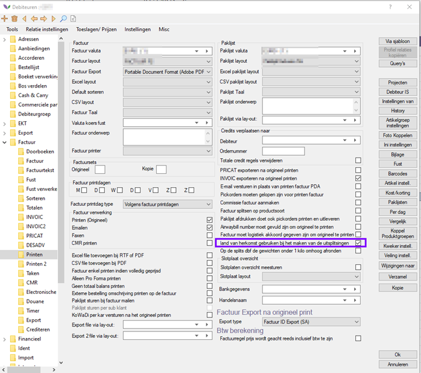

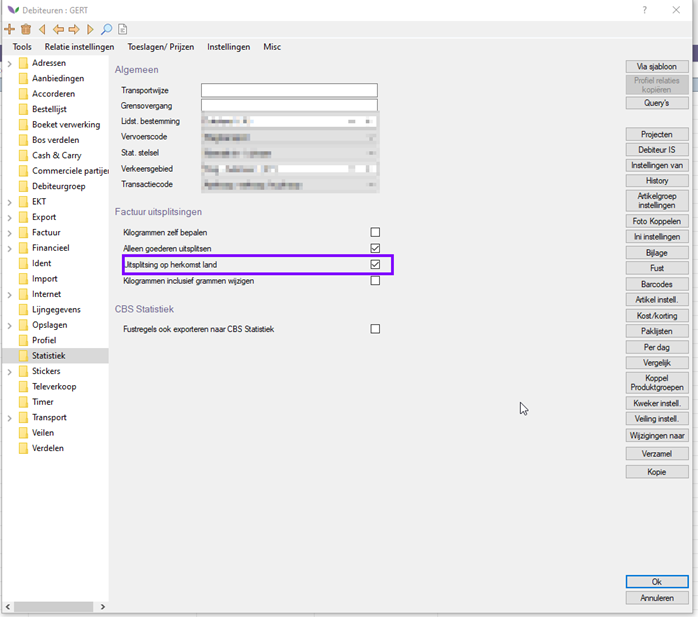

LET OP. In de versie begin december tot 2 januari kunt u als nog een melding krijgen dat het doorboeken niet lukt. Dat komt omdat in die versie ook nog naar onderstaande instelling gekeken werd:

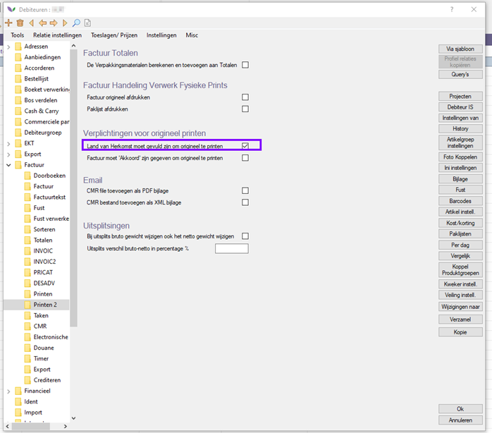

Deze kunt u in principe aanzetten. Mocht u deze vink niet willen gebruiken dan kunt u updaten en kijkt Florisoft tijdens het doorboeken niet meer naar deze vink.

Als deze aanstaan zal Florisoft ook het land van herkomst vullen in de CBS tabel. Deze data kan vervolgens weer gestuurd worden naar het CBS.
Dit heeft ook gevolgen voor de statistieken op de factuurprint. Deze zullen nu namelijk gegroepeerd worden op land van herkomst. 
Als u dus 2 factuurregels heeft van hetzelfde product met een ander land van herkomst dan komen deze dus als 2 regels op de lay-out.

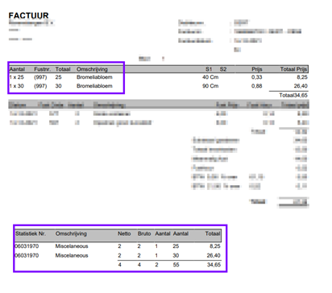

U kunt hier zelf eventueel het land van herkomst naast zetten of groeperen op de lay-out. Als u dit niet kunt of liever wilt dat wij dit doen dan kunt u contact opnemen met onze supportafdeling. Zij kunnen de aanpassing in kaart brengen en begroten voor u. 

## Land van herkomst uitsplitsing

Mocht u wel gebruik willen maken van aparte uitsplitsingen per land van herkomst dan kunt u dat op de volgende manier inrichten:

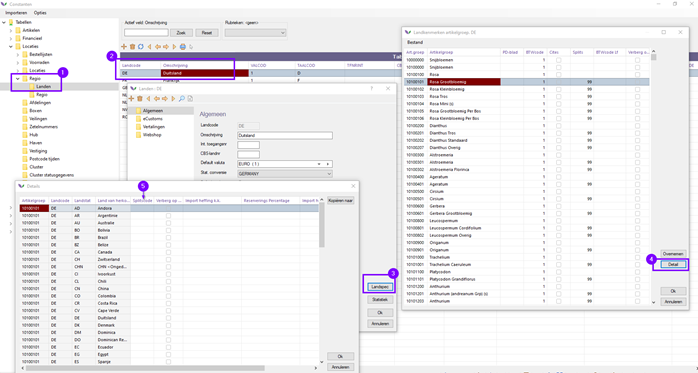

# Werkwijze:

## Stap 1: Inloggegevens aanvragen CBS

Om uw gegevens naar het CBS te kunnen uploaden heeft u specifieke gegevens nodig. Deze kunt u opvragen bij het CBS. Dit kunt u doen door een e-mail te sturen naar: bedrijveninfo@cbs.nl

## Stap 2: Bestand aanmaken.

CBS aangifte via Florisoft gaat grotendeels zoals u gewend bent. U gaat naar CBS Statistiek via de Florisoft Navigator:

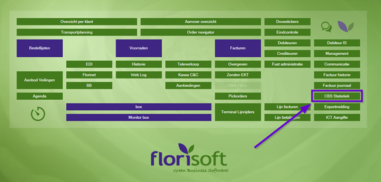

Hier kiest u de juiste administraties en eventuele andere filters:

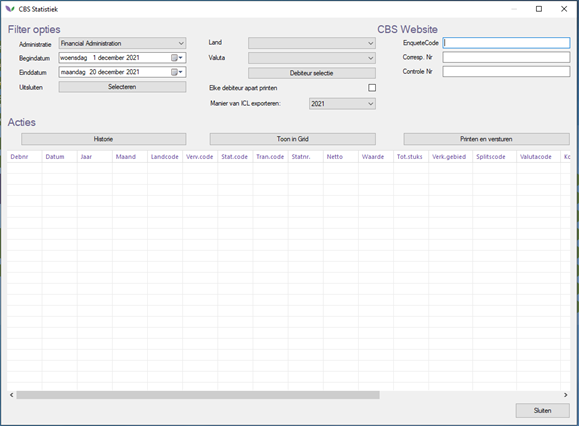

Daarna klikt u op OK. Het volgende scherm verschijnt:

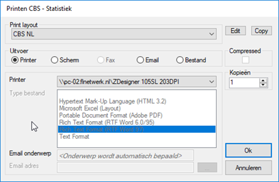

Nadat u de CBS gegevens geprint heeft of via printen scherm bekeken heeft krijgt u de vraag of de gegevens wil uploaden.
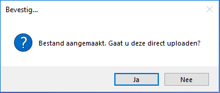

 Als u hier ja kiest opent de website van het CBS op de upload pagina en de bestandslocatie van het bestand word geopend.

 ## Stap 3: Bestand uploaden

 Nadat u Stap 2 afgerond hebt en de laatste vraag met JA beantwoord hebt opent Florisoft de locatie op de computer/server waar het bestand is aangemaakt*. En de site van het CBS komt naar voren op de juiste pagina.
*Locatie: Dataadt\Archief\CBS
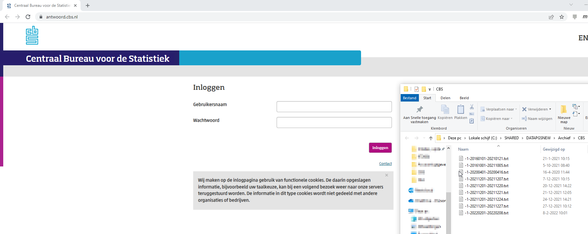

Na het inloggen kiest "inlezen" en dan nogmaals inlezen:
 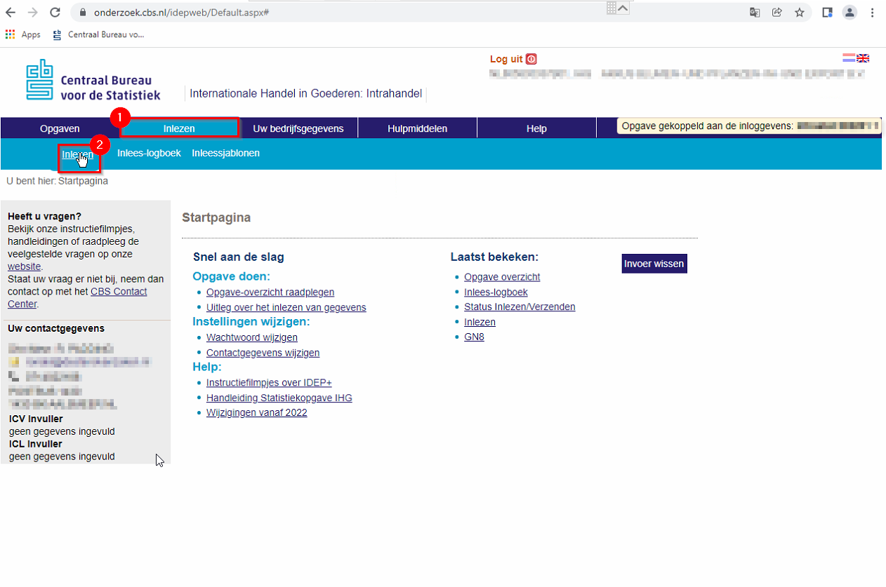

Vervolgens selecteren we "Meerdere stromen/periodes". Er kan gekozen worden om reeds bestaande records binnen de opgave te verwijderen bij inleesactie. 

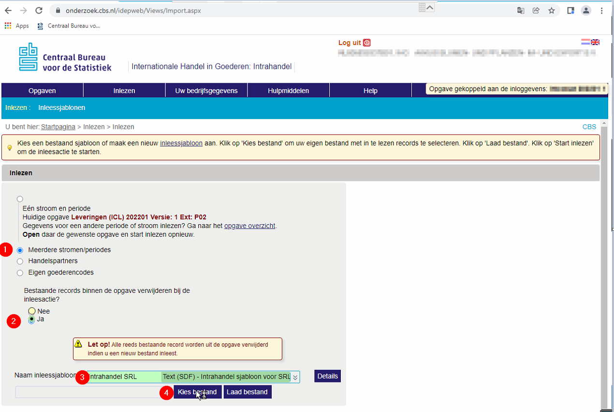 

Vervolgens de volgende stappen doorlopen:

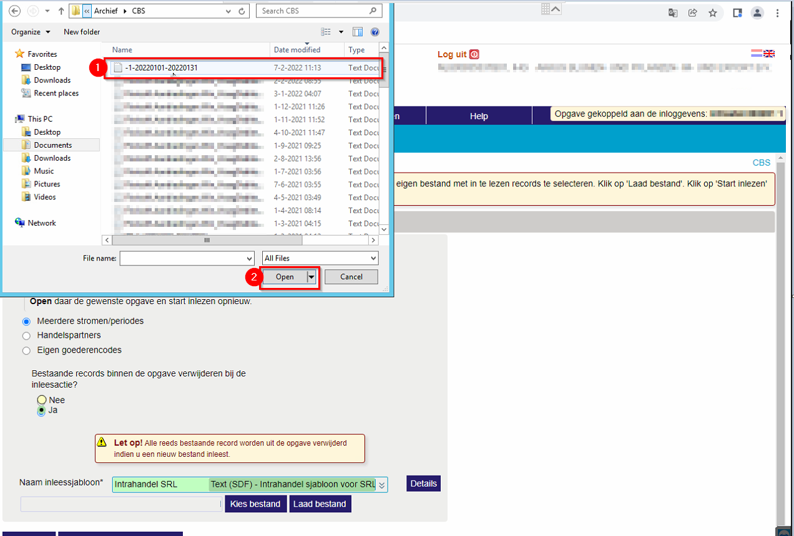
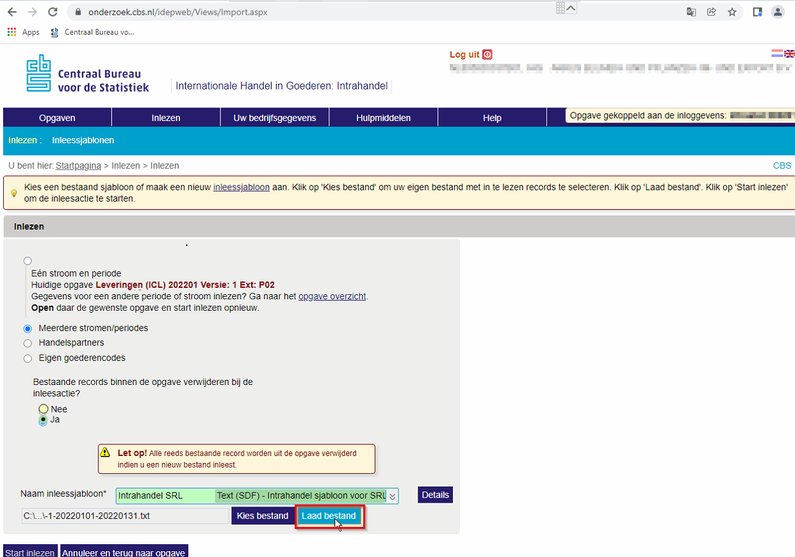

Het CBS laat vervolgens zien of het bestand goed of fout is.

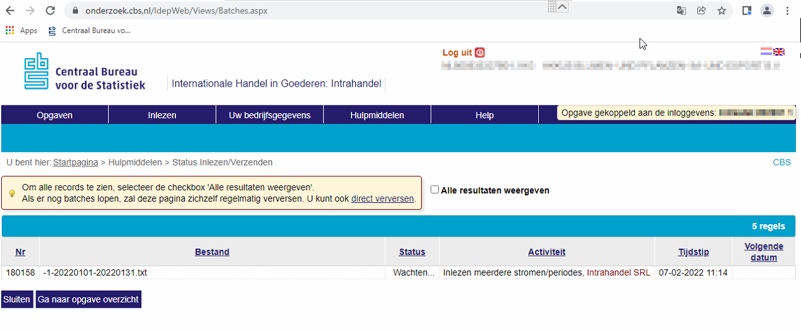

Bij eventuele foutmeldingen kan men het volgende bestand raadplegen:

https://github.com/florisoft/documentatie/blob/main/CBS/Veel%20voorkomende%20meldingen%20CBS%20import.md

