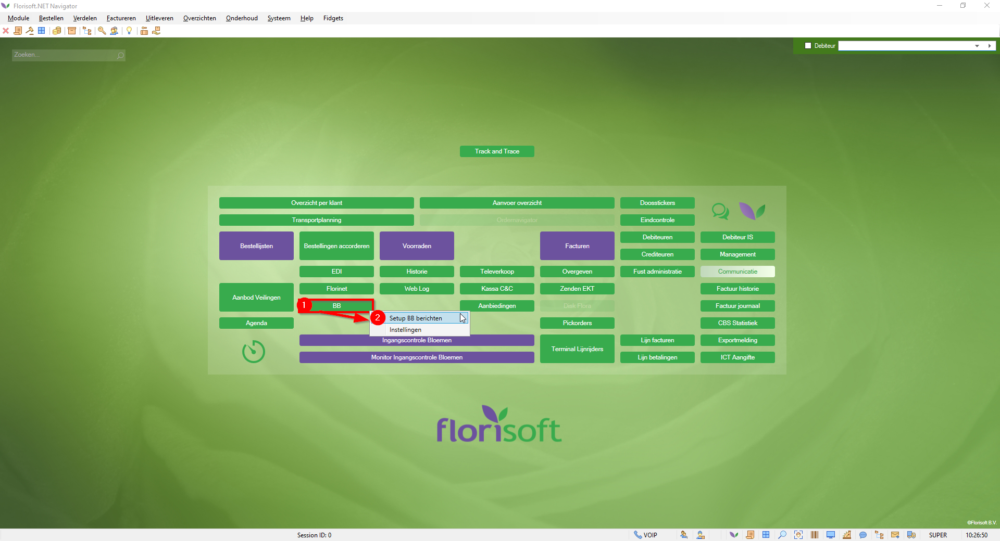
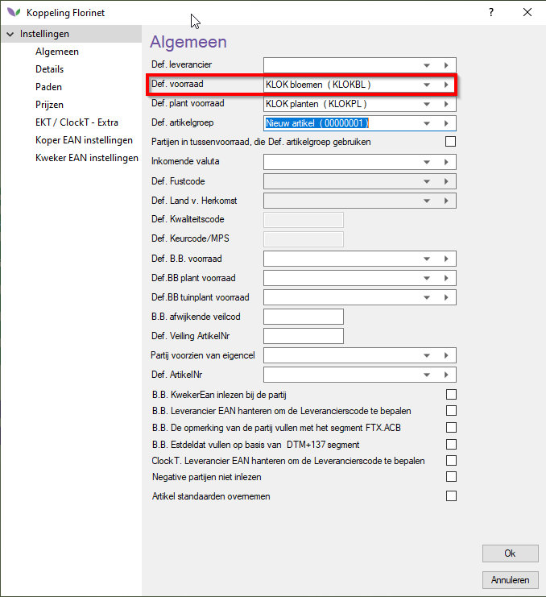
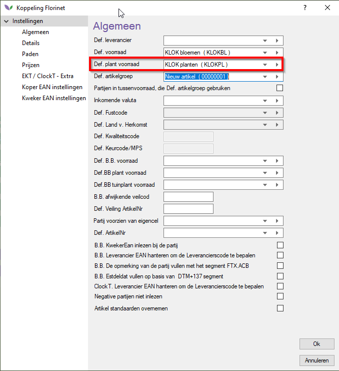
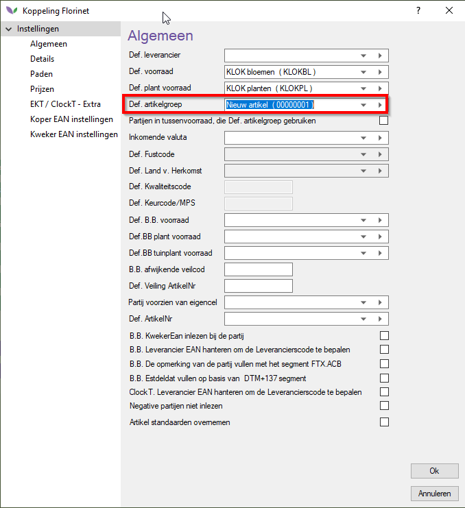
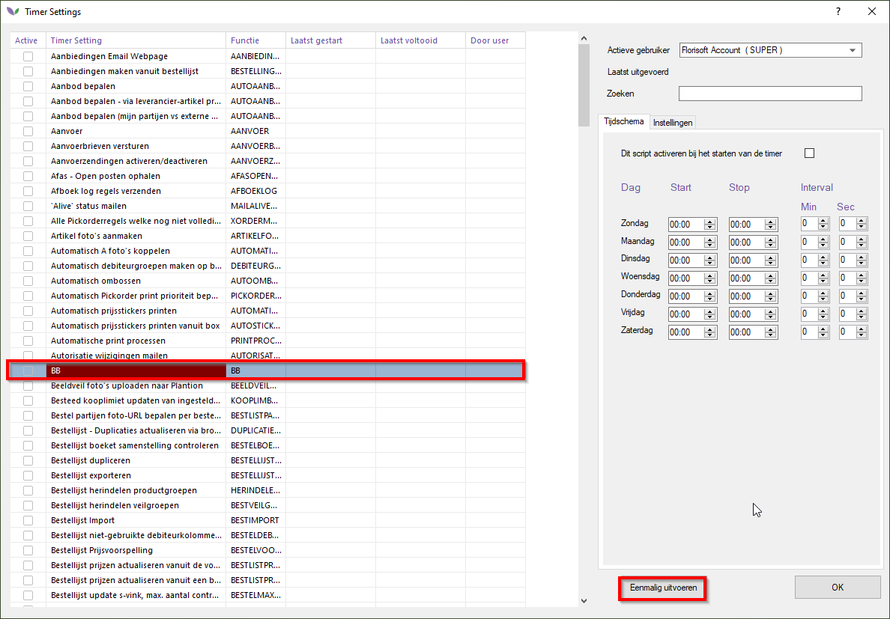

# Florisoft handleiding Connect Transactions

Als u gewend bent om EKT's te ontvangen en in te lezen werkt het inlezen van Connect/BB hetzelfde.
Deze berichten dienen dus ook naar dezelfde mailbox verzonden te worden als de EKT-berichten. 

Het berichtformat dat gebruikt wordt voor connect-transacties is DESADV, dat vanuit de mailbox opgehaald (gepopt) wordt door de EDI-functie.

*Voor het inlezen van deze berichten volgt u de onderstaande stappen.*

:warning: **Voer de volgende stappen uit op de TIMER gebruiker!**:warning:

|Stap|Uitleg|
|:--|:--|
|**1**|In de navigator klikt u met de rechtermuisknop op de **BB** knop, u krijgt nu een context menu'tje te zien. Klik hier op de optie "*Setup BB Berichten*".  U krijgt nu een instellingenscherm te zien voor het ontvangen van BB berichten (vergelijkbaar met die van EKT-instellingen)

<b>Klik hier voor uw voorbeeld afbeeldingen</b>

|
|**2**|Vul hier de waarde **Def voorraad** in door een voorraad te selecteren, dit is de standaard voorraad.

<b>Klik hier voor uw voorbeeld afbeeldingen</b>

|
|**3**|Vul daarna het veld **Def. artikelgroep** in met de standaard artikelgroep.

<b>Klik hier voor uw voorbeeld afbeeldingen</b>

|
|**4**|**Optioneel**: U kan ook een standaard plantvoorraad invullen, voor het inlezen van planten.

<b>Klik hier voor uw voorbeeld afbeeldingen</b>

|
|**5**|Het inlezen van Connect/BB-berichten kan u doen door in de navigator met linkermuisknop op de **BB** knop te drukken.  Of door de timerinstellingen te openen en de **BB** functie eenmalig uit te voeren.   Daarnaast kan u er ook voor kiezen om een tijdsschema in te vullen om de taak (het inlezen van BB/Connect berichten) automatisch uit te laten voeren. 

<b>Klik hier voor uw voorbeeld afbeeldingen</b>

|