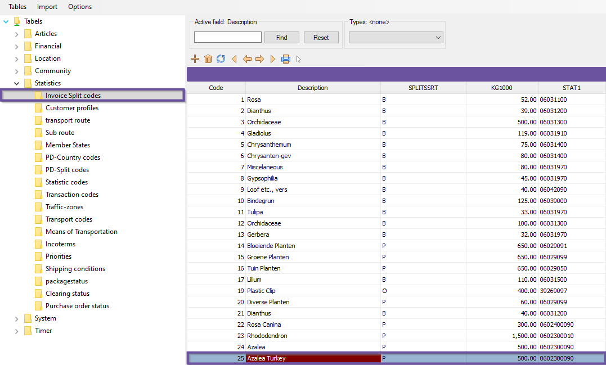
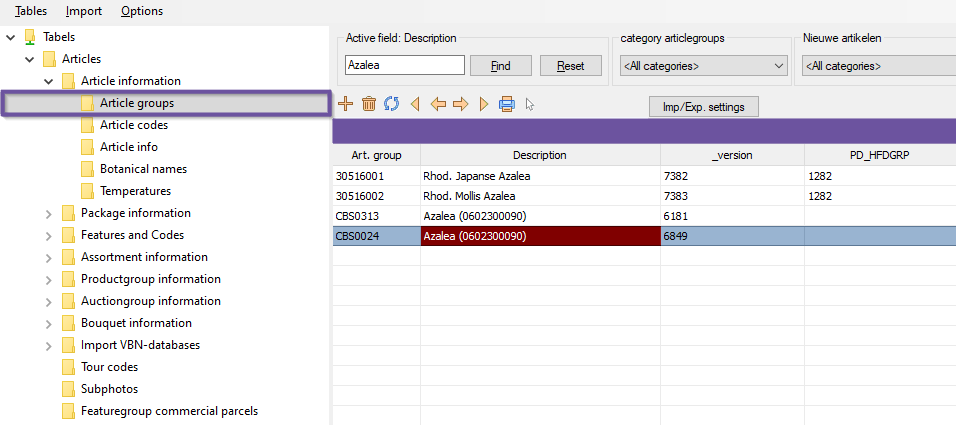
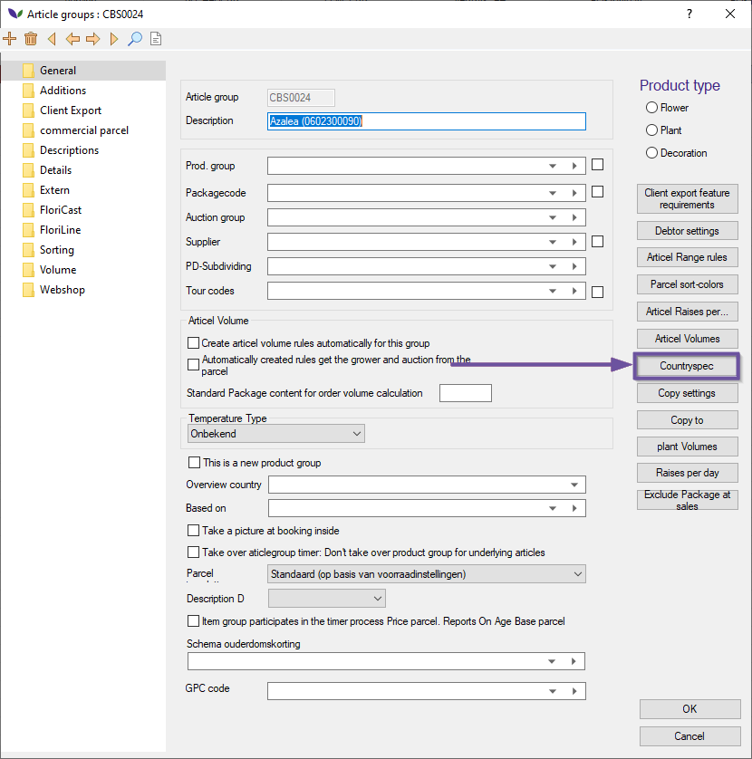
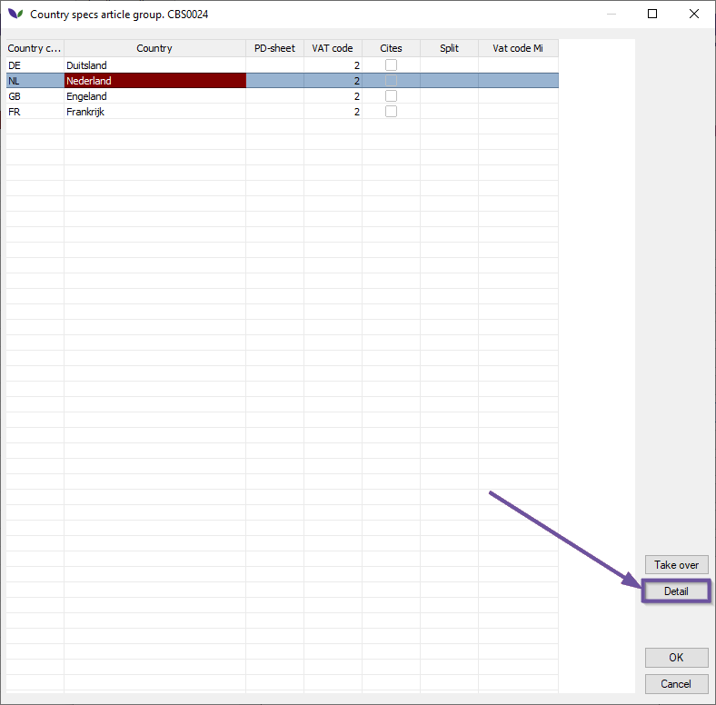
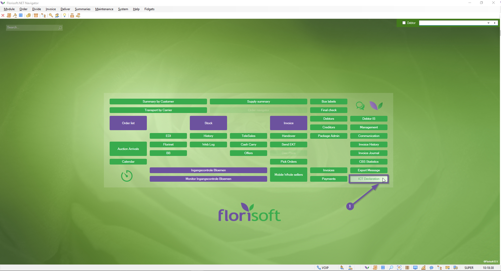
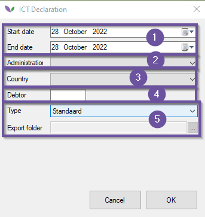

# Florisoft Manual Export Multi User (M10)

Welcome to the Florisoft manual for the Export Multi User module. This module is required when you export your product to other countries. The module Export contains all the required information which you have to send to the CBS (Statistics the Netherlands) and the Bedrijfsschap (The Dutch Agricultural Wholesale Board/Flowers and Plants). Besides sending the required documents, the module Export contains the possibility to accomplish your ICT declaration and creating your PD forms (Plant Protection Service of the Netherlands).

## Table of contents

[Product breakdown](#product-breakdown)  
[IT Declaration](#it-declaration)

## Product Breakdown

You can set various breakdowns per productgroup per country. You have to create a separate invoice breakdown for this per country that you want to break down.

In this example we split Azalea with the country of origin Turkey from other countries of origin.

*Follow the steps below:*

|Step|Explanation|
|:--|:--|
|**1**|Open the constants screen and navigate to teh following path: **Statistics** → **Invoice Split Codes**

<b>Click here for your example image</b>

|
|**2**|In this case there already is a Azalea in the system. Now add a new splitcode for Azalea Turkey by pressing the feather on top of the screen. Except for the splitcode and description, all other values should be the same as the original"

<b>Click here for your example image</b>

|
|**3**|You can now indicate a split code per article group, per country of origin. Navigate to the following path in the constants screen: **Articles** → **Article Information** → **Article groups**.

<b>Click here for your example image</b>

|
|**4**|Now find and dubble click on the corresponding article group. This should open the article group configuration screen.|
|**5**|Once in the next screen press the "Countryspec" button.

<b>Click here for your example image</b>

|
|**6**|Here are already split codes. To be able to split per country of origin, we have to click on the detail button. This way you can indicate per country how the articles should be divided. **NOTE:** Before you press the detail button, you have to select the country you want to set it for. In the example above, we open a detail screen of the Netherlands.

<b>Click here for your example image</b>

|
|**7**|Type the splitcode you have made behind the country of origin. In this example we have made an extra splitcode for the Azalea Turkey which we would like to split.

<b>Click here for your example image</b>

|

## IT Declaration

In order to make your declaration, a few things should be set straight. *Follow the steps below*:

|Step|Explanation|
|:--|:--|
|**1**|From the Florisoft Navigator, head to ICT Declaration by clicking on the ICT Declaration button.

<b>Click here for your example image</b>

|
|**2**|A new screen should have opened, change the following fields:  - **Start & End date**: *Fill in the start & end date*  - **Administration**: *Select the type of administration.*  - **Country**: *Select the right country*  - **Debtor**: *Enter the corresponding debtor* - **Export folder**: *You can also choose between standard export and King export. If you select the King export, you can select the export folder wehere the file will ba saved. If you choose to keep the standard export, Florisoft will ask you in what way you wish to download the declaration. Select your preffered way.*

<b>Click here for your example image</b>

|
