# Florisoft Handleiding Florishield (M96)

Deze handleiding behandelt de vereisten/werking/configuratie en controle van de Florishield module.

## Inhoudsopgave

[Licentie](#licentie)  
[Werking](#werking)  
[Configuratie](#configuratie)  
[Controles](#controles)  
[FloriShield client stoppen](#florishield-client-stoppen)  
[Florishield service stoppen](#florishield-service-stoppen)  
[Meldingen](#meldingen)  
[Updates](#updates)  
[Telegram](#telegram)  
[Telegram instellen](#telegram-instellen)                
[Telegram account aanmaken](#teleggram-account-aanmaken)  
[Telegram bot aanmaken](#telegram-bot-aanmaken)   
[Aanmelden bij je telegram bot](#aanmelden-bij-je-telegram-bot)  
[Telegram berichten vanuit de FloriShield](#telegram-berichten-vanuit-de-florishield)   

## Licentie

Om de Florisoft Monitor te kunnen gebruiken is de licentie voor '*FloriShield*' vereist. Na activatie in het licentiebestand moet er een licentie update in een cliënt gedaan worden. 

## Werking

FloriShield bestaat uit meerdere onderdelen. De normale FloriSoft cliënt waar bijvoorbeeld de Timer draait. Als de *FloriShield* licentie actief is en voor de ingelogde gebruiker staat aan dat er gemonitord moet worden, dan wordt de **FloriShieldService** gestart. Daarnaast is er een ***FloriShield*** gestart. Daarnaast is er een ***FloriShield Client*** nodig, dit is het deel date de Florisoft cliënt controleert, corrigeert en rapporteert.

In de toekomst komt daar nog een ***FloriShield IT Client*** en ***FloriShield Support Client*** bij. De ***FloriShield IT Client*** komt bijvoorbeeld bij de Florisoft applicatie beheerder te draaien en toont de resultaten en meldingen van meerdere **FloriShield Cliënts** in zijn netwerk. De **FloriShield**, **Support Client** komt bij Florisoft Support te draaien en toont resultaten en meldingen van meerdere Florisoft klanten.

## Configuratie

## Florisoft Timer dbf in fsnet plaatsen

Voordat we de nodige backoffice instellingen gaan configureren willen we eerst het een DBF bestand klaarzetten, volg hiervoor de onderstaande stappen.

|Stap|Uitleg|
|:-:|:--|
|**1**|Download het dbf bestandje [hier](https://github.com/florisoft/User.Manuals/blob/main/BASIS/FloriShield%20(M96)/Download/FS_FLORISHIELD.DBF).
|**2**|Eenmaal gedownload kopieert en plakt u het .DBF bestand naar de volgende bestandsmap op uw server : <br>**C:/FSNET/**.|

### Florisoft Client

Om te zorgen dat een Florisoft client gemonitord kan worden dient dit aangezet te worden voor de ingelogde gebruiker. Hiervoor dient FS-2000 instelling FloriShield op True gezet worden.

<details><summary><b>Klik hier voor uw afbeelding</b></summary>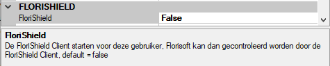</details>

*Volg hiervoor de onderstaande stappen*:

|Stap|Uitleg|
|:--|:--|
|**1**|Klik tweemaal op de gebruikersnaam rechtsonder in de Florisoft Navigator. Dit opent een nieuw scherm.|
|**2**|Klik nu op de knop '*inifiles*' aan de linkerkant van het scherm. Dit opent weer een nieuw scherm|
|**3**|Selecteer nu in de '*inifile*' drop down '**FS2000**'. Dit update de onderstaand tabel.|
|**4**|Scroll nu door naar de het instellingen tabje FloriShield en zet hier de FloriShield instelling op '**True**'. |

Als deze gebruiker Florisoft start, wordt de **FloriShield service** mee gestart en kan deze Florisoft gecontroleerd worden door de **FloriShield Client.**

<details><summary><b>Klik hier voor uw afbeelding</b></summary></details>

Het geselecteerde icoon geeft aan dat de service actief is. Zorg dat in de snelkoppeling om de Florisoft Client te starten ook de parameter MEER is opgenomen.

### Het starten van de Florishield Client

|Stap|Uitleg|
|:--|:--|
|**1**|Maak een nieuwe snelkoppeling naar de florisoft 2000.exe executable met als optie "**/MONITOR MEER**"<br>U doet dit door rechtermuisknop te doen op uw bureaublad en te kiezen voor de optie '**nieuw**' kies dan vervolgens voor de optie '**Snelkoppeling**'.<details><summary><b>Klik hier voor uw afbeelding</b></summary>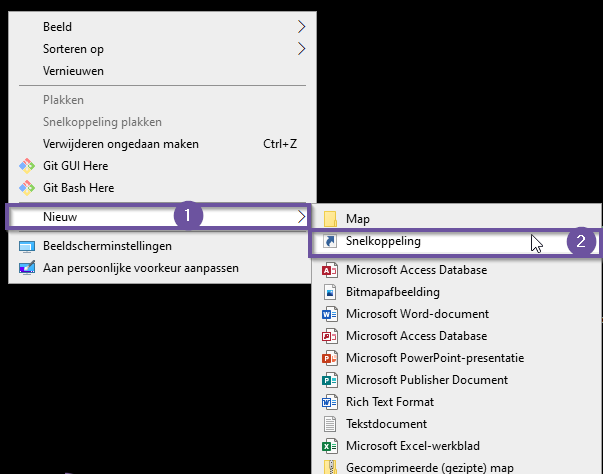</details>|
|**2**|U krijgt nu een invoerscherm waarin u het pad moet aangeven naar de florisoft2000 executable meestal kan u het onderstaande pad invullen: <br> "*C:\fsnet\Splash\florisoft 2000.exe*"|
|**3**|Druk vervolgens op '*Volgende*', geef dan vervolgens een naam aan de snelkoppeling en druk op '*Voltooien*'.|
|**4**|Klik vervolgens met de rechtermuisknop op de zojuist aangemaakte snelkoppeling en kies voor eigenschappen.<details><summary><b>Klik hier voor uw afbeelding</b></summary></details>|
|**5**|In het invoerveld '*doel*' ziet u dan het aangegeven pad naar de Florisoft applicatie zet hier het volgende achter: ' /MONITOR MEER' (min de ' ' natuurlijk)<details><summary><b>Klik hier voor uw afbeelding</b></summary>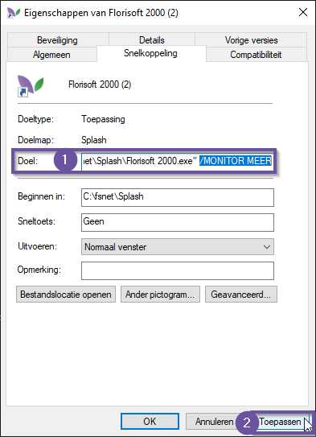</details>|
|**6**|Klik vervolgens op de knop '*Toepassen*' om de wijzigingen op te slaan.|
|**7**|Als u deze snelkoppeling nu opstart krijgt u het volgende te zien.|

Open nu de Florisoft applicatie zodat we wat FloriShield instellingen kunnen nakijken:

|Stap|Uitleg|
|:--|:--|
|**1**|Open het constanten scherm en navigeer naar het onderstaande pad:<br>**Systeem**→**Florishield**<details><summary><b>Klik hier voor uw afbeelding</b></summary>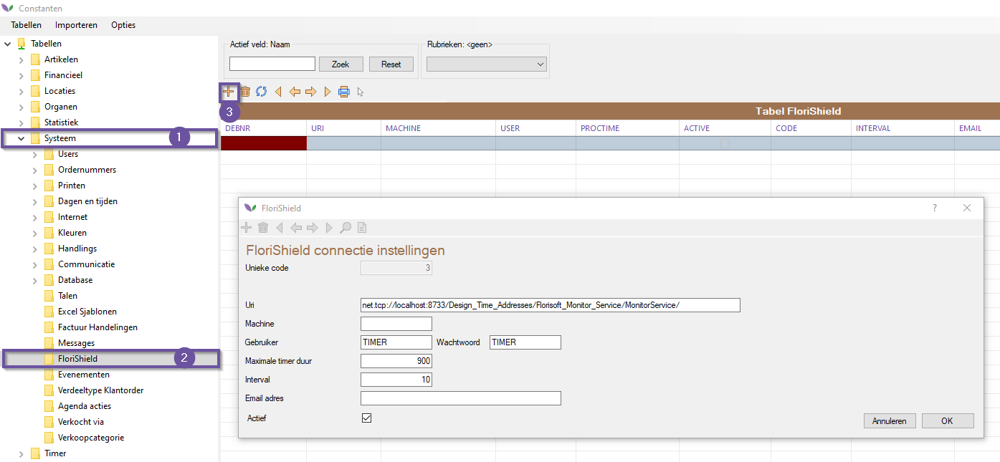</details>|
|**2**|*Vul de volgende velden in:*<br>**Email**: Niet relevant door het gebruik van Telegram.<br>**Interval:** Tijd in seconden tussen 2 controles<br>**Maximale timer duur**: De maximale tijd dat een timerproces mag duren in seconden<br>**URI**: Het adres van de monitor service in de Florisoft Client default is: net.tcp://localhost:8733/Design_Time_Addresses/Florisoft_Monitor_Service/MonitorService/<br>**Gebruiker**: Gebruikersnaam van de timer gebruiker die ingelogd moet zijn<br>**Wachtwoord**: Het wachtwoord van de timer gebruiker die ingelogd moet zijn|

## Controles

Binnen deze module zijn de volgende controles beschikbaar:

|#|Controle|Actie|
|:--|:--|:--|
|**1**|Is Florisoft actief?|Zo niet dan wordt Florisoft gestart met de ingestelde gebruiker en wachtwoord en wordt de timer gestart.|
|**2**|Is de gebruiker actief?|Zo niet dan wordt er een nieuwe Florisoft gestart met de ingestelde gebruiker en wachtwoord en wordt de timer gestart.|
|**3**|Is de timer actief?|Zo niet dan wordt de timer gestart.|
|**4**|Is er recente timer activiteit?|Een proces mag maximaal zo lang duren als ingesteld in ProcessTime. Als een proces al langer draait dan de ingestelde tijd, wordt er een melding gestuurd naar het ingestelde email adres. Er wordt nog geen actie ondernomen.|

Als alle testen succesvol zijn verlopen ziet u het onderstaande scherm:

<details><summary><b>Klik hier voor uw voorbeeld afbeelding!</b></summary></details>

:warning: **LET OP!** :warning:

*Als er op dezelfde machine meerdere monitors dienen te draaien (denk bijv. aan een virtual machine) dan moeten de poortnummers afwijkend van elkaar zijn.*

<details><summary><b>Klik hier voor uw voorbeeld afbeelding!</b></summary>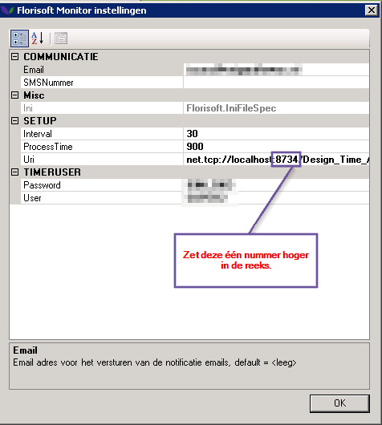</details>

>**ATTENTIE:** In de DOTNET versie verloopt de communicatie niet meer via TCP maar via HTTP de Windows user die de Florishield Server draait moet rechten krijgen om te mogen luisteren naar HTTP: netsh http add urlacl ```url=http://+:8733/Design_Time_Addresses/Florisoft_Monitor_Service/MonitorService/ user=DOMAIN\Username```

## FloriShield Client stoppen

De FloriShield client kan niet gestopt worden door op het kruisje te klikken. Dit is gedaan om te voorkomen dat iemand zomaar, per ongeluk de FloriShield client stopt. Als je toch op het kruisje klikt, dan wordt de FloriShield Client geminimaliseerd naar de System Tray en blijft gewoon doorlopen met controleren. 

<details><summary><b>Klik hier voor uw voorbeeld afbeelding!</b></summary></details>

De FloriShield client kan gestopt worden door met de rechtermuisknop op het icoon te klikken en te kiezen voor Close FloriShield.

<details><summary><b>Klik hier voor uw voorbeeld afbeelding!</b></summary></details>

Waarna je moet bevestigen om de FloriShield Client te stoppen.

Als de **FloriShield Client** geminimaliseerd is, kan er dubbel geklikt worden op het icoon in de System Tray om de FloriShield Client weer te tonen.


## FloriShield Service stoppen

De ***FloriShield Service*** stopt automatisch als de Florisoft Client wordt gestopt. Het stoppen van de Florisoft Client duurt dan wel iets langer, omdat alle verbindingen met de ***FloriShield Service*** moeten worden gestopt.

## Meldingen

De FloriShield Client stuurt verschillende berichten naar Telegram gebruikers (Zie Telegram instellen hoe dit geconfigureerd dient te worden). Deze berichten kunnen ingesteld worden in de Constanten van Florisoft onder ‘Financieel – Factuurteksten’. De teksten 26 t/m 31 worden gebruikt voor het versturen van de diverse berichten. Op dit moment kunnen de vertalingen nog niet ingevoerd worden. Er kunnen wel 2 variabelen ingesteld worden in de teksten, dat zijn {MACHINE} en {USER} waarbij {MACHINE} vervangen wordt door de computernaam waar de Monitor Client op draait en {USER} door de Florisoft gebruikersnaam die volgens de instellingen actief moet zijn.

## Updates

De ***FloriShield Client*** loopt mee met de *scheduled updates*. Zodra er een scheduled update wordt ingepland, pakt ook de FloriShield Client deze op net als de Florisoft client die op de bewuste machine draait. Op de ingestelde tijd worden zowel de Florisoft client als de FloriShield Client afgesloten, echter met het verschil dat de FloriShield Client de opdracht meekrijgt om te herstarten.

Het volgende scherm wordt getoond:

<details><summary><b>Klik hier voor uw voorbeeld afbeelding!</b></summary>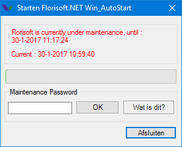</details>

Nadat de geplande update is afgelopen, zal er een herstart van de ***FloriShield Client*** plaatsvinden, die direct de update uitvoert, zoals dat bij elke Florisoft client gebeurd. Na de update start de ***FloriShield Client*** opnieuw en deze zal Florisoft en de timer starten als onderdeel van de ingestelde controles.

## Telegram

Om Telegram in te stellen dienen er een aantal stappen doorlopen te worden.

### Telegram instellen

#### Teleggram account aanmaken

|Stap|Uitleg|
|:--|:--|
|**1**|Open uw webbrowser en ga naar de volgende link:<br>https://web.telegram.org/#/login|
|**2**|Voer het juiste land en mobiele telefoonnummer in dat je wilt gebruiken om je bot aan te koppelen.<br>**Gebruik wel een bestaand nummer, u ontvangt namelijk een SMS met de inlog code.**<details><summary><b>Klik hier voor uw voorbeeld afbeelding!</b></summary></details>|
|**3**|Na het invoeren van het nummer klik je op "*Volgende*", Voer de ontvangen autorisatiecode in en daarna je gegevens. Je komt nu in de web-versie van de Telegram-app.<details><summary><b>Klik hier voor uw voorbeeld afbeelding!</b></summary></details>|

#### Telegram bot aanmaken

|Stap|Uitleg|
|:--|:--|
|**1**|Nu je ingelogd bent bij Telegram kun je een bot aanmaken. Hiervoor start je een nieuw gesprek met de BotFather, voer hiervoor @botfather in het Zoeken veld en klik op het enige resultaat.<details><summary><b>Klik hier voor uw voorbeeld afbeelding!</b></summary></details>|
|**2**|Klik nu onderaan op “Begin”<details><summary><b>Klik hier voor uw voorbeeld afbeelding!</b></summary>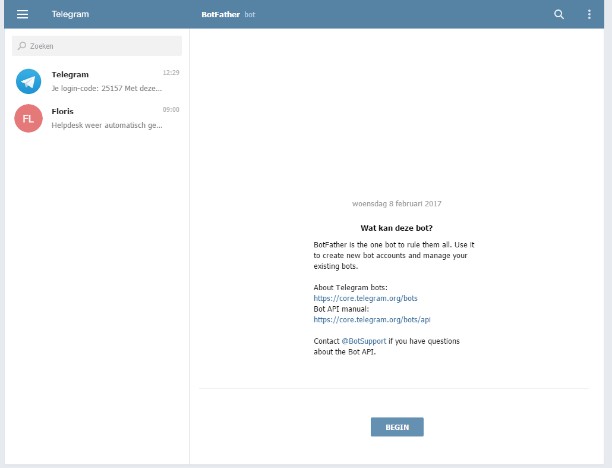</details>|
|**3**|Je bent nu een ‘gesprek’ begonnen met de BotFather|
|**4**|Stuur nu het volgende commando: **/newbot** (inclusief de /) naar de botfather.<details><summary><b>Klik hier voor uw voorbeeld afbeelding!</b></summary></details>|
|**5**|Er wordt gevraagd om een naam voor je bot, geef de gewenste naam in.|
|**6**|Vervolgens wordt er gevraagd om de gebruikersnaam van je bot, hier mogen geen spaties in zitten, en moet eindigen op ‘bot’, dat is niet hoofdletter gevoelig en alles mag er voor staan, de naam moet wel uniek zijn bij Telegram.|
|**7**|De bot is gemaakt en je ontvangt de API Token, die hebben we nodig:<details><summary><b>Klik hier voor uw voorbeeld afbeelding!</b></summary></details>|

#### Aanmelden bij je Telegram bot

Om je aan te melden bij de nieuw aangemaakte Telegram bot, moet dit ingesteld worden in Florisoft. Open dus ook alvast de Florisoft applicatie indien u dit nog niet had gedaan.

|Stap|Uitleg|
|:--|:--|
|**1**|Klik in op de knop **onderhoud** bovenaan in het navigator scherm, klik vervolgens op **Setup Systeem**. Klik in dit scherm dan weer op het mapje **Telegram IT Bot**. Vul hier dan ook de API key in die we in het vorige hoofdstuk hebben ontvangen.<details><summary><b>Klik hier voor uw voorbeeld afbeelding!</b></summary></details>|
|**2**|Vervolgens moet bij 1 gebruiker de FloriShield IT Bot worden aangezet, alleen als deze Florisoft online is kunnen gebruikers zich aanmelden bij de bot om berichten te ontvangen.<br><br>Om de FloriShield IT Bot aan te zetten moet FS2000 – FloriShieldItBot aangezet worden.|
|**3**|Start nu de Florisoft met de gebruiker waarbij de FloriShield IT Bot is aangezet.<details><summary><b>Klik hier voor uw voorbeeld afbeelding!</b></summary></details>|
|**4**|Herstart de timer door de Florisoft client waar de timer op draait te herstarten.|
|**5**|In Telegram type je de gebruikersnaam van je bot in het zoeken veld en klik op het gevonden resultaat.<details><summary><b>Klik hier voor uw voorbeeld afbeelding!</b></summary></details>|
|**6**|Klik onderaan op Begin<details><summary><b>Klik hier voor uw voorbeeld afbeelding!</b></summary></details>|
|**7**|Stuur nu je gebruikersnaam en daarna je wachtwoord<details><summary><b>Klik hier voor uw voorbeeld afbeelding!</b></summary></details>|
|**8**|Je bent nu aangemeld bij de bot.|
|**9**|:warning: **Let op!** Er moet een bekende Florisoft gebruikersnaam en wachtwoord ingevoerd worden (systeem gebruiker) en de gebruiker mag niet geblokkeerd zijn.|
|**10**|Om af te melden stuur je /unsubscribe naar de bot en je wordt verwijderd van de lijst met ontvangers.|

## Telegram berichten vanuit de FloriShield

Als FloriShield nu een probleem constateert of verhelpt wordt de tekst uit de Factuur teksten naar alle aangemelde Telegram gebruikers gestuurd. Hier zijn geen extra instellingen voor nodig. Zodra de Telegram bot API key is ingevoerd en de FloriShield wordt geherstart, worden de berichten verstuurt.

### Telegram berichten instellen

In uw Florisoft backoffice kunt in de inhoud van de berichten instellen die op Telegram verstuurd worden.

|Stap|Uitleg|
|:-:|:--|
|**1**|Vanuit de Florisoft navigator opent u de constanten.<details><summary><b>Klik hier voor uw voorbeeld!</b></summary>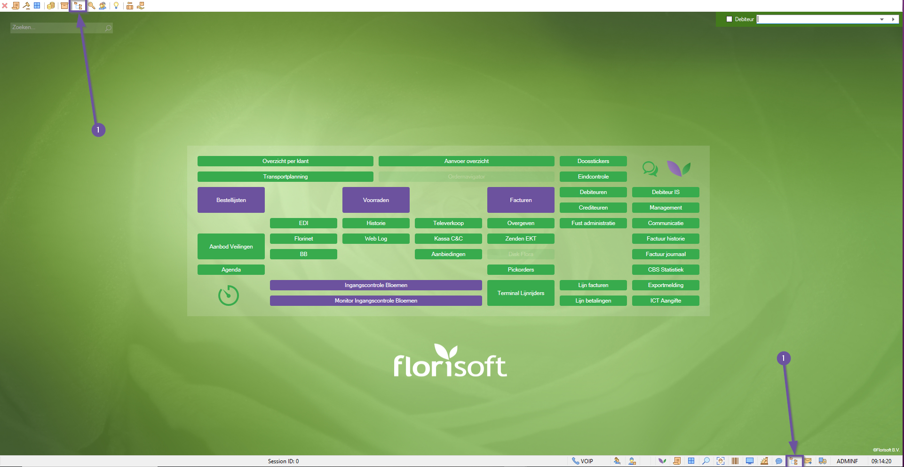</details>|
|**2**|In de constanten navigeert u naar het pad :<br>**Financieel→Factuurteksten**<details><summary><b>Klik hier voor uw voorbeeld!</b></summary>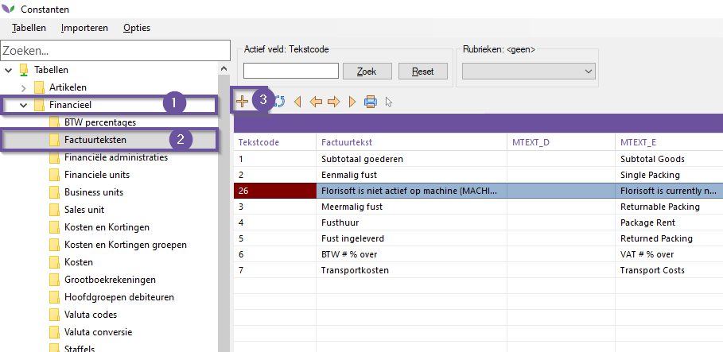</details>|
|**3**|Gebruik het + icoon om een factuurtekst aan te maken, u krijgt nu een keuze om te kiezen uit een set aan (verplichte templates). Voor Florishield zijn de templates 26 t/m 31 relevant.<details><summary><b>Klik hier voor uw voorbeeld!</b></summary>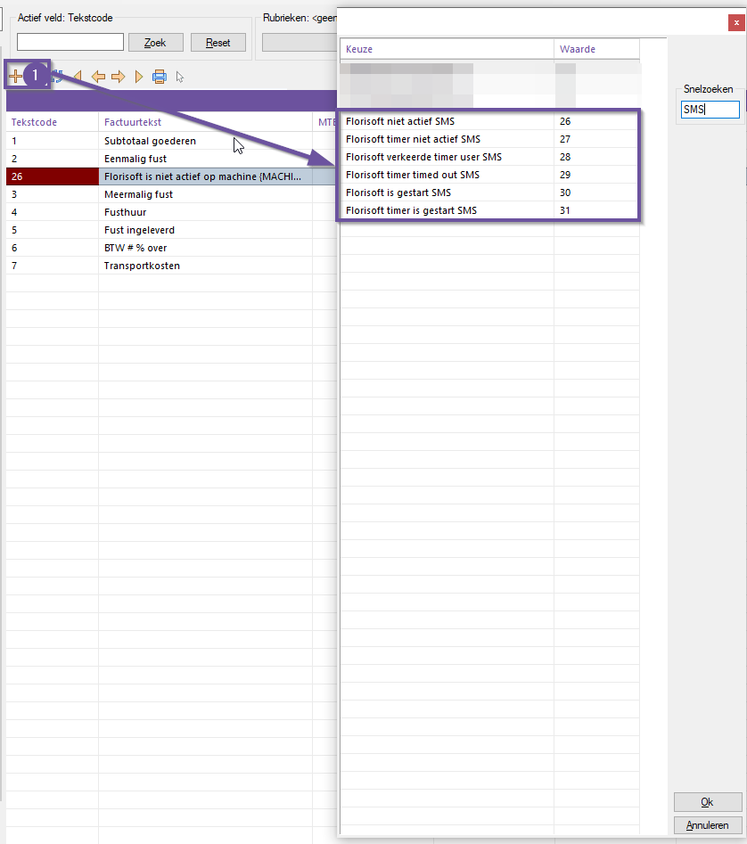</details>|
|**4**|Bij het aanmaken van een factuurtekst staat onder het veld Factuurtekst standaard de Nederlandse versie van het bericht.<br><br>In dit bericht staan in de gekrulde haakjes waarin variabelen zoals de gebruiker, machinenaam en tijdstip zijn opgenomen.<details><summary><b>Klik hier voor uw voorbeeld!</b></summary>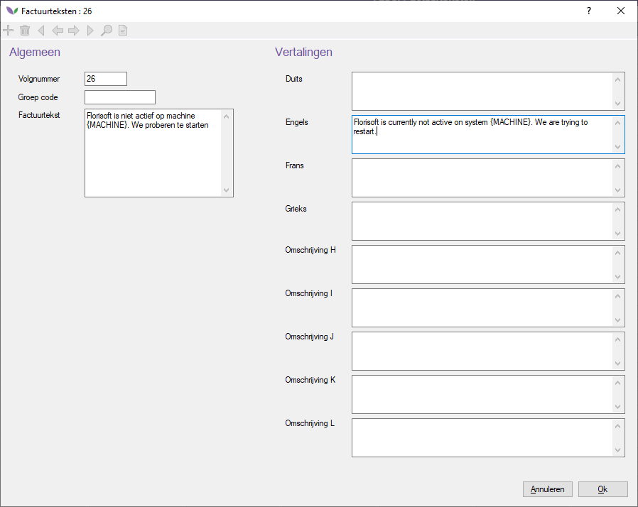</details>|
|**5**|Bij systemen die ingesteld zijn op een andere taal vult u de respectievelijke taalvertaling in, gebruik hier ook de variabelen met de gekrulde haakjes om deze te tonen in het bericht.<details><summary><b>Klik hier voor uw voorbeeld!</b></summary></details>|
