# Florisoft Handleiding FloriShield (M96)

## License

To use the florisoft monitor the license for "*Florishield*" is required. After activation in the license file, a license update has to be done in the client.

## Operation

The FloriShield consists of several parts. The normal Florisoft client where, for example, the Timer is running. If the *FloriShield* license is active and for the logged user it is checked that it is being monitored, then the **FloriShield Client** is started. In addition, a ***FloriShield Client*** is required, this is the part that the Florisoft client checks, corrects and reports.

In the future, a ***FloriShield IT Client*** and ***FloriShield Support Client*** will be added. For example, the ***FloriShield IT Client*** runs with the Florisoft application manager and displays the results and messages of multiple ***FloriShield Clients*** in its network. The ***FloriShield Support Client*** will run at Florisoft Support and will show results and notifications from multiple Florisoft customers.

## Configuration

### Florisoft client

To ensure that a Florisoft client can be monitored, this has to be enabled for the logged in user. For this, *FS-2000 FloriShield setting* has to be set to **True**.

<details><summary><b>Click here for your example image!</b></summary>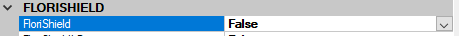</details>

*To do this follow the steps below*:

|Step|Explanation|
|:--|:--|
|**1**|Click twice on the username in the bottom left corner of the Florisoft navigator screen, this opens a new window.|
|**2**|Click on the '*inifiles* button in the left side of the screen. This again opens a new screen.|
|**3**|In the *Inifile* dropdown select '**FS2000**' this updates the table below.|
|**4**|In the table scroll down to the setting tab '*FloriShield*' and set the setting '*FloriShield*' to true.|

When this user starts Florisoft, the FloriShield service is also started and this Florisoft can be controlled by the ***FloriShield Client***.

<details><summary><b>Click here for your example image!</b></summary>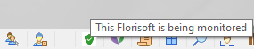</details>

The selected icon indicates that the service is active. Make sure that the "MEER" parameter is also included in the shortcut to start the Florisoft Client.

#### Starting the FloriShield Client

|Step|Explanation|
|:--|:--|
|**1**|Create a new shortcut to the Florisoft2000 executable with the launch option "**/MONITOR MEER**" (without " "). You can do this by creating a new shortcut on your desktop by rightclicking choosing **new** and then clicking on the option "**shortcut**". <details><summary><b>Click here for your example image!</b></summary>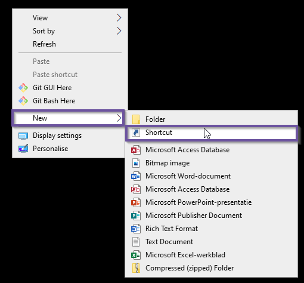</details>|
|**2**|You should now be prompted with an input screen where you have to enter the path to the florisoft2000 executable. Most of the times you can use the following path:<br>"*C:\fsnet\Splash\florisoft 2000.exe*".|
|**3**|Click on the '*next*' button, enter the name for the shortcut and click on the '*finish*' button.|
|**4**|Click on the newly created shortcut with the right mouse button and click ont the menu option '*properties*'<details><summary><b>Click here for your example image!</b></summary>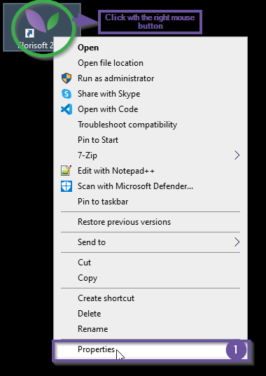</details>|
|**5**|In the input field called '*Target*' you will see the Florisoft2000 path you entered before. In this field you'll need to add the following behind the path " /MONITOR MEER" (Without the " ", but with the whitespace)<details><summary><b>Click here for your example image!</b></summary>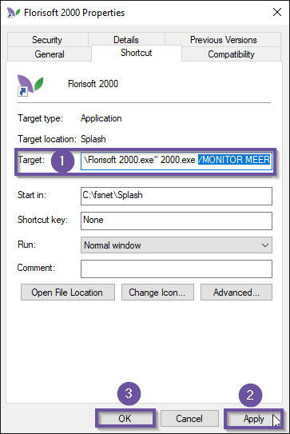</details>|
|**6**|Click on the '*apply*' button and close the properties screen.|
|**7**|You may now open the FloriShield client by launching the shortcut.|

Open the Florisoft backoffice application so that we can check some FloriShield settings.

|Step|Explanation|
|:--|:--
|**1**|Open the constants screen and navigate to the following path:<br>**System**→**FloriShield**<details><summary><b>Click here for your example image!<b></summary>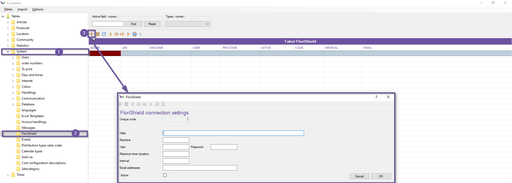|
|**2**|**Email:** Does not work. We work with Telegram. <br>**Interval:** Time in seconds between 2 checks <br>**ProcessTime:** The maximum time a timer process is allowed to last in seconds <br>**Uri:** The address of the monitor service in the Florisof Client default is: net.tcp://localhost:8733/Design_Time_Addresses/Florisoft_Monitor_Service/MonitorService/ <br> **Password:** The password of the timer user who must be logged in<br> **User:** Username of the timer user who must be logged in|

## Controls

In this modules the following controls are available:

|#|Control|Action|
|:--|:--|:--|
|**1**|Florisoft active?|If not, Florisoft is started with the set user and password and the timer is started.|
|**2**|Is the correct user active?|If not, a new Floirosft is started with the set user and password and the timer is started.|
|**3**|Is the timer active?|If not, the timer is started.|
|**4**|Is there any recent timer activity?|A process can take up to as long as set in ProcessTimer. If a process has been running for longer than the set time, a notification will be sent to the set email address. No action is being taken yet.|

If all test were sucessful you should see the same FloriShield like in the image below:

<details><summary><b>Click here for the example image!</b></summary>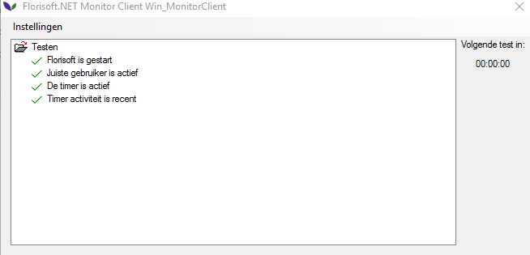</details>

:warning: **Pay attention!!** :warning:

*If multiple monitors are to run on the same machine (for example a virtual machine), the port number must be different from each other*.

<details><summary><b>Click here for the example image!</b></summary>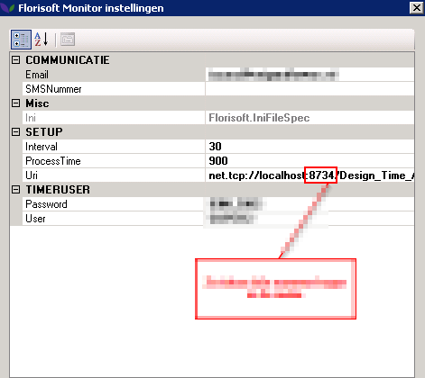</details>

> **ATTENTION:** In the DOTNET version, communication is no longer via TCP but via HTTP the Windows user running the Florishield Server must be given permissions to listen to HTTP: ```netsh http add urlacl url=http://+:8733/Design_Time_Addresses/Florisoft_Monitor_Service/MonitorService/ user=DOMAIN\Username```


## Stopping the FloriShield Client

The FloriShield Client cannot be stopped by clicking on the cross. This is done to prevent someone from accidentally stopping the FloriShield Client. If you click on the cross anyway, the FloriShield Client is minimized to the System tray and continues to check.

<details><summary><b>Click here for the example image!</b></summary></details>

The FloriShield Client can be stopped by right clicking on the icon and choosing "Close Florisoft monitor" (This did not work on my system for some odd reason).

<details><summary><b>Click here for the example image!</b></summary>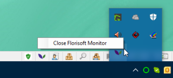</details>

After which you have to confirm to stop the FloriShield Client.
The **FloriShield Service** stops automatically when the Florisoft Client is stopped. Stopping the Florisoft Client will take a little longer, because all connections to the **FloriShield Service** must be stopped.

## Notifications

The FloriShield Client sends various messages to Telegram users (See how to configure Telegram). These messages can be set in Florisoft's Constants under 'Financial - Invoice texts'. Texts 26 to 31 are used for sending the various messages. At this moment the translations cannot be entered yet. However, 2 variables can be set in the texts, these are {MACHINE} and {USER} where {MACHINE} is replaced by the computer name on which the Monitor Client runs and {USER} by the Florisoft username that must be active according to the settings.

## Updates

The ***FloriShield Client*** runs along with *scheduled updates*. As soon as a scheduled update is scheduled, the FloriShield Client will also pick it up, just like the Florisoft Client running on the machine in question. At the set time, both the Florisoft Client and the FloriShield Client are closed, with the difference that the FloriShield Client is instructed to restart.

*The following screen is displayed:*

<details><summary><b>Click here for the example image!</b></summary>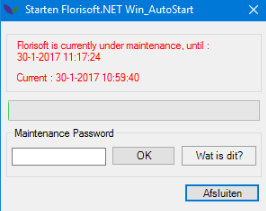</details>

After the scheduled update has ended, a restart of the ***FloriShield Client*** will take place, which immediately performs the update, as happens with any Florisoft Client. After the update, the ***FloriShield Client*** will restart and it will start Florisoft and the timer as part of the set controls.

## Set-up Telegram

To set up Telegram, you have to go through a number of steps.

### Configuring Telegram

#### Creating a Telegram account

|Step|Explanation|
|:--|:--|
|**1**|Open your webbrowser and go to the following link:<br>https://web.telegram.org/#/login|
|**2**|Enter the correct country and celphone number that you want to connect to the Telegram bot. **Do however use an existing number that you own, because you will receive a verification login code via SMS.** <details><summary><b>Click here for the example image!</b></summary></details>|
|**3**|After entering the phonenumber click on '*next*'. Then enter a authorization code and other required data. You should now be redirected to the web-version of the Telegram-app.<details><summary><b>Click here for the example image!</b></summary>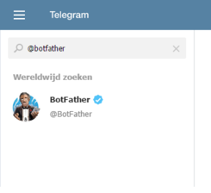</details>|

##### Creating a Telegram bot

|Step|Explanation|
|:--|:--|
|**1**|Now that you are logged in on Telegram you are able to create Telegram bots. To do this you will need to start a new conversation with the **BotFather**. Search for the user @botfather in the searchbar, there should only be one result.<details><summary><b>Click here for the example image!</b></summary></details>|
|**2**|Now click on **begin**.<details><summary><b>Click here for the example image!</b></summary></details>|
|**3**|You have now started a conversation with the BotFather.|
|**4**|Now send the following command": /newbot (including the "/")<details><summary><b>Click here for the example image!</b></summary></details>|
|**5**|You will be asked to name your bot. Enter the desired name.|
|**6**|You will then be asked for the username of your newly created bot. There cannot be apces in it and it must end with "bot", which is not case sensitive and everything can be in front of it, the chosen name must be a unique one in Telegram.|
|**7**|The bot has been created and you will receive the API Token, we will need this token later.<details><summary><b>Click here for the example image!</b></summary></details>|

#### Log in to your Telegram bot

To log in to your newly created Telegram bot, you'll need to configure some settings in Florisoft. So open your Florisoft backoffice application if you haven't already.

|Step|Explanation|
|:--|:--|
|**1**|Click on the **maintenance** in the top bar of the navigator screen.Click on the dropdown option '**Setup system**. This opens small screen within this screen click on the folder **Telegram IT Bot**. Fill out the textfield with the Telegram API key we got in the previous chapter.<details><summary><b>Click here for the example image!</b></summary>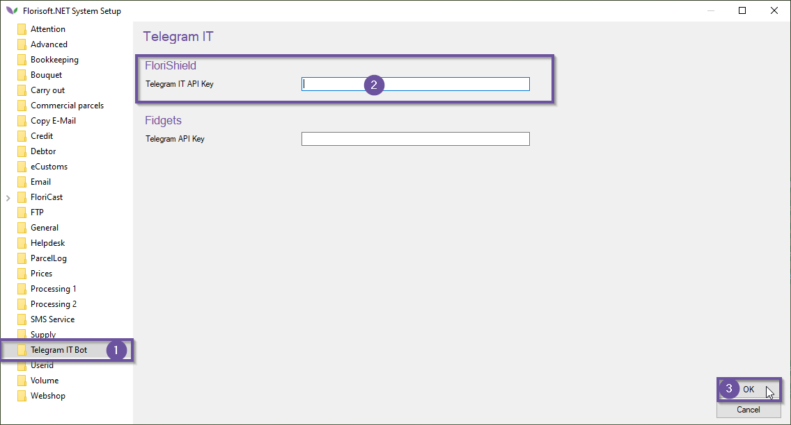</details>|
|**2**|Next, the FloriShield IT Bot must be turned on for 1 user. Only if this Florisoft is online, users can login to the bot to receive messages.|
|**3**|Now start the Florisoft with the user with the FloriShield IT Bot turned on.e<details><summary><b>Click here for the example image!</b></summary>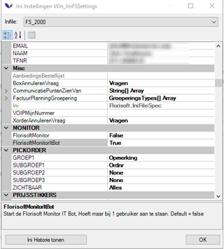</details>|
|**4**|Restart the timer by restarting the Florisoft Timer's backoffice client.|
|**5**|In Telegram, type your bot's username in the search box and click on the desired result.<details><summary><b>Click here for the example image!</b></summary>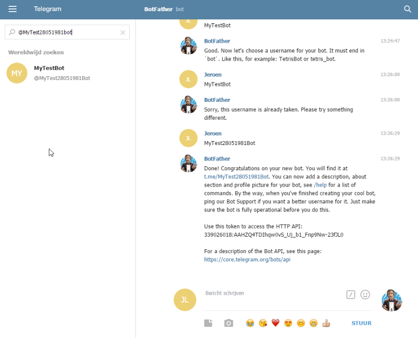</details>|
|**6**|At the bottom, click on "Begin"<details><summary><b>Click here for the example image!</b></summary></details>|
|**7**|Now send your username and then your password.<details><summary><b>Click here for the example image!</b></summary></details>|
|**8**|You are now logged in to the bot.|
|**9**|:warning:**Note!** A known Florisoft username and password must be entered (system user) and the user must not be blocked.|
|**10**|To unsubscribe, send "/unsubscribe" to the bot and you will be removed from the recipient list.|

## Telegram messages from Florisoft.

If FloriShield now detects or resolves a problem, the text from the Invoice texts is sent to all registered Telegram users. No additional settings are required for this. As soon as the Telegram Bot API key has been entered and the FloriShield is restarted, the messages are sent.

### Configuring Telegram messages

In the Florisoft backoffice we can configure the content of the to-be sent telegram messages.

|Step|Explanation|
|:-:|:--|
|**1**|From the Florisoft navigator open the constants screen.<details><summary><b>Click here for the example image!</b></summary>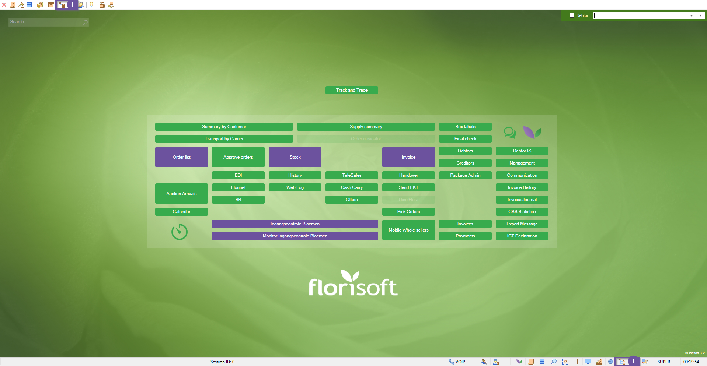</details>|
|**2**|In the constants navigate to the path :<br>**Financial→Invoice texts**.<details><summary><b>Click here for the example image!</b></summary>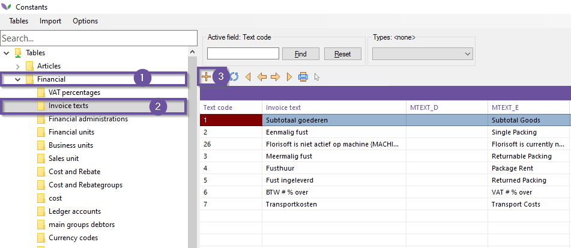</details>|
|**3**|Use the + icon to create a new invoice text, this prompts a template choice window where you have to select a mandetory template, Florishield uses the numbers 26 till 31. These should be created and configured.<details><summary><b>Click here for the example image!</b></summary>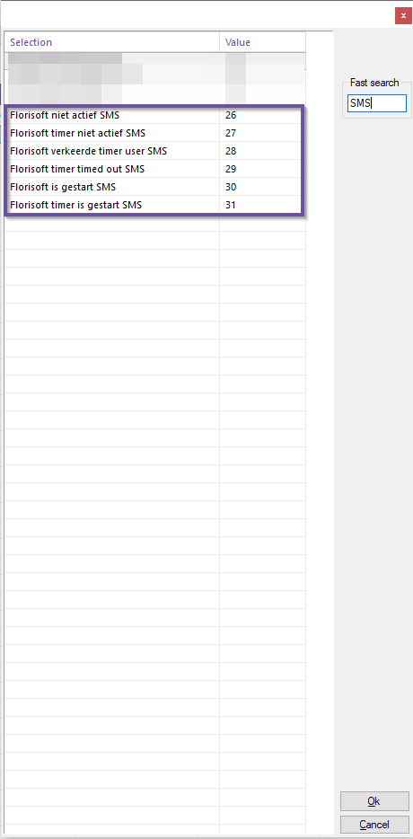</details>|
|**4**|When creating the invoice text, the field invoice text is filled on default with a Dutch message, for an English message fill the textbox 'Engels'. The curly brackets in the message contain variables such as user name, machine name and or a timestamp.<details><summary><b>Click here for the example image!</b></summary>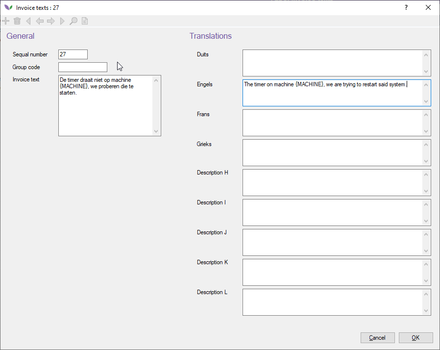</details>|
|**5**|Fill out the textbox of the languages that are relevant to you, use the variables in the Dutch message to display these values in your translation as well.<details><summary><b>Click here for the example image!</b></summary></details>|
