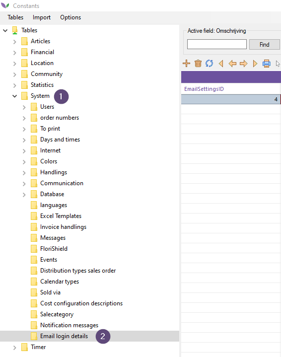
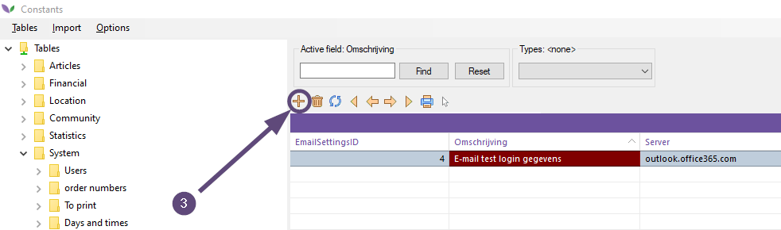
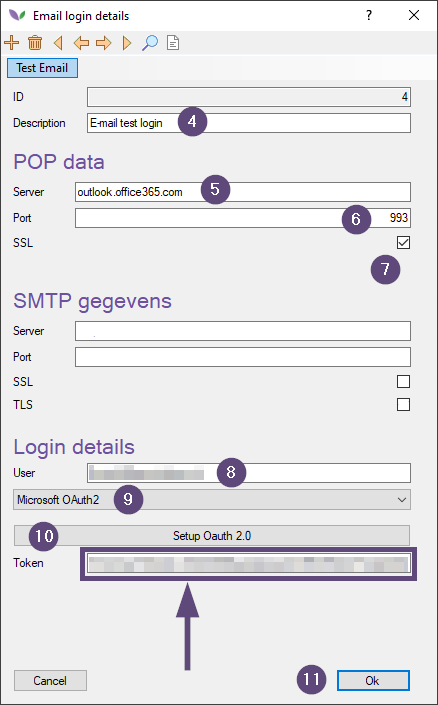
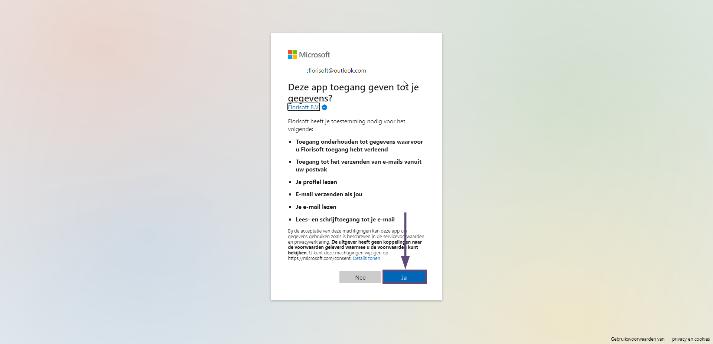
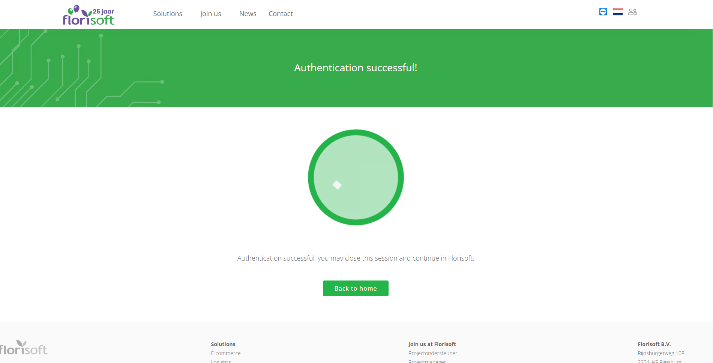
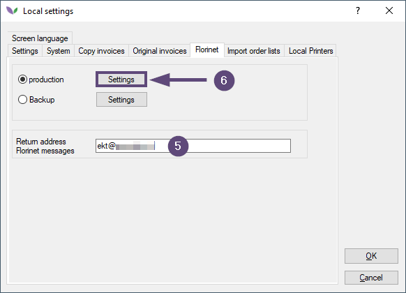
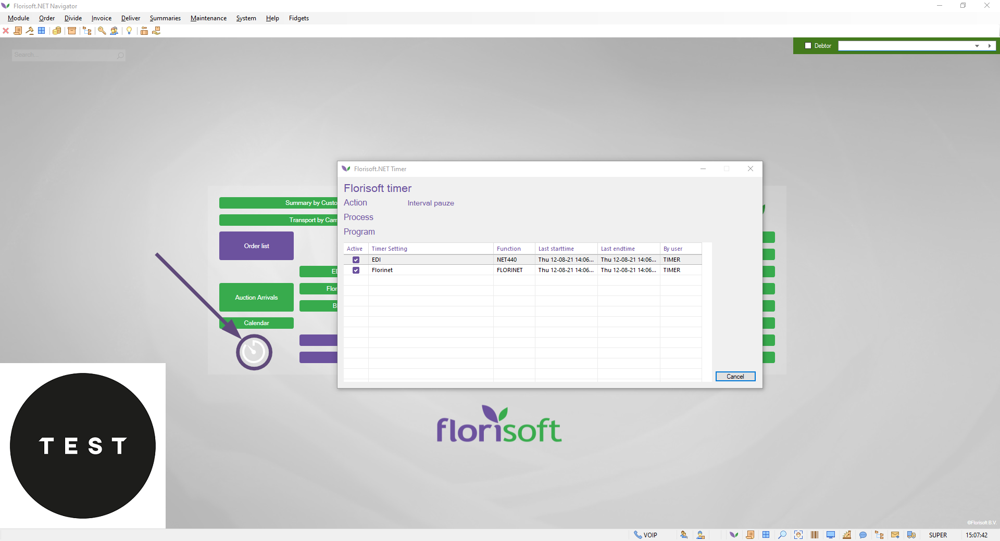

# Quickstart manual POP settings via OAuth 2.0

## Table of contents
[1. Preface](#1-preface) 
[2. What is OAuth 2.0](#2-what-is-oauth-20) 
[3. Setting up OAuth 2.0 for POP](#3-setting-up-oauth-20-for-pop) 
[4. Link Email login details to timer user](#4-link-email-login-details-to-timer-user)

## 1. Preface

Welcome to the Florisoft quickstart manual POP settings via OAuth 2.0. This manual explains the principal of OAuth 2.0 and how to set it up in Florisoft.

First a short explanation of POP in combination with OAuth 2.0 is given after which the steps for setting it up in Florisoft will be described.

**:warning: Screenshots in this manual may differ from your system due to Florisoft being updated continuously.**

## 2. What is OAuth 2.0

OAuth 2.0 is a new authentication method for siging into e-mail accounts. Beside a username and password a special token is required for authenticating into an e-mail account.

### Why do I need OAuth 2.0

From 2022 and upwards, security settings for signing into e-mail accounts are becoming more stricter. OAuth 2.0 is one of those security measures applied by e-mail providers like Microsoft in their Office365 environment.

However, OAuth 2.0 is not a Microsoft product. It can be applied by any software provider which requires authenticating.

**A software provider can enforce the use of OAuth 2.0 authentication. If so, the settings in this document must be applied otherwise Florisoft is not able to connect with the other software provider anymore.**

## 3. Setting up OAuth 2.0 for POP

Follow the steps below to setup OAuth 2.0 authentication for the POP settings:

|Step#|Explanation|
|:--|:--|
|**0**|Open the Florisoft application and log in with your user credentials.|
|**1**|In the Florisoft Navigator open the *Constants screen*(#1) by clicking the concerning icon in the iconbar.   

Click here to reveal the image

|
|**2**|Within the Constants navigate to *System(#1)* **→** *Email login details*(#2)

Click here to reveal the image

|
|**3**|Click the *plus icon*(#3) to add a new set of Email login details. The Email login details window opens.

Click here to reveal the image

|
|**4**|Follow the steps 4.1 up and till 4.10 possibly with the help of the image below. 

Click here to reveal the image

|
|**4.1**|Enter a clear description in the *Description field*(#4)|
|**4.2**|Enter the name of the POP server in the *Server field*(#5) below the POP data header.|
|**4.3**|Enter the port number in the *Port field*(#6)|
|**4.4**|Check the *SSL checkmark*(#7)|
|**4.5**|Enter the username in the *User field*(#7) below the Login details header.|
|**4.6**|Choose *Microsoft OAuth2*(#9) in the concerning dropdown menu.|
|**4.7**|Click the *Setup OAuth 2.0 button*(#9) to proceed the process. A browser window opens.|
|**4.8**|Click the *Yes button* in the screen below. **Pay attention: be sure that the Yes button is clicked in the screen below. When choosing the No option the OAuth 2.0 authentication cannot succeed. The administrator of the email account is needed to reset the e-mail account.**

Click here to reveal the image

|
|**4.9**|The screen below appears when the OAuth 2.0 authentication is succesfull finished. 

Click here to reveal the image

|
|**4.10**|Close the browser window/tab as stated in the screenshot above. |

OAuth 2.0 is now setup correctly for POP. Read chapter four to get an overview of instructions on how to setup the Email login details on the timer to activate them.

>**Pay attention: follow the instructions below to link the Email login details to the timer. Without this coupling POP via OAuth 2.0 will not work.**

## 4. Link Email login details to timer user
The last step in the process of configuring POP via OAuth 2.0 is coupling the Email login details as created in chapter three to the timer user in Florisoft. Follow the steps below:

|Step#|Explanation|
|:--|:--|
|**0**|Log into the Windows user where the Florisoft timer is running.|
|**1**|Set the timer off by clicking the *Cancel button*(#1) **Pay attention: the timer can only be turned off when the current action is at an  Interval pauze (break) state.**

Click here to reveal the image

|
|**2**|In the Navigator click the *System(#2)* **→** *Setup User*(#3) menu option. The Local settings window opens.

Click here to reveal the image

|
|**3**|Click the *Florinet tab*(#4) to open the Florinet settings.

Click here to reveal the image

|
|**4.**|Be sure that the field *Return address Florinet messages*(#5) is filled with the e-mail address used for reading in EKT and other types of messages. 

Click here to reveal the image

|
|**5.**|Click the *Settings button*(#6) behind the production radio button. The Win_Setup_EKTInstellingen window opens.|
|**6.**|Follow the steps 6.1 up and till 6.5 possibly with the help of the screenshot below. 

Click here to reveal the image

|
|**6.1**|Click the *down pointing arrow*(#7) An index window opens.|
|**6.2**|Double click one of the available Email login details(#8) to select this one. **Pay attentntion: please be sure to select a set of Email login details which contain POP information. Selecting a set of Email login details without POP information means that no messages can be read into Florisoft.** 
|**6.3**|Click the *Ok button*(#9) in the Win_Setup_EKTInstellingen window to confirm the settings.|
|**6.4**|Click the *OK button*(#10) in the Local settings window to confirm the settings in this screen. Florisoft returns back to the Navigator. 

Click here to reveal the image

|
|**6.5**|Restart the Florisoft timer. A running timer looks something like the screenshot below. By all means a running timer is indicated by a white coloured timer icon in the bottom left part of the Navigator. 

Click here to reveal the image

|

All settings neccecary for configuring POP via OAuth 2.0 are ready. Reading in EKT and other types of messages should work as usual.