# 1. Fust administratie

In de sierteeltketen gebruiken we verschillende verpakkingen. Deze zijn belangrijk om een product goed te kunnen vervoeren.

Er bestaan verschillende transportverpakkingen, voor zowel een- als meermalig gebruik. Eenmalige fusten zijn bijvoorbeeld de bloemen- en plantendozen en eenmalige plantentrays. Daarnaast kan je ook meermalige fusten gebruiken. Zoals emmers, rekken, bloemendozen en plantentrays.

Er zijn klanten die niet hoeven te betalen voor fusthuur. Hierbij worden de fusten belast tegen 0-tarief. En er zijn klanten die wel worden belast voor fusthuur. Hierbij worden balansen bijgehouden, ook wel bekend als fustadministratie.

# 2. Manieren om het in de fustadministratie op te nemen

Er zijn twee manieren om fusten in de fustadministratie op te nemen:

1. Direct bij de verkoop via een verdeling - waarbij je de per regel een fustcode opgeeft. Dit kan op verschillende plekken: C&C verkoop, Webshop, vanuit de voorraad, etc. 
2. Gebruik maken van het scherm: **Fust inname inname / uitgifte** (ingave met de hand).

**Let erop dat je in Florisoft bij elk afzonderlijk fust aan moet geven of hiervoor administratie bijgehouden moet worden. Standaard staat dit uit.** 

Dit doe je op de volgende plek: Constanten -> Tabellen -> Artikelen -> Fust gegevens -> **Fustsoorten**:

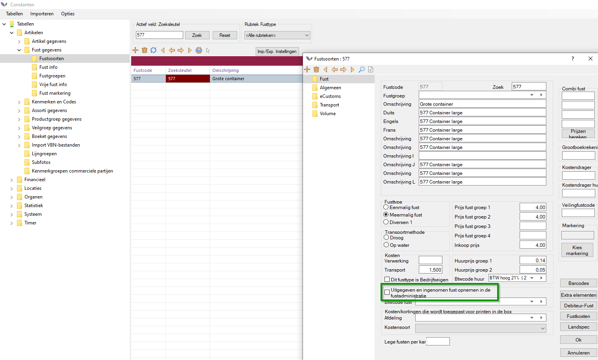

## 2.1 Fust administratie via verdeling bij verkoop
De meeste klanten verdelen partijen inclusief fust. Dan komt er bij de verdeling een fustcode te staan.

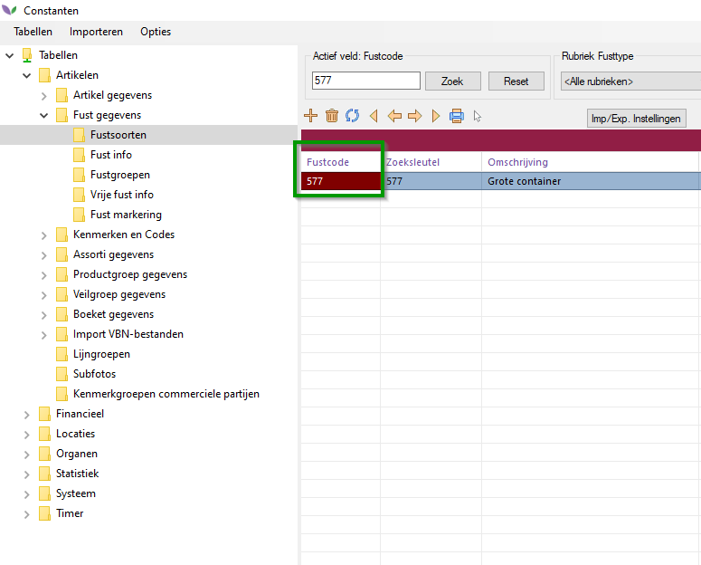

## 2.2 Fust administratie via scherm **Fust inname / uitgifte**

Dit scherm is te benaderen vanaf de volgende plek:

Navigator -> **Fust inname / uitgifte**

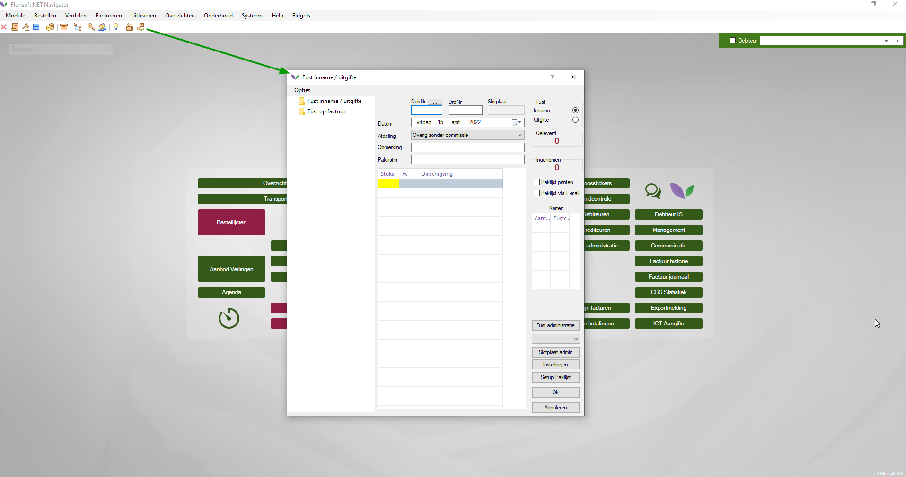

In dit scherm geef je op welke fusten mee worden gegeven. Als je het **DebNr** opgeeft + **OrdNr**, dan wordt aan een bestaande factuur de fustadminstratie toegevoegd. Als je het OrdNr niet opgeeft, dan wordt er een losse factuur aangemaakt.

In onderstaand voorbeeld is voor debiteur TEST opgegeven dat deze de volgende fusten mee heeft gekregen:

- 577 (Grote container) 
- 566 (Kleine container)
- 19 (Deense Container)
- 18 (Kooikar plaat)
- 21 (Opzetstuk)

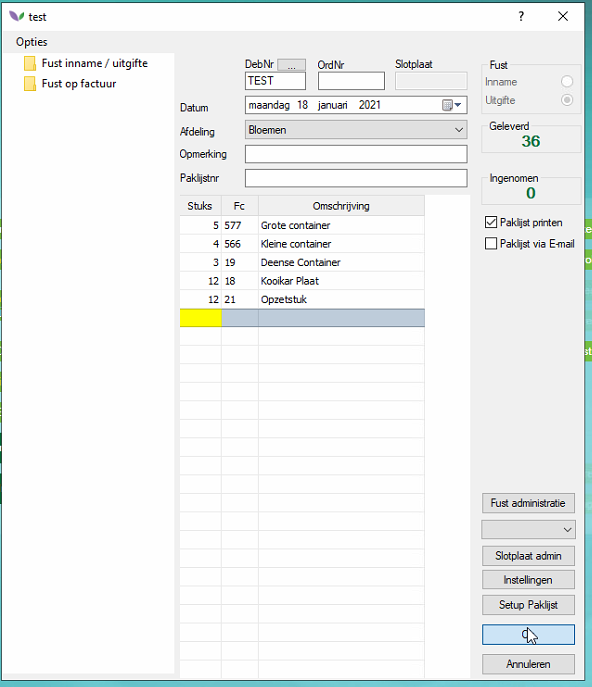

Als je op **OK** klikt dan gaat het door naar **Facturen**. Vervolgens kan je voor de volgende klant verder gaan met de fustadministratie. 

## 2.3 Overzicht 

Om een overzicht te krijgen van de fustadministratie, klik je in je navigator op: **Fust administratie**. Het volgende scherm opent zich dan:

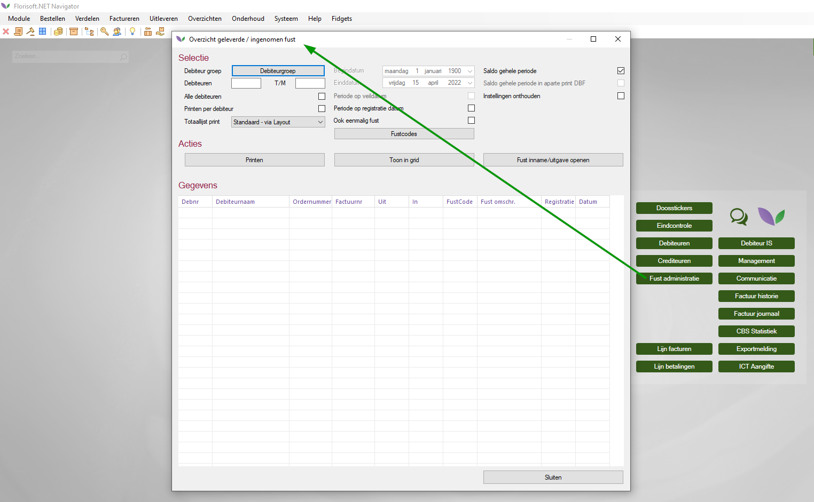

Let erop dat dit enkel een overzicht is, en je hier niets kan ingeven.

# 3. Fust in de regel vs. fust aparte regel

Klik op "Facturen" in het Florisoft homescherm. Een nieuw venster opent zich. Voordat je verder gaat, klik in dit venster op 'opties' en zorg ervoor dat de optie "Nieuwe factuur wijzigen scherm" aangevinkt is. Anders kom je niet verder bij de volgende stap.

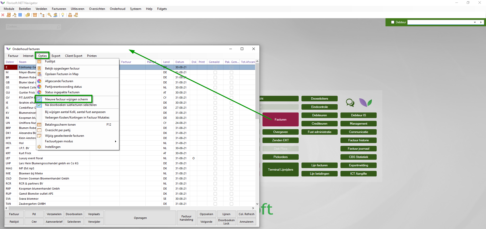

Om te zien wat er geldt voor een desbetreffende factuur, kies je bovenin het scherm voor: 

Opties -> Factuurkop -> **Fust**. Vervolgens kan je de instellingen zien van Fust in de regel / Fust aparte regel. (via het oude facturen scherm staat er rechtsboven een knop Factuurkop)

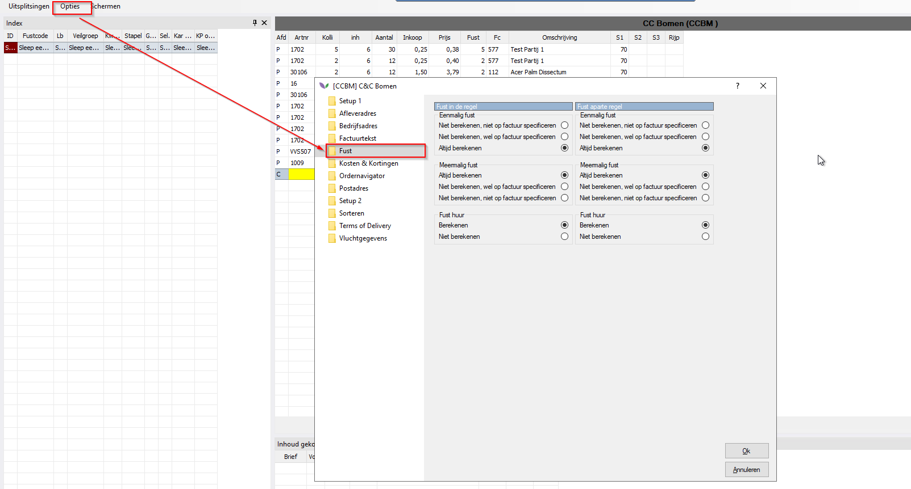

## 3.1 Fust in de regel
Dit betekent dat als je iets verkoopt, en daarbij een verdeling (hebt) (ge)maakt (bijvoorbeeld in de voorraad), je per partijregel een fustcode ziet.

Hieronder een voorbeeld van **fust in de regel** (in het facturenscherm). Je ziet per regel een fustcode terugkomen:

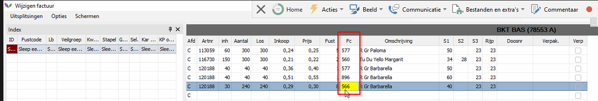

## 3.2 Fust niet in de regel:
Dit betekent dat onderaan de factuur, de fusten los vermeld staan. Je hebt dan dus niet per partijregel een fustcode, maar onderaan de factuur staat met welke fusten het geleverd wordt/is. 

Hieronder een voorbeeld van **Fust niet in de regel** (facturenscherm):

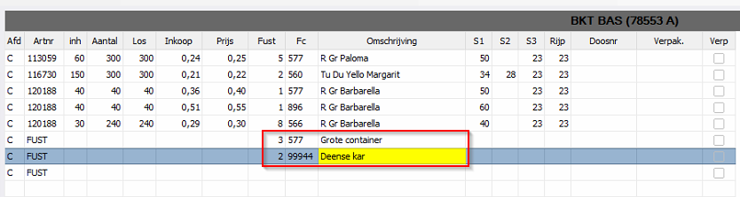

# 4. Praktijkvoorbeeld

## 4.1 Klant krijgt fust mee

Bij Veiling Vaassen (=Planten Cash & Carry), komen klanten over de vloer. Deze pakken buiten hun producten, en zetten dit op een Deense kar (= een fust). De klant laat weten dat ze de Deense kar mee willen nemen. Veiling Vaassen administreert dit. 

Dit doen ze in o.a. het C&C (Kassa)-scherm, en hierbij wordt naast de producten ook de fust (= Deense kar) opgegeven:

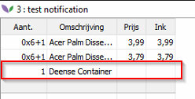

Bovenstaand scherm is afkomstig van een PDA. Het is hierbij niet mogelijk om op fustcode te zoeken. Op de desktop is dit wel mogelijk.

## 4.2 Klant brengt fust terug 

Het is ook mogelijk om in het Kassa (C&C)-scherm op te geven dat een klant een fust terug komt brengen. Je geeft dan een negatief getal op:

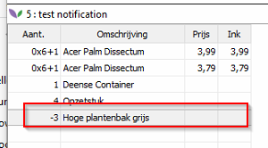

