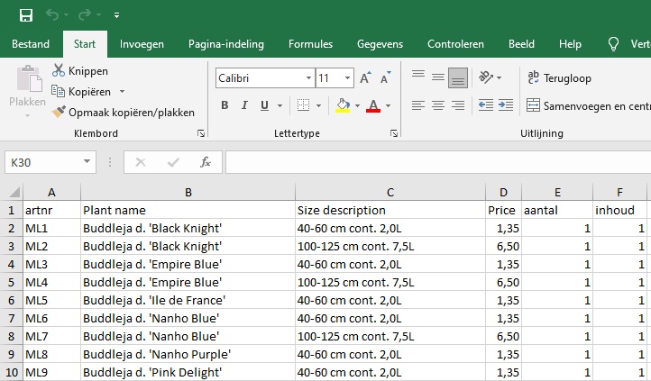
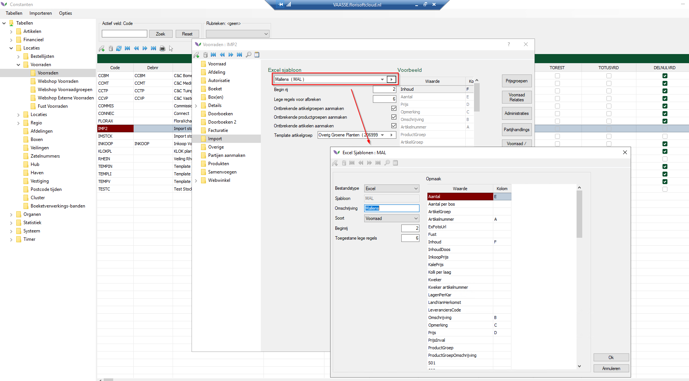

# 1. Importeren assortiment (in de voorraad)

Veiling Vaassen bestelt bij een 10-tal kwekers. Bij deze kwekers hebben ze een Excel-lijst opgevraagd, die we gaan importeren in Florisoft.
In de aangeleverde Excel-lijsten staan geen artikelnummers. Daarom hebben wij deze zelf gegenereerd.

In onderstaand voorbeeld hebben wij de volgende Excel-lijst geimporteerd:

# 2.  Aanmaken voorraad & Excel-sjabloon

In de constanten maken wij een import voorraad aan. Hierin komen de partijen te staan, die we in een latere stap in de bestellijst gaan plaatsen.

Na het aanmaken van de voorraad, gaan we een Excel sjabloon koppelen. In dit geval hebben we een Excel-sjabloon **Mallens** aangemaakt. Hierin staat ingesteld in welke kolom welke informatie staat.

Ga nu naar de voorraad, klik op Voorraad -> Importeren & Exporteren -> **Importeren sjabloon**. Kies nu de Excel die je wilt importeren.

# 3. Partijen overnemen als assortiment in de bestellijst

Als je de Excel hebt geimporteerd, dan selecteer je alles regels middels rechter muisknop -> helemaal onderaan: 1 / x -> **select inverse**.

Kies nu voor Partij -> **Selectie overnemen als assortiment in de Bestellijst**. En kies daarna de bestellijst waarin de partijen moeten komen.

