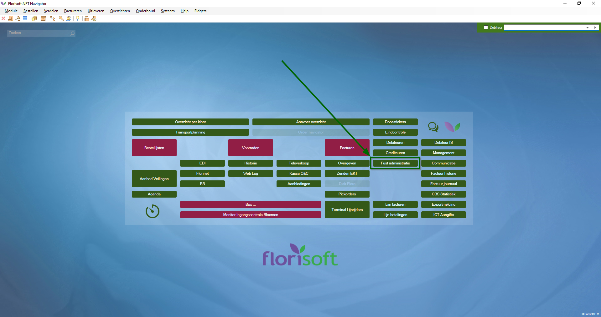

# Florisoft Handleiding Pakketbeheer

Welkom bij de Florisoft handleiding voor de pakketadministratie. In Florisoft wordt de inname en uitgifte van vaatjes geadministreerd.

## Fustadministratie

**Volg de onderstaande stappen**:

|Stap|Uitleg|
|:--|:--|
|**1**|Om te beginnen met het gebruik van de module, start u de Florisoft applicatie op en gaat u naar de "Fust inname/uitgifte" pagina.

<b>Klik hier voor de voorbeeld afbeelding! </b>

|.
|**2**|In het volgende scherm voert u het betreffende debiteurnummer (nr.1) in, of u selecteert het uit de lijst door op "..." te drukken.
|**3**|Nu selecteert u de pakketvorm(nr.2). Let op: Intake is dat het pakket uw administratie verlaat.
|**4**|Bij "opmerking" (nr.3) kunt u het bonnummer van het pakje invoeren. Dit is niet noodzakelijk.
|**5**|Als de bovenstaande informatie (nr.1-3) is ingevuld, kunt u beginnen met het toevoegen van de pakketten aan de lijst. Selecteer het eerste open veld onder "Stuks" (nr.4) en vul in hoeveel stuks u wilt verzenden. Het volgende open veld is om te bepalen welk pakket (nr.5) het is, doe dit door de pakketcode in te vullen. De omschrijving wordt automatisch gevuld met de omschrijving van de ingevulde pakketcode.

<b>Klik hier voor de voorbeeld afbeelding! </b>

|**6**| Als er een ongeldige code wordt ingevoerd, zal het volgende scherm zich openen. Dit scherm zorgt ervoor dat je de juiste fust kan vinden. Gebruik de zoek functie of scroll door de nummers om het gewnste fust te vinden

<b>Klik hier voor het voorbeeld</b>

|
|**7**| Als je op de optie "Setup paklijst" klikt, dan opent zich een nieuw scherm. Hier kan je aangeven hoe je paklijst wil printen. Dit kan o.a. gezet worden naar PDF.

<b>Klik hier voor het voorbeeld</b>

|
|**8**|Dit hoeft maar één keer gedaan te worden. Na de eerste instelling hoeft u alleen maar op OK te drukken om verder te gaan. Als u PDF heeft geselecteerd, zal na het drukken op OK worden gevraagd waar u de PDF wilt opslaan. Florisoft zal deze locatie onthouden en volgende pakketlijsten naar die locatie sturen.
|**9**|Nu zijn de pakketten succesvol geadminstreerd. Als u een overzicht wilt zien van het huidige pakketbeheer, ga dan naar de Florisoft applicatie en selecteer "Pakketbeheer". Daar vindt u een overzicht van de pakketten.

<b>Klik hier voor het voorbeeld</b>

|