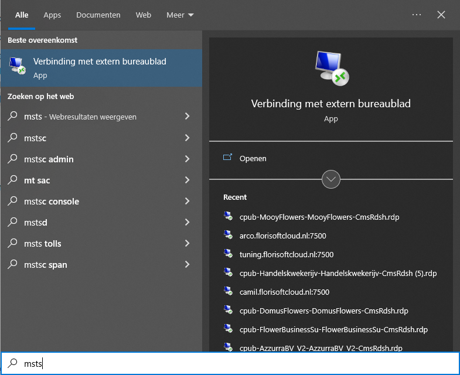
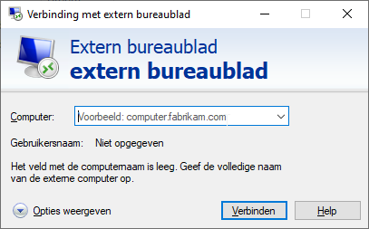
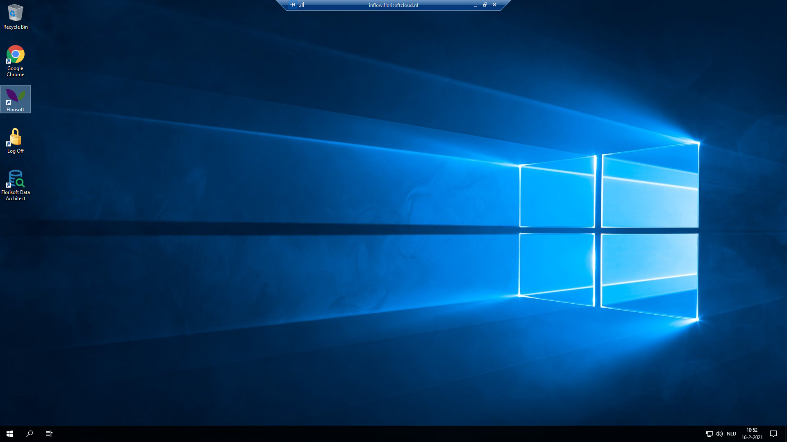

# Florisoft Handleiding: Inloggen Florisoft

Welkom tot de handleiding inloggen bij Florisoft. De Florisoft applicatie draait meestal op een Cloud server. Hierdoor bestaat het inloggen bij Florisoft uit twee stappen: inloggen op de cloud server en het inloggen in de applicatie zelf. Deze stappen zijn beschreven in twee aparte hoofdstukken.

Na deze korte introductie krijgt u uitleg over het inloggen op de cloud server. Uw gebruikers horen hiervoor al inloggegevens voor gekregen te hebben tijdens het implementatieproces.

Hoofdstuk 2 beschrijft het inloggen op een RESET server. Reset is een bedrijf waar wij cloud services afnemen, tijdens de implementatie hoort al bekend te zijn of uw server hier draait. Het inlogproces is bij reset servers net even anders volg dus de stappen van dit hoofdstuk als uw Florisoft hierop draait.

Hoofdstuk 3 beschrijft het inloggen in de Florisoft applicatie zelf. De inloggegevens hiervoor hoort u ook al verkregen te hebben.

Hoofdstuk 4 beschrijft het inloggen op de webshop. Deze stappen zijn optioneel aangezien niet iedereen bij ons een webshop afneemt.

## Inhoudsopgave

[Inloggen op de server](#inloggen-op-de-server)  
[Inloggen op de server (RESET)](#inloggen-op-de-server-reset)  
[Inloggen op de Florisoft applicatie](#inloggen-op-de-florisoft-applicatie-back)  
[Inloggen op de webshop](#inloggen-op-de-webshop)  

## Inloggen op de server

Om in te loggen op de cloud server word er gebruik gemaakt van het Microsoft RDP protocol. Hierdoor kunnen we op afstand inloggen, volg de onderstaande stappen:

|Stap|Uitleg|
|:--|:--|
|**1**|Klik op het vergrootglas of de zoekbalk van de Windows taalbalk.

<b>Klik hier voor uw voorbeeld afbeelding</b>

|
|**2**|Zoek voor '*msts*', het resultaat '*Verbinding maken met extern bureaublad*' hoort nu naar voren te komen.

<b>Klik hier voor uw voorbeeld afbeelding</b>

|
|**3**|Klik op het hiervoor benoemde zoekresultaat, dit opent een Extern Bureaublad scherm.|
|**4**|In het computer veld vult u de naam in van de cloud server. De naam is aangeleverd door Florisoft tijdens het implementatieproces.

<b>Klik hier voor uw voorbeeld afbeelding</b>

|
|**5**|Als u eenmaal de het computernaam veld heeft ingevuld drukt op de connect/verbinden knop.|
|**7**|Als alles goed gegaan is hoort u nu een kortdurend laadschermpje te zien. 

<b>Klik hier voor uw voorbeeld afbeelding</b>

|
|**8**|Na een aantal seconden hoort u een Windows bureaublad te zien te krijgen zoals in de onderstaande afbeelding.

<b>Klik hier voor uw voorbeeld afbeelding</b>

|

## Inloggen op de server (Reset)

Als u gehost wordt op een RESET server heeft u een loginproces dat net anders gaat. Volg hier voor de onderstaande stappen:

|Stap|Uitleg|
|:--|:--|
|**1**|Voor het reset inlogproces heeft u een .RDP bestandje nodig. Dit bestandje hoort aangeleverd te zijn door Florisoft of door RESET. Mocht u dit bestandje niet hebben neem dan contact op met support.

<b>Klik hier voor uw voorbeeld afbeelding</b>

|
|**2**|Vind het aangeleverde .RDP bestandje en klik er tweemaal op met de linkermuisknop om het te openen. Dit hoort het RDP scherm te openen.|
|**3**|Klik op de connect/verbinden knop.

<b>Klik hier voor uw voorbeeld afbeelding</b>

|
|**4**|Na het ingedrukt hebben van de verbinden knop hoort u een Windows beveiliging scherm te zien kruigen. Vul hier uw Windows login informatie in voor de webserver (windows gebruiker). Mocht er al een gebruiker geselecteerd staan waarbij u niet in wil loggen klik dan op de inloggen met andere gebruiker optie.  Klik vervolgens op Ok om daadwerkelijk op de server in te loggen.

<b>Klik hier voor uw voorbeeld afbeelding</b>

|

## Inloggen op de Florisoft Applicatie (Backoffice)

Wanneer u ingelogd bent op een cloud server volgt u de onderstaande stappen om in te loggen op de Florisoft applicatie.

|Stap|Uitleg|
|:--|:--|
|**1**|Klik tweemaal op het Florisoft icoon dat op het bureaublad staat van de cloud server.

<b>Klik hier voor uw voorbeeld afbeelding</b>

|
|**2**|Florisoft is nu aan het opstarten, u krijgt zometeen een inlog schermpje te zien voor Florisoft.|
|**3**|Vul uw gebruikersnaam in bij '*UserID*' en het bijhorende wachtwoord bij password. Geautoriseerde gebruikers horen logininformatie gekregen te hebben van Florisoft tijdens het implementatieproces.

<b>Klik hier voor uw voorbeeld afbeelding</b>

|
|**4**|Wanneer u beide velden heeft ingevuld kan u op de Ok kop drukken om door te gaan. U word nu naar de Florisoft navigator gebracht. Vanuit de navigator heeft u toegang tot alle tot u beschikbare functionaliteiten van de Florisoft applicatie.|

## Inloggen op de webshop

Als u ook gebruik maakt van de Florishop modulen en dus een webshop afneemt via Florisoft kan u dit hoofdstuk gebruiken om op de webwinkel in te loggen. De webshop kent meerdere accounts met verschillende priveleges. U kan bijvoorbeeld met een administrator account de webshop aanpassen terwijl een normale debiteur dit natuurlijk niet kan. Volg de onderstaande stappen om in te loggen op de webshop.

|Stap|Uitleg|
|:--|:--|
|**1**|Open een webbrowser (bij voorkeur Google Chrome) door tweemaal op het webbrowser icoon te drukken.

<b>Klik hier voor uw voorbeeld afbeelding</b>

|
|**2**|Kopieer en plak (CTRL + C & CTRL + V) de webshop link/URL in de adresbalk (#2) en druk op de enter toets.

<b>Klik hier voor uw voorbeeld afbeelding</b>

|
|**3**|Vul de gebruikersnaam van het management account in bij het veld Gebruikersnaam|
|**4**|Vul het wachtwoord in bij het wachtwoord veld|
|**5**|Klik op enter of klik de LOGIN knop(#5). U hoort nu ingelogd te zijn in de Florishop met uw account.

<b>Klik hier voor uw voorbeeld afbeelding</b>

|

