# Manual Logging into Florisoft

Welcome to the manual for logging into Florisoft. The Florisoft application is usually running on a cloud server. That is why logging in consists out of 2 steps: logging onto the cloud server and logging onto Florisoft. These two steps are explained in the next 2 chapters.

After this introduction a chapter will follow explaining logging into the cloud server. Only autorised users can access the server. These users received a username and password during the implementation process of Florisoft.

Chapter 3 describes the process of logging into Florisoft. Here the same principles apply as it does for logging into the cloud server: only autorised users can access Florisoft using a username and password.

In chapter 4 is is described how a user can log into the webshop. These steps in the chapter are optional. Not every customer uses a webshop. The webshop has different types accounts that can log in, though the logging in process is the same for all.

The goal of this manual is to explain to Florisoft users how to log into the server, aswell as Florisoft.

## Table of contents

[Logging into the server](#logging-into-the-server)  
[Logging into a Reset server](#logging-into-a-reset-server)  
[Logging into the Florisoft Application (Backoffice)](#logging-into-the-florisoft-application-backoffice)  
[Logging into the webshop (Florishop)](#logging-into-the-webshop-florishop)  

## Logging into the server

To be able to log into the cloud server, we will use the Microsoft RDP-protocol. This allows us to use a computer from a distance.  *Follow the steps below:*

|Step|Explanation|
|:--|:--|
|**1**|Click on the the magnifying glass or searchbar on the Windows taskbar.|
|**2**|Search for '*msts*'. The result '*Remote Deskop Connection*' should show, this is correct.

<b>Click here for your example image</b>
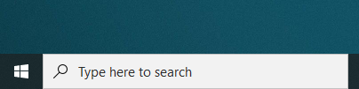
|
|**3**|Click on "*Remote Desktop connection*".

<b>Click here for your example image</b>
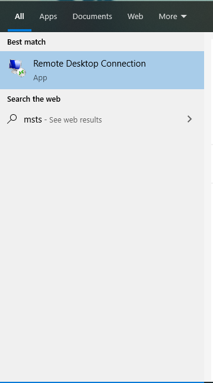
|
|**4**|A new window called 'Remote Desktop Connection' will appear.|
|**5**|In the "Computer:" field, enter the name of the cloud server. This name is provided by Florisoft during the implementation.

<b>Click here for your example image</b>

|
|**6**|Once you have filled out the computer field press the connect button.

<b>Click here for your example image</b>

|
|**7**|Now a window will pop up asking you to fill in a username and password of the cloud server. These were also provide by Florisoft during the implementation process.|
|**8**|Click on OK to continue.|
|**9**|With a working wifi-connection Windows will now connect to the cloud server.

<b>Click here for your example image</b>
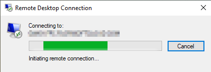
|
|**10**|After a few seconds the desktop of the cloud server will appear. See the picture below.

<b>Click here for your example image</b>

|

## Receiving a Reset Florisoft Connection File

If your server is hosted by RESET (a hosting provider) you will be sent a connection file that is used to connect to the Florisoft server. 
Follow the steps below to download the server connection file to your computer's desktop. 

*The following steps take place in the Microsoft Office Outlook application, you might use a different email application like gmail or hotmail.*

|Step|Explanation|
|:--|:--|
|**1**|When your server is ready we will sent you an email with the connection file and login credentials for you to use when connecting to the server. The image below shows an example of what that e-mail looks like.

**Click here for the example image!**
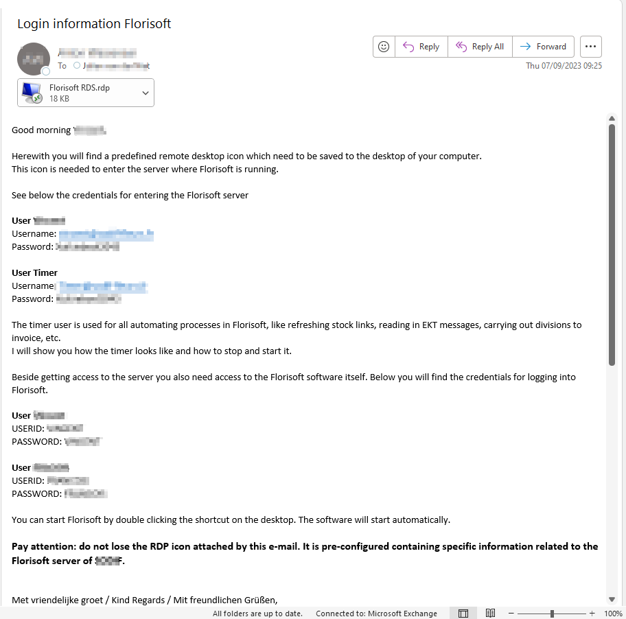
|
|**2**|Take note of the Userid (username) and password (not physically ofcourse).|
|**3**|Click on the .rdp file in the appendix with the Right Mouse Button, click on the **save as** option.

**Click here for the example image!**
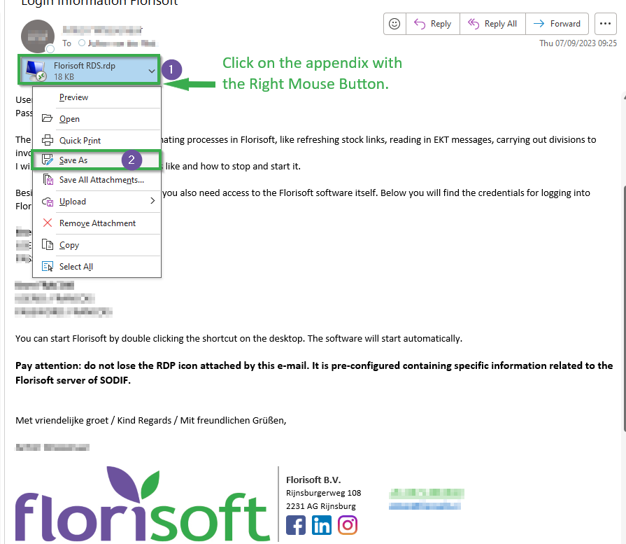
|
|**4**|This will prompt a Windows Explorer screen in which you can save the file to a specific destination. To make it easier for ourselves it is best to save it to the desktop folder. Now press the **save** button. This will make it so that we see the connection file to our desktop screen which makes looking for it a lot easier.

**Click here for the example image!**
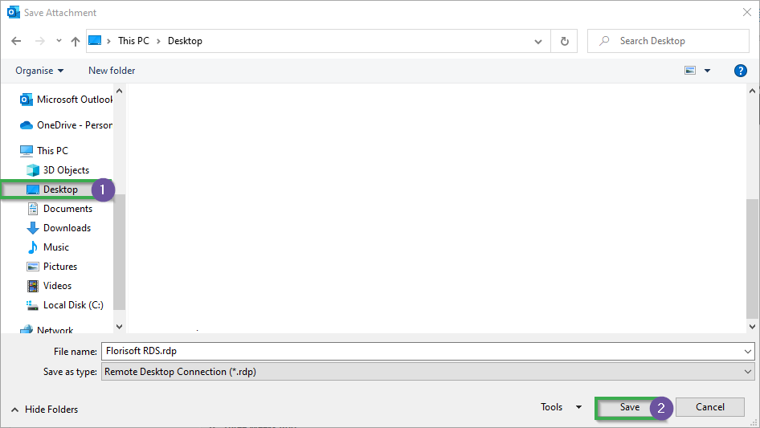
|
|**5**|Now if me move back to our desktop screen you should be able to see the connection file stored there.

**Click here for the example image!**
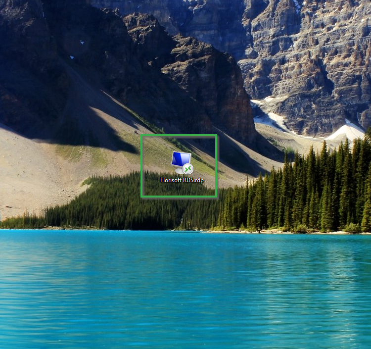
|

## Logging into a Reset server

If you are hosted on a RESET (Hosting service) server you have a sligthly different login process. To log into your server using Microsoft's RDP service follow the steps listed below:

|Step|Explanation|
|:--|:--|
|**1**|For the following steps a .RDP file is required, if you are hosted on RESET servers Florisoft will have provided this for you. In case you don't have the RDP file needed to connect to the server, contact Florisoft.

<b>Click here for your example image</b>
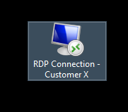
|
|**2**|Find the .RDP file on your desktop (most likely) and double left click on it. This should open a RDP screen.|
|**3**|Press the "Connect" button ()

<b>Click here for your example image</b>
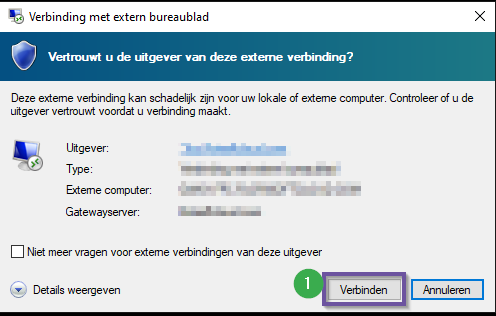
|
|**4**|By pressing connect a new Windows Security screen should appear were you need to authenticate using the provided user credentials. Fill in the right username and password, if there is already a user selected (that you don't want to log into) click on more choices and then use different account this should allow you to enter the credentials of a different user.  Click on OK to finalize the log in process, you should soon be able to see the server's desktop screen.

<b>Click here for your example image</b>
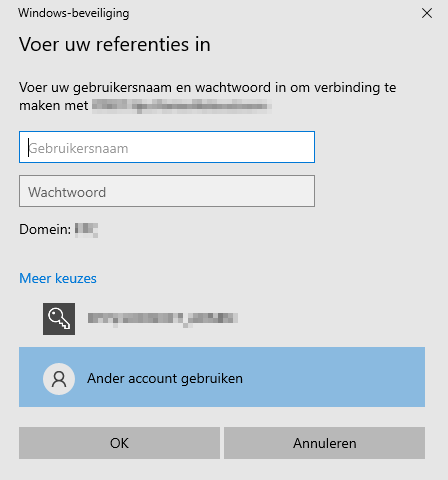
|

## Logging into the Florisoft Application (Backoffice)

When the connection with the cloud server has been established, it is possible to log into Florisoft. Read the steps below to find out how.

|Step|Explanation|
|:--|:--|
|**1**|Double click on the Florisoft icon which can be found on the desktop of the cloud server,Florisoft is now starting. The login screen will show in a few seconds.

<b>Click here for your example image</b>

|
|**2**|Fill in the username in "Userid", and the corresponding password in "Password".Authorized users will have received a userid and password during the Florisoft implementation process.

<b>Click here for your example image</b>
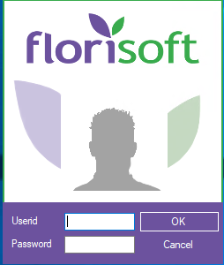
|
|**3**|Once it has been filled in, click on OK to continue.Now the Florisoft Navigator will show. The Navigator is the starting screen of Florisoft. From here all options and functions can be accessed and used.|

## Logging into the webshop (FloriShop)

Next to using Florisoft, alot of our customers make use of a webshop. This webshop can be banded via a standard or modified URL. The webshop has the possibility to be able to log in using the Administrator account. This user can edit the settings, design of the webshop, content and alot more.

|Step|Explanation|
|:--|:--|
|**1**|Open a webbrowser (preferably Google Chrome) by double clicking on the corresponding icon (nr.1). A standard browser window will open.

<b>Click here for your example image</b>

|
|**2**|Copy and paste (Crtl + C and Crtl + V) the URl of the webshop in the adressbar and press enter (nr.2). The webshop will load in and appear in the browser.

<b>Click here for your example image</b>
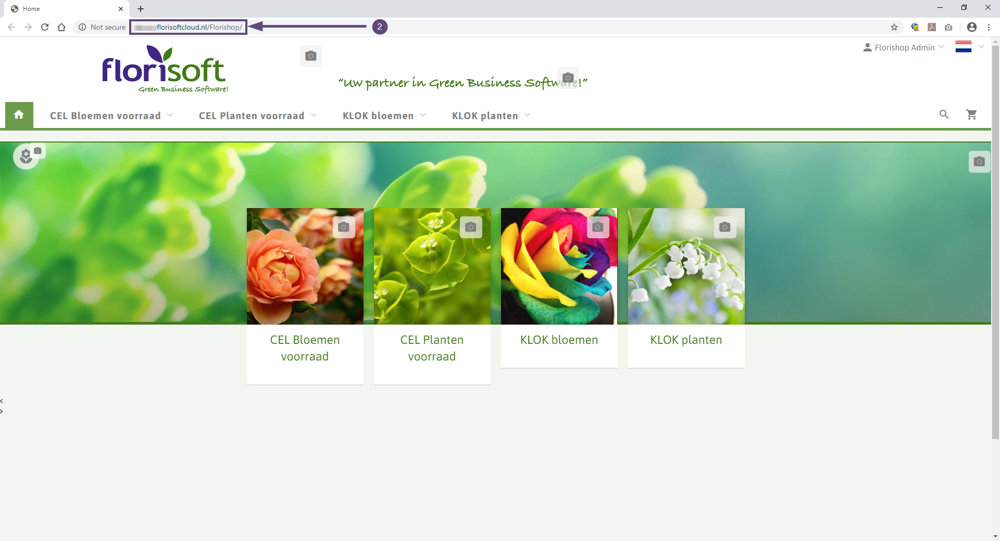
|
|**3**|Fill in the username of the managementaccount (Beheeraccount) in the "Gebruikersnaam" field (nr.3).

<b>Click here for your example image</b>
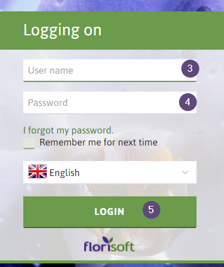
|
|**4**|Fill in the password of the managementaccount in the "Wachtwoord" field (nr.4).|
|**5**|Press Enter on the keyboard or klik on the big LOGIN button (nr.5) to log in. The webshop now logs into the webshop with the management account, see the picture below.

<b>Click here for your example image</b>
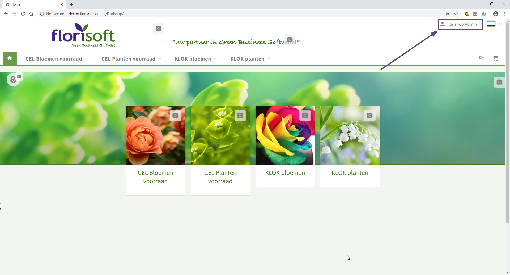
|