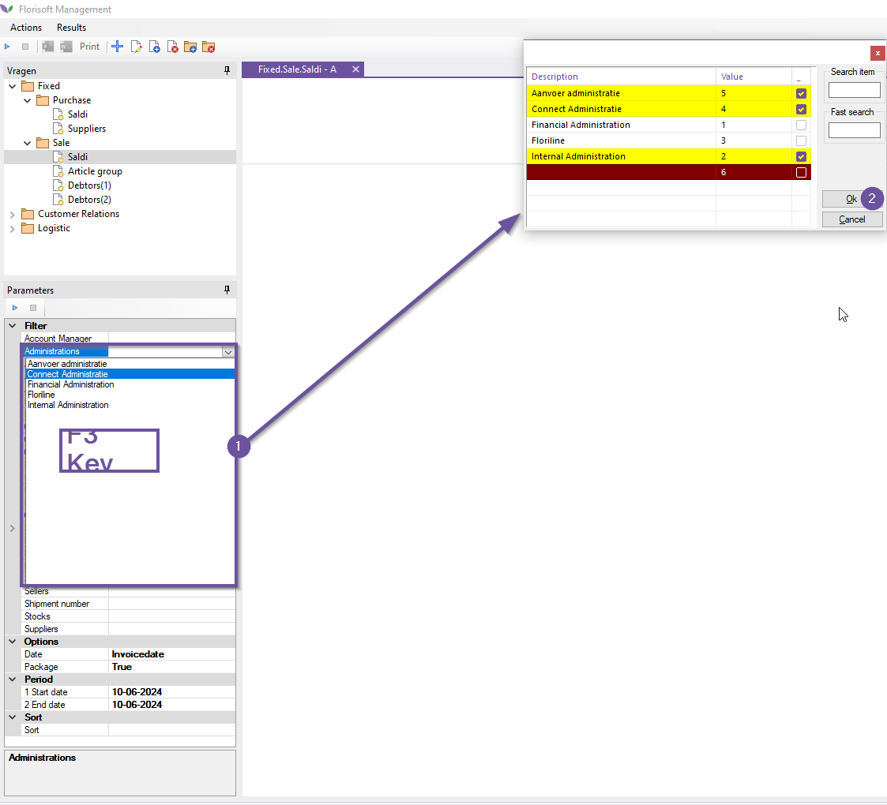

# Florisoft Manual Management Module (Saldi)

Welcome to the florisoft management module manual, in this manual you will learn how to export sales balance data from Florisoft to an excel file. The exported data can be filtered based on parameters such as the financial administration and invoice date.

## Prerequisites

In order to export the Florisoft data directly to Excel it is required to have Microsoft Excel installed on your server. If this requirement is not met Florisoft will produce an error saying it can't export to Excel. 

### Steps

*Follow the steps below:*

|Step|Explanation|
|:-:|:--|
|**1**|From the florisoft navigator open the management screen (#1).

<b>Click here for the example image!</b>

|
|**2**|Navigate the management queries file structure like so: **Fixed→Sale→Saldi**

<b>Click here for the example image!</b>

|
|**3**|Dubble click on the Saldi query, this opens a new tab on the right side of the screen alongside a filter/parameters table in the bottom left (#1).

<b>Click here for the example image!</b>

|
|**4**|In de parameter tab set the **date** dropdown (under the *Options* header) to the value **InvoiceDate**.

<b>Click here for the example image!</b>

|
|**5**|In the filters/parameters entry use the following filters, **Administrations** here you can select a financial adminisration that is to be used in the Excel report.

<b>Click here for the example image!</b>

 You can also select multiple **Administrations** at once by utilizing the search grid. Open a the **Administrations** dropdown and press the F3-key, in this grid you can select multiple options using the space bar. Click on the **Ok** button to confirm your selection.

<b>Click here for the example image!</b>

|
|**6**|Now fill out the filters under the header **Period**, this filters the sales balance the data for the given period of time.

<b>Click here for the example image!</b>

|
|**7**|Click on the triangular button to execute the management query with the given parameters.

<b>Click here for the example image!</b>

|
|**8**|You should now see data on the right side of your screen in query tab we opened before. To export the data in this tab click on the Excel icon in the top left of your screen.

<b>Click here for the example image!</b>

|
