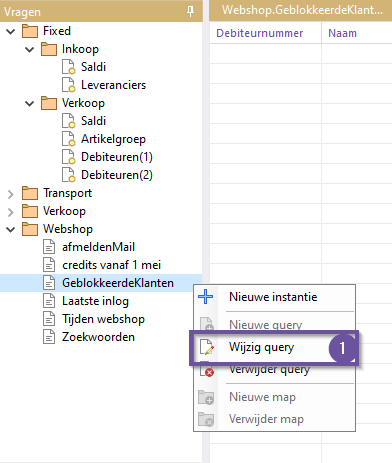
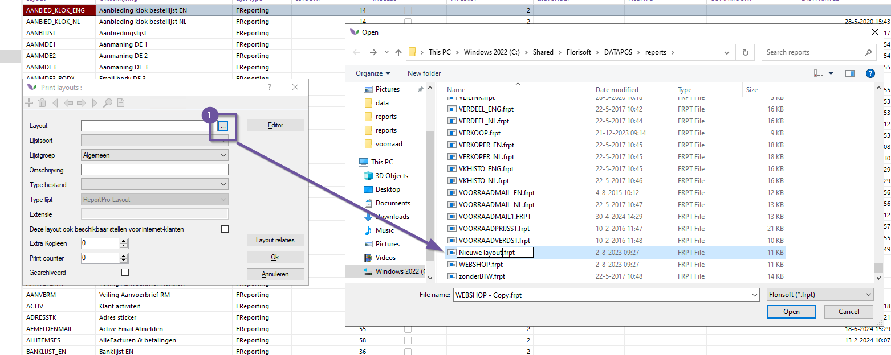

# Florisoft Handleiding Management Timer (M122)

In deze handleiding leest u over het gebruik van de management timer module.
Met deze module genereerd u management informatie op basis van database queries die u kan onderhouden in het Management scherm.
De resultaten van de queries worden dan verwerkt in een layout waarvanuit de management informatie verwerkt kan worden in een .pdf of excel bestand.

De timer voert deze opdacht op ingestelde intervallen uit en mailt het naar de geconfigureerde emailadressen. 

## Benodigdheden

Om gebruik te maken van de Management Timer heeft u een aantal dingen nodig:

1. Management SQL database query.
2. Layout om data uit management query weer te geven.

Het opstellen van een management query en het ontwerpen van de bijhorende layout kan u aanvragen bij Florisoft Support.
Bent u een ervaren gebruiker? Dan kan u het eventueel zelf proberen met de stappen in het volgende hoofdstuk te volgen.

## Voorbereiding

Zorg er eerst voor dat het timerproces voor de management timer module aanstaat, volg de onderstaande stappen:

|Stap|Uitleg|
|:-:|:--|
|**1**|Open Florisoft op de Timer gebruiker|
|**2**|Open de timer settings, klik met rechtermuisknop op het timer icoon en klik op **Timer Settings**.

<b>Klik hier voor uw voorbeeld!</b>

|
|**3**|Zoek in de timer naar het proces "MANAGEMENTINFO" door middel van de zoekfunctie(#1).

<b>Klik hier voor uw voorbeeld!</b>

|
|**4**|Zorg ervoor dat het proces in de kolom **Active** (#2) een vinkje staat.

<b>Klik hier voor uw voorbeeld!</b>

|
|**5**|Zet vervolgens in het tabje **Tijdschema** de instelling **Dit script activeren bij het starten van de timer**(#3) aan.

<b>Klik hier voor uw voorbeeld!</b>

|
|**6**|Stel vervolgens een voor u passend tijdsschema in (#4).

<b>Klik hier voor uw voorbeeld!</b>

|
|**7**|Druk nu op **Ok**.|

## Aanmaken van een management timer proces

Het aanmaken van een management timerproces doet u in een aantal stappen, eerst maakt u een management query aan, vervolgens maakt u een layout aan en tenslotte stelt u de query en layout in als management timer proces. Indien Florisoft dit voor u aanmaakt hoeft u deze stappen niet te volgen en kan u dit overslaan tot stap **1** van hoofdstuk [Instellen management timer proces](#instellen-management-timer-proces) waarmee je het tijdsschema instelt van het specifieke proces.

### Aanmaken management query

Het aanmaken van management queries/reports doet u in het management scherm, door de onderstaande stappen te volgen leert u hoe u daar komt, queries kan uitvoeren en nieuwe aan te maken. (Maak queries alleen aan wanneer u voldoende kennis heeft over zowel SQL als de Florisoft database).

#### Openen van management scherm en uitvoeren van rapportage

|Stap|Uitleg|
|:-:|:--|
|**1**|Vanuit de navigator klikt u op de **Management** knop, dit opent het report management scherm.

<b>Klik hier voor uw voorbeeld!</b>

|
|**2**|Aan de linkerkant van het scherm ziet u een soort bestandsmappenstructuur, in deze mappen staan SQl management reports opgenomen.

<b>Klik hier voor uw voorbeeld!</b>

|
|**3**|Open een van deze mappen, in dit voorbeeld openen wij de map **Webshop**, u ziet nu onder deze map de reports staan.   Klik nu tweemaal op een report, dit opent nu een instantie van het report in de vorm van een nieuw tablad.

<b>Klik hier voor uw voorbeeld!</b>

|
|**4**|U voert de rapportage uit door op een van de blauwe driehoekjes te drukken (zie voorbeeld afbeelding).

<b>Klik hier voor uw voorbeeld!</b>

|
|**5**|Het blanke tablad zal nu gevuld worden met de resultaten van de SQL query van het management report. 

<b>Klik hier voor uw voorbeeld!</b>

|

#### Afdrukken van een rapportage

De resultaten van een rapportage kunnen lastig zijn om direct van uw scherm af te lezen, in Florisoft kunt u deze gegevens ook laten verwerken in een management rapportage. De layouts van deze rapportage kan de data exporteerbaar maken naar PDF en Excel.

*Volg hier de onderstaande stappen:*

|Stap|Uitleg|
|:-:|:--|
|**1**|Linksboven vindt u de knop 'printen', klik op deze knop.

<b>Klik hier voor uw voorbeeld!</b>

|
|**2**|Er opent nu een printen venster, kies hier een **print layout**(#1), deze moet bij het rapport passen.

<b>Klik hier voor uw voorbeeld!</b>

|
|**3**|Daarnaast kiest u voor de vorm van uitvoer, via de printer, via de mail of opslaan als bestand.

<b>Klik hier voor uw voorbeeld!</b>

|
|**4**|Kiest u voor printen dan kiest u een printer uit de lijst met printers.

<b>Klik hier voor uw voorbeeld!</b>

|
|**5**|Wanneer u op **Ok** drukt zal een scherm/mail/bestand/print opdracht gestart worden aan de hand van de geselecteerde layout.

<b>Klik hier voor uw voorbeeld!</b>

|

#### Aanpassen van een management rapportage

*Volg de onderstaande stappen:*

|Stap|Uitleg|
|:-:|:--|
|**1**|In het managementrapportagescherm klikt u met de rechtermuisknop op een rapportage.

<b>Klik hier voor uw voorbeeld!</b>

|
|**2**|Klik op de optie **wijzig query**, dit opent een nieuw tablad met de SQL query.

<b>Klik hier voor uw voorbeeld!</b>

|
|**3**|In dit tablad kan u de query aanpassen, u slaat de query op door het tablad te sluiten.

<b>Klik hier voor uw voorbeeld!</b>

|
|**4**|Bevestig de query wijzigingen.

<b>Klik hier voor uw voorbeeld!</b>

|
|**5**|Voer de query uit om de nieuwe resultaten te zien. |

### Aanmaken van een layout

Deze handleiding gaat niet in op hoe de layout designer werkt, u leest hier enkel hoe u de editor opent en een nieuwe layout aanmaakt. 

*Volg de onderstaande stappen*:

|Stap|Uitleg|
|:-:|:--|
|**1**|Open het constantenscherm en navigeer naar het pad: **Systeem→Printen→PrintLayouts**

<b>Klik hier voor uw voorbeeld!</b>

|
|**2**|Klik op de **+** knop om een nieuwe layout toe te voegen.

<b>Klik hier voor uw voorbeeld!</b>

|
|**3**|Klik op de drie **...**, dit opent een Windows verkenner scherm, kopieer en plak hier al een bestaande layout. Geef deze vervolgens een andere naam zodat deze past bij de doeleinden van jouw layout.

<b>Klik hier voor uw voorbeeld!</b>

|
|**4**|Selecteer de layout en klik op **Oke** in het Windows verkenner venster.

<b>Klik hier voor uw voorbeeld!</b>

|
|**5**|Selecteer in de **Lijstsoort** de optie **management**

<b>Klik hier voor uw voorbeeld!</b>

|
|**6**|Geef de layout een passende omschrijving, deze omschrijving is zichtbaar in selectieschermen.

<b>Klik hier voor uw voorbeeld!</b>

|
|**7**|Druk nu op **Ok** om de nieuwe layout te bevestigen

<b>Klik hier voor uw voorbeeld!</b>

|
|**8**|U kan vanuit hier de layout ook aanpassen, door de nieuwe layout constante waarde opnieuw te openen en op de **Editor** knop te drukken. Dit opent de report designer, echter kan u dan niet zien welke gegevens beschikbaar zijn wat previewen lastig maakt.  In plaats hiervan is het verstandiger om layouts aan te passen op plaatsen waar gegevens beschikbaar zijn. Hoe u dit doet voor management layouts leest u in het volgende hoofdstuk.

<b>Klik hier voor uw voorbeeld!</b>

|

#### Aanpassen van een management layout 

|Stap|Uitleg|
|:-:|:--|
|**1**|In het management scherm (**navigator→management**) opent u een instantie van een rapportage.

<b>Klik hier voor uw voorbeeld!</b>

|
|**2**|Voer de rapportage vervolgens uit (**blauwe driehoek**), u ziet de gegevens nu verschuinen op het scherm.|
|**3**|Klik vervolgens op de knop **printen**

<b>Klik hier voor uw voorbeeld!</b>

|
|**4**|Kies voor de uitvoer optie **scherm** en druk op **ok**

<b>Klik hier voor uw voorbeeld!</b>

|
|**5**|Klik vervolgens op de knop **Designer**, dit opent de report editor met de gegevens afkomstig uit de resultaten van de zojuist uitgevoerde management rapportage.

<b>Klik hier voor uw voorbeeld!</b>

|

### Instellen management timer proces

Nu dat u zowel een management query als een bijhorende layout heeft kan u de management mailing instellen. Heeft Florisoft de layout en management query ingesteld voor u volgt u de onderstaande stappen om de mailing te configureren. 

|Stap|Uitleg|
|:-:|:--|
|**1**|Open het constantenscherm en navigeer naar het pad: **Timer→Management Info Mailing**

<b>Klik hier voor uw voorbeeld!</b>

|
|**2**|Indien er nog geen passende management mail constante waarde is maak er dan een aan met de **+** knop.

<b>Klik hier voor uw voorbeeld!</b>

|
|**3**|Geef de mail een passende naam.

<b>Klik hier voor uw voorbeeld!</b>

|
|**4**|Bij de dropdown **Script** kiest u de management query die u of florisoft heeft aangemaakt.

<b>Klik hier voor uw voorbeeld!</b>

|
|**5**|Bij de dropdown **layout** kiest u de bijhorende layout.

<b>Klik hier voor uw voorbeeld!</b>

|
|**6**|Bij het veld **E-mails** typt u het emailadres en vervolgens **Toevoegen** zo kan herhaaldelijk email adressen toevoegen.

<b>Klik hier voor uw voorbeeld!</b>

|
|**7**|In de sectie **Planning** kan u het schema van de individuele management rapportage, u zet een vinkje bij de start en stop om de begin en eindtijd aan te geven. Bij het veld **interval in minuten** vult u in om de hoeveel minuten de mail verzonden word.

<b>Klik hier voor uw voorbeeld!</b>

|
|**8**|Daarnaast is het in sommige scenario's aan te raden om de instelling **Via de timer email sturen als er geen resultaat is** aan te zetten om geen mail te versturen in het geval van een leeg query resultaat.

<b>Klik hier voor uw voorbeeld!</b>

|
|**9**|Zet de info mail vervolgens op actief door een vinkje bij de checkbox **Actief** te zetten. 

<b>Klik hier voor uw voorbeeld!</b>

|
|**10**|Sla de management info mail nu op door op de **ok** knop te drukken.|
