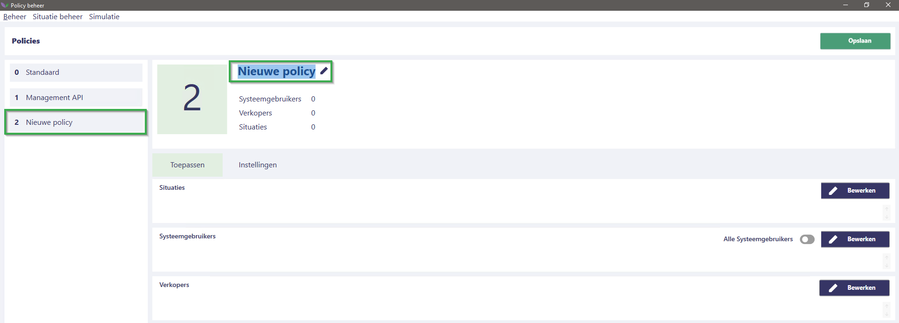
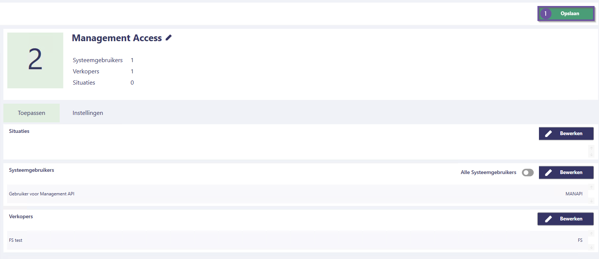

# Florisoft handleiding Policy Beheer

Ter vervanging van het gebruikersautorisatiescherm is er een Policy-scherm in Florisoft waarmee u gebruikers kunt autoriseren. Het voordeel van dit scherm is dat u meerdere gebruikers in één autorisatie (Policy) kunt hebben, waardoor het eenvoudig centraal te beheren is.

## Aanmaken van een policy

Om een policy aan te maken volgt u de volgende stappen :

|Stap|Uitleg|
|:-:|:--|
|**1**|Open het constanten scherm en navigeer naar het pad: **Systeem→Users→Policy Beheer**  *Dit opent een nieuw scherm, het policy scherm.*

<b>Klik hier voor uw voorbeeld!</b>

|
|**2**|In de linkerkant van het scherm ziet de al bestaande policies (#1), onderaan deze balk klikt u op de **Toevoegen** knop(#2) om een Policy toe te voegen.

<b>Klik hier voor uw voorbeeld!</b>

|
|**3**|U heeft nu een policy aangemaakt, deze heet standaard **Nieuwe Policy**, deze willen we echter een nieuwe naam geven zodat we later eenvoudig de policies kunnen herkennen.  U wijzigt de Policy naam door op de naam te klikken en een nieuwe naam in te typen. Zorg ervoor dat dit een passende naam is.

<b>Klik hier voor uw voorbeeld!</b>

|

:warning: **LET OP**: Policies hebben een hierarchie, in deze hierarchie telt de policy met het **hoogste** getal het sterkst. Dit geldt uiteraard enkel voor policies met overlappende instellingen/autorisaties, wanneer deze niet overlappen tellen deze als normaal. 

:bulb: **In het hoofdstuk [Policy Simulatie](#policy-simulatie) leert u hoe uw policies kan checken op correct functioneren.***

## Toewijzen instellingen/autorisaties

Om autorisaties aan een policy te voegen volgt u de onderstaande stappen:

|Stap|Uitleg|
|:-:|:--|
|**1**|Klik op het tabje *Instellingen*, hier ziet u de verschillende groepen aan autorisatie, een groep instellingen kan ook weer subgroepen hebben.

<b>Klik hier voor uw voorbeeld!</b>

|
|**2**|Voor deze handleiding willen we een gebruiker autorisatie  geven om gebruik te maken van de server management API.  We navigeren daarom naar de categorie **External** de subcategorie **Management**, hier zien we de instellingen voor de management API.|
|**3**|Stel uw nodige autorisaties in. Waneer u terug naar een bovenliggende groep wil navigeren maakt u gebruik van het pad(#1) aangegeven onder **Instellingen** tabje.   U kan dit zien als een bestandspad dat u kent vanuit Windows.

<b>Klik hier voor uw voorbeeld!</b>

|
|**4**|Na het toekennen van instellingen/autorisaties aan de Policy is het handig om tussentijd op de **Opslaan** knop te drukken.

<b>Klik hier voor uw voorbeeld!</b>

|
|**5**|Om te snel te zien welke instellingen/autorisaties ingesteld zijn bij een policy klikt u op het trechter icoontje en schkaelt u de instelling **Toon alleen ingesteld** in en de **Toon groepen** uit.   *Door dit te doen krijgt u een snel overzicht te zien van de bij deze policy ingestelde autorisaties.*

<b>Klik hier voor uw voorbeeld!</b>

|

## Toewijzen gebruikers

*Om gebruikers en verkopers te koppelen volgt u de onderstaande stappen:*

|Stap|Uitleg|
|:-:|:--|
|**1**|Om gebruikers aan deze policy te koppelen klikt u op het tabje **Toepassen**.

<b>Klik hier voor uw voorbeeld!</b>

|
|**2**|Om een policy toe te kennen aan alle Systeemgebruikers klikt u op **Alle Systeemgebruikers**.   Om individuele gebruikers aan deze policy te koppelen klikt op de **Bewerken** knop(#1). U krijgt nu een lijst van systeemgebruikers te zien, vink aan welke u nodig heeft en druk vervolgens op opslaan.

<b>Klik hier voor uw voorbeeld!</b>

|
|**3**|Sommige autorisaties/instellingen zijn gelinkt aan een verkoper, om een verkoper te koppelen aan een policy klikt u op de **Bewerken** knop. Vervolgens selecteert u de verkopers en klikt u op **Opslaan**.

<b>Klik hier voor uw voorbeeld!</b>

|
|**4**|Wanneer u de nodige Systeemgebruikers en Verkopers gekoppeld heeft klik u op de **Opslaan** knop rechtsbovenin uw scherm.

<b>Klik hier voor uw voorbeeld!</b>

|

## Situatiebeheer

*In sommige gevallen wilt u situatiespecifieke instellingen hebben, een voorbeeld hiervan is dat bij een werkplek A printer 1 hoort en bij werkplek B printer 2 hoort. Voor dit soort situaties dient u een situatie aan te maken.   Volg hiervoor de onderstaande stappen:*

|Stap|Uitleg|
|:-:|:--|
|**1**|Klik links bovenin op de knop **Situatie beheer**, hier ziet u de situaties in uw systeem.

<b>Klik hier voor uw voorbeeld!</b>

|
|**2**|Klik op de **Toevoegen** knop om een situatie aan te maken. Na het aanmaken van een policy kan u de naam aanpassen door op de naam te klikken en een nieuwe naam in te typen.

<b>Klik hier voor uw voorbeeld!</b>

|
|**3**|Vervolgens ziet u de gekoppelde policies bij de situatie.

<b>Klik hier voor uw voorbeeld!</b>

|
|**4**|Om een Situatie aan een policy toe te voegen klikt u op de **bewerken** knop naast de policy, selecteer de relevante situaties en klik op **opslaan**.

<b>Klik hier voor uw voorbeeld!</b>

|

:warning: **Situaties worden veelal gebruikt in de Florisoft apps in het hoofdstuk [Situatie instellen in Florisoft apps](#situatie-instellen-in-florisoft-apps)**.

## Policy simulatie

*Om te zien of een Policy op het juiste moment actief is kan u gebruik maken van de Policy Simulatie. U kan dit simuleren door de onderstaande stappen te volgen:*

|Stap|Uitleg|
|:-:|:--|
|**1**|In het policy scherm klikt u op de Simulatie knop. U krijgt nu het simulatie scherm te zien.

<b>Klik hier voor uw voorbeeld!</b>

|
|**2**|Om een eenvoudig overzicht te hebben van de relevante instellingen klikt u op het trechter icoon en selecteert u de instelling **Toon alleen ingesteld** en zet u de instelling **Toon groepen** uit.

<b>Klik hier voor uw voorbeeld!</b>

|
|**3**|Vervolgens kan u de Systeemgebruiker, Situatie en Verkoper specificeren om te zien welke autorisaties en instellingen aan worden gezet.

<b>Klik hier voor uw voorbeeld!</b>

 |
|**4**|Wanneer een policy niet naar behoren werkt ligt dit waarschijnlijk aan de eerder beschreven policy hierarchie. |

## Situatie instellen in Florisoft apps

Policy situaties zijn vooral relevant voor de Florisoft apps. 
Dit stelt u in bij de app instellingen in de app zelf

<b>Klik hier voor uw voorbeeld!</b>

Of via het hamburgermenu, waarbij u een situatie kan inscannen aan de hand van een QR-code.

<b>Klik hier voor uw voorbeeld!</b>

De QR code voor de situatie vindt u in het policyscherm, in de situatieregel. Deze QR code kunt u vervolgens uitprinten om in productie te kunnen scannen.

<b>Klik hier voor uw voorbeeld!</b>

