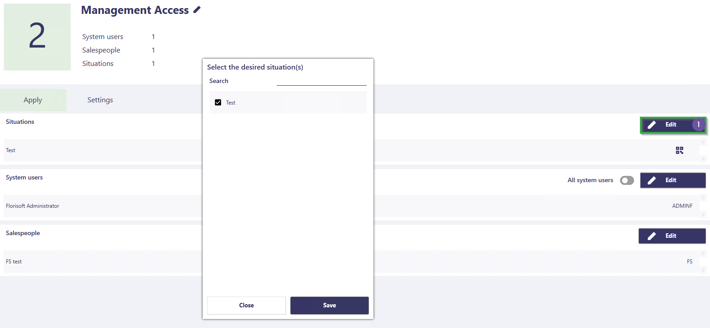

# Florisoft Manual Policy Management

To replace the user authorization screen, there is a Policy screen in Florisoft where you can authorize users. The advantage of this screen is that you can have multiple users in one authorization (Policy), making it easy to manage centrally.

## Creating a Policy

To create a policy, follow these steps:

|Step|Explanation|
|:-:|:--|
|**1**|Open the constants screen and navigate to the path: **System→Users→Policy Management**  *This opens a new screen, the policy screen.*

<b>Click here for your example!</b>

|
|**2**|On the left side of the screen, you will see existing policies (#1), at the bottom of this bar, click on the **Add** button (#2) to add a Policy.

<b>Click here for your example!</b>

|
|**3**|You have now created a policy, it is named **New Policy** by default, but we want to give it a new name so that we can easily recognize the policies later.  You change the Policy name by clicking on the name and typing a new name. Make sure it is an appropriate name.

<b>Click here for your example!</b>

|

:warning: **ATTENTION**: Policies have a hierarchy, in this hierarchy, the policy with the **highest** number holds the strongest authority. This applies only to policies with overlapping settings/authorizations; when they do not overlap, they are considered normal. **To adjust the hierarchy, you can drag the order of the policies in the Policies column on the left side of the screen.**

:bulb: **In the chapter [Policy Simulation](#policy-simulation), you will learn how to check your policies for correct functioning.**

## Assigning settings/authorizations

To add authorizations to a policy, follow the steps below:

|Step|Explanation|
|:-:|:--|
|**1**|Click on the *Settings* tab; here you will see the different groups of authorizations. A group of settings can also have subgroups.

<b>Click here for your example!</b>

|
|**2**|For this manual, we want to grant a user authorization to use the server management API.  Therefore, we navigate to the category **External**, subcategory **Management**; here, we see the settings for the management API.|
|**3**|Set your necessary authorizations. When you want to navigate back to a parent group, use the path (#1) indicated under the **Settings** tab.   You can think of this as a file path that you know from Windows.

<b>Click here for your example!</b>

|
|**4**|After assigning settings/authorizations to the Policy, it is useful to press the **Save** button intermittently.

<b>Click here for your example!</b>

|
|**5**|To quickly see which settings/authorizations are set for a policy, click on the funnel icon and switch on the **Show only set** setting and turn off the **Show groups** setting.   *By doing this, you will get a quick overview of the authorizations set for this policy.*

<b>Click here for your example!</b>

|

## Assigning users

*To link users and sellers, follow the steps below:*

|Step|Explanation|
|:-:|:--|
|**1**|To link users to this policy, click on the **Apply** tab.

<b>Click here for your example!</b>

|
|**2**|To assign a policy to all System Users, click on **All System Users**.   To link individual users to this policy, click on the **Edit** button (#1). You will now see a list of system users, check the ones you need, and then click save.

<b>Click here for your example!</b>

|
|**3**|Some authorizations/settings are linked to a seller; to link a seller to a policy, click the **Edit** button. Then select the sellers and click **Save**.

<b>Click here for your example!</b>

|
|**4**|Once you have linked the necessary System Users and Sellers, click the **Save** button in the top right corner of your screen.

<b>Click here for your example!</b>

|

## Situation Management

*In some cases, you want to have situation-specific settings, an example of this is that at workstation A printer 1 belongs and at workstation B printer 2 belongs. For such situations, you need to create a situation.   To do this, follow the steps below:*

|Step|Explanation|
|:-:|:--|
|**1**|Click on the **Situation Management** button in the top left corner, here you will see the situations in your system.

<b>Click here for your example!</b>

|
|**2**|Click on the **Add** button to create a situation. After creating a policy, you can adjust the name by clicking on the name and typing a new name.

<b>Click here for your example!</b>

|
|**3**|Next, you will see the linked policies with the situation.

<b>Click here for your example!</b>

|
|**4**|To add a Situation to a policy, click on the **edit** button next to the policy, select the relevant situations, and click **save**.

<b>Click here for your example!</b>

|

:warning: **Situations are mainly used in the Florisoft apps in the chapter [Setting Situation in Florisoft Apps](#setting-situation-in-florisoft-apps)**.

## Policy Simulation

*To see if a Policy is active at the right time, you can use the Policy Simulation. You can simulate this by following the steps below:*

|Step|Explanation|
|:-:|:--|
|**1**|In the policy screen, click on the Simulation button. You will now see the simulation screen.

<b>Click here for your example!</b>

|
|**2**|To have a simple overview of the relevant settings, click on the funnel icon and select the **Show only set** setting, and turn off the **Show groups** setting.

<b>Click here for your example!</b>

|
|**3**|Then, you can specify the System User, Situation, and Seller to see which authorizations and settings are being applied.

<b>Click here for your example!</b>

 |
|**4**|If a policy is not working properly, it is likely due to the previously described policy hierarchy. |

## Setting Situation in Florisoft Apps

Policy situations are especially relevant for the Florisoft apps. 
You set this in the app settings within the app itself

<b>Click here for your example!</b>

Or via the hamburger menu, where you can scan a situation based on a QR code.

<b>Click here for your example!</b>

You can find the QR code for the situation in the policy screen, in the situation row. You can then print this QR code to scan it in production.

<b>Click here for your example!</b>

