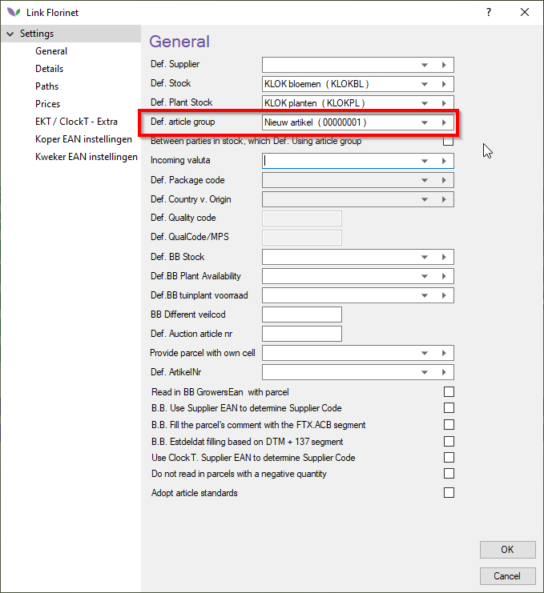

# Florisoft manual for reading in Connect/BB messages

If you are used to receiving and reading in EKT messages, rading in BB/Connect messages works largely the same. These messages should be sent to the same mailbox as the one for EKT-messages.

The message format that is used for connect transaction messages is DESADV, which will be retrieved (popped) by the EDI function.

*To set this up follow the steps below:*

:warning: **The following steps should be executed on the TIMER user**:warning:

|Step|Explanation|
|:--|:--|
|**1**|In the navigator click on the **BB** button with the right mouse buttom, you should now see a context menu. Click on the option **Setup BB messages**.  You should now see a settings screen for receiving Connect/BB messages (comparable to the EKT-settings).

<b>Click here for the example image!</b>

|
|**2**|Fill out the **Def. Stock** value to select the stock, this is the default stock. 

<b>Click here for the example image!</b>

 |
|**3**|Now fill out the default article group **Def. aricle group**

<b>Click here for the example image!</b>

|
|**4**|**Optional**: You can choose to enter a default Plant stock for reading in plant stock. 

<b>Click here for the example image!</b>

|
|**5**|You can read in Connect/BB messages by clicking on the **BB** button (with the left mouse button).  You may also choose to open the timer settings and open the **BB** function and execute it once by clicking on the **Eenmalig uitvoeren** button.

<b>Click here for the example image!</b>

|