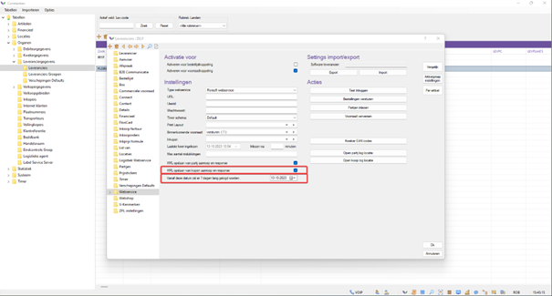

# Florisoft Handleiding Scannen van Barcodes in de box

In dit document staat een veel voorkomende situatie beschreven; het niet correct kunnen ontvangen van leverancier's artikelen vanwege een barcode mismatch met de pakbon. 

In de meeste gevallen is het nodig dat de leverancier aanpassingen maakt. Dit document beschrijft hoe je duidelijk aan de leverancier kunt doorgeven wat er aangepast moet worden. Pas nadat deze aanpassingen zijn gedaan en nieuwe aankopen zijn gemaakt, kun je opnieuw testen.

## Inhoudsopgave  

[Wat moet je weten](#wat-moet-je-weten)  
&nbsp;&nbsp;&nbsp;&nbsp;[Welke barcode staat er op de pakbonsticker van de leverancier](#welke-barcode-staat-er-op-de-pakbonsticker-van-de-leverancier)   
&nbsp;&nbsp;&nbsp;&nbsp;[Wat is de verwachte barcode (VPARTIJ barcode)?](#wat-is-de-verwachte-barcode-vpartij-barcode)
&nbsp;&nbsp;&nbsp;&nbsp;[Barcode-Opbouw](#barcode-opbouw)  
&nbsp;&nbsp;&nbsp;&nbsp;[Controleer de barcode](#controleer-de-barcode)     
&nbsp;&nbsp;&nbsp;&nbsp;[Hoe worden de aankopen gedaan: Koppeling/Directe verkoop (EKT)?](#hoe-worden-de-aankopen-gedaan-koppelingdirecte-verkoop-ekt)  
[Wat kun je aanpassen in het eigen systeem](#wat-kun-je-aanpassen-in-het-eigen-systeem)  
[EKT](#ekt)  
&nbsp;&nbsp;&nbsp;&nbsp;[Voorbeeld EKT](#voorbeeld-ekt)  
[Koppelingen](#koppelingen)  
[Oplossingen voor de leverancier die Florisoft gebruikt](#oplossingen-voor-de-leverancier-die-florisoft-gebruikt)   
&nbsp;&nbsp;&nbsp;&nbsp;[Veilingcode wijkt af\(Eerste 3 van de barcode\)](#veilingcode-wijkt-af-eerste-3-van-de-barcode)  
&nbsp;&nbsp;&nbsp;&nbsp;[Dagnummer komt niet overeen](#dagnummer-komt-niet-overeen)  
&nbsp;&nbsp;&nbsp;&nbsp;[PTY barcode of STK barcode?](#pty-barcode-of-stk-barcode)  
[Voorbeeld mail naar leverancier](#voorbeeld-mail-naar-leverancier) 

## Wat moet je weten

### Welke barcode staat er op de pakbon/sticker van de leverancier?

Eerst moet je weten wat er onder de barcode op de sticker/pakbon wordt afgedrukt. Dit is de invoer die het systeem zoekt. Als er geen code onder de barcode staat, kun je de barcode scannen in Notepad.

### Wat is de verwachte barcode (VPARTIJ barcode)?

De verwachte barcode is te vinden in de Box-monitor, waar de verwachte barcode per distributie wordt weergegeven. Let op: het aantal van de partij staat hier niet vermeld! (Raadpleeg de barcode-opbouw hieronder.)


### Barcode-Opbouw

De barcode opbouw is als volgt:
VVV KK DDD TTTTT L H AAAA

* V = Veilingcode
* K = Kloknummer
* D = Dag nummer
* T = Logistiek Transactievolgnummer
* H = Herstartindicatie
* A = Aantal

### Controleer de barcode

1. Zorg ervoor dat de barcode op de pakbon duidelijk is afgedrukt en niet beschadigd is;

2. Vergelijk de barcode met de gegevens in jouw systeem;

3. Neem contact op met je leverancier en vraag om verduidelijking over de barcode op de pakbon. Vraag om bevestiging van de juiste barcodegegevens en of er wijzigingen zijn aangebracht.

### Hoe worden de aankopen gedaan: Koppeling/Directe verkoop (EKT)?

Het is belangrijk om te weten dat EKT-barcodes anders zijn dan Etrade/koppeling-barcodes. In beide gevallen kun je de ontvangen barcode in de monitor zien.

## Wat kun je aanpassen in het eigen systeem

Als de barcode aanzienlijk afwijkt, kan het zijn dat de barcode uit het verkeerde segment wordt gehaald. Er zijn verschillende opties:


<br>

De meest gangbare types zijn ‘Standaard’ en ‘RFFBT’ voor Externe leveranciers buiten Royal Flora Holland (klokvoorverkoop en de veiling zie later in dit document).
Het kan zijn dat de standaardopbouw niet goed werkt bij een leverancier. In dit geval kun je ervoor kiezen om de barcode over te nemen uit het BT-segment. Controleer of de barcode op de bon overeenkomt met wat in het BT-segment staat.

<br>

## EKT

In de EKT kun je verschillende stukken informatie vinden. De EKT is op te vragen in de historie.


### Voorbeeld EKT

```
UNH+4663821+CLOCKT:003:007:FS'
UNB+UNOA:2+Bedrijfsnaam EKT in Systeem Setup Algemeen:ZZ+DIT:ZZ+231013:1407+4663820++FST'
BGM+493'
DTM+97:20231013:102'
NAD+BY+DIT'
NAD+FLA+12'
NAD+SE+'
LIN+++841:VBN'
DTM+9:140443:402'
NAD+MF+00000'
RFF+AAD:00'
RFF+ACE:00000'
RFF+ADZ:0001'
RFF+AGJ:66382'
RFF+BT:120000466382'
RFF+CTS:'
RFF+FAC:99'
RFF+FAN:0000'
QTY+52:50'
QTY+66:1'
PRI+INV:1.930'
IMD++S99+:::BUPLEURUM ROTUNDIFOL'
IMD++S20+070'
IMD++S21+000'
IMD++S22+023'
IMD++S62+NL'
IMD++K01+000'
IMD++K02+000'
PAC+++999'
EQD+BX++1'
UNT+30+4663821'
UNZ+1+4663820'
```
<br>

**In dit geval is de barcode-opbouw als volgt:**

VVV KK DDD TTTTT AAAA 
012 99 286 66382 0001

V= Veilingcode      ( NAD+FLA+12' )  
K = Kloknummer  (RFF+FAC:99')  
D = Dagnummer  (DTM+97:20231013:102') Datum is dag nummer   
T = Logistieke Transactievolgnummer (RFF+AGJ:66382' )  
A = Aantal    


<Br>

Soms kloppen deze gegevens niet, maar staan de juiste gegevens in het RFF+BT-segment in de EKT. Als dit het geval is, kun je ervoor kiezen om de barcode uit het RFF+BT-segment te gebruiken. Pas dit aan bij de veilingen (let op! doe dit op de gebruiker die de EKT's invoert).

## Koppelingen

Voor koppelingen werkt het weer net een beetje anders. Hiervoor is het goed om in eerste instantie het log aan te zetten zodat we precies kunnen zien wat er gestuurd en ontvangen wordt.

:warning: **Let op!** dat de datum op vandaag staat. Om te voorkomen dat er te veel gelogd wordt gaat dit standaard na 7 dagen weer uit!



<br>

Nadat er een koop gedaan is kan je het koop log locatie openen.

<br>


<Br>

Deze opent een map waarin je een ‘request’ en ‘response’ terug gaat vinden.
Voor de barcode kijken we altijd in de response:

Zoek hier de volgende velden op.

**\<feram:ReferencedDocument\>
\<ram:IssuerAssignedID schemeName="BT"\>**
Hier staat de barcode in zoals deze in het BT segment staat.
Bijvoorbeeld op deze manier:

**\<ram:IssuerAssignedID schemeName="BT"\>00099248662900010001\</ram:IssuerAssignedID\>**

*Ook hier is de barcode weer op dezelfde manier opgebouwd.*

## Oplossingen voor de leverancier die Florisoft gebruikt

Wat het meeste fout gaat bij leveranciers zijn de volgende 3 settings

### Veilingcode wijkt af (Eerste 3 van de barcode)

Hiervoor moeten voor zowel de Koppeling als EKT de veilcode bij de debiteur ingegeven worden.
Dus ook als je alleen een koppeling gebruikt. 

Dit kan de leverancier aanpassen bij de **debiteur > EKT - > Veiling code**


### Dagnummer komt niet overeen

Dit komt vaak dat de EKT voor morgen is maar de order vandaag al verwerkt wordt.
In dit geval moet de leverancier de volgende setting aanzetten:
DTM+97 vullen met het ordernummer als datum of vandaag.


### PTY barcode of STK barcode?

Op de lay-out kunnen er 2 type barcodes geprint worden. Voor koppeling kopen moet de PTY barcode geprint worden. Voor EKT kopen moet de STK barcode geprint worden. Dit moet de leverancier aanpassen. (Let wel op dat hiervoor indien deze nog niet aanwezig is er een aparte lay-out gemaakt wordt)

## Voorbeeld mail naar leverancier

Voor een leverancier kan het vaak een kleine moeite zijn om het gene aan te pakken wat er mis gaat.
Een duidelijk voorbeeld is met barcodes essentieel.
Iets wat je vandaag print kan morgen weer anders zijn dus daarom zijn voorbeelden heel erg belangrijk.

```
Geachte leverancier,

Om onze logistieke afhandeling zo vlot mogelijk te laten verlopen, is het van essentieel belang dat we de barcodes van de aangeschafte producten kunnen scannen. Na wat onderzoek te hebben gedaan, kwam ik tot het volgende inzicht:

Op deze datum [ DATUM] heb ik dit product ontvangen [ Product] En in dit voorbeeld was er geen overeenkomst in de barcode.
De barcode die jullie hebben afgedrukt, luidt als volgt: [Barcode zoals afgedrukt op de aflever bon of sticker].
 De barcode die wij verwachten, is echter: [Barcode op het daadwerkelijke product in de ontvangen zending].

Mijn verwachting is dat de discrepantie mogelijk wordt veroorzaakt door: [Geef hier aan wat de mogelijke oorzaak van de afwijkende barcodes kan zijn].

Ik zou graag willen vernemen wanneer jullie in de gelegenheid zullen zijn om deze kwestie op te lossen. Zodra ik een bevestiging ontvang, zal ik een nieuwe test uitvoeren en mijn bevindingen met jullie delen.

Ik waardeer jullie tijd en aandacht voor dit belangrijke vraagstuk.

Met vriendelijke groet,
[Uw naam]
```