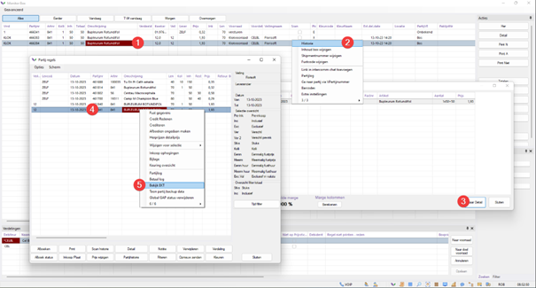
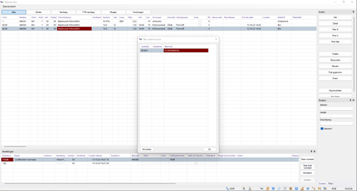
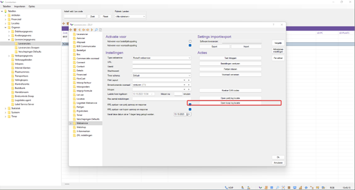
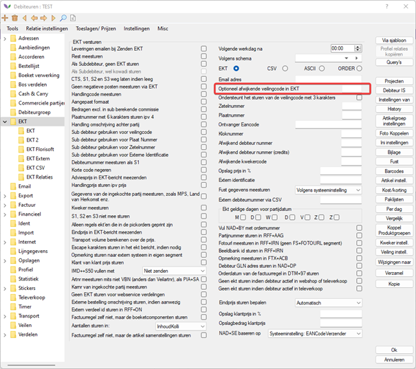
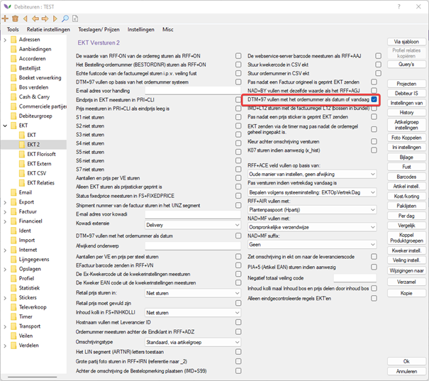

# Scanning Barcodes

This document covers the often reoccuring situation of not being able to correctly receive a supplier's articles due to a mismatch between the barcode and packing list.

More often than not this requires the supplier to make some changes in order to solve this problem. In this document you will read about how one can clearly communicate to the supplier on what needs to be changed. After the changes are made and new purchases are made from this supplier can you test again. 

## Table of content

[]()  
[]()  
[]()  
[]()  
[]()  
[]()  
[]()  
[]()  
[]()  

## Requirements

### Which barcode is currently on the supplier's packing list / sticker

First you will need to know what gets printed underneath the barcode on the packing list / sticker. You will need this as this the value that gets searched for in your system/ If no value is present underneath the barcode; scan the barcode and copy-paste its value in notepad. 

### What is the expected barcode (VPARTIJ barcode)?

The expected barcode can be found in the entry control (box) monitor, here the expected barcode is displayed per distribution. **Important :** the parcel amount is not shown here! (Consult the barcode buildup below).

 <!-- Naar Engels! -->

### Barcode buildup 

The barcode is build up like so :

**VVV KK DD TTTTT L H AAAA**

* V = Auction code
* K = Clock number
* D = Day number
* T = Logistics transaction trace number
* H = Restart indication
* A = Quantity

### Checking the barcode

1. Make sure that the barcode on the packing list is printed in a clear and readable fashion (and is not damaged).

2. Compare the barcode with data present in your system

3. Contact your supplier with a request to clarify the barcode buildup on their packinglist. Request confirmation on whether or not the new barcode contains the correct barcode values and the right changes were made.

### How were the purchases made (Connections/Direct sales (EKT))?

It is important to know that EKT-barcodes differ from E-Trade/connection barcodes. In both cases the received barcodes are shown in the entry control (box) monitor.

### What changes can be made in your own Florisoft system

If the barcode is considerably different, it is possible that the barcode gets read in from the wrong segment. There are multiple options :

 <!-- NEDERLANDS!? -->

The most common types are the 'Standaard' and 'RFFBT' types voor external suppliers (outside of Royal Flora Holland), clock presales and auctions are shown later on in this manual.

It may be the case that the standard buildup does not work correctly for a supplier. In these cases you can choose to use barcodes from BT-Segment. Check if the barcodes on the packing list matches that of the barcode in the BT-segment.

## EKT

The EKT contains important pieces of information and is to be found in the historical data.

 <!-- NEDERLANDS -->

### Example of an EKT

```
UNH+4663821+CLOCKT:003:007:FS'
UNB+UNOA:2+Bedrijfsnaam EKT in Systeem Setup Algemeen:ZZ+DIT:ZZ+231013:1407+4663820++FST'
BGM+493'
DTM+97:20231013:102'
NAD+BY+DIT'
NAD+FLA+12'
NAD+SE+'
LIN+++841:VBN'
DTM+9:140443:402'
NAD+MF+00000'
RFF+AAD:00'
RFF+ACE:00000'
RFF+ADZ:0001'
RFF+AGJ:66382'
RFF+BT:120000466382'
RFF+CTS:'
RFF+FAC:99'
RFF+FAN:0000'
QTY+52:50'
QTY+66:1'
PRI+INV:1.930'
IMD++S99+:::BUPLEURUM ROTUNDIFOL'
IMD++S20+070'
IMD++S21+000'
IMD++S22+023'
IMD++S62+NL'
IMD++K01+000'
IMD++K02+000'
PAC+++999'
EQD+BX++1'
UNT+30+4663821'
UNZ+1+4663820'
```

<br>

**The barcode buildup here is like this :**

**VVV KK DDD TTTTT AAAA**
012 99 286 66382 0001

V= Auction code      ( NAD+FLA+12' )  
K = Clock number  (RFF+FAC:99')  
D = Day number  (DTM+97:20231013:102') Datum is dag nummer   
T = Logistical transaction trace number (RFF+AGJ:66382' )  
A = quantity    

 <!-- NEDERLANDS -->

<br>

For connections the process is a bit different, here we will want to enable logging so that we can see what we send and receive. 

:warning: **Important :** *check to see of the date is that of today, do this in order to prevent excess logging. The logging functionality will automatically disable itself after 7 days. 

 <!-- NEDERLANDS -->

<br>

Open the purchase log after a purchase was made.

 <!-- NEDERLANDS -->

<br>

This will open wherein you will find the 'request' and the 'response' logs. The barcodes we are looking for are to found in the reponse logs. 

Here we will want to look for the following fields :

**\<feram:ReferencedDocument\>
\<ram:IssuerAssignedID schemeName="BT"\>**

This element contains the BT-segment's barcode which would look like this :

**\<ram:IssuerAssignedID schemeName="BT"\>00099248662900010001\</ram:IssuerAssignedID\>**

*This barcode's buildup is build along the previously described format.**

## Solutions for suppliers that use Florisoft

When there are issues with suppliers that use Florisoft as their backoffice it is usually caused by one of the three following settings :

### Deviating auction code (first three characters in the barcode)

To solve this issue for both the Connection and EKT barcodes the debtor's auction code needs to specified.

This can be changed with the setting :

**community → debtor data → debtors → EKT → Auction code**

 <!-- NEDERLANDS -->

### Day numbers do not match

This often happens when an EKT is meant for tomorrow but gets processed today (the day before). To address this issue you will want to enable the setting **DMT+97**.

 <!-- NEDERLANDS -->

### PTY or SKT barcode?

Lay-outs may use two types of barcodes; for connections we want to use the PTY barcode, EKT's ought to use STK barcodes. This has to be changed by the supplier.

**Make sure that a separate layout is made for this change (if there wasn't one already)**.

### Example mail to suppliers

These issues are things that a supplier can easily address (without much effort). However, it is important to provide the supplier with clear (and readable (non-damaged)) barcodes.

```
Dear supplier,

For our logistics to run as smoothly as possible, it is essential to be able to scan the barcodes of purchased products. After doing some research, I came to the following understanding:

On this date [ DATE], I received this product [ Product] And in this example, there was no match in the barcode.
The barcode you printed is as follows: [Barcode as printed on the delivery note or sticker].
 However, the barcode we expect is: [Barcode on the actual product in the received shipment].

My expectation is that the discrepancy is possibly caused by: [Please indicate the possible cause of the discrepant barcodes here].

I would like to know when you will be in a position to resolve this issue. As soon as I receive confirmation, I will run another test and share my findings with you.

I appreciate your time and attention to this important issue.

Kind regards,
[Your name]
```