# Telesales

## Opening TeleSales

The Telesales screens can be opened by clicking the **Telesales** button in the Navigator.

  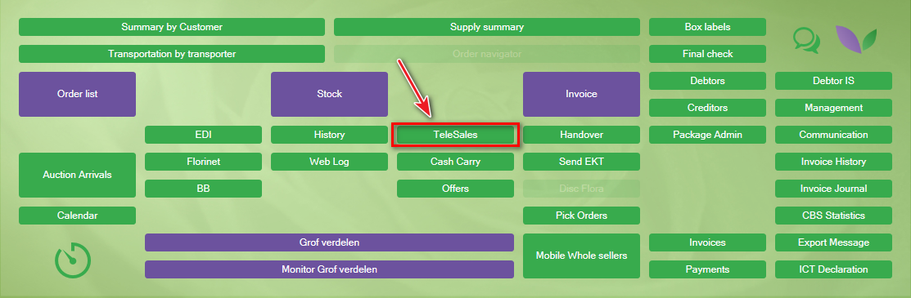

When configured, you need to enter your personal Seller ID.

  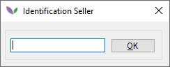

After a valid Seller ID has been entered, the Telesales main screen is shown.

## Main screen layout

  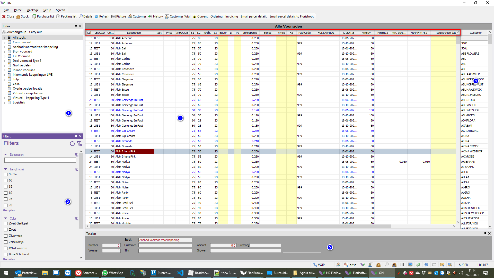

### 1. Stocks

This window contains the stocks that are available to the user. The **All stocks** option shows the available parcels from every visible stock.

To determine which stocks are visible:

1. Right-click the Telesales button in the Navigator. A pop-up menu appears.

  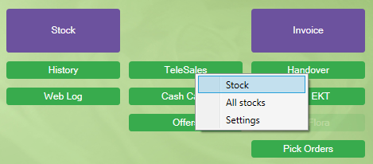

2. Click **Stock** to open the stock-selection window. Press the spacebar on the active line to select or deselect a stock.

  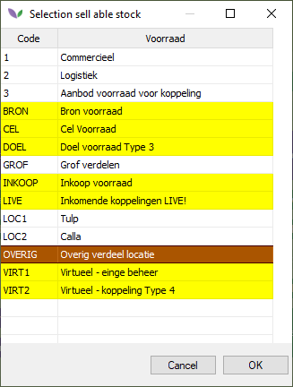

The stocks highlighted in yellow will be visible in the Telesales main screen for this user.

### 2. Filters

Various filters can be found and used in this window.

### 3. Parcels

This window shows the parcels from the selected stock or from **All stocks**. Right-click the header to configure the visible columns.

### 4. Debtors

This window contains the debtors. Its columns change after a debtor has been selected.

  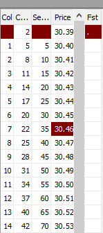

The columns make it possible to specify how many stems are sold in each colli:

- **Col:** number of colli to sell.
- **Content:** content of each colli.
- **Separate:** additional separate stems that are not placed in a container.
- **Price:** price per item.
- **Fst:** bucket type used for the product.

### 5. Debtor and order information

The selected debtor and the related order information are shown in this section.

## Buttons at the top of the main screen

The following buttons are available at the top of the screen:

  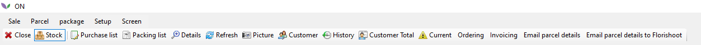

- **Close:** closes the Telesales screen.
- **Stock:** shows all parcels in the selected stock.
- **Purchase list:** shows parcels from all stocks on which an order has been placed. Parcels without an order are hidden.
- **Packing list:** shows a pop-up with the divisions for all debtors that still have stock.

Double-click a debtor to see a summary of all sales for that debtor.

  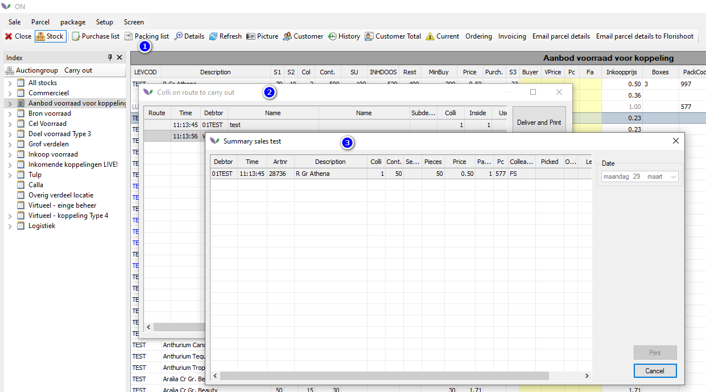

- **Details:** shows a pop-up with details of the active parcel.
- **Refresh:** refreshes the stock.
- **Picture:** shows the picture linked to the active parcel.
- **Customer:** selects a debtor.
- **History:** shows historical invoices for the active debtor.

  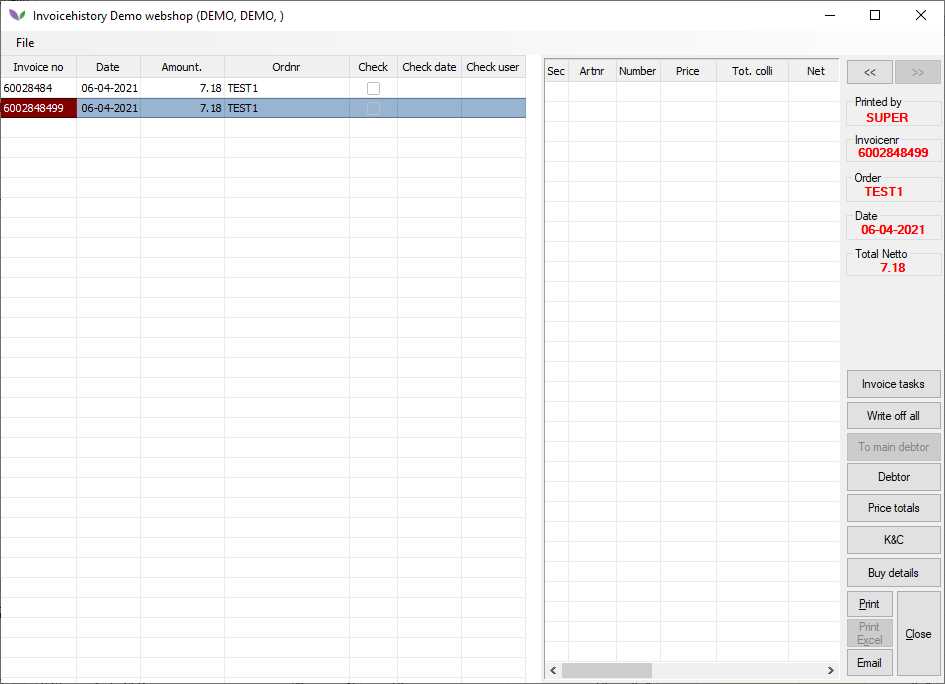

- **Customer Total:** shows all orders and order numbers for the active debtor.

  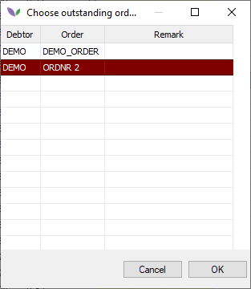

Double-click an order to see its details in the customer summary.

  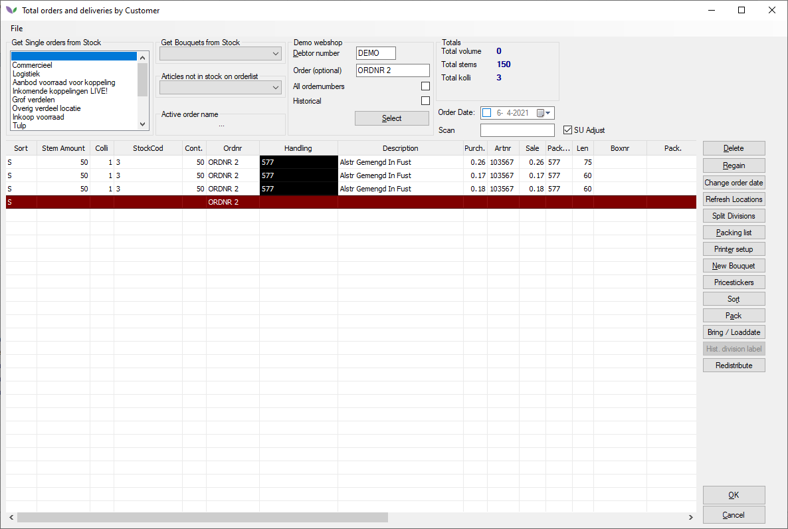

- **Current:** shows the current Telesales order for the selected date.

  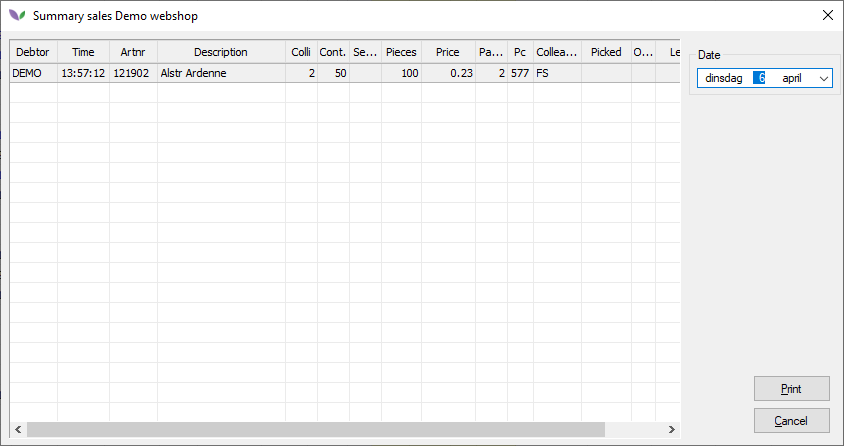

- **Ordering:** shows all order lists. After an order list is selected, Florisoft searches for the order-list parcel linked to the active stock parcel. This function can be used when the stock parcel and order-list parcel reference each other.
- **Invoicing:** opens the Invoice screen to process invoices.

  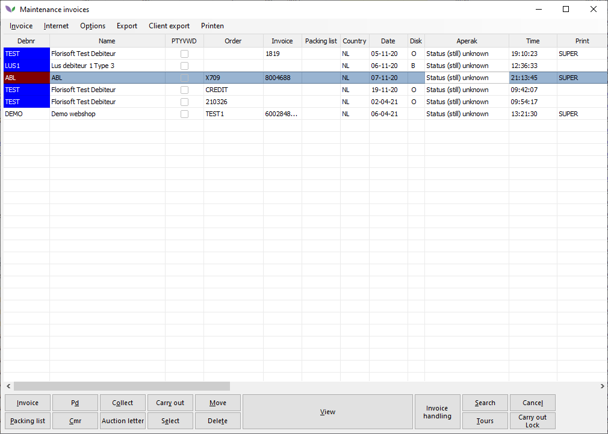

## Selling

Start by selecting a debtor. Click the button with three dots at the top of the debtor window, or scroll through the list and click the debtor number.

  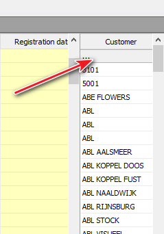

Alternatively, click **Customer** at the top of the screen.

  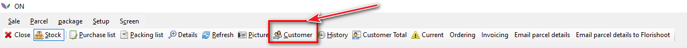

The debtor-selection screen opens, where you can search for and select a debtor.

  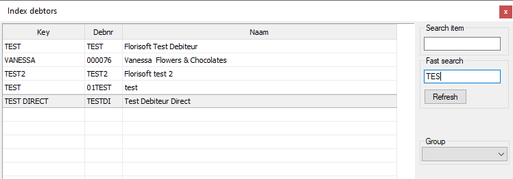

After the debtor has been selected, a screen may appear in which you can enter or select an order number.

  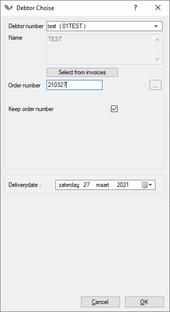

This screen is shown when **Use Order Number** is enabled under **Setup**.

  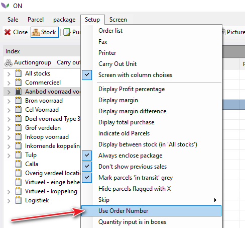

After the debtor and order number have been selected, orders can be entered. Use the search and filtering options to find a product more quickly.

Enter a quantity in the buyer column to allocate the desired quantity to the debtor.

  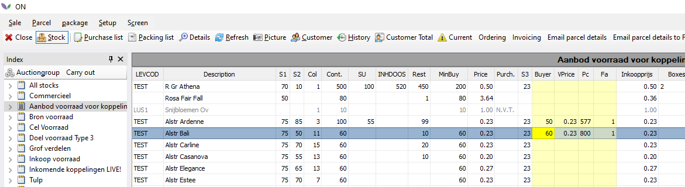

When the following option is enabled, sales are always entered using the parcel's sales unit.

  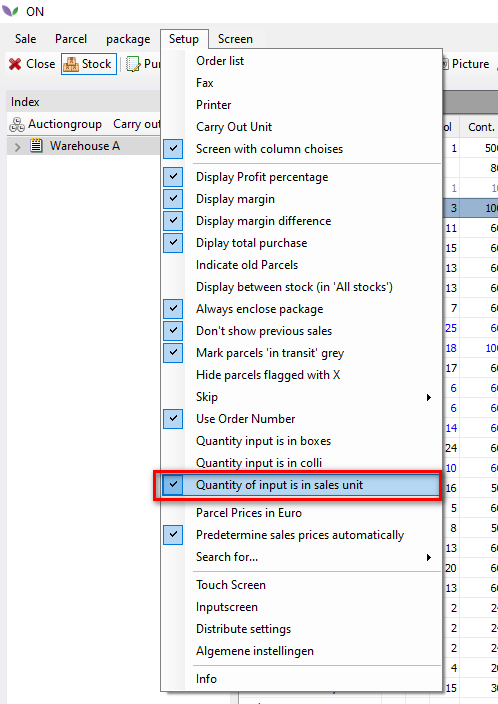

When you enter `1`, the quantity is automatically changed to the sales unit. The sales unit is visible in the **SU** column.

### Delete a sale

Enter a quantity of `0` in the yellow column to delete a sale.

  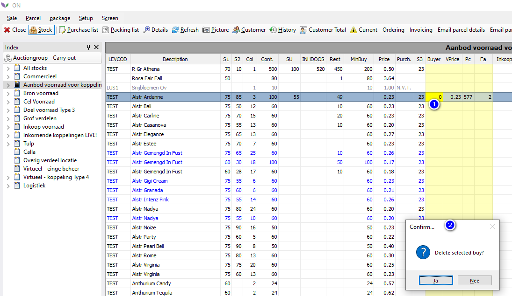

The **PC** column contains the package code. The **FA** column contains the number of packages included in the sale. Change **FA** to `0` if the packaging should not be included.

## Sales margins and total amount

Columns are available on each line to show the margin for that sale.

**When a price configuration is used to calculate the sales price shown in the price column, a margin is not calculated. A margin is calculated when the price in the yellow VPrice column is changed, based on the difference between Price and VPrice.**

## Searching and filtering

Telesales includes a quick-search function. Start typing to display the entered characters at the bottom of the screen. Parcels are filtered using these characters, and a space can separate multiple keywords.

  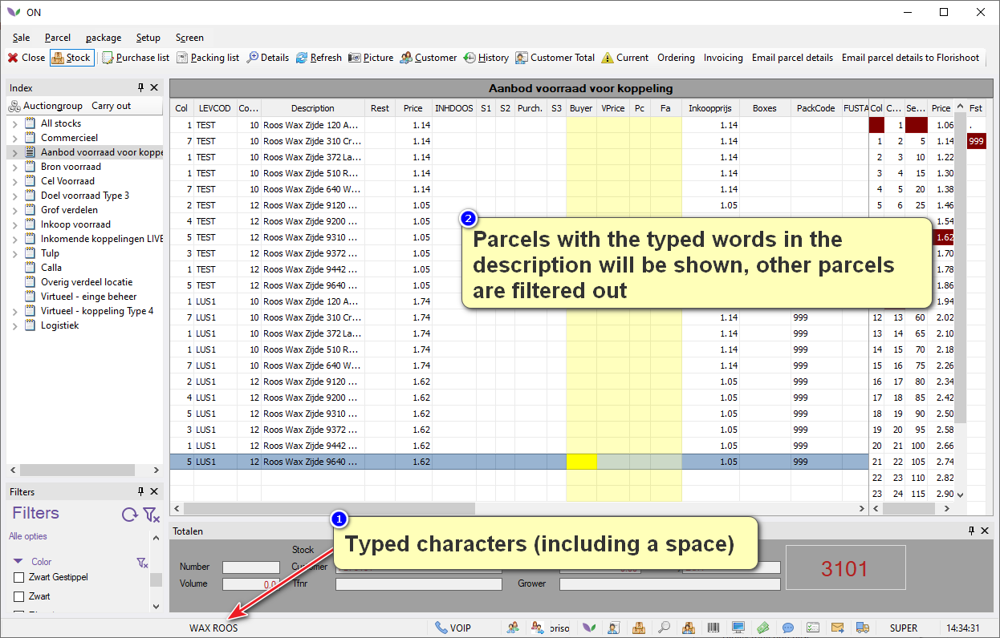

Use the Backspace key to remove the entered characters and reset the search.

The second filtering method uses the filters window.

  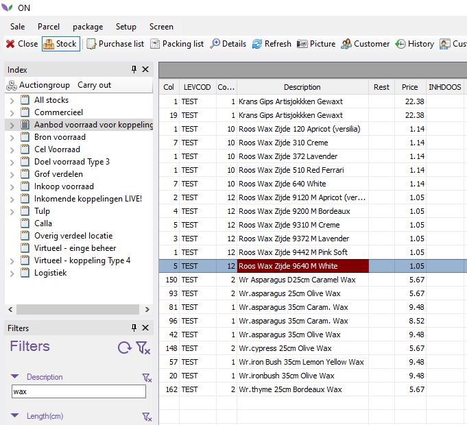

Open or close the filters window via **Screen > Show filters**.

  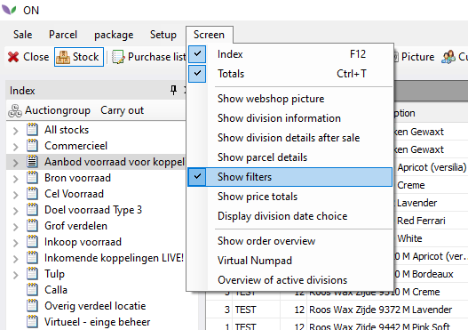

