# Florisoft Update

### 1. Warum muss ich ein Update durchführen?
Ein Update von Florisoft ist erforderlich, wenn Sie eine Anpassung innerhalb von Florisoft angefordert haben (oder Florisoft diese Anpassung für notwendig erachtet hat) und Florisoft Sie darüber informiert hat, dass diese Anpassung bereit ist, ausgeliefert zu werden.

### 2. Wie führe ich ein Update durch?
Befolgen Sie diese Schritte, um das Update zu starten:

1. Starten Sie die `Florisoft Update-Verknüpfung`.  
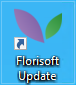

> **Warum sollte ich über eine separate Florisoft-Verknüpfung aktualisieren?** 
Auf diese Weise laden Sie die neue Florisoft-Version nur auf einen separaten Florisoft-Client herunter. Der Vorteil dabei ist, dass Sie die neue Version testen können, ohne dass die anderen Benutzer sofort auf die neueste Version zugreifen. Falls Probleme in der neuen Version auftreten sollten, können alle weiterhin auf der alten Version arbeiten, bevor das Update für alle Benutzer bereitgestellt wird.
  
Falls Sie noch keine `Florisoft Update-Verknüpfung` auf Ihrem Desktop haben, setzen Sie sich bitte per E-Mail oder telefonisch mit unserem Support-Team in Verbindung, um einen Termin zur Einrichtung zu vereinbaren.

2. Klicken Sie mit der rechten Maustaste auf das `Florisoft Leaves-Symbol` im Navigator.

3. Wählen Sie die Option `Internet Update System`.  
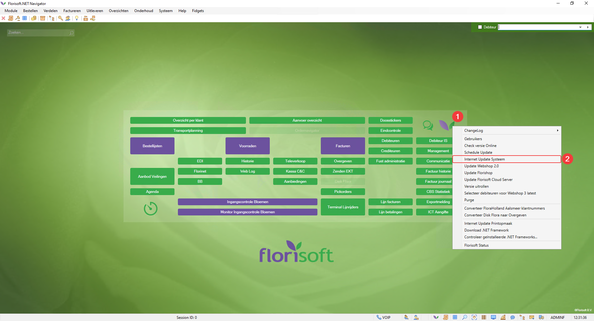

4. Beantworten Sie die folgende Frage mit `Yes`.  
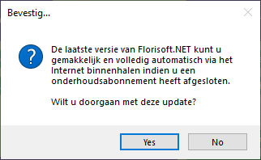

5. Wählen Sie, ob Sie die `Stable` oder `Latest` Version herunterladen möchten. Lesen Sie die Erläuterungen zu beiden Optionen, um zu entscheiden, welche Version Sie benötigen. Wenn Sie unsicher sind, kontaktieren Sie Florisoft während der Geschäftszeiten.  
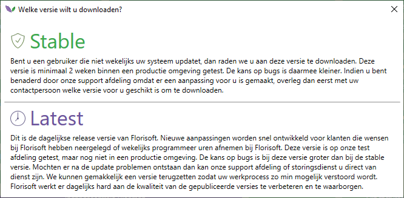

6. Im Florisoft Navigator erscheint ein Bildschirm, der anzeigt, welche Dateien heruntergeladen werden. Abhängig von Ihrer Internetgeschwindigkeit kann dies einige Zeit dauern.  
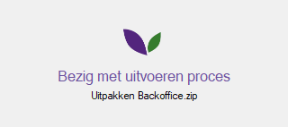

7. Sobald der Download abgeschlossen ist, erhalten Sie eine Benachrichtigung, dass Florisoft neu gestartet werden muss und dass Sie eine Bereinigung durchführen müssen.  

8. Starten Sie Florisoft neu und führen Sie die Bereinigung durch.  

### 3. Wie führe ich eine Purge durch?

1. Nach dem Neustart von Florisoft erscheint automatisch der folgende Bildschirm. Klicken Sie auf `Start Purge`.  
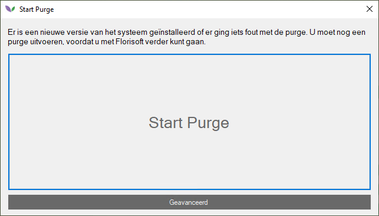

2. Wenn seit dem letzten Mal, als eine Purge durchgeführt wurde, mehr als einen Monat vergangen ist, werden Sie gefragt, ob Sie Dateien aufräumen möchten. Beantworten Sie diese Frage, indem Sie auf `Yes` klicken.  
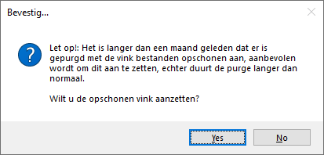

3. Jetzt sehen Sie den folgenden Bildschirm:  
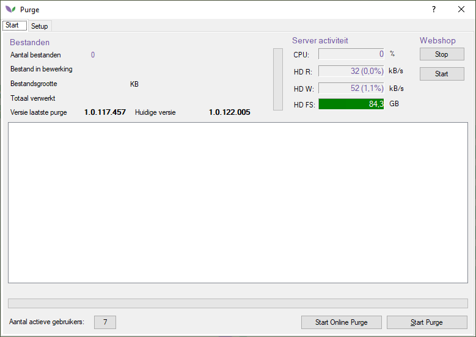

> Bei dieser Art von Purge ist es nicht erforderlich, dass die Systembenutzer abgemeldet werden und der Webshop gestoppt wird. Dadurch ist es möglich, die Version zu aktualisieren, ohne dass die anderen Systembenutzer beeinträchtigt werden und die Erreichbarkeit des Webshops leidet.  
Sie können den Webshop und CloudServer zu einem späteren Zeitpunkt aktualisieren. Wir empfehlen, dies am selben Tag zu tun, zu einer geeigneten Zeit.  
Wie Sie den Webshop und CloudServer aktualisieren können, wird später in diesem Dokument erklärt.

4. Wählen Sie `Start Online Purge`. Wenn die Online-Purge erfolgreich war, erhalten Sie folgende Meldung:  
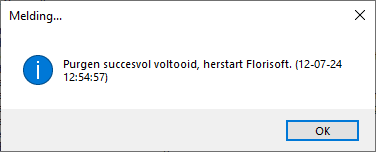

### 4. War das Update erfolgreich?
Um zu überprüfen, ob das Update erfolgreich war, klicken Sie jetzt mit der linken Maustaste auf das `Florisoft Leaves-Symbol` im Navigator. Sie sehen ein Datum auf dem Bildschirm. Abhängig von der Uhrzeit des Updates ist dies ein aktuelles Datum.

Montags bis donnerstags wird jeden Morgen um 08:00 Uhr (Niederländische Zeit) eine neue Version von Florisoft online gestellt. Wenn Sie montags bis donnerstags aktualisieren, sehen Sie heute das aktuelle Datum auf diesem Bildschirm. Wenn Sie freitags aktualisieren, sehen Sie auf diesem Bildschirm das Datum vom Vortag.

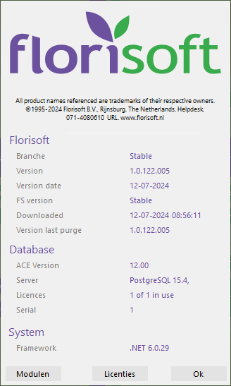

### 5. Version ausrollen

Wenn die neueste Version von Florisoft erfolgreich getestet wurde, indem Sie Florisoft über die `Florisoft Update-Verknüpfung` starten und alles zufriedenstellend ist, können Sie die Version auf die anderen Benutzer ausrollen.

1. Beim Starten des `Florisoft Update-Clients` erhalten Sie folgende Meldung:  
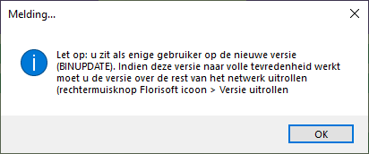

2. Wenn alles zufriedenstellend ist, können Sie die Version ausrollen, indem Sie mit der rechten Maustaste auf das `Florisoft Leaves-Symbol` im Navigator klicken und die Option `Version ausrollen` wählen:  
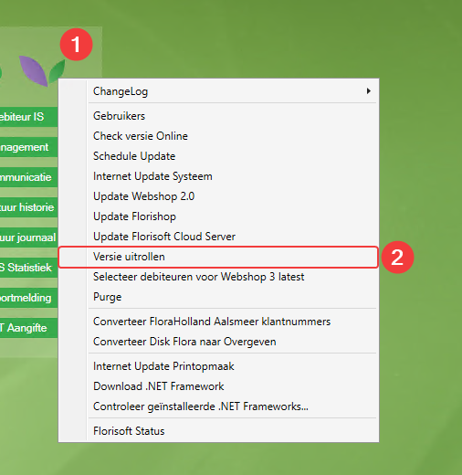

3. Sie sehen jetzt den folgenden Bildschirm:  
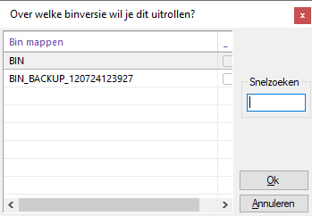

4. Wählen Sie mit der linken Maustaste die Zeile mit dem Namen `BIN` aus und klicken Sie auf `OK`. Sie sehen jetzt einen grünen Balken laufen.  

5. Sobald dies abgeschlossen ist, sehen Sie den folgenden Bildschirm und klicken Sie auf `OK`:  
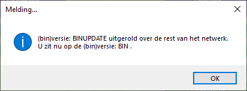

Damit ist die Version ausgerollt.

### 6. Webshop aktualisieren

Wenn es möglich ist, dass der Webshop kurzzeitig nicht erreichbar ist, können Sie den Webshop wie folgt aktualisieren.

1. Starten Sie die `Florisoft Update-Verknüpfung`.

2. Klicken Sie mit der rechten Maustaste auf das `Florisoft Leaves-Symbol` im Navigator und wählen Sie `Update Florishop`:  
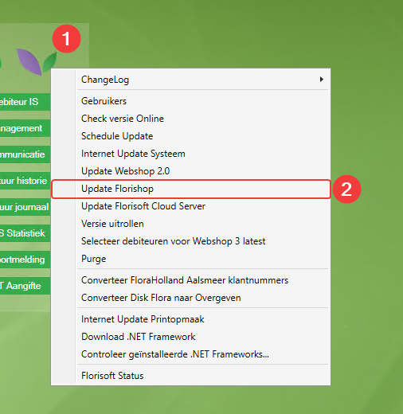

3. Jetzt sehen Sie den folgenden Bildschirm:  
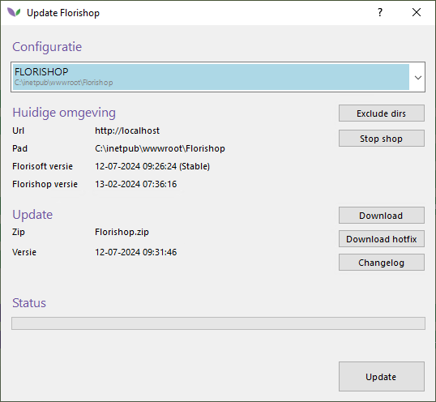

4. Klicken Sie auf `Update`, um die Aktualisierung zu starten.

5. Sobald die Aktualisierung des Webshops abgeschlossen ist, sehen Sie den folgenden Bildschirm. Überprüfen Sie jetzt, ob der Webshop wieder erreichbar ist.  
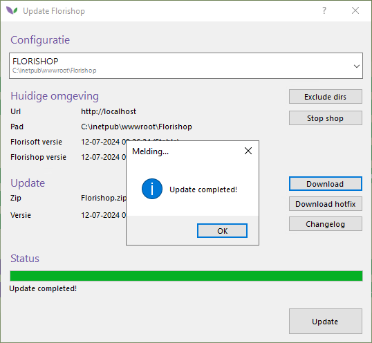

### 6. CloudServer aktualisieren

Wenn es möglich ist, dass der CloudServer kurzzeitig nicht erreichbar ist, können Sie den CloudServer wie folgt aktualisieren. Die Aktualisierung des CloudServers erfolgt auf die gleiche Weise wie die Aktualisierung des Webshops.

1. Starten Sie die `Florisoft Update-Verknüpfung`.
   
2. Klicken Sie mit der rechten Maustaste auf das `Florisoft Leaves-Symbol` im Navigator und wählen Sie `Update Florisoft Cloud Server`:  
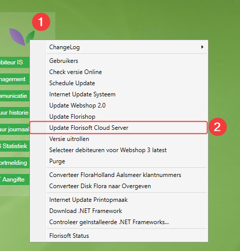

3. Jetzt sehen Sie den folgenden Bildschirm:  
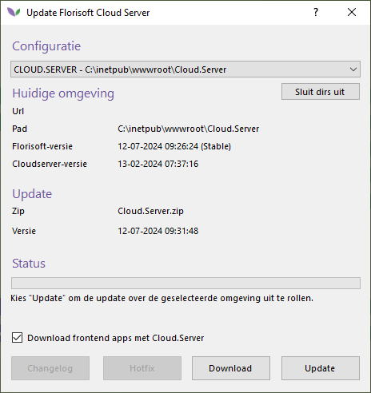

4. Klicken Sie auf `Update`, um die Aktualisierung zu starten.

5. Sobald die Aktualisierung des CloudServers abgeschlossen ist, sehen Sie den folgenden Bildschirm. Überprüfen Sie jetzt, ob der CloudServer wieder erreichbar ist.  
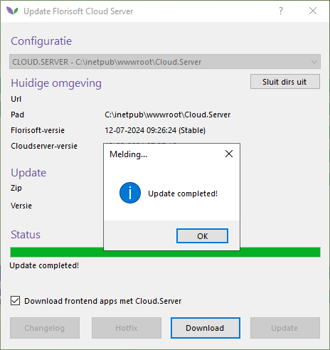

### 8. Apps ausrollen

Wenn Sie auch die Florisoft-Apps verwenden, können die Apps ebenfalls auf die neueste Version gebracht werden. Auf die gleiche Weise wie in Kapitel 5. Aber dann die Option: Roll out version Apps 
Bei einem Internet-Update (ab Schritt 2) werden auch die Apps heruntergeladen.
Nach dem Herunterladen können sie über die Option Roll out version Apps ausgerollt werden.
Wenn der Benutzer eine App auf dem Gerät neu startet, sieht er, dass die App aktualisiert wird und läuft dann mit der neuesten Version.   

## Abschluss

Damit ist der Updateprozess von Florisoft abgeschlossen. Bei Fragen oder Unterstützungsbedarf können Sie sich jederzeit an unseren Support wenden. Vielen Dank für die Nutzung von Florisoft!

