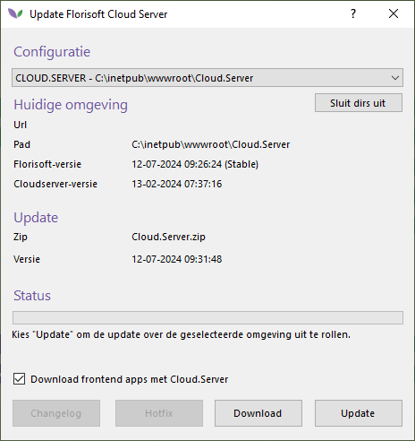

# Florisoft Update

### 1. Waarom moet ik een update doen?
Bij de aanschaf van een Florisoft .NET-licentie bent u verplicht de Florisoft .NET-modulen te onderhouden door de software up-to-date te houden via de door Florisoft aangeleverde updates. Hierdoor beschikt u altijd over de meest actuele versie van Florisoft .NET. 

Florisoft adviseert om minimaal eens per maand een software-update uit te voeren. Indien u ondersteuning nodig heeft voor een softwarelicentie ouder dan 3 maanden, dient u eerst een software-update uit te voeren.  

### 2. Hoe doe ik een update?
Volg deze stappen om de update te starten:

1. Start de `Florisoft Update-snelkoppeling`.  

> **Waarom updaten via een aparte Florisoft-snelkoppeling?** 
Op deze manier haal je de nieuwe Florisoft-versie alleen op een aparte Florisoft-client binnen. Het voordeel hiervan is dat je kunt testen met de nieuwe versie zonder dat de andere gebruikers al gelijk op de nieuwste versie inloggen. Mochten er problemen in de nieuwe versie zijn, kan iedereen doorwerken op de oude versie voordat de update wordt uitgerold naar alle gebruikers.
  
Als je nog geen `Florisoft Update-snelkoppeling` op je bureaublad hebt, neem dan via e-mail of telefonisch contact op met de supportafdeling zodat wij een afspraak kunnen maken om dit in te stellen.

2. Klik met je rechtermuisknop op het `Florisoft Leaves-icoon` in de Navigator.

3. Kies de optie `Internet Update Systeem`.  

4. Beantwoord de volgende vraag met `Yes`.  

5. Wij adviseren om bij het updaten te kiezen voor de `Stable` versie, tenzij u een update uitvoert voor een specifieke aanpassing binnen Florisoft die u heeft aangevraagd (of Florisoft deze aanpassing nodig acht). Kies in dat geval voor de latest versie. Bij twijfel kunt u tijdens kantooruren contact opnemen met ons.
  

6. In de Florisoft Navigator verschijnt een scherm waarin staat welke bestanden er worden gedownload. Afhankelijk van je internetsnelheid kan dit enige tijd duren.  

7. Als het downloaden van de bestanden is voltooid, krijg je een melding dat Florisoft opnieuw moet worden opgestart en dat je een purge moet uitvoeren.  

8. Start Florisoft opnieuw en voer de purge uit.  

### 3. Hoe moet ik purgen?

1. Na het herstarten van Florisoft verschijnt automatisch onderstaand scherm in beeld. Klik op `Start Purge`.  

2. Als het langer dan een maand geleden is dat er voor het laatst gepurged is, krijg je de vraag om bestanden op te schonen. Beantwoord deze vraag door op `Yes` te klikken.  

3. Nu krijg je onderstaand scherm:  

> Bij deze vorm van purgen is het niet noodzakelijk om de systeemgebruikers uit te loggen en de webshop te stoppen. Hierdoor is het mogelijk om de versie te updaten zonder hinder voor overige systeemgebruikers en de bereikbaarheid van de Webshop.  
Je kunt de webshop en CloudServer op een ander moment updaten. Wij raden aan om dit op dezelfde dag te doen op een geschikt tijdstip.  
Hoe je de webshop en CloudServer kunt updaten, wordt later in dit document uitgelegd.

4. Kies voor `Start Online Purge`. Wanneer de online purge is gelukt, krijg je de volgende melding:  

### 4. Is de update gelukt?
Om te controleren of de update is gelukt, klik je nu met de linkermuisknop op het `Florisoft Leaves-icoon` in de Navigator. Je ziet een datum in het scherm staan. Afhankelijk van het tijdstip van de update is dit een recente datum.

Op maandag t/m donderdag komt er elke ochtend om 08:00 uur (Nederlandse tijd) een nieuwe versie van Florisoft online. Update je op maandag t/m donderdag, dan zie je in dit scherm de datum van vandaag. Doe je de update op vrijdag, dan zie je in dit scherm de datum van de dag ervoor.

### 5. Versie uitrollen

Wanneer de nieuwste versie is getest door Florisoft op te starten via de `Florisoft Update-snelkoppeling` en alles is naar wens, kun je de versie uitrollen naar de andere gebruikers.

1. Wanneer je de `Florisoft Update-client` opstart, krijg je onderstaande melding:  

2. Wanneer alles naar wens is, kun je de update uitrollen door rechtermuisknop te klikken op het `Florisoft Leaves-icoon` in de Navigator en op de optie `Versie uitrollen` te klikken:  

3. Je krijgt nu het volgende scherm:  

4. Selecteer met de linkermuisknop de regel met de naam `BIN` en klik op `OK`. Je ziet nu een groene balk lopen.  

5. Wanneer dit klaar is, krijg je onderstaand scherm en klik op `OK`:  

Nu is de versie uitgerold.

### 6. Webshop updaten

Wanneer het uitkomt dat de webshop even niet bereikbaar is, kun je als volgt de webshop updaten.

1. Start de `Florisoft Update-snelkoppeling`.

2. Klik met de rechtermuisknop op het `Florisoft Leaves-icoon` in de Navigator en kies voor `Update Florishop`:  

3. Je krijgt nu onderstaand scherm te zien:  

4. Klik op `Update` om de update te starten.

5. Wanneer de update van de webshop klaar is, krijg je onderstaand scherm te zien. Controleer nu of de webshop weer benaderbaar is.  

### 7. CloudServer updaten

Wanneer het uitkomt dat de CloudServer even niet bereikbaar is, kun je als volgt de CloudServer updaten. Het updaten van de CloudServer gaat op dezelfde manier als het updaten van de webshop.

1. Start de `Florisoft Update-snelkoppeling`.
   
2. Klik met de rechtermuisknop op het `Florisoft Leaves-icoon` in de Navigator en kies voor `Update Florisoft Cloud Server`:  

3. Je krijgt nu onderstaand scherm te zien:  

4. Klik op `Update` om de update te starten.

5. Wanneer de update van de CloudServer klaar is, krijg je onderstaand scherm te zien. Controleer nu of de CloudServer weer benaderbaar is.  

## 8. Versie uitrollen Apps

Indien u ook gebruik maakt van de Florisoft Apps kunnen de apps ook uitgerold worden naar de latest versie.
Tijdens het uitvoeren van een internet update systeem (uit stap 2) worden de apps ook gedownload.
Na het downloaden kunnen deze uitgerold worden via de optie Versie uitrollen Apps.
Wanneer de gebruiker een app op het device opnieuw opstart, kunt men zien dat de app wordt geüpdatet en dan draait deze op de laatste versie.  

## Afronding

Met deze stappen is het updateproces van Florisoft voltooid. Neem bij vragen of hulpbehoeften gerust contact op met onze supportafdeling. Bedankt voor het gebruik van Florisoft!
