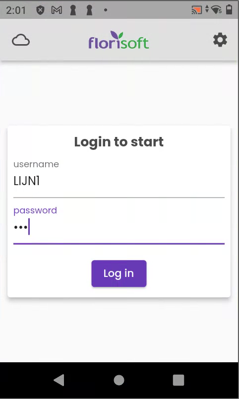
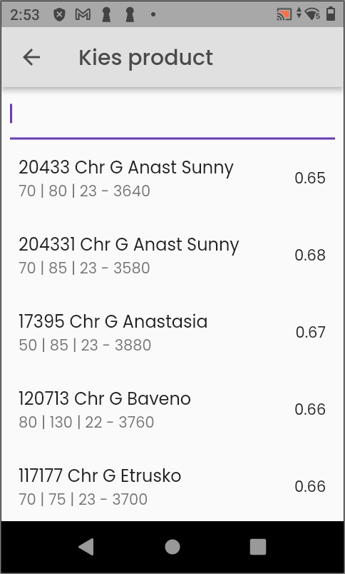
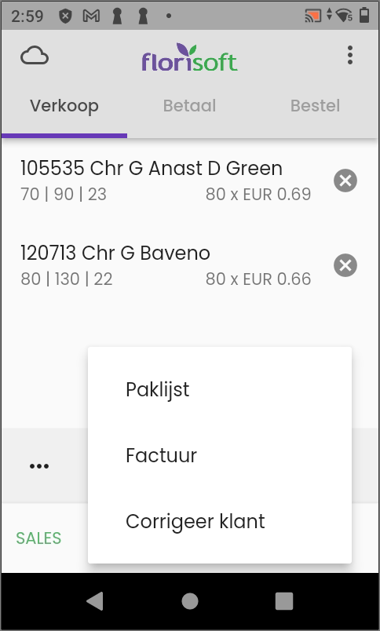
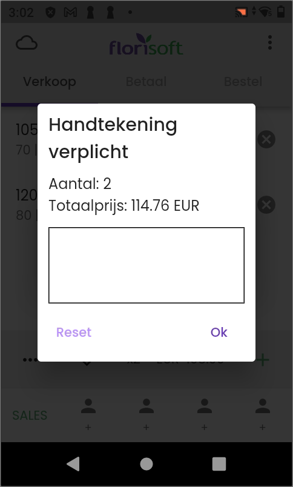

[Back to Index](https://github.com/florisoft/User.Manuals/blob/main/CLOUD%20APPLICATIONS/Apps%20Android/App%20Floriline%20Express/Start.md)  
# Florisoft Floriline App

Welcome to the manual for using the Floriline app on Android. This manual explains the standard procedure for the Floriline app, which will mainly be used by line drivers.

## Logging In

When you start the app, you will enter the login screen. Here, you log in using the system user that is set in the Floriline Management screen.

    
<b>Click here for your image</b>

    

 

If only one trip is configured, the PDA will immediately start synchronization and load all data onto the device.  
If multiple trips are configured, you will get a selection screen where you can choose which trip you want to select.

    
<b>Click here for your image</b>

    

   

## Sales

During sales, there are several functions you need to know.

|#|Explanation|
|:--|:--|
|**1**|At the bottom, you can have multiple customers open to sell to.|
|**2**|With this button, you can add items to the current customer.|
|**3**|This is the total amount of the items.|
|**4**|This is the total number of purchases.|
|**5**|When finished, you can use the checkmark to close. Here you can choose for Packing List, Invoice, or Correct Customer.|
|**6**|Here you can request the packing list / totals of the invoice without printing or finalizing the invoice.|

    
<b>Click here for your image</b>

     

   

When selecting items, a selection screen appears. Here you can search for the desired item.

The information you see for each item means the following:

**ARTNR - ITEM DESCRIPTION - PRICE**  
**CHARACTERISTICS (S1, S2, S3) - STOCK QUANTITY**

    
<b>Click here for your image</b>

     

   

After the sale is completed, you can choose to print a packing list, invoice, or perform a correction.

    
<b>Click here for your image</b>

     

  

When printing the invoice, you can add a surcharge to the invoice or charge transport costs. The surcharge is by default set to the discount costs from the Floriline Management screen.

    
<b>Click here for your image</b>

    

  

After this, a signature can optionally be added. Here, the customer can check the number of purchases and the total amount.

    
<b>Click here for your image</b>

    

  

After this, the invoice is displayed. Here, the invoice can be printed or sent by email. For the No-Paper option, click on the arrow at the top left.

    
<b>Click here for your image</b>

    

  

After creating the invoice, it must be synchronized. At the top left there is a cloud icon; the number shown indicates how many invoices still need to be synchronized.

If there is no connection, a line will be shown through the cloud. As soon as there is a connection again, the invoices will be synchronized.

    
<b>Click here for your image</b>

    

  

This process can be repeated for each trip.

[Back to Index](https://github.com/florisoft/User.Manuals/blob/main/CLOUD%20APPLICATIONS/Apps%20Android/App%20Floriline%20Express/Start.md)  
