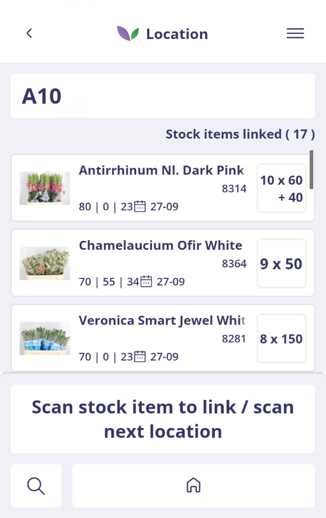
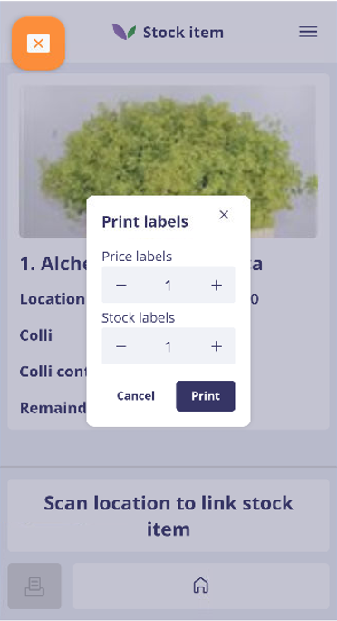

# Florisoft Inventory App – Slotting manual

## Introduction

This manual describes how to use the Slotting functionality in the Florisoft Inventory App.
The app workflow is configured based on the relevant policies.

With this functionality, you can efficiently and accurately assign stock items to a location.

> A detailed manual for configuring these policies is available here: [Policies Slotting EN](https://github.com/florisoft/User.Manuals/blob/main/CLOUD%20APPLICATIONS/Inventory%20App/Slotting/Policies%20Slotting%20EN%20.md)

**Requirements:**

* Florisoft Inventory App
* Backoffice Stock Module
* PDA Pickorder location module

---

## Slotting Procedure

### Step 1: Log in to the Inventory App

Open the Inventory App via the Florisoft Hub App or the Inventory App icon. Log in with your user credentials.

<b>Click here for example!</b>

### Step 2: Slotting

After logging in, you land on the navigation screen. Click the **Slotting** tile.

<b>Click here for example!</b>

### Step 3: Overview of scan workflows

When the Slotting screen opens, the scanning screen is shown by default. The workflow assumes users primarily work with a scanner, though a search function is also available.

This screen supports two workflows:

* Scan a location barcode
* Scan a parcel barcode

These workflows are detailed in the following steps.

<b>Click here for example!</b>

---

#### Step 4: Scan a location barcode

Use your scanner to scan a location barcode. Alternatively, swipe right on the screen to enter a barcode manually.

##### Step 4.a: Link parcels to this location

Scan the barcodes of the parcels you want to assign to this location. They will be grouped under this location.

##### Step 4.b: Scan the next location

Continue by scanning the next location.

<b>Click here for example!</b>

---

#### Step 5: Scan a parcel barcode

Scan a parcel barcode, then a location barcode to link them.
You can also use the search icon to look up a parcel. Results are matched on:

* Article name
* Parcel number
* VParcel number
* Scancode
* Scancode2

<b>Click here for example!</b>

<b>Click here for example!</b>

##### Step 5.a: Repeat for all parcels

Repeat this for all parcels that need to be assigned to a location.

---

### Step 6: Verify parcel locations in the Backoffice

In the backoffice, you can check both the current and historical locations of a parcel.

| Step  | Description                                                                                                                                                                  |
| ----- | ---------------------------------------------------------------------------------------------------------------------------------------------------------------------------- |
| **1** | Open the stock screen via the navigator.                                                                                                                                     |
| **2** | Right-click a parcel within the relevant stock.                                                                                                                              |
| **3** | Select **Parcel log** from the context menu.                                                                                                                                 |
| **4** | The log shows all changes made to the parcel.                                                                                                                                |
| **5** | Use the *Loc. from* and *Loc. to* columns to view location changes. *Not visible?* Right-click the column headers, enable **LOCATIEVAN** and **LOCATIENAAR**, then click OK. |

<b>Click here for example!</b>

---

## Optional steps:
### Print Labels

In this screen, you can print stock or price labels. The available layouts and printers are preconfigured.

Click the print template, enter the desired quantity, and click **Print**. You can choose between stock labels or price labels depending on the selected template.

<b>Click here for an example!</b>

## Version Control & Development Phase

> **Last updated:** August 27, 2025  
> **Current development phase:** Dev phase 1 completed

This manual is based on the current Inventory App and is periodically updated when new features are added or policies change.
