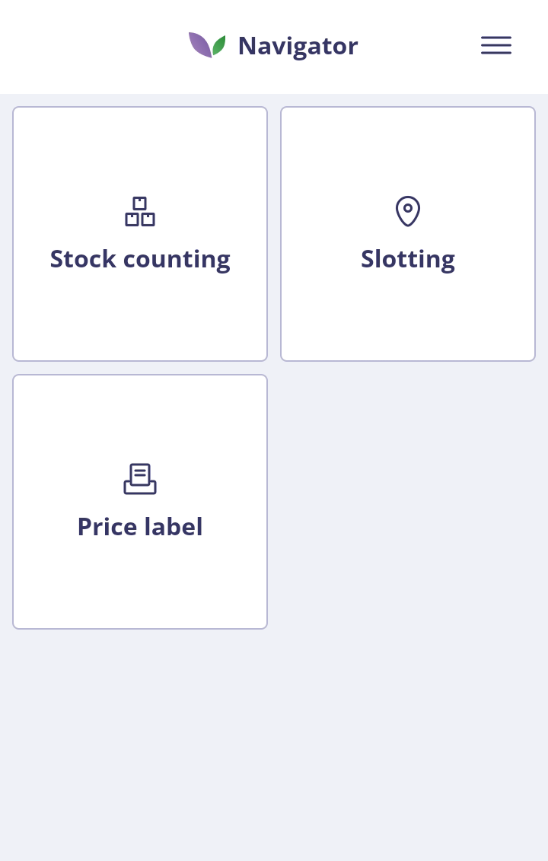
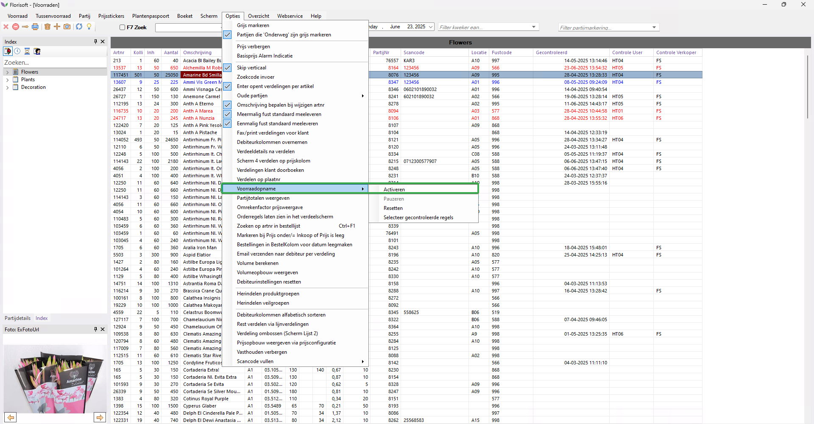
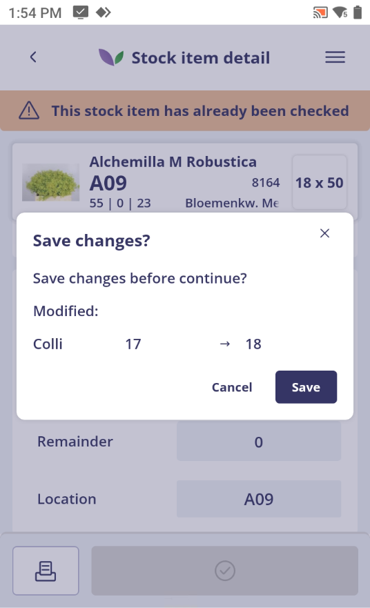
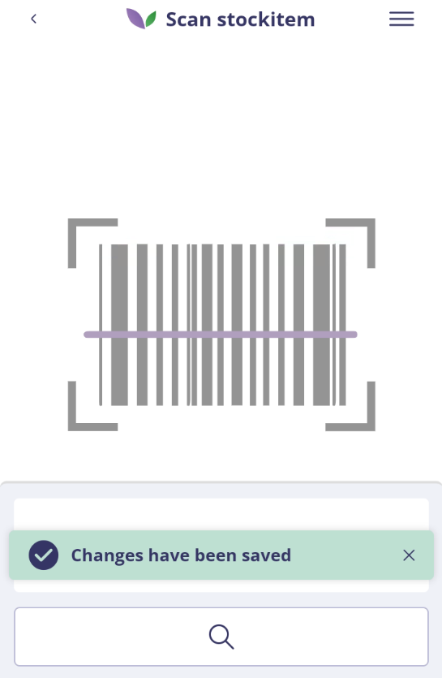
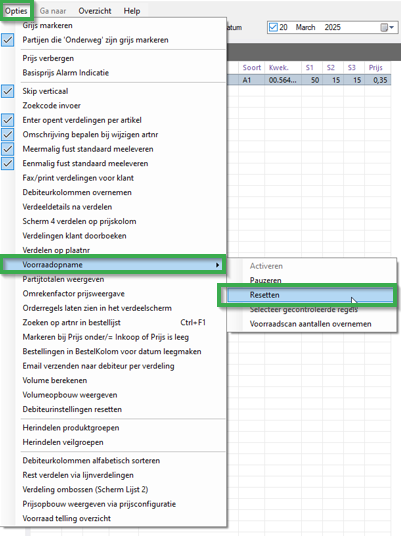

# Florisoft Inventory App - Stockcounting Manual

## Introduction

This manual describes the use of the stock counting functionality in the Florisoft Inventory App. The app's workflow is configured based on the applicable policies.

> ℹ️ The full policy configuration manual is available via the following link: [Policies stock counting EN](https://github.com/florisoft/User.Manuals/blob/main/CLOUD%20APPLICATIONS/Inventory%20App/Stock%20Counting/Policies%20Stock%20Counting%20EN.md)

**Requirements:**

- Florisoft Inventory App
- Backoffice Stock Module
- Module Stock Control

## Step-by-step stockcounting Process

### Step 1: Logging into the Inventory App

Open the Inventory App via the Florisoft Hub-App or the Inventory App icon. Log in using your user credentials. 

<b>Click here for an example!</b>

### Step 2: Navigate to Stock Inspection

After logging in, you land on the navigation screen. Click the stock counting tile.

<b>Click here for an example!</b>

### Step 3: Prepare Backoffice View

Open the stock screen in the backoffice to view which stock items have already been inspected.

<b>Click here for an example!</b>

Then activate the stock inspection view. Parcels inspected using the app will automatically be highlighted in green.

**Options → stock counting→ Activate**

<b>Click here for an example!</b>

### Step 4: Scan or Search for a Parcel

Open the stock counting functionality in the Inventory App. You can scan a parcel

<b>Click here for an example!</b>

or search by:

<b>Click here for an example!</b>

* Article name
* Parcel number
* Vparcel number
* Scancode
* Scancode2

Only parcels in configured stock locations will be shown.

### Step 5: Select a Parcel

Click **Select stock item** to open the parcel detail. If the parcel was selected via scanning, this screen will open automatically.

<b>Click here for an example!</b>

### Step 6: Review and Adjust Values

Adjust the stock values as needed in the stock item detail screen. If a parcel was previously inspected, an orange banner will appear at the top of the screen. If there are open pick orders for the parcel, this will also be indicated. Note that the displayed total includes quantities still to be picked.

<b>Click here for an example!</b>

### Print Labels

In this screen, you can print stock or price labels. The available layouts and printers are preconfigured.

Click the print template, enter the desired quantity, and click **Print**. You can choose between stock labels or price labels depending on the selected template.

<b>Click here for an example!</b>

### Step 7: Confirm Stock and Continue

Click the green button to save the updated stock. A confirmation will appear. You can then proceed to inspect the next parcel, either manually or by scanning directly. If a change was made and the user scans the next item immediately, a confirmation prompt with the change will be displayed. This prompt must be confirmed before continuing.

<b>Click here for an example!</b>

<b>Click here for an example!</b>

### Step 8: Review in the Backoffice

After inspection, the corresponding stock line will be highlighted in green and filled with the inspection date and time, the user who performed the inspection, and the associated seller.

Click a stock line to open the division screen and review the recorded divisions.

<b>Click here for an example!</b>

### Step 9: Repeat for all parcels

Repeat the above steps for all stock parcels.

### Step 10: Finalize Inspection

At the end of the inspection, it is clear whether all stock lines have been checked. Lines not marked as inspected must still be processed. Once all lines are properly inspected, the view can be reset to start fresh during the next inspection:

**Options → Stock Inspection → Reset**

<b>Click here for an example!</b>

---

This manual is based on the current Inventory App and may be updated periodically to reflect new functionality or changes in policies.
