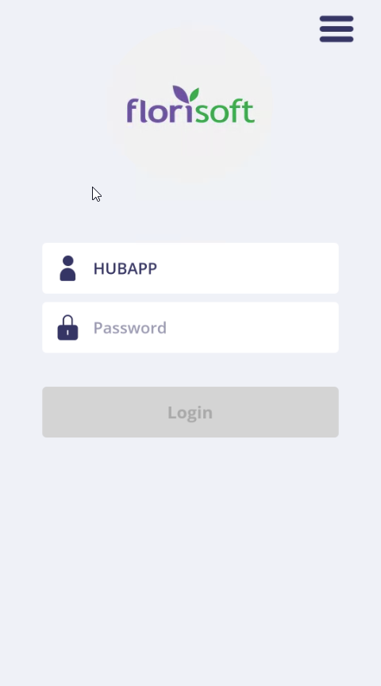
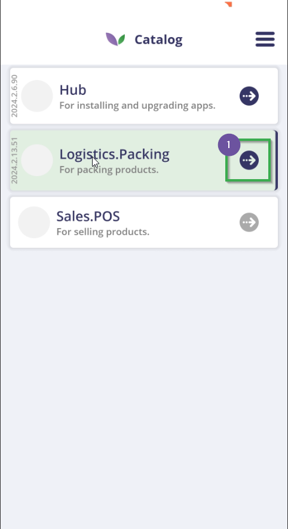
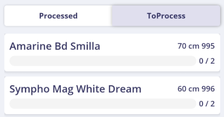

# Florisoft Manual Trolley Building App

In this manual you will learn about the setup required for the Trolley building app and the user process.

*This manuals requires a fully set up Hub-app on both your Florisoft back-office system and terminal. In case these are not fully set up yet read [this]() manual to complete the setup.*

## Hub-app

*Follow the steps below:*

|Step|Explanation|
|:-:|:--|
|**1**|Open your Hub-app and click on the **Go To Catalog** button.

<b>Click here for the example image!</b>

|
|**2**|In case you are not logged in yet a login page will be shown, log in.

<b>Click here for the example image!</b>

|
|**3.a**|You should now see the available apps for your system. Apps that are already installed have a purple emblem next to them. In this screen we are looking for the *Logistics.Packing* row, if this has a purple emblem next to it, click on it to open the app.

<b>Click here for the example image!</b>

|
|**3.b**|If the emblem is grayed out the app isn't installed yet. To install the app swipe the row to the left, a download and bin icons should now be shown. Click on the download icon.

<b>Click here for the example image!</b>

 |
|**4**|You have now started the installation process, you will be prompted multiple times to confirm the app's installation, confirm each one.|
|**5**|When having installed the app a purple emblem should now be shown next to it. Click on this emblem to start up the Trolley Building app.

<b>Click here for the example image!</b>

|

## Trolley building app

*After you have opened the Trolley building the general user process is as follows:*

|Step|Explanation|
|:-:|:--|
|**1**|Opening the app for the first time you will be prompted with the settings screen for the Trolley building app. Most of the time the fields should filled out correctly already but we reccommend checking the following fields: cloudserver url and if the version field is set to '*latest*'. If everything is set correctly click on the **save** button.  After saving you will be prompted with a dialog box asking you to restart the app click on *yes* to restart the app.

<b>Click here for the example image!</b>

|
|**2**|When the app is restarted a login screen should now be shown, login with your Trolley build up user. **This can not be the same user logged in to the hub-app**.

<b>Click here for the example image!</b>

|
|**3**|After logging in enter your seller's id.

<b>Click here for the example image!</b>

|
|**4**|An overview of all the open orders should now be shown on screen (#1), you can also filter this list based on date(#2) and debtor/customer name/id.

<b>Click here for the example image!</b>

|
|**5**|Tap one of the orders and click on the **new trolley** button (#1).

<b>Click here for the example image!</b>

|
|**6**|Now choose the type of trolley that is to be added, tap on the **Ok** button. If other trolley types are needed here, they can be added to the app by Florisoft.

<b>Click here for the example image!</b>

|
|**7**|Scan the Trolley ID or give it a name.|
|**8**|The trolley should now be shown in the order overview.

<b>Click here for the example image!</b>

|
|**9**|Open the trolly by clicking on it, a list of functions should now appear on screen:

<b>Click here for the example image!</b>

 **Transfer trolley**": transfering a trolley's content to another trolley **Manage extra elements**: e.g. adding extra shelves to a trolley **Change trolley**: switch to a different trolley **Repring trolley list:** print the trolley's packing list again. **Delete trolley**: delete the trolley from the order **Empty trolley**: remove the trolley's content **Correct product**: change the trolley's content **Cancel** cancel the trolley's changes.

<b>Click here for the example image!</b>

|
|**10**|Click ont he tab **ToProcess**(#2), here you should see an overview of the parcels in your order. You can also scan the product barcodes.

<b>Click here for the example image!</b>

|
|**11**|Click on the parcel that you want to assign to the trolley, this should prompt you with the parcel's infromation, these details can also be changed. When you are done click on the button **Put on trolley**.|
|**12**|Click on the button/label **Amount**, enter an amount and click on the **Ok** button.

<b>Click here for the example image!</b>

|
|**13**|A trolly overview should now be shown with your current progress, is the trolly complete then click on the button **Complete**.

<b>Click here for the example image!</b>

|
|**14**|Another overview will be displayed that provides details with which the trolley can be checked.

<b>Click here for the example image!</b>

|
|**15**|Reconfirm (for the last time) that the trolley is complete.

<b>Click here for the example image!</b>

|
|**16**|After this, several trolley's can be built, or the current built-up trolley can still be changed. When the order is fully built up, you will also see this in the order overview.

<b>Click here for the example image!</b>

|
|**17**|The order building process is now complete, the order can now also be found in the invoices screen in Florisoft.|
