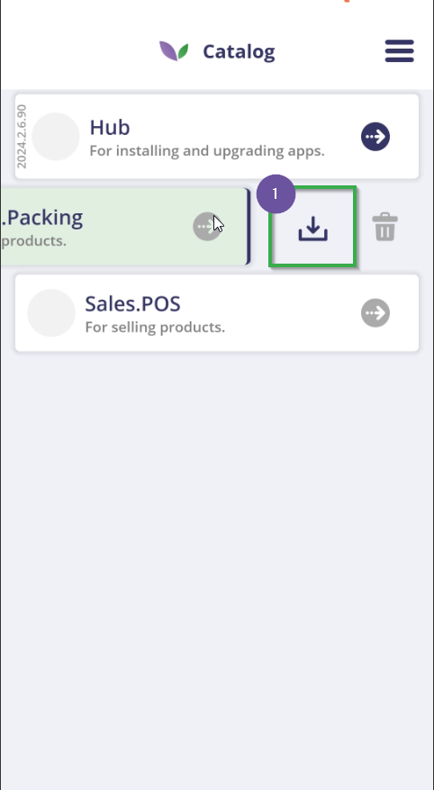
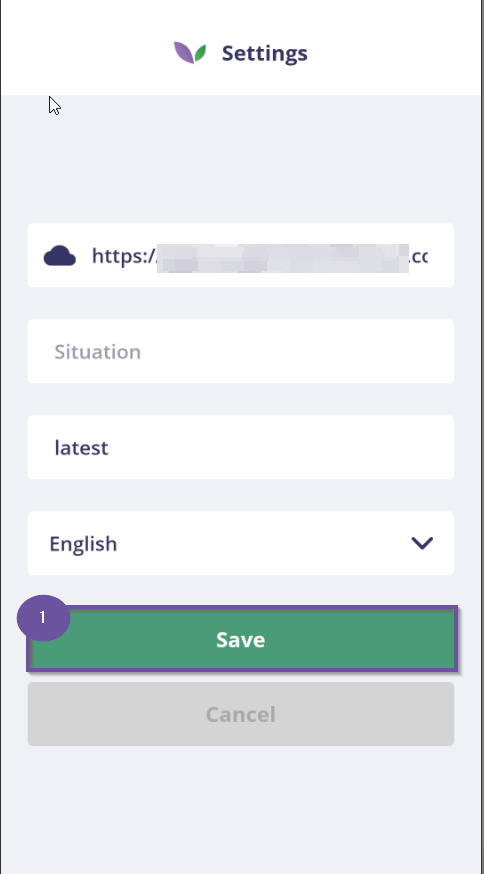
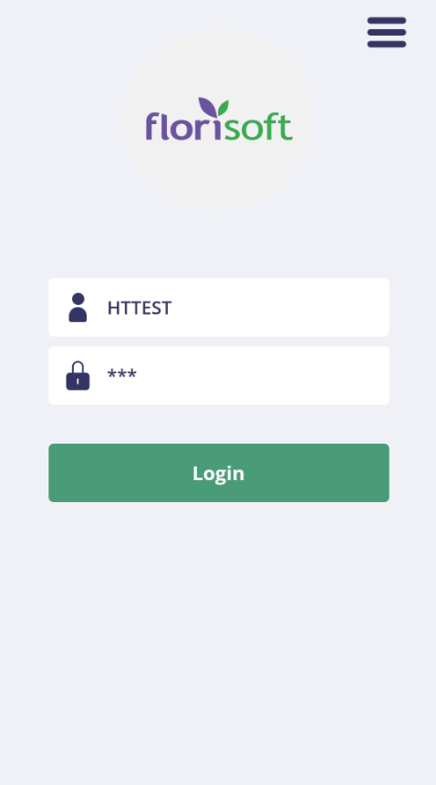
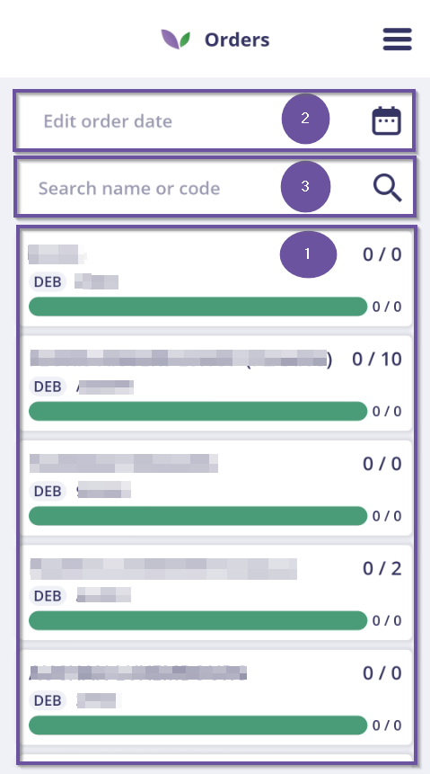
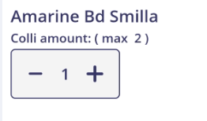
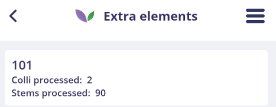
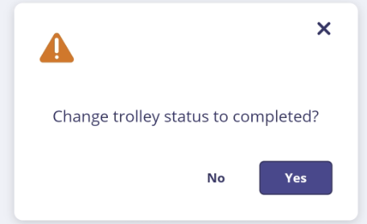

# Florisoft Handleiding Trolley Building App

In deze handleiding leert u over de werking van de Trolley building app en het benodigde instelwerk.

*Deze handleiding gaat er vanuit dat u een werkende Hub-app heeft draaien op zowel uw back-office systeem als handterminal, mocht u dat nog niet hebben leest u [hier](https://github.com/florisoft/User.Manuals/blob/main/CLOUD%20APPLICATIONS/Hub%20App/Installatie%20Hub-App.md) hoe u dit instelt.*

## Hub-app

*Volg de onderstaande stappen:*

|Stap|Uitleg|
|:-:|:--|
|**1**|Open uw Hub-app en klik op de knop **Go To Catalog**.

<b>Klik hier voor uw voorbeeld!</b>

|
|**2**|Mocht u nog niet ingelogd zijn krijgt u nu een loginpagina te zien, login.

<b>Klik hier voor uw voorbeeld!</b>

|
|**3.a**|Indien u de Trolley building app al geïnstalleerd heeft (in de app heet dit *Logistics.Packing*) staat er een paars ingekleurd symbool naast. Klik op dit paarse embleem om de Trolley building app te starten.

<b>Klik hier voor uw voorbeeld!</b>

|
|**3.b**|Heeft u de app nog niet geïnstalleerd sleept u de *Logistics.Packing* app naar links. Vervolgens ziet u een download en prullenbak icoon verschijnen, klik op het download icoon. 

<b>Klik hier voor uw voorbeeld!</b>

|
|**4**|Doorloop vervolgens de installatie stappen en bevestig meerdere malen dat u de app wilt installeren.|
|**5**|Wanneer de app geïnstalleerd heeft staat er een paars embleem naast, klik hier op om de Trolley building app te starten.

<b>Klik hier voor uw voorbeeld!</b>

|

## Trolley building app

*Nadat u de Trolley building app geopend heeft doorloopt u de volgende stappen:*

|Stap|Uitleg|
|:-:|:--|
|**1**|Bij het eerste keer openen van de app ziet u het settingsscherm van de Trolley building app, de version moet hier op "*latest*" staan check ook of de cloudserver_url correct is. Klik vervolgens op **save**.  U word nu gevraagd om de app opnieuw op te starten, klik hier op ja.

<b>Klik hier voor uw voorbeeld!</b>

|
|**2**|Bij het heropenen van de app krijgt u een loginscherm te zien, log hier in met uw Trolley build up gebruiker. **Dit is niet dezelfde gebruikers als die van de hub-app.**

<b>Klik hier voor uw voorbeeld!</b>

|
|**3**|Vervolgens vult u uw verkoperscode in.

<b>Klik hier voor uw voorbeeld!</b>

|
|**4**|Vervolgens krijgt u een scherm te zien met de openstaande orders (#1), daarnaast kan u ook filteren op de bijhorende datum(#2) en debiteurnaam/nummer(#3) van een order.

<b>Klik hier voor uw voorbeeld!</b>

|
|**5**|Klik nu op een van de orders en klik op **nieuwe kar** (of **New Trolley**)(#1)

<b>Klik hier voor uw voorbeeld!</b>

|
|**6**|Kies nu het type kar dat toegevoegd moet worden, en klik op **Ok**. Mochten hier andere karren bij moeten, kunnen deze erbij worden gezet.)

<b>Klik hier voor uw voorbeeld!</b>

|
|**7**|Scan vervolgens het kar ID of geef de kar een naam.|
|**8**|U ziet nu de kar in het overzicht verschijnen.

<b>Klik hier voor uw voorbeeld!</b>

|
|**9**|Klik vervolgens op de kar, u ziet nu een aantal opties verschijnen. Klik op het zojuist verschenen potlood embleem (#1). U krijgt nu een aantal opties te zien:

<b>Klik hier voor uw voorbeeld!</b>

 **Transfer trolley:** het overzetten van een kar **Manage extra elements** **Change Trolley**: kar wijzigen **Reprint trolley list**: print karpaklijst opnieuw **Delete trolley**: kar verwijderen **Empty trolley**: kar legen **Correct products**: inhoud van kar wijzigen **Cancel**: het wijzigen van de kar annuleren.

<b>Klik hier voor uw voorbeeld!</b>

|
|**10**|Klik vervolgens op het tabje **ToProcess**(#2), hier ziet u een overzicht van de partijen op de order. U kan hier ook de barcodes van producten scannen.

<b>Klik hier voor uw voorbeeld!</b>

|
|**11**|Klik op de partij die je wilt toewijzen, je krijgt hier ook informatie over de partij te zien ook kan hier dingen wijzigen.  Wanneer u klaar bent klikt u op **Put on trolley**.|
|**12**|Klik vervolgens op **Aantal** en geef vervolgens een aantal aan en klik op **ok**.

<b>Klik hier voor uw voorbeeld!</b>

|
|**13**|U ziet vervolgens inhet karoverzicht dat er voortgang is geboekt, is de kar klaar? Klik dan op **Complete**.

<b>Klik hier voor uw voorbeeld!</b>

|
|**14**|U krijgt nu een overzicht in te zien waarmee u de kar kan controleren. Klik vervolgens op **Ok**.

<b>Klik hier voor uw voorbeeld!</b>

|
|**15**|Bevestig vervolgens nogmaals (voor de laatste keer) dat de kar compleet is.

<b>Klik hier voor uw voorbeeld!</b>

|
|**16**|Hierna kunnen meerdere karren worden opgebouwd, of de huidige opgebouwde kar kan nog gewijzigd worden. Als de order volledig opgebouwd is, zie je dat ook in het overzicht van de orders.

<b>Klik hier voor uw voorbeeld!</b>

|
|**17**|Vervolgens is de order opgebouwd, welk vervolgens ook in de facturen bak terug kan worden gevonden.|

## Situatie 

Policy situaties zijn vooral relevant voor de Florisoft apps. 
Dit stelt u in bij de app instellingen in de app zelf

<b>Klik hier voor uw voorbeeld!</b>

Of via het hamburgermenu, waarbij u een situatie kan inscannen aan de hand van een QR-code.

<b>Klik hier voor uw voorbeeld!</b>

