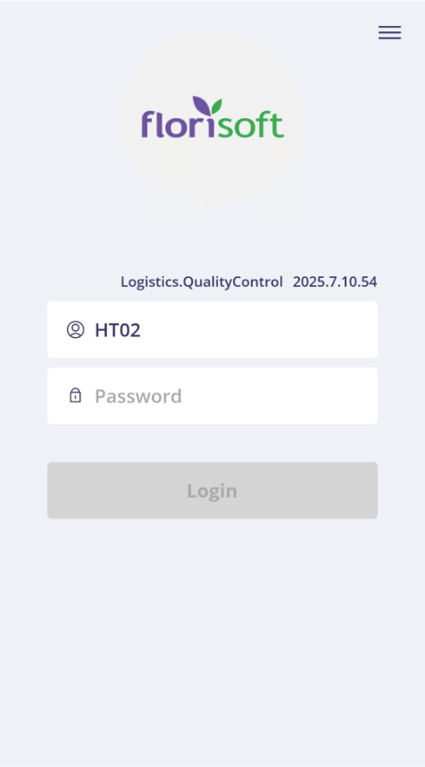
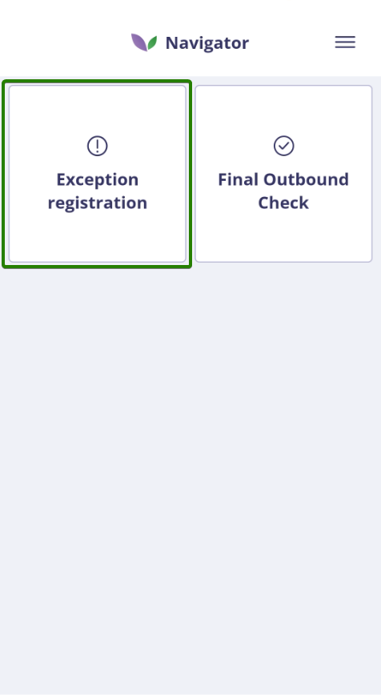
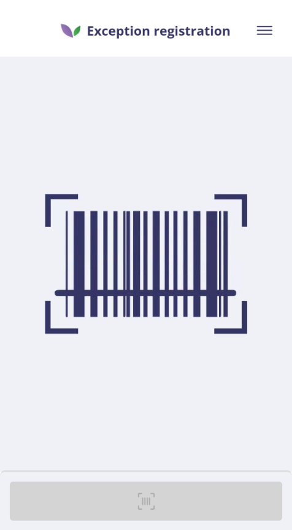
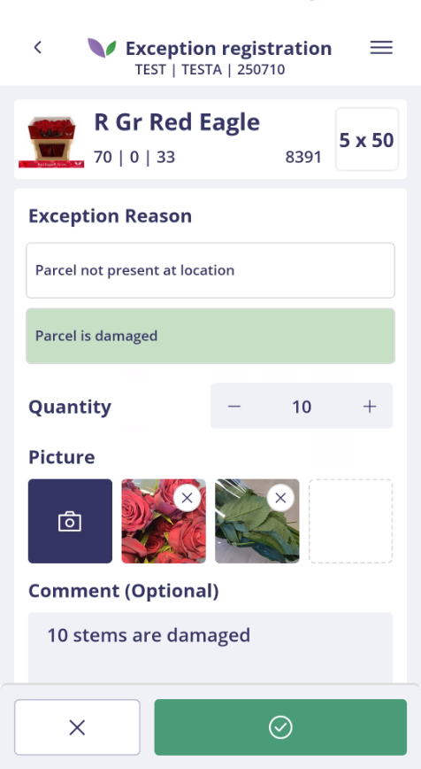
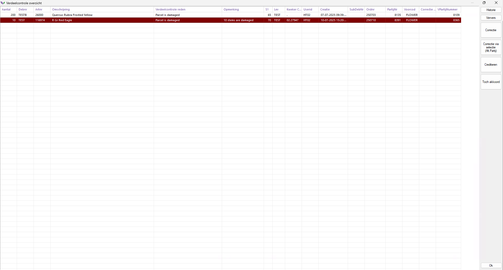

# Florisoft Quality Control App – Exception Registration Handleiding

## Inleiding

Deze handleiding beschrijft het gebruik van de Exception Registration-functionaliteit in de Florisoft Quality Control App.
De workflow van de app is geconfigureerd op basis van de relevante policies.

Met deze module kunnen gebruikers snel en nauwkeurig afwijkingen registreren tijdens operationele processen zoals orderpicking of eindcontrole.

> ℹ️ De uitgebreide handleiding voor het instellen van deze policies is beschikbaar via de volgende link: [Policies Exception Registration NL](https://github.com/florisoft/User.Manuals/blob/main/CLOUD%20APPLICATIONS/Apps%20Android/App%20Quality%20Control/Exception%20Registration/Policies%20Exception%20Registration%20NL.md)

**Benodigdheden:**

* Florisoft Quality Control App
* Licentie voor Exception Registration
* Backoffice Verdeelcontrole

---

## Stappenplan Exception Registration

### Wanneer registreer je een exception?

Bij schade, een verkeerd geleverd artikel of een andere afwijking registreert u een exception, zodat de administratie en vervolgprocessen dit correct kunnen afhandelen.

> ℹ️ Let op: wanneer Exception Registration automatisch wordt gestart vanuit een andere Florisoft-app (zoals Picking of Final Outbound Check), worden stap 1 t/m 3 overgeslagen. U komt dan direct terecht in het scan- of registratiescherm.

### Stap 1: Inloggen in de Quality Control App

Open de Quality Control app vanuit de Florisoft Hub-App of via het Quality Control-App-icoon. Log in met uw gebruikersgegevens. 

<b>Klik hier voor een voorbeeld!</b>

### Stap 2: Kies Exception Registration

Na het inloggen komt u in het navigatiescherm. Tik op de tegel **Exception Registration**.

<b>Klik hier voor een voorbeeld!</b>

### Stap 3: Start met scannen

Het scanscherm opent direct. U kunt een van de ondersteunde barcodes scannen (op basis van uw policyconfiguratie).
Ondersteunde barcodes kunnen zijn:

* Orderbarcode
* Karbarcode
* Cvar15

<b>Klik hier voor een voorbeeld!</b>

---

### Stap 4: Registreer een exceptie

Na het scannen van een geldige barcode verschijnt het registratieformulier. U doorloopt de volgende stappen:

1. **Kies de reden**
   De beschikbare redenen worden opgehaald.

2. **Vul het aantal in**
   Standaard wordt het resterende te verwerken aantal voorgesteld.
   Het aantal moet groter dan nul zijn en mag niet hoger zijn dan het resterende aantal.

3. **Voeg eventueel een foto en opmerking toe**

   Sommige redenen vereisen een foto. In dat geval ziet u "Picture" bij de fotoknop; anders "Picture (Optional)".

4. **Bevestig de registratie**
   Tik op het vinkje om te bevestigen. Bij succes verschijnt de melding **"Exception submitted"**.
   Het resterende te verwerken aantal wordt direct aangepast.

<b>Klik hier voor een voorbeeld!</b>

> ℹ️ Alle geregistreerde excepties worden ook automatisch vastgelegd in de partijlog, inclusief details zoals reden en gebruiker.

---

### Stap 5: Inzicht in de backoffice
- Ga naar: **Verdeelcontrole**
    
    > ℹ️ Indien **Verdeelcontrole** niet zichtbaar is in het navigatiemenu, kan deze worden toegevoegd via de ontwerpmodus (F12).
    
- U krijgt een overzicht van alle geregistreerde excepties, inclusief debiteur, artikelnummer, omschrijving, reden en aanvullende opmerkingen.

    > ℹ️ Als u na het registreren van een exceptie géén regels ziet in de verdeelcontrole, controleer dan de gebruikersinstelling (Inifiles) FS_KASSA - Kassa_Id. Wanneer deze leeg is, worden er geen regels weergegeven.
    
- Toegevoegde foto's zijn zichtbaar via de rechtermuisknop of door het indrukken van **F5**. Via het contextmenu kunnen meerdere foto's worden ingezien als er meer dan één gekoppeld is.
    
#### Beschrijving knoppen (rechterzijde van het scherm)
 > ℹ️ De zichtbaarheid van knoppen in het verdeelcontrole-scherm wordt beheerd via de policy **SidebarButtonVisibility**. 
- **Historie**: opent de historie van de geregistreerde excepties.
- **Ververs**: haalt de meest recente gegevens op uit de database. Gebruik dit om het overzicht te actualiseren.
- **Correctie**: voert automatisch een correctie uit. 
- **Correctie via selectie (Alt. Partij)**: voert automatisch een correctie uit met behulp van een alternatieve partij die u selecteert.
- **Crediteren**: markeert de geselecteerde exceptie als credit op de betreffende factuur.
- **Toch akkoord**: gebruikt u wanneer de exceptie onterecht is geregistreerd of alsnog wordt goedgekeurd. De partij wordt dan vrijgegeven voor verdere verwerking.

<b>Klik hier voor een voorbeeld!</b>

---

## Mogelijke meldingen

* **The order can't be found. Please try again or use the manual input** – de opgegeven barcode komt niet voor.
* **Invalid amount, amount can't be higher then: ...** – het ingevoerde aantal is te hoog.
* **Invalid amount, amount can't be negative** – het ingevoerde aantal is negatief.
* **This page is unavailable until exception reasons have been registered.** – er zijn nog geen exception redenen ingesteld.

---

Deze handleiding is gebaseerd op de actuele versie van de Quality Control App en kan periodiek worden bijgewerkt met nieuwe functionaliteit of aangepaste policies.
