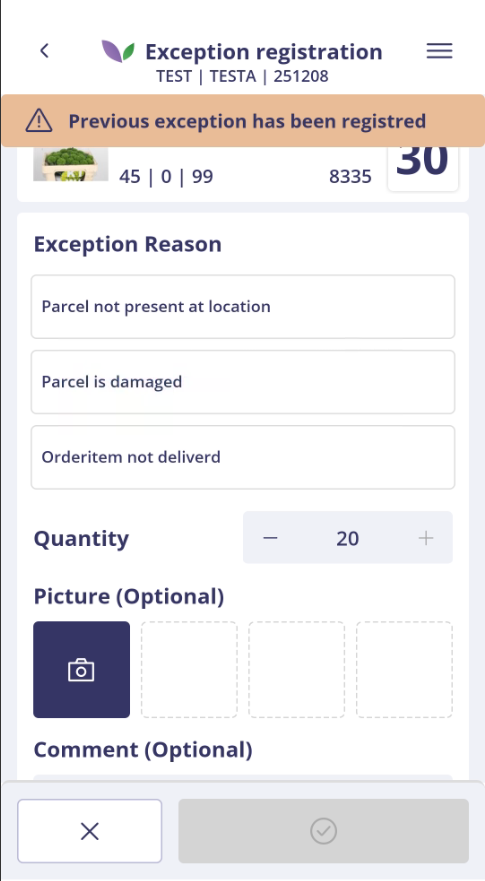

# Florisoft Quality Control App – Exception Registration Guide

## Introduction

This guide describes how to use the Exception Registration feature in the Florisoft Quality Control App.  
The app workflow is configured based on the relevant policies.

This module allows users to quickly and accurately register deviations during operational processes such as order picking or final check.

> ℹ️ A full guide on configuring these policies is available at: [Policies Exception Registration EN](https://github.com/florisoft/User.Manuals/blob/main/CLOUD%20APPLICATIONS/Apps%20Android/App%20Quality%20Control/Exception%20Registration/Policies%20Exception%20Registration%20EN.md)

**Requirements:**

- Florisoft Quality Control App
- License for Exception Registration
- Backoffice module: Division Control

---

## Exception Registration Procedure

### When should you register an exception?

Register an exception in cases of damage, incorrect delivery, or any other deviation to ensure proper administrative handling and follow-up processes.

> ℹ️ Note: When Exception Registration is automatically triggered from another Florisoft app (such as Picking or Final Outbound Check), steps 1 through 3 are skipped. You are taken directly to the scan or registration screen.

### Step 1: Log in to the Quality Control App

Open the app from the Florisoft Hub App or via the standalone Quality Control app icon. Log in with your user credentials.

<b>Click here for an example!</b>

### Step 2: Select Exception Registration

After logging in, you will enter the navigation screen. Tap the **Exception Registration** tile.

<b>Click here for an example!</b>

### Step 3: Start Scanning

The scan screen opens immediately. You can scan one of the supported barcodes (based on your policy configuration).  
Supported barcodes may include:

- Order barcode  
- Trolley barcode  
- Cvar15

<b>Click here for an example!</b>

---

### Step 4: Register an exception

After scanning a valid barcode, the registration form will appear.  

<b>Click here for an example!</b>

If **an exception for this item or location has already been registered**, you will see a banner at the top:

#### 🔶 Banner: *“Previous exception has been registered”*  
This message indicates that an exception already exists.  
You can still register a new exception.

<b>Click here for an example!</b>

1. **Select the reason**  
   The available reasons are retrieved automatically.  
   Some reasons require a photo. In that case, the button shows “Picture”; otherwise, “Picture (Optional)”.

2. **Enter the quantity**  
   By default, the remaining quantity is suggested.  
   The value must be greater than zero and cannot exceed the remaining quantity.

3. **Optionally, add a photo and comment**

4. **Confirm the registration**  
   Tap the checkmark to confirm. If successful, the message **“Exception submitted”** will appear.  
   The remaining quantity is adjusted immediately.

   

<b>Click here for an example!</b>

> ℹ️ All registered exceptions are also automatically stored in the parcel log, including details such as reason and user.

---

### Step 5: Backoffice Overview

- Go to: **Division Control**

  > ℹ️ If **Division Control** is not visible in the navigation menu, it can be added via design mode (F12).

- You will see an overview of all registered exceptions, including debtor, article number, description, reason, and comments.

  > ℹ️ If you do not see any parcels in the divsion control after registering an exception, check the user setting (Inifiles) FS_KASSA - Kassa_Id. If this is empty, no parcels will be displayed.

- Attached photos are visible via right-click or by pressing **F5**. If multiple photos are attached, use the context menu to browse them.

#### Button overview (right side of screen)
> ℹ️ The visibility of buttons in the Division Control screen is managed via the **SidebarButtonVisibility** policy.

- **History** – Opens the change log of the selected exception.
- **Refresh** – Retrieves the latest data from the database.
- **Correction** – Triggers an automatic correction.
- **Correction via selection (Alt. Parcel)** – Performs a correction using an alternative parcel of your choice.
- **Credit** – Marks the exception to be credited on the related invoice.
- **Approve anyway** – Use when the exception was incorrect or ultimately accepted. The parcel is released for further processing.

 

<b>Click here for an example!</b>

---

## Possible Messages

- **The order can't be found. Please try again or use the manual input** – The entered barcode could not be found.
- **Invalid amount, amount can't be higher than: ...** – The entered quantity exceeds the allowed value.
- **Invalid amount, amount can't be negative** – The entered quantity is negative.
- **This page is unavailable until exception reasons have been registered.** – No exception reasons have been configured yet.

## Version Control & Development Phase

> **Last update:** July 10, 2025  
> **Current development phase:** Dev phase 1 (MVP) completed

This manual is based on the current Logistics App and will be periodically updated to reflect new functionality or changes in policies.