# Florisoft Logistics App - Final Outbound Check Handleiding

## Inleiding

Deze handleiding beschrijft het gebruik van de **Final Outbound Check**-app in de Florisoft Quality control App. De workflow van de app is afgestemd op de relevante policies.

> ℹ️ De uitgebreide handleiding voor het instellen van deze policies is beschikbaar via de volgende link: [Policies Final Outbound Check NL](https://github.com/florisoft/User.Manuals/blob/main/CLOUD%20APPLICATIONS/Apps%20Android/App%20Quality%20Control/Final%20outbound%20check/Policies%20Final%20outbound%20check%20-%20NL.md)

**Benodigdheden:**

* Florisoft Quality Control App
* Final Outboud Check licentie

## Stappenplan Final Outbound Check

### Stap 1: Inloggen in de Quality control App

Open de Quality control App vanuit de Florisoft Hub-App of via het Logistics App-icoon. Log in met uw gebruikersgegevens.

<b>Klik hier voor een voorbeeld!</b>
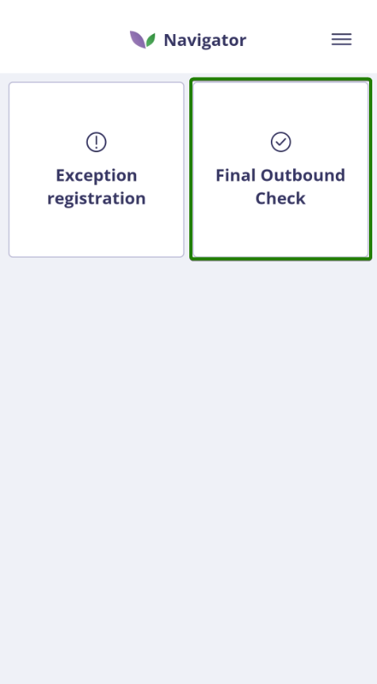

> ℹ️ Als de Quality control App nog niet is geïnstalleerd, download deze dan via de Florisoft Hub-App. Raadpleeg hiervoor de installatiehandleiding: [Hub-App Installatie NL](https://github.com/florisoft/User.Manuals/blob/main/CLOUD%20APPLICATIONS/App%20Hub/Hub-App%20Installatie%20NL.md)

### Stap 2: Order selecteren

Om te kunnen starten met het controleren van een order, moet eerst een openstaande klantorder geselecteerd worden. Dit kan op twee manieren:

* **Optie 1: Scannen van een barcode**

Scannen van de barcode van een orderregel, bijvoorbeeld een pickordersticker. Hiervoor moet de juiste barcode-instelling geactiveerd zijn via de policy `BarcodeDecodeOptions`.

<b>Klik hier voor een voorbeeld!</b>
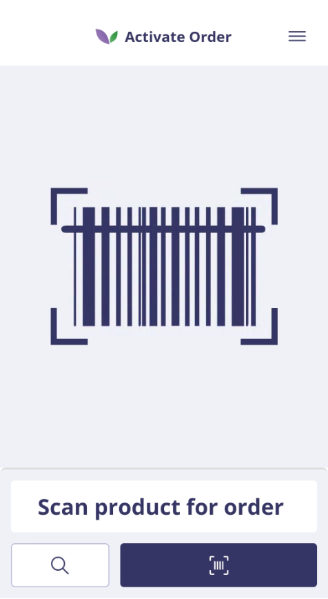

* **Optie 2: Order zoeken via zoekicoon**

Door het zoekicoon te gebruiken wordt een orderoverzicht getoond. Dit overzicht laat alle beschikbare klantorders zien. De weergave van dit overzicht kan naar eigen voorkeur ingesteld worden. De benodigde policies hiervoor zijn te vinden in de submap `Overview` van de FinalOutbound policies.

<b>Klik hier voor een voorbeeld!</b>
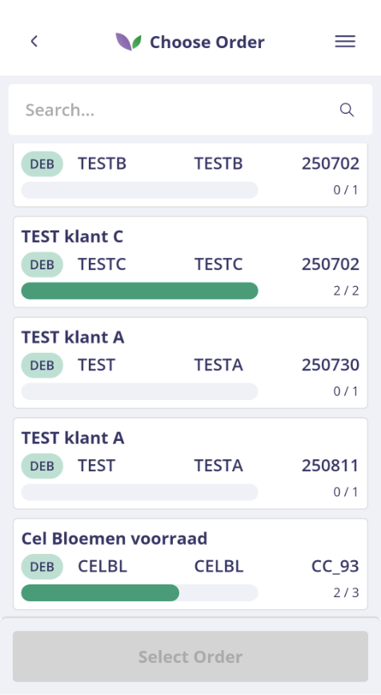

### Stap 3: Orderregels controleren

Na het selecteren van een klantorder wordt de pagina **To check** geopend. Deze pagina toont alle orderregels die nog gecontroleerd moeten worden. Elke orderregel kan worden gecontroleerd door de bijbehorende barcode te scannen. Tijdens het scannen valideert het systeem automatisch:

* of de barcode herkend wordt,
* of het artikel hoort bij de geselecteerde order,
* en of de regel al volledig is gecontroleerd.

<b>Klik hier voor een voorbeeld!</b>
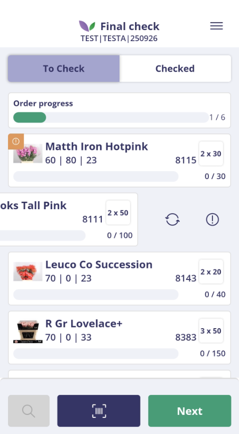

De manier waarop een controle wordt afgehandeld, is afhankelijk van de instelling van de policy `CountingStrategy`. Deze bepaalt of het gecontroleerde aantal wordt afgeleid uit:

* het aantal in de barcode,
* het aantal kolli,
* of het volledige bestelde aantal.

Als het scannen van een orderregel niet mogelijk is, kan de controle ook handmatig worden uitgevoerd. Deze handmatige controle wordt visueel weergegeven in het scherm en geregistreerd in het partijlog.

<b>Klik hier voor een voorbeeld!</b>
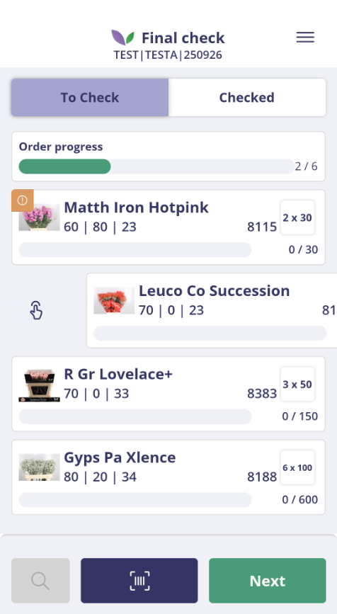

<b>Klik hier voor een voorbeeld!</b>
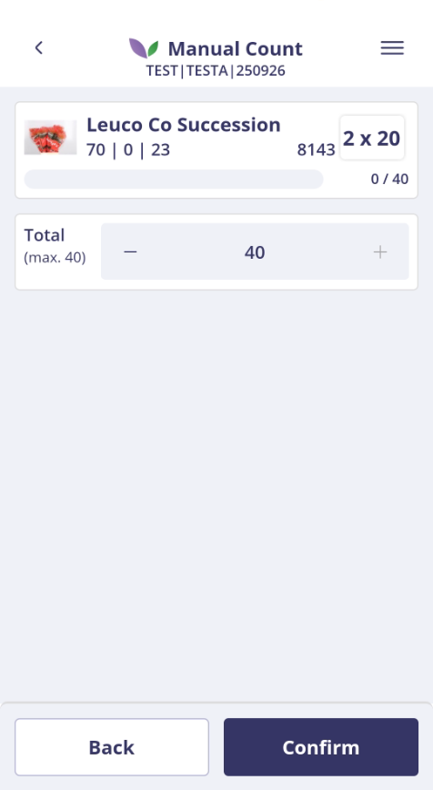

Indien er een probleem is met een orderregel, en de regel is als add-on ingesteld (zie betreffende policy), dan kan via exception registration een afwijking worden vastgelegd. Ook dit wordt visueel zichtbaar gemaakt voor de gebruiker.

<b>Klik hier voor een voorbeeld!</b>
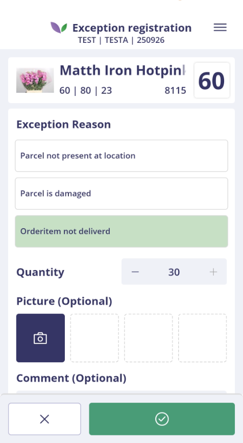

Tot slot is het ook mogelijk om een hele order in één keer goed te keuren. Deze functionaliteit is afhankelijk van de policy `AllowCompleteEntireTarget`.

<b>Klik hier voor een voorbeeld!</b>
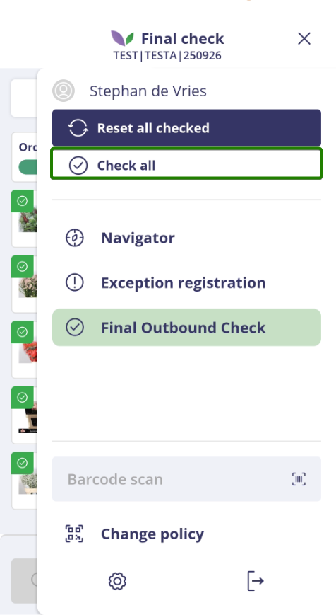

### Stap 4: Order afronden

Wanneer alle regels gecontroleerd zijn, krijgen de orders de status Checked.

<b>Klik hier voor een voorbeeld!</b>
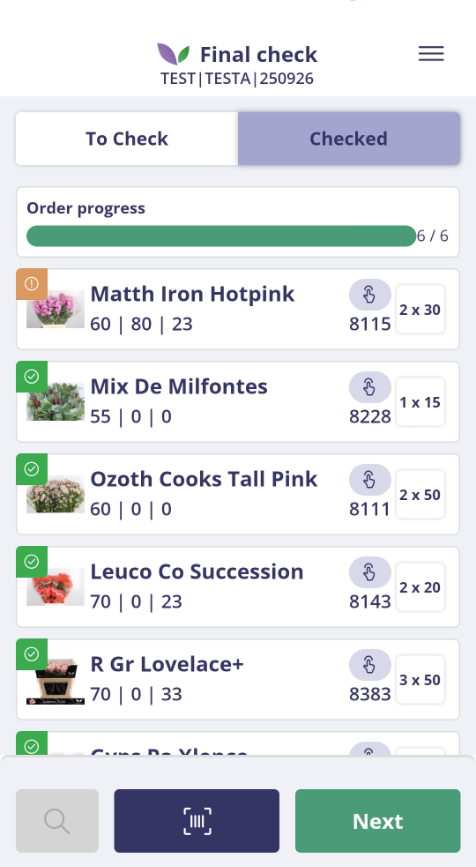

Daarbij worden ook diverse statussen bijgewerkt in backoffice - facturen, zoals het vinkje voor de eindcheck, de eindscan die door de verkoper wordt gezet en het eindcontroleaantal.

Daarnaast zijn er extra mogelijkheden:

* Een enkele orderregel kan opnieuw worden vrijgegeven voor controle via de policy `AllowResetOrderItem`.
* De gehele order kan opnieuw worden gestart via de policy `AllowResetEntireTarget`.

<b>Klik hier voor een voorbeeld!</b>
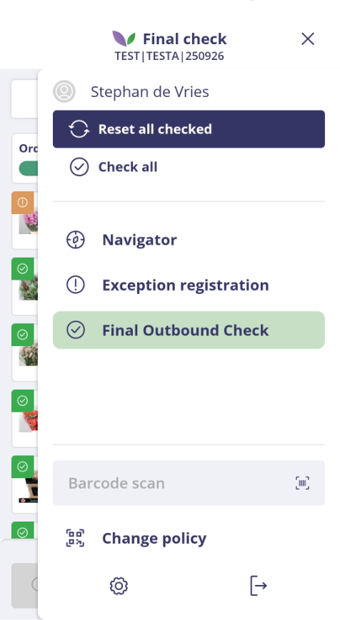

Door op Next te klikken kunnen eventuele vervolgstappen uitgevoerd worden, zoals het maken van foto’s.

<b>Klik hier voor een voorbeeld!</b>
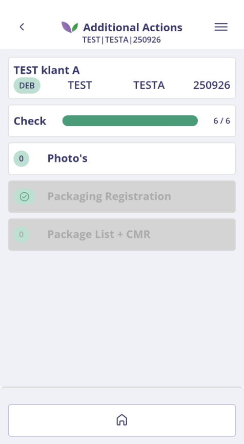

De policy `ShowWarningIfIncomplete` controleert of alle regels gecontroleerd zijn. Zo niet, dan verschijnt er een waarschuwing.

<b>Klik hier voor een voorbeeld!</b>
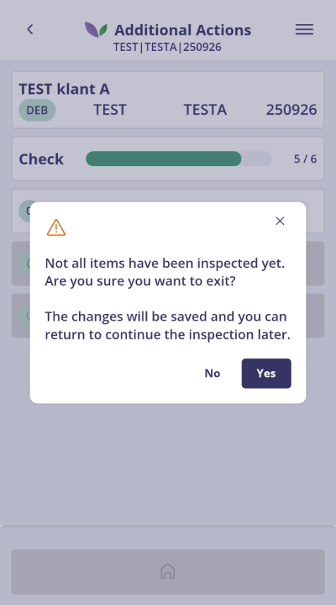

---

Deze handleiding is gebaseerd op de actuele Logistics App en wordt periodiek bijgewerkt bij nieuwe functionaliteit of gewijzigde policies.

