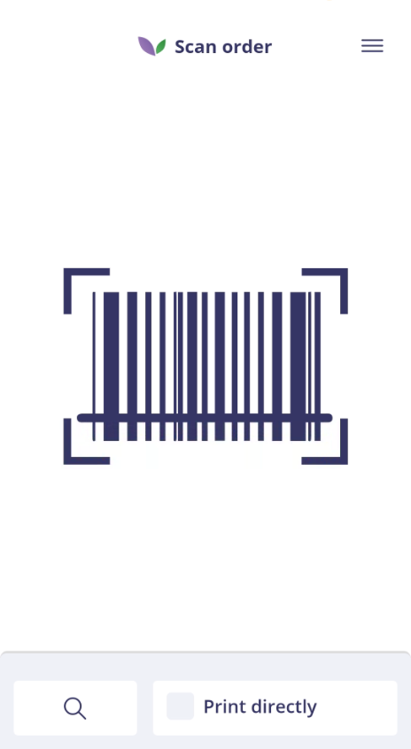
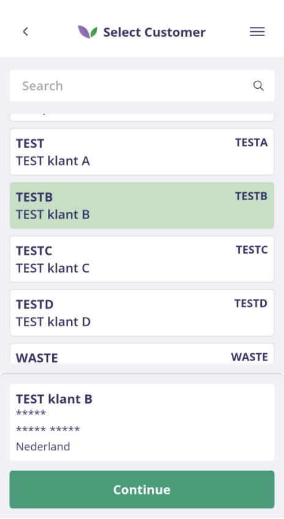
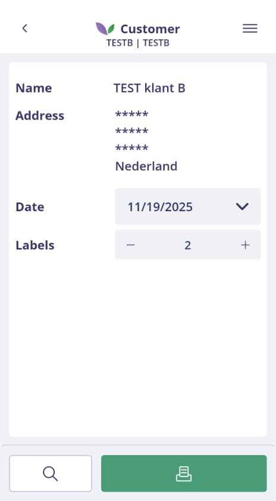
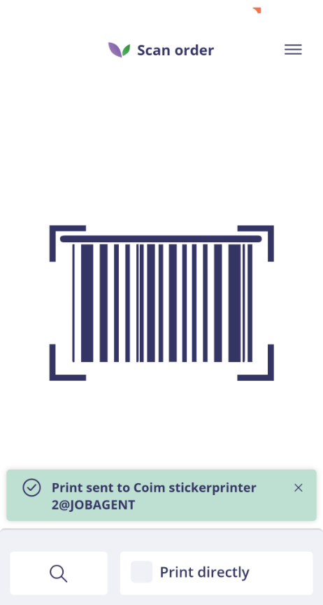

# Handleiding – Address Label

## Wat is Address Label?

Met Address Label in de Florisoft Shipping App drukt u adreslabels af voor klanten of hubs. Het label ondersteunt de identificatie van een zending tijdens het interne logistieke proces en bij de overdracht aan de transporteur.

U kunt Address Label rechtstreeks openen in de Shipping App. De afdrukfunctie kan ook als aanvullende actie beschikbaar zijn in andere Florisoft-apps. Welke printer, lay-out, standaardhoeveelheid en barcodes beschikbaar zijn, hangt af van de ingestelde policies.

Maakt of beheert u een adreslabel-layout? Bekijk dan het Engelstalige [overzicht van alle beschikbare printvariabelen](Address%20Label%20Print%20Variables%20-%20EN.md).

## Voorwaarden

Voor het gebruik van Address Label zijn minimaal nodig:

- de Florisoft Shipping App;
- toegang tot de usecase Address Label;
- een geldige Florisoft-gebruiker;
- de licentie voor Address Label;
- een actieve JobAgent;
- een ingestelde printer en rapportlay-out;
- een scanner wanneer u de scanworkflow gebruikt.

## Werkwijze

### Stap 1: Address Label openen

Open de Shipping App vanuit de Florisoft Hub App of via het Shipping App-icoon op uw apparaat. Log in met uw gebruikersgegevens en kies **Adreslabel printen**.

Het scanscherm wordt geopend.

### Stap 2: een klant zoeken of scannen

Scan een ondersteunde barcode. Welke barcodes worden herkend, wordt bepaald door de policy `BarcodeDecodeOptions`.

Wanneer scannen niet mogelijk is, opent u via de zoekfunctie onderaan het scherm het klantoverzicht.

<b>Klik hier voor een voorbeeld</b>

### Stap 3: de klant selecteren

Zoek de klant in de lijst of gebruik de zoekbalk bovenaan. Selecteer de klant en controleer de samenvatting onderaan het scherm. Kies daarna **Doorgaan**.

Na een geldige scan wordt deze handmatige selectiestap overgeslagen.

<b>Klik hier voor een voorbeeld</b>

### Stap 4: de labelgegevens controleren

Controleer in het printscherm de gegevens die op het label worden afgedrukt.

De app bepaalt het adres in deze volgorde:

1. Als bij de debiteur aflevergegevens zijn ingevuld, gebruikt de app de aflevernaam en het afleveradres.
2. Als geen afleveradres beschikbaar is, gebruikt de app de standaard naam- en adresgegevens van de klant.

Controleer daarnaast:

- de naam van de klant;
- het getoonde adres;
- de datum op het label;
- het aantal labels.

De datum kan met de datumkiezer worden gewijzigd. Pas het aantal labels aan met de plus- en minknop. Het aanvankelijke aantal wordt bepaald door `DefaultCopies`.

<b>Klik hier voor een voorbeeld</b>

### Stap 5: het label afdrukken

Kies de groene printknop wanneer alle gegevens correct zijn. Na een geslaagde printopdracht keert de app terug naar het scanscherm. Onderaan verschijnt een groene melding met de printer waarnaar de opdracht is verstuurd.

De app is daarna klaar voor de volgende klant.

<b>Klik hier voor een voorbeeld</b>

## Direct afdrukken

Wanneer **Direct printen** in het scanscherm actief is, drukt de app na een geldige scan direct één adreslabel af. Het controlescherm wordt dan overgeslagen.

Gebruik direct afdrukken alleen wanneer de klantgegevens en printerinstellingen vooraf zijn gecontroleerd. Schakel de optie uit als u voor iedere opdracht de datum, het adres of het aantal labels wilt controleren.

## Starten vanuit een andere Florisoft-app

Address Label kan vanuit een ondersteund logistiek proces worden geopend. De actieve klant of hub wordt dan automatisch aan de Shipping App doorgegeven en de zoek- en scanstappen worden overgeslagen.

De integratie is onder andere beschikbaar in:

- Order Picking;
- Final Outbound Check;
- TrolleyLoading;
- Returnables Outbound.

De actie is alleen zichtbaar wanneer de Address Label-licentie actief is en de betreffende app en policies de aanvullende actie toestaan. Meer informatie over app-integraties staat in het [overzicht van de Cloud Applications](https://github.com/florisoft/User.Manuals/blob/main/CLOUD%20APPLICATIONS/README.md).

## Policies instellen

Open in de Backoffice het constantenscherm via de navigator en ga naar **Systeem → Users → Policy Beheer**. Selecteer of maak een policy en navigeer naar **Apps → Logistics → Shipping → AddressLabels**.

Meer informatie over het aanmaken, koppelen en beheren van policies staat in de [handleiding Policy Management](https://github.com/florisoft/User.Manuals/blob/main/BASIS/Policy%20Management/Handleiding%20Policy%20Management%20NL.md).

> De beschikbaarheid van instellingen kan afhangen van de inrichting en versie van uw omgeving.

### PrinterSetting

De policygroep `PrinterSetting` bevat de instellingen voor het afdrukken van adreslabels.

| Instelling | Werking |
| --- | --- |
| `PrinterName` | Bepaalt naar welke printer het adreslabel wordt gestuurd. |
| `ReportName` | Bepaalt welke rapportlay-out of sjabloon voor het adreslabel wordt gebruikt. |
| `DefaultCopies` | Bepaalt hoeveel labels standaard in het printscherm zijn geselecteerd. |
| `Enabled` | Schakelt de printerinstellingen voor Address Label in of uit. |

Voor het afdrukken moet de JobAgent actief zijn. Als deze niet beschikbaar is, worden printers niet weergegeven of kan de printopdracht niet worden uitgevoerd. Raadpleeg voor installatie en configuratie de [handleiding JobAgent](https://github.com/florisoft/User.Manuals/blob/main/CLOUD%20APPLICATIONS/Apps%20Windows/Job-Agent/Handleiding%20Job-Agent%20-%20NL.md).

### BarcodeDecodeOptions

`BarcodeDecodeOptions` bepaalt welke barcodetypen de app in het scanscherm herkent. Selecteer alleen de decoders die in het logistieke proces worden gebruikt. Meerdere typen kunnen tegelijk worden ingeschakeld.

Een decoder vertelt de app hoe de informatie uit een barcode moet worden gelezen. Afhankelijk van de inrichting kunnen bijvoorbeeld een order-, kar- of andere logistieke barcode naar de bijbehorende klant leiden.

## Problemen oplossen

| Probleem | Controle |
| --- | --- |
| De tegel of aanvullende actie is niet zichtbaar. | Controleer de licentie, usecasetoegang en de policies van de app van waaruit Address Label wordt gestart. |
| Een barcode wordt niet herkend. | Controleer of het juiste type in `BarcodeDecodeOptions` is opgenomen en of de barcode naar een klant leidt. |
| De verkeerde adresgegevens worden getoond. | Controleer eerst de aflevergegevens en daarna de standaard adresgegevens van de debiteur. |
| De printer is niet beschikbaar. | Controleer `Enabled`, `PrinterName` en of de JobAgent actief en bereikbaar is. |
| Het verkeerde label of formaat wordt afgedrukt. | Controleer de ingestelde waarde bij `ReportName`. |
| Het standaard aantal labels klopt niet. | Controleer de waarde van `DefaultCopies`. |
