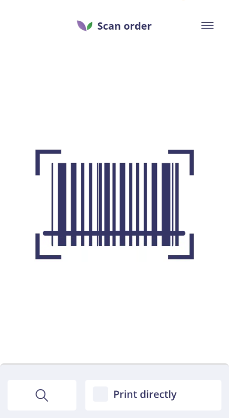
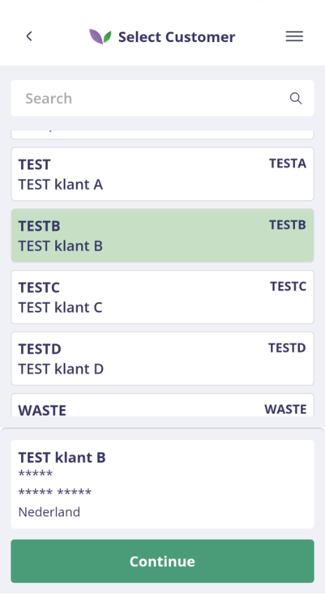
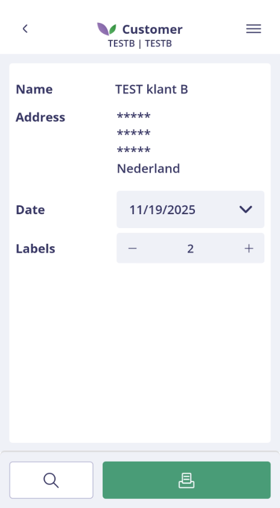
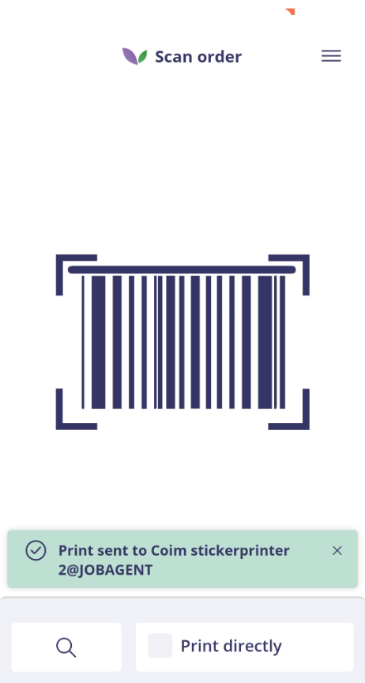

# Florisoft Shipping App – Address Label Manual

## Introduction

This manual describes how to use the Address Label functionality in the Florisoft Shipping App.  
The workflow of the app is configured based on the relevant policies.

With this app, users can quickly print address labels in operational processes such as order picking or final outbound checks.

> ℹ️ The extended manual for configuring these policies is available via the following link:  
> **[Policies Address Label EN](https://github.com/florisoft/User.Manuals/blob/main/CLOUD%20APPLICATIONS/Apps%20Android/App%20Shipping/Adress%20Label/Policies%20Adress%20label%20-%20EN.md)**

**Requirements:**

- Florisoft Shipping App  
- License for Address Label

---

## Address Label Procedure

### When do you print an address label?

When an order has been fully picked, checked, and prepared for transport, you print an address label.  
This label ensures correct identification during the internal logistics process and during handover to the carrier. Printing the label at the correct moment helps prevent shipping errors and ensures smooth continuation of follow-up processes.

> ℹ️ Note: When the print process is started automatically from another Florisoft app (such as *TrolleyLoading* or *Picking*), the initial steps are skipped. You are taken directly to the print or confirmation screen in the Shipping App.

### Step 1: Open the Shipping App

Open the Shipping App from the Florisoft Hub App or using the Shipping App icon on your device. Log in with your user credentials.

### Step 2: Select ‘Print Address Label’

After logging in, you will enter the navigation screen. Tap the **Print Address Label** tile.

### Step 3: Scan or select the order

The scanning screen opens immediately. You can scan one of the supported barcodes (based on your policy configuration).  
Supported barcodes may include:

- Order barcode  
- Trolley barcode  
- Cvar15  

Once the barcode is scanned or the order is selected, you are automatically taken to the print screen.

---

### Step 4: Search for the order

The scan screen opens. If scanning is not possible, you can use the search function at the bottom of the screen to manually look up the order.

<b>Klik hier voor een voorbeeld!</b>

### Step 4a: Select the customer

The customer selection screen opens automatically. Here you select the customer for whom you want to print the address label.  
Scroll through the list or use the search bar at the top.

When you select a customer, a summary of the customer details appears at the bottom of the screen.  
Tap **Continue** to proceed.

<b>Klik hier voor een voorbeeld!</b>

### Step 5: Verify customer details and print settings

You now enter the customer overview. Here you verify:

- Customer name  
- Address details  
- Date** to print on the label (adjustable via the date picker)  
- Number of labels to print (using the plus and minus buttons)

Check all information carefully.  
When everything is correct, tap the **green print button** at the bottom of the screen.

<b>Klik hier voor een voorbeeld!</b>

### Step 6: Print confirmation

After sending the print job, you are automatically returned to the scan screen.  
A green confirmation message appears at the bottom, confirming that the label has been successfully sent to the assigned printer.

The app is then immediately ready for the next order.

<b>Klik hier voor een voorbeeld!</b>

---
