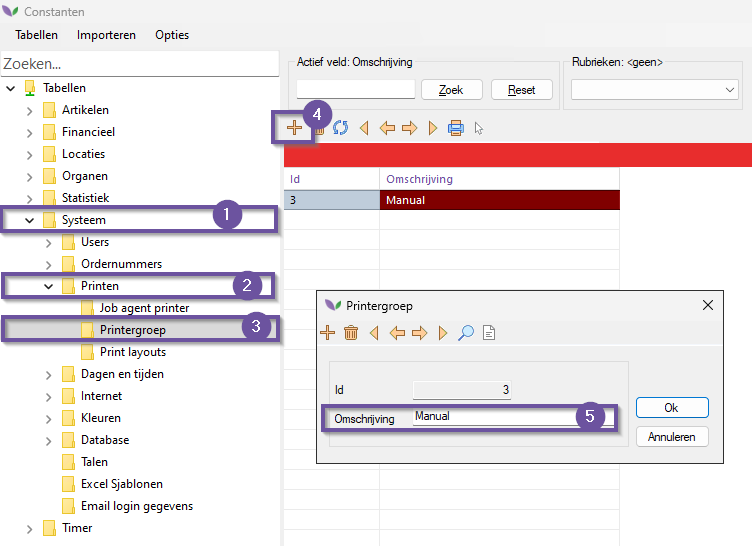
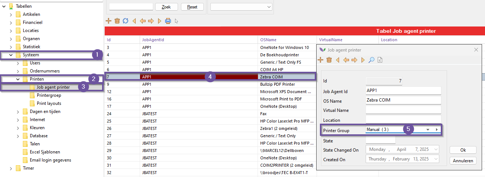

# Handleiding Job-Agent

In deze handleiding leert u hoe u de Job-Agent start vanuit de Florisoft Windows Hub-App.

## Vereisten

Om de stappen in deze handleiding te volgen, dient u te beschikken over het volgende:

- Een recente installatie van de cloudserver.
- De Hub-App dient geïnstalleerd te zijn. Is deze nog niet geïnstalleerd? Lees dan [hier](https://github.com/florisoft/User.Manuals/blob/main/CLOUD%20APPLICATIONS/App%20Hub/Hub-App%20Installatie%20NL.md) hoe u dit doet.

## Job-Agent

| Stap | Uitleg |
|:-:|:--|
| **1** | Open de lokale Windows Hub-App en log in met de toegewezen Florisoft Hub-App gebruiker, of druk op **Catalogue**. 

<b>Klik hier voor uw voorbeeld!</b>

|
| **2** | Klik op de paarse pijltjestoets in de balk om de Job-Agent applicatie te starten.

<b>Klik hier voor uw voorbeeld!</b>

|
| **3** | De Job-Agent applicatie wordt nu gestart. U ziet een loginscherm verschijnen. Klik rechtsboven in het loginscherm op het hamburgermenu. 

<b>Klik hier voor uw voorbeeld!</b>

|
| **4** | Controleer of bij het wolk-icoontje de juiste cloudserver-URL is ingevuld. 

<b>Klik hier voor uw voorbeeld!</b>

|
| **5** | Zorg ervoor dat de volgende instellingen zijn ingeschakeld:  - **Handles print jobs locally** - **Login automatically** - **Launch on Windows login** 

<b>Click here for the example image!</b>

|
| **6** | Nadat u deze instellingen heeft gecontroleerd, drukt u op de **Save**-knop. U wordt nu gevraagd om de Job-Agent te herstarten. Klik op **Yes**. 

<b>Klik hier voor uw voorbeeld!</b>

|
| **7** | Log in met uw persoonlijke Job-Agent gebruiker.

<b>Klik hier voor uw voorbeeld!</b>

 |
| **8** | U bevindt zich nu in het **Jobs**-scherm. Hier ziet u de taken (jobs) die uw lokale Job-Agent binnenhaalt via de cloudserver.

<b>Klik hier voor uw voorbeeld!</b>

 |

## Printer groepen

In Florisoft (en de apps) zijn enkel printers zichtbaar die ingesteld zijn onder een printergroep.
Systeemgebruikers moeten vervolgens gekoppeld worden aan een printergroep om de ingesteld printers te zien in zijn of haar werkzaamheden.

*Printers die beschikbaar zijn via de jobagent worden automatisch aangemaakt in Florisoft, deze hoeft u dus <u>niet</u> zelf aan te maken.*

Volg de onderstaande stappen (in uw Florisoft backoffice) om de printers, printergroepen en gebruikers in te stellen.

|Stap|Uitleg|
|:-:|:--|
|**1**|Vanuit de Florisoft Navigator opent u de constanten.

<b>Klik hier voor uw voorbeeld!</b>

|
|**2**|In de constanten navigeer je naar : **Systeem→Printen→Printergroep**

<b>Klik hier voor uw voorbeeld!</b>

|
|**3**|Gebruik het + icoon om een nieuwe printergroep aan te maken, vul hier de volgende velden in:  **Omschrijving**, dit is de in de grid zichtbare naam.

<b>Klik hier voor uw voorbeeld!</b>

|
|**4**|Sla de nieuwe groep op door op **Ok** te drukken.|
|**5**|Navigeer nu naar **Systeem→Printen→Job agent printer**, open vervolgens een printer object en stel onder Printer Group in onder welke printergoep het valt.

<b>Klik hier voor uw voorbeeld!</b>

|
|**6**|Herhaal de laatste stap voor alle relevante printer voor de aangemaakte groep|