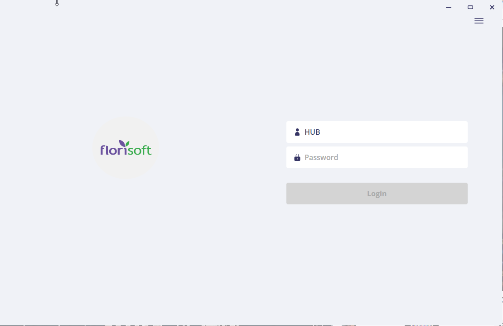
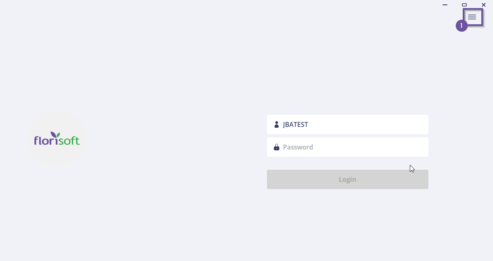
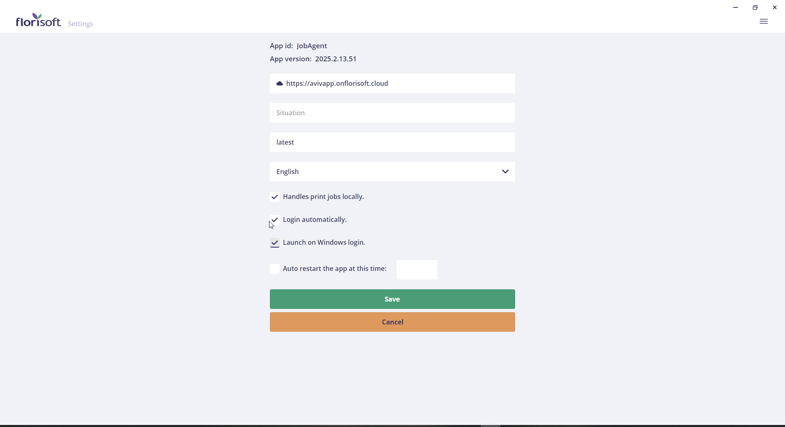
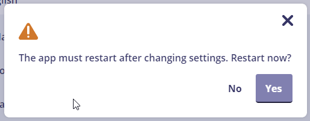
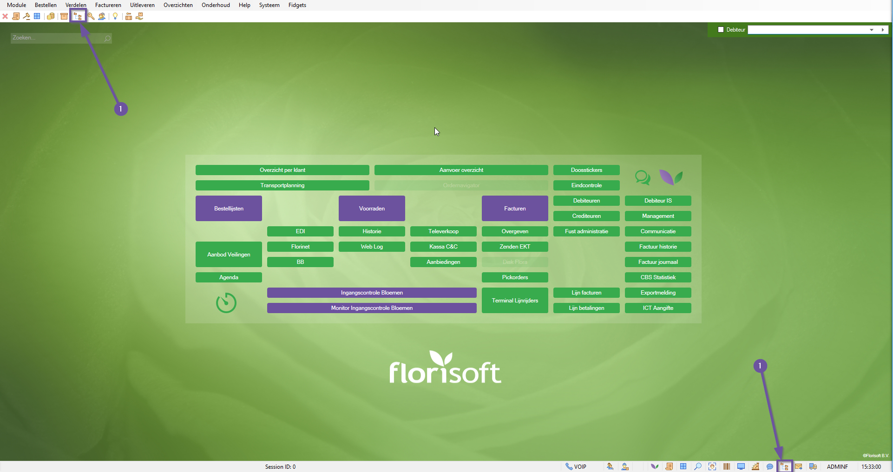

# Job-Agent Manual

In this manual, you will learn how to start the Job-Agent from the Florisoft Windows Hub-App.

## Prerequisites

To follow the steps in this manual, you need the following:

- A recent installation of the cloud server.
- The Hub-App must be installed. If it is not yet installed, read [here](https://github.com/florisoft/User.Manuals/blob/main/CLOUD%20APPLICATIONS/App%20Hub/Hub-App%20Installation%20EN.md) to learn how to do so.

## Job-Agent

| Step | Explanation |
|:-:|:--|
| **1** | Open the local Windows Hub-App and log in with the assigned Florisoft Hub-App user, or click **Catalogue**.

<b>Click here for the example image!</b>

 |
| **2** | Click the purple arrow button in the bar to start the Job-Agent application. 

<b>Click here for the example image!</b>

|
| **3** | The Job-Agent application will now launch. You will see a login screen. Click the hamburger menu in the top-right corner of the login screen.

<b>Click here for the example image!</b>

|
| **4** | Check if the correct cloud server URL is entered next to the cloud icon. 

<b>Click here for the example image!</b>

|
| **5** | Ensure that the following settings are enabled:  - **Handles print jobs locally** - **Login automatically** - **Launch on Windows login** 

<b>Click here for the example image!</b>

|
| **6** | After verifying these settings, click the **Save** button. You will now be prompted to restart the Job-Agent. Click **Yes**.

<b>Click here for the example image!</b>

 |
| **7** | Log in with your personal Job-Agent user. 

<b>Click here for the example image!</b>

|
| **8** | You are now in the **Jobs** screen. Here, you will see the tasks (jobs) that your local Job-Agent retrieves from the cloud server.

<b>Click here for the example image!</b>

## Printer groups

Printers in Florisoft (and in the apps) are only visible when they fall under a printer group.
System users then need to linked to a printergroups allowing the printers to be seen during daily activities.

*Printers available through the job agent are automatically created in Florisoft, meaning that you don't have to create them yourself.*

|Stap|Uitleg|
|:-:|:--|
|**1**|From the Florisoft navigator open the constants.

<b>Click here for the example image!</b>

|
|**2**|In the constants navigate to : **System→To Print→Printer Group**.

<b>Click here for the example image!</b>

|
|**3**|Using the + icon create a printer group, fill out the **Description** field, this is the name that will be visible in the grid.

<b>Click here for the example image!</b>

|
|**4**|Save the group by clicking on the **Ok** button.|
|**5**|Now navigate to **System→To print→Job agent printer**, open a printer object and configure under which printer group the printer will fall under.

<b>Click here for the example image!</b>

|
|**6**|Repeat the last step for all relevant printers for the newly created printer group.|
