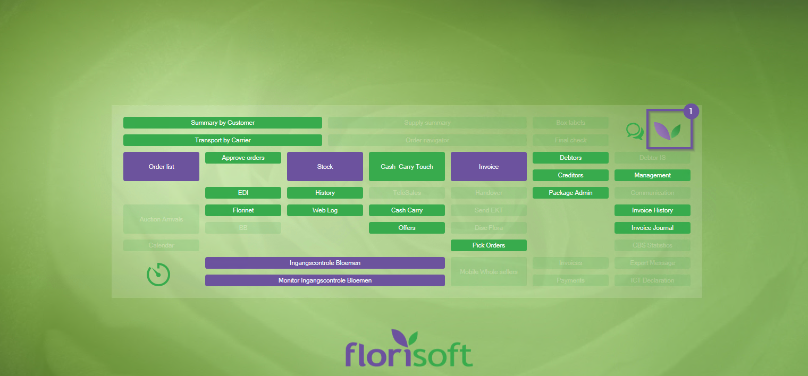
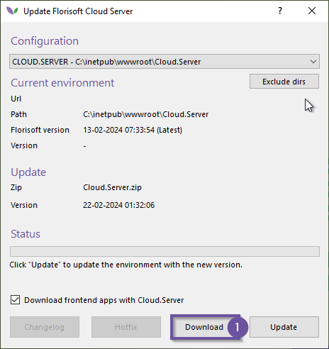
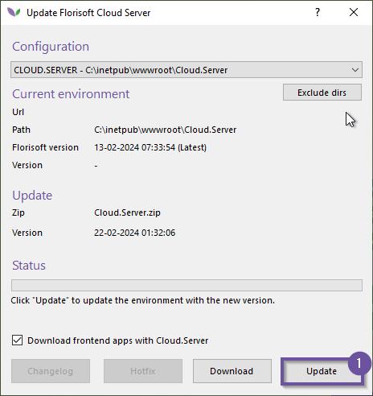

# Updaten van de Cloud Server

Dit document beschrijft de wijze waarop de Florisoft-cloudserver wordt bijgewerkt.

Voordat we beginnen, is het belangrijk om te weten dat de cloudserver en de backofficeversie niet te ver uit elkaar mogen lopen. Dit kan namelijk onverwacht en ongewenst gedrag veroorzaken in uw omgeving. Het advies is dan ook om waar mogelijk de cloudserver en backoffice gelijktijdig bij te werken. Zorg ervoor dat er niet meer dan een paar weken tussen de twee versies zitten.

Standaard wordt een nieuwere versie van de cloudserver gedownload tijdens het bijwerken van de backoffice; deze moet u vervolgens nog installeren. Daarnaast kunt u er ook voor kiezen om zelf de nieuwste versie van de cloudserver te downloaden en te installeren.

Voordat u de cloudserver gaat bijwerken, is het van belang dat er geen gebruikers zijn die actief gebruik maken van de functionaliteiten van de cloudserver.

<b>Klik hier voor uw voorbeeld!</b>

Zorg ervoor dat er geen actieve gebruikers zijn op de cloudserver voor dat u gaat updaten, indien nodig kan u de gebruikers disconnecten.

*Volg daarna de volgende stappen:*

|Stap|Uitleg|
|:-:|:--|
|**1**|Klik met de rechtermuisknop op het Florisoft logo (in de navigator).

<b>Klik hier voor uw voorbeeld!</b>

|
|**2**|Dit opent een optiemenu, klik hier op de optie **Update Florisoft Cloud Server**.

<b>Klik hier voor uw voorbeeld!</b>

|
|**3**|U krijgt nu het cloud server updatescherm te zien, wanneer u de cloudserver los wilt updaten klikt u eerst op de **Download** knop u de nieuwste versie binnen te halen.   Heeft u al een nieuwe versie binnen via een back office update dan hoeft u niet op de download knop te drukken aangezien er al een nieuwe versie in binnen gehaald met de update.

<b>Klik hier voor uw voorbeeld!</b>

|
|**4**|Nadat u de nieuwste versie heeft binnen gehaald klikt u op de **update** knop waarna de nieuwste versie geïnstalleerd zal worden. 

<b>Klik hier voor uw voorbeeld!</b>

|
|**5**|U heeft nu de cloud server geüpdatet.|