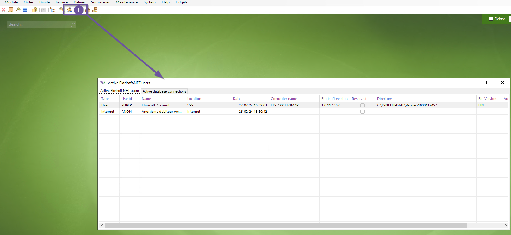
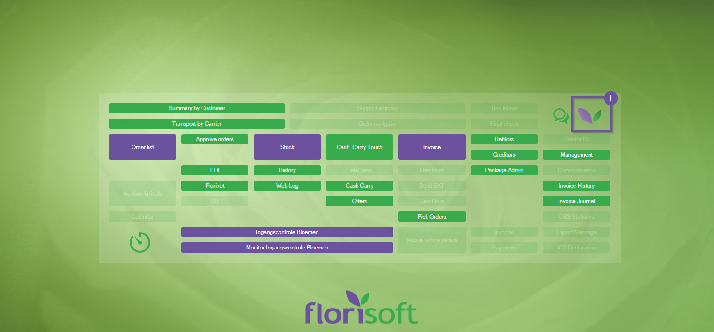
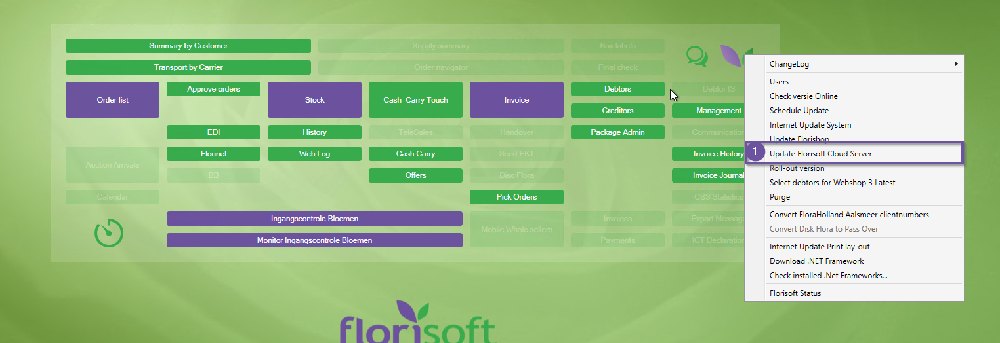
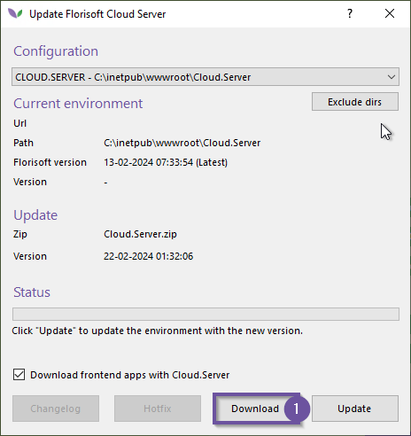
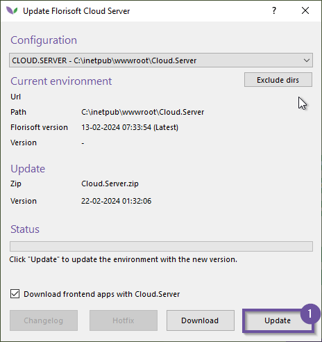

# Updating the Cloud Server

This document describes the process of updating the Florisoft cloud server.

Before we start, it is important to know that your Florisoft backoffice and cloud server versions are not too far part. 
Having many different versions between the two can cause unexpected and unwanted behaviour. It is recommended that when possible the cloud server and backoffice
are updated simultaneously. If this is not possible try to update your backoffice within two weeks.

On default a new cloudserver is downloaded when updating the backoffice; you will still need to install/update the downloaded cloud server update.
You can also choose to download the cloud server independently and then update it seperately as well.

Before you update the cloud server do make sure there are no users actively using the cloud server's functionalities, if need be disconnect the users.

<b>Click here for the example image!</b>

*Follow the steps below:*

|Step|Explanation|
|:-:|:--|
|**1**|Click on the Florisoft logo (navigator) with the right mouse button.

<b>Click here for the example image!</b>

|
|**2**|This opens a context menu, click on the option **Update Florisoft Cloud Server**

<b>Click here for the example image!</b>

|
|**3**|You should now see the cloud server update screen, when you want to update the cloud server seperately click the **Download** button first to fetch the newest version.  If you already got the newest cloud server version when updating your backoffice there is no need to download the newest version again.

<b>Click here for the example image!</b>

|
|**4**|After you fetched the newest version, click the **update** button which installs the newest version onto your system.

<b>Click here for the example image!</b>

|
|**5**|You have now updated the cloud server.|