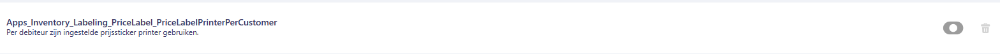

# Policy Handleiding Price Label

In deze handleiding leest u over de policies die behoren tot de Price Label-functionaliteit van de Inventory-app.  
Met dit document kunt u de Price Label-functionaliteit configureren voor uw specifieke use-case.

## Waar vind ik de Price Label Policies?

Volg de onderstaande stappen om de policies van de Price Label-functionaliteit in de Inventory-app te vinden.  
Gebruik [deze handleiding](https://github.com/florisoft/User.Manuals/blob/main/BASIS/Policy%20Management/Handleiding%20Policy%20Management%20NL.md) om te leren hoe u policies instelt en beheert.

| Stap | Uitleg |
|:-:|:--|
| **1** | Open het constantenscherm vanuit de navigator.

<b>Klik hier voor uw voorbeeld!</b>

|
| **2** | Navigeer naar:  **Systeem → Users → Policy Beheer**. 

<b>Klik hier voor uw voorbeeld!</b>

|
| **3** | In een (nieuwe) policy navigeert u naar:  **Apps → Inventory → Labeling → **.

<b>Klik hier voor uw voorbeeld!</b>

|

## Policies

Hieronder vindt u een lijst met relevante policies voor Price Label. Per policy wordt beschreven hoe u deze instelt en welke impact deze heeft op de werking van de app. test

### TotalPriceLabelsDisplayType

<b>Klik hier voor uw voorbeeld!</b>

### ProcessBluComBarcodes

Bij het aanzetten van deze policy instelling is het mogelijk om BluCom Barcodes te scannen.

<b>Klik hier voor uw voorbeeld!</b>

### AskPriceLabelCopyAmount

Vraag hoeveel kopieën prijsstickers geprint moeten worden bij het afdrukken van prijsstickers.

<b>Klik hier voor uw voorbeeld!</b>

### CheckIfPriceLabelPrinted

Moet in de app gevraagd worden om een bevestiging wanneer er al een prijssticker is afgedrukt voor de gescande order.

<b>Klik hier voor uw voorbeeld!</b>

### CheckIfOrderHasHandling

<b>Klik hier voor uw voorbeeld!</b>

### PriceLabelPrinterPerCustomer

Gebruik in plaats van de bij de onderstaande policy ingestelde sticker layout de prijssticker die ingesteld bij de debiteur.

<b>Klik hier voor uw voorbeeld!</b>

### PriceLabelLayout

Een standaard prijssticker die gebruikt wordt bij het afdrukken van prijsstickers vanuit de price label functionaliteit. 

<b>Klik hier voor uw voorbeeld!</b>

### PriceLabelPrinter

Welke printer moet gehanteerd worden bij het afdrukken van prijsstickers van uit de price label functionaliteit.

<b>Klik hier voor uw voorbeeld!</b>

