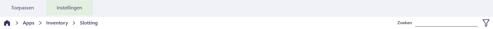
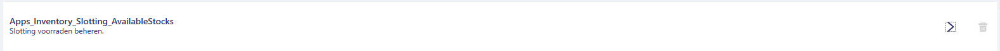
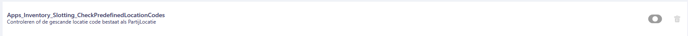

# Policy Handleiding Slotting

In deze handleiding leest u over de policies die behoren tot de Slotting-functionaliteit van de Inventory-app.  
Met dit document kunt u de Slotting-functionaliteit configureren voor uw specifieke use-case.

## Waar vind ik de Slotting Policies?

Volg de onderstaande stappen om de policies van de Slotting-functionaliteit in de Inventory-app te vinden.  
Gebruik [deze handleiding](https://github.com/florisoft/User.Manuals/blob/main/BASIS/Policy%20Management/Handleiding%20Policy%20Management%20NL.md) om te leren hoe u policies instelt en beheert.

| Stap | Uitleg |
|:-:|:--|
| **1** | Open het constantenscherm vanuit de navigator.

<b>Klik hier voor uw voorbeeld!</b>

|
| **2** | Navigeer naar:  **Systeem → Users → Policy Beheer**. 

<b>Klik hier voor uw voorbeeld!</b>

|
| **3** | In een (nieuwe) policy navigeert u naar:  **Apps → Inventory → Slotting**.

<b>Klik hier voor uw voorbeeld!</b>

|

## Policies

Hieronder vindt u een lijst met relevante policies voor Slotting. Per policy wordt beschreven hoe u deze instelt en welke impact deze heeft op de werking van de app.

### AvailableStocks

Welke voorraads met de Slotting functionaliteit beheert kunnen worden.

<b>Klik hier voor uw voorbeeld!</b>

### CheckPredefinedLocationCodes

<b>Klik hier voor uw voorbeeld!</b>

### LinkParcelToLocationThenResetLocation

<b>Klik hier voor uw voorbeeld!</b>

