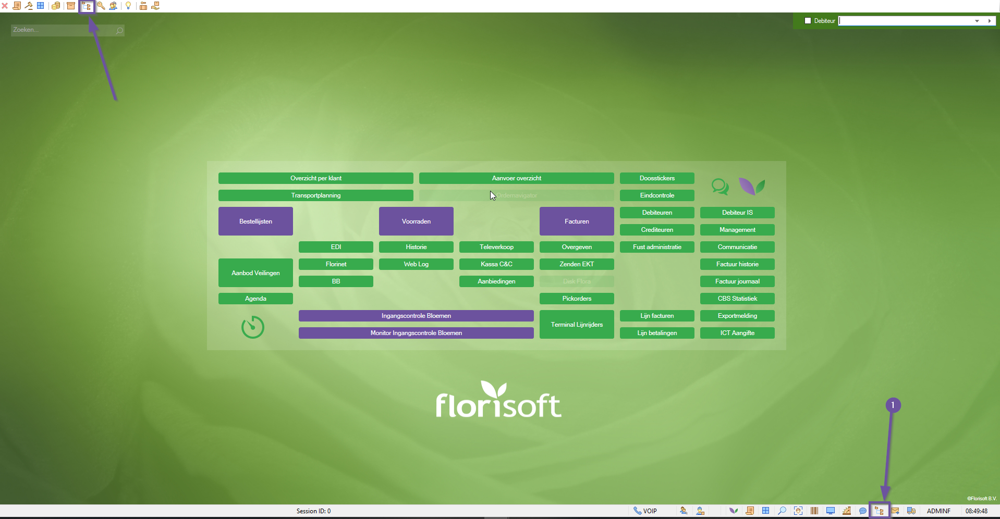
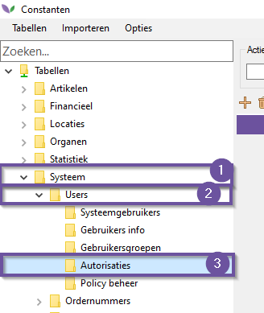
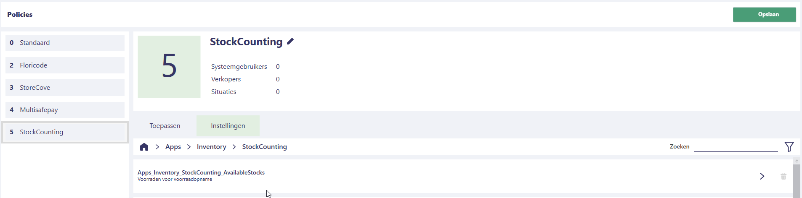
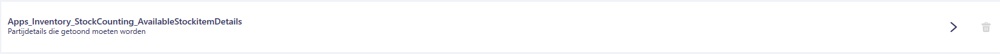
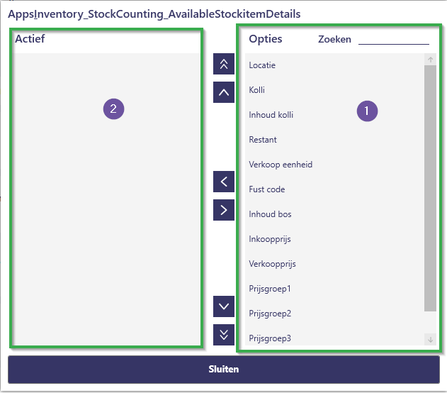
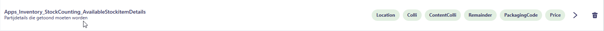
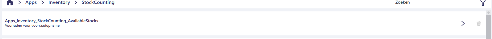
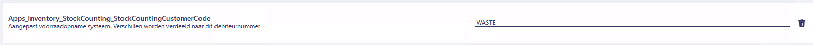

# Policy Handleiding Stock Counting

In deze handleiding leest u over de policies die behoren tot de Stock Counting-functionaliteit van de Inventory-app.  
Met dit document kunt u de Stock Counting-functionaliteit configureren voor uw specifieke use-case.

## Waar vind ik de Stock Counting Policies?

Volg de onderstaande stappen om de policies van de Stock Counting-functionaliteit in de Inventory-app te vinden.  
Gebruik [deze handleiding](https://github.com/florisoft/User.Manuals/blob/main/BASIS/Policy%20Management/Handleiding%20Policy%20Management%20NL.md) om te leren hoe u policies instelt en beheert.

| Stap | Uitleg |
|:-:|:--|
| **1** | Open het constantenscherm vanuit de navigator.

<b>Klik hier voor uw voorbeeld!</b>

|
| **2** | Navigeer naar:  **Systeem → Users → Policy Beheer**. 

<b>Klik hier voor uw voorbeeld!</b>

|
| **3** | In een (nieuwe) policy navigeert u naar:  **Apps → Inventory → Stock Counting**.

<b>Klik hier voor uw voorbeeld!</b>

|

## Policies

Hieronder vindt u een overzicht van relevante **policies** voor de functionaliteit *Stock Counting*.  
Per policy wordt beschreven hoe deze ingesteld kan worden en welke invloed dit heeft op het gedrag van de app.

> ⚠️ Houd er rekening mee dat tijdens de doorontwikkeling van de app regelmatig **nieuwe policies** worden toegevoegd of bestaande worden aangepast.  
> Waar nodig wordt de beschrijving van een policy bijgewerkt om de werking correct te blijven toelichten.

Sommige policies zijn specifiek bedoeld voor bepaalde klantinrichtingen of uitzonderingssituaties.  
Voor deze policies wordt mogelijk geen algemene uitleg opgenomen in deze handleiding.

### PrintSettings
Op deze pagina stelt u de **printinstellingen** in voor het afdrukken van *prijslabels (`PriceLabels`)* en *voorraadlabels (`StockLabels`)*. Voor beide functies configureert u afzonderlijk:

- **De printer** via de policy:  
  - `PriceLabelPrinter` – voor prijslabels  
  - `StockLabelPrinter` – voor voorraadlabels

- **De lay-out** via de policy:  
  - `PriceLabelLayout` – voor prijslabels  
  - `StockLabelLayout` – voor voorraadlabels

Daarnaast kunt u met de policies `PriceLabelPrinterDescription` en `StockLabelPrinterDescription` de naam of omschrijving van de printer aanpassen. Deze aangepaste omschrijving wordt weergegeven in de app, zodat gebruikers eenvoudiger de juiste printer kunnen herkennen.

> **Belangrijk:** Voor het gebruik van printers binnen de app is de **JobAgent** vereist.  
> Als de JobAgent niet actief is, worden er **géén printers weergegeven** in dit overzicht en is afdrukken via de app niet mogelijk.

### StockItemDetailSetting - AvailableStockItemDetails

Met deze policy stelt u in welke voorraadpartij-eigenschappen u zichtbaar wil hebben bij het openen van de partij in de stockcounting app. 

<b>Klik hier voor uw voorbeeld!</b>

|Stap|Uitleg|
|:-:|:--|
|**1**|Open de policy, dit opent een nieuw scherm, aan de rechterkant (#1) van dit scherm ziet u de alle mogelijke partij-eigenschappen die getoond kunnen worden. Links (Active) ziet u de partij-eigenschappen die getoond worden (#2).

<b>Klik hier voor uw voorbeeld!</b>

|
|**2**|Met de knop  zet u een partij eigenschap zichtbaar in de app (actief) en met "> zet u de zichtbare optie op inactief.|
|**3**|Met de knoppen ,  beïnvloed u de volgorde van de partij-eigenschappen, selecteer daarvoor een regel en gebruik deze knoppen om de eigenschap omhoog of omlaag in te delen.|
|**4**|Met de knoppen ,  zet u de geselecteerde regel in een keer als bovenste of onderste item.|
|**5**|Klik op sluiten om de wijzigingen op te slaan, u ziet nu de eigenschapindeling onder de policykaart staan.

<b>Klik hier voor uw voorbeeld!</b>

|

Na het instellen van deze policy ziet het bijhorende scherm er zo uit :

<b>Klik hier voor uw voorbeeld!</b>

### StockItemDetailSetting - AllowEditStockitemDetails
Standaard kunnen partijdetails niet worden gewijzigd. Met deze policy bepaalt u welke velden binnen de AvailableStockItemDetails wél aangepast mogen worden. Zo behoudt u controle over welke informatie bewerkbaar is voor gebruikers.

### AvailableStocks

Met deze policy stelt u in welke voorraden beschikbaar zijn voor Stockcounting.
Selecteer de voorraden die u beschikbaar wilt stellen voor stock counting.

<b>Klik hier voor uw voorbeeld!</b>

### SetStockItemType

Met deze keuzelijst bepaalt u welk partijtType (`stockItemType`) wordt gescand binnen de **Voorraadtelling**-functionaliteit.  
De keuzelijst biedt de volgende drie opties:

- **VParcel**
- **Parcel**
- **LogPartij**

### ToPickQuantityDisplay

Binnen de **StockCounting**-functionaliteit wordt naast de beschikbare voorraad ook weergegeven hoeveel er nog openstaat aan **pickorders** voor een bepaalde partij.

Met de instelling `ToPickQuantityDisplay` bepaalt u in **welke eenheid** deze te picken hoeveelheid wordt getoond:
- In **stelen**, of
- In de overige **colli-inhoud** (zoals fusten, dozen, etc.)

### StockCountingCustomerCode
De policy `StockCountingCustomerCode` wordt gebruikt om een **debiteurnummer** in te stellen.  
Alle voorraadverschillen die tijdens de voorraadtelling worden geregistreerd, worden aan deze debiteur toegewezen.  

<b>Klik hier voor uw voorbeeld!</b>

### StockCountingCustomerCodePerStock

Met de policy `StockCountingCustomerCodePerStock` wordt niet het algemene debiteurnummer uit `StockCountingCustomerCode` gebruikt,  
maar juist het **debiteurnummer dat per voorraad is ingesteld** voor de voorraadopname.

Dit zorgt ervoor dat voorraadverschillen worden toegewezen aan de specifieke debiteur die bij de betreffende voorraad hoort, in plaats van aan één centrale debiteur.

### StockCountingXorder
Wanneer het aantal in de voorraad wordt aangepast, wordt er – naast de verdeling naar het ingestelde **voorraadopnamedebiteurnummer** – ook automatisch een **xorder** (oftewel een *pickorder*) aangemaakt.
