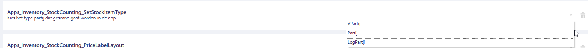
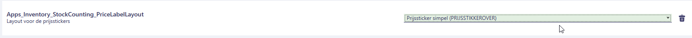
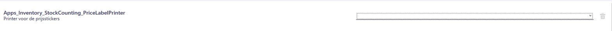
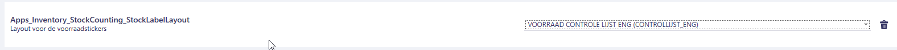
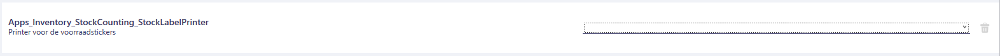
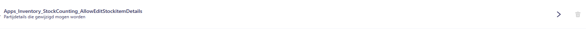
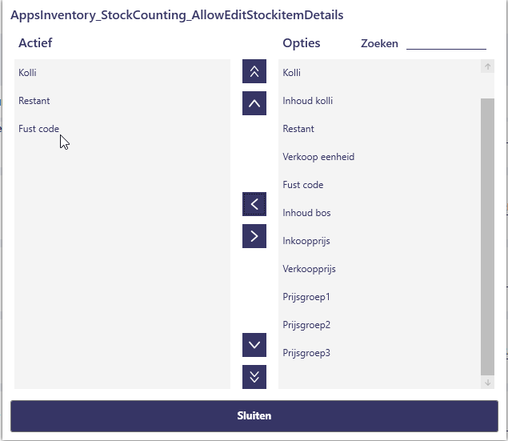
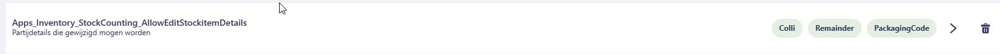
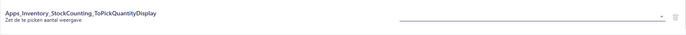

# Policy Handleiding Stock Counting

In deze handleiding leest u over de policies die behoren tot de Stock Counting-functionaliteit van de Inventory-app.  
Met dit document kunt u de Stock Counting-functionaliteit configureren voor uw specifieke use-case.

**Vergeet niet de autorisaties in te stellen, [autorisaties](#autorisaties)**

## Waar vind ik de Stock Counting Policies?

Volg de onderstaande stappen om de policies van de Stock Counting-functionaliteit in de Inventory-app te vinden.  
Gebruik [deze handleiding](https://github.com/florisoft/User.Manuals/blob/main/BASIS/Policy%20Management/Handleiding%20Policy%20Management%20NL.md) om te leren hoe u policies instelt en beheert.

| Stap | Uitleg |
|:-:|:--|
| **1** | Open het constantenscherm vanuit de navigator.

<b>Klik hier voor uw voorbeeld!</b>

|
| **2** | Navigeer naar:  **Systeem → Users → Policy Beheer**. 

<b>Klik hier voor uw voorbeeld!</b>

|
| **3** | In een (nieuwe) policy navigeert u naar:  **Apps → Inventory → Stock Counting**.

<b>Klik hier voor uw voorbeeld!</b>

|

## Policies

Hieronder vindt u een lijst met relevante policies voor Stock Counting. Per policy wordt beschreven hoe u deze instelt en welke impact deze heeft op de werking van de app.

### AvailableStocks

Met deze policy stelt u in welke voorraden beschikbaar zijn voor Stockcounting.
Selecteer de voorraden die u beschikbaar wilt stellen voor stock counting.

<b>Klik hier voor uw voorbeeld!</b>

### AvailableStockItemDetails

Met deze policy stelt u in welke voorraadpartij-eigenschappen u zichtbaar wil hebben bij het openen van de partij in de stockcounting app. 

<b>Klik hier voor uw voorbeeld!</b>

|Stap|Uitleg|
|:-:|:--|
|**1**|Open de policy, dit opent een nieuw scherm, aan de rechterkant (#1) van dit scherm ziet u de alle mogelijke partij-eigenschappen die getoond kunnen worden. Links (Active) ziet u de partij-eigenschappen die getoond worden (#2).

<b>Klik hier voor uw voorbeeld!</b>

|
|**2**|Met de knop  zet u een partij eigenschap zichtbaar in de app (actief) en met "> zet u de zichtbare optie op inactief.|
|**3**|Met de knoppen ,  beïnvloed u de volgorde van de partij-eigenschappen, selecteer daarvoor een regel en gebruik deze knoppen om de eigenschap omhoog of omlaag in te delen.|
|**4**|Met de knoppen ,  zet u de geselecteerde regel in een keer als bovenste of onderste item.|
|**5**|Klik op sluiten om de wijzigingen op te slaan, u ziet nu de eigenschapindeling onder de policykaart staan.

<b>Klik hier voor uw voorbeeld!</b>

|

Na het instellen van deze policy ziet het bijhorende scherm er zo uit :

<b>Klik hier voor uw voorbeeld!</b>

### SetStockItemType

Using this dropdown you select what parcel type (stockItemType) will be scanned in the Stock Count functionality. The dropdown presents us with 3 options :

1. **VParcel** : *uitleg*.

2. **Parcel** : *uitleg*.

3. **StoredStockItem** : *uitleg*.

<b>Klik hier voor uw voorbeeld!</b>

### PriceLabelLayout

In het StockCount component is er de mogelijkheid om een prijssticker te printen, met deze policy selecteer je de stickerlayout die bij daarbij geprint wordt. De keuzes beschikbaar in de dropdown zijn prijsstickerlayouts in uw systeem.

<b>Klik hier voor uw voorbeeld!</b>

### PriceLabelPrinter

Deze policy bepaald naar welke printer de sticker printopdracht word verzonden, gebruikt u een job-agent selecteert u de juiste printer en job agent (\<printernaam\>@\<jobagent>).

<b>Klik hier voor uw voorbeeld!</b>

### StockLabelLayout

In het stockcount component van de Inventory app is het ook mogelijk om voorraadstickers te printen, met deze policy stelt u in welke voorraadstickerlayout gehanteerd wordt. De stickerlayouts beschikbaar in de dropdown zijn de mogelijke voorraadstickerlayouts.

<b>Klik hier voor uw voorbeeld!</b>

### StockLabelPrinter

Deze policy bepaald naar welke printer de voorraadstickerprintopdracht word verzonden, gebruikt u een job-agent selecteert u de juiste printer en job agent (\<printernaam\>@\<jobagent>).

<b>Klik hier voor uw voorbeeld!</b>

### AllowEditStockItemDetails

Deze policy bepaald welke partij-eigenschappen aangepast mogen worden, dit is buitenom de eerder benoemde policy waarin we de zichtbare/actieve eigenschappen instellen. 

<b>Klik hier voor uw voorbeeld!</b>

|Stap|Uitleg|
|:-:|:--|
|**1**|Open de policy, dit opent een nieuw scherm, aan de rechterkant (#1) van dit scherm ziet u de alle mogelijke partij-eigenschappen die getoond kunnen worden. Links (Active) ziet u de partij-eigenschappen die getoond worden (#2).

<b>Klik hier voor uw voorbeeld!</b>

|
|**2**|Met de knop  zet u een partij eigenschap zichtbaar in de app (actief) en met "> zet u de zichtbare optie op inactief.|
|**3**|Met de knoppen ,  beïnvloed u de volgorde van de partij-eigenschappen, selecteer daarvoor een regel en gebruik deze knoppen om de eigenschap omhoog of omlaag in te delen.|
|**4**|Met de knoppen ,  zet u de geselecteerde regel in een keer als bovenste of onderste item.|
|**5**|Klik op close om de wijzigingen op te slaan, u ziet nu de eigenschapindeling onder de policykaart staan.

<b>Klik hier voor uw voorbeeld!</b>

|

### ToPickQuantityDisplay

In de StockCounting functionaliteit staat naast de nog beschikbare voorraad hoeveelheid ook vermeld welke pickorders nog uitstaan voor deze partij. Met deze instelling geef je aan in welke eenheid deze hoeveelheid wordt weergegeven, in stelen of de overige colli inhoud.

<b>Klik hier voor uw voorbeeld!</b>

## Autorisaties

Volg de onderstaande stappen om de nodige autorisaties in te stellen.

|Stap|Uitleg|
|:-:|:--|
|**1**|Vanuit de navigator opent u het constantenscherm.|
|**2**|In het constantenscherm navigeert u naar het pad : **Systeem→Users→Systeem gebruikers**|
|**3**|Open een relevante systeemgebruiker en klik op de knop **autorisatie**, dit opent het autorisaties scherm.|
|**4**|Klik in de bestandsmappen scherm en druk op de F3 toets om het zoekscherm te openen. Gebruik het snelzoekenveld om te zoeken naar de code "425".  **Navigator palmtop/Voorraad opname_425** zet deze autorisatie **"Alle handelingen toegestaan"**. Druk vervolgens op **ok** om de wijzigingen op te slaan.|
|**5**|Herhaal dit voor de andere gebruikers, je kan dit versnellen door in het autorisatiescherm op de knop **"kopie autorisatie"** te drukken.|