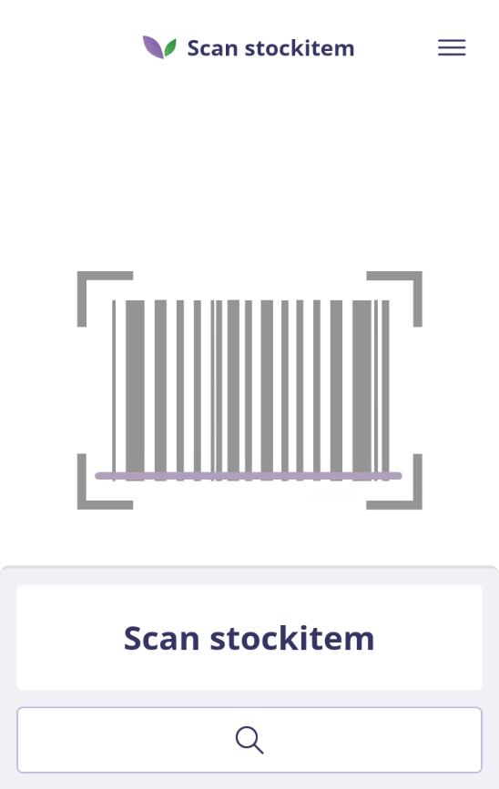
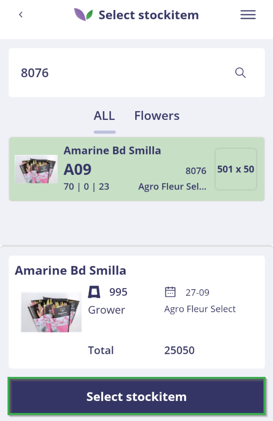
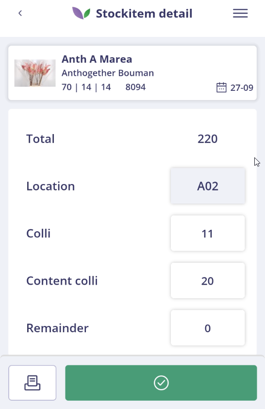

# Florisoft Inventory App - Stock Counting Handleiding

## Inleiding

Deze handleiding beschrijft het gebruik van de Stock Counting-functionaliteit in de Florisoft Inventory App. De workflow van de app is geconfigureerd op basis van de relevante policies.

De uitgebreide handleiding voor het instellen van deze policies is beschikbaar via de volgende link: [Policies Stock Counting NL](https://github.com/florisoft/User.Manuals/blob/main/CLOUD%20APPLICATIONS/Inventory%20App/Stock%20Counting/Policies%20Stock%20Counting%20NL.md)

**Benodigdheden:**

- Florisoft Inventory App
    
- Backoffice Voorraadmodule
## Stappenplan Voorraadcontrole

### Stap 1: Inloggen in de Inventory App

Open de Inventory app vanuit de Florisoft Hub-App of via het Inventory-App-icoon. Log in met uw gebruikersgegevens. 

<b>Klik hier voor uw voorbeeld!</b>

### Stap 2: Navigeren naar Stock Counting

Na het inloggen komt u in het navigatiescherm. Klik op de tegel **Stock Counting**.

<b>Klik hier voor uw voorbeeld!</b>

### Stap 3: Controle in de backoffice voorbereiden

Open het voorraadscherm in de backoffice om te zien welke voorraden al zijn gecontroleerd.

<b>Klik hier voor uw voorbeeld!</b>

Activeer vervolgens het voorraadopnamescherm. Hierin worden met de app gecontroleerde voorraadregels automatisch groen gemarkeerd.

**Opties → Voorraadopname → Activeren**

<b>Klik hier voor uw voorbeeld!</b>

### Stap 4: Partij scannen of zoeken

In de Inventory App opent u de Stock Counting-functionaliteit. U kunt voorraadpartijen scannen

<b>Klik hier voor uw voorbeeld!</b>

of zoeken op:

<b>Klik hier voor uw voorbeeld!</b>

- Artikelnaam
    
- Partijnummer
    
- VPartijnummer
    
- Scancode
    
- Scancode2
    

Alleen partijen binnen geconfigureerde voorraden worden getoond.

### Stap 5: Selecteer een partij

Klik op **Select stock item** om het detail van de partij te openen. Als u de partij via scannen heeft geselecteerd, wordt dit scherm automatisch geopend.

<b>Klik hier voor uw voorbeeld!</b>

### Stap 6: Controleer en pas waarden aan

Pas in het Stockitem-detailscherm de voorraadwaarden aan waar nodig. Als een partij al eerder is gecontroleerd, herkent u dit aan een oranje banner boven in het scherm. Wanneer er nog pickorders openstaan op de partij, wordt dit ook weergegeven in het scherm. Houd er rekening mee dat het weergegeven totaal inclusief het aantal is dat nog gepickt moet worden.

<b>Klik hier voor uw voorbeeld!</b>

### Stickers printen

In het detailscherm kunt u voorraad- of prijsstickers printen. De beschikbare lay-outs en printers zijn vooraf ingesteld.

Klik op het printsjabloon, geef het gewenste aantal labels op en klik op **Print**. U kunt zowel voorraad labels als prijssticker labels selecteren, afhankelijk van het gekozen sjabloon.

<b>Klik hier voor uw voorbeeld!</b>

### Stap 7: Voorraad bevestigen en doorgaan

Druk op de groene knop om de gecontroleerde voorraadstand op te slaan. U krijgt een bevestiging op het scherm en kunt direct doorgaan met het controleren van de volgende partij, bijvoorbeeld door deze direct te scannen. Als er een wijziging is aangebracht en de gebruiker scant direct door, verschijnt er een melding met de aangebrachte wijziging. Deze melding moet worden bevestigd voordat men verder kan gaan.

<b>Klik hier voor uw voorbeeld!</b>

<b>Klik hier voor uw voorbeeld!</b>

### Stap 8: Controle in de backoffice

Na controle wordt de bijbehorende voorraadregel groen gemarkeerd en gevuld met de datum en tijd van de controle, de gebruiker die de controle heeft uitgevoerd en de gekoppelde verkoper.

Klik op een voorraadregel om het verdelingsscherm te openen en bekijk de gemaakte verdelingen.

<b>Klik hier voor uw voorbeeld!</b>

### Stap 9: Herhalen van de controle

Herhaal bovenstaande stappen voor alle voorraadpartijen. 

### Stap 10: Afronden van de controle

Aan het einde van de controle is zichtbaar of alle voorraadregels zijn gecontroleerd. Regels die niet als gecontroleerd zijn gemarkeerd, moeten nog worden verwerkt. Zodra alle regels correct zijn gecontroleerd, kan het scherm worden gereset zodat bij een volgende controle weer vanaf het begin gestart kan worden:

**Opties → Voorraadopname → Resetten**

<b>Klik hier voor uw voorbeeld!</b>

---

Deze handleiding is gebaseerd op de actuele Inventory App en kan periodiek worden bijgewerkt met nieuwe functionaliteit of aangepaste policies.