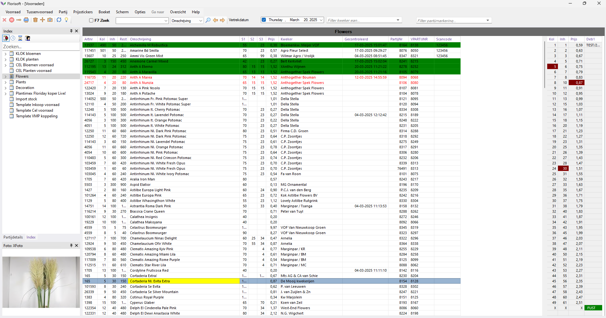

# Florisoft Inventory App - Stock Counting Handleiding

In deze handleiding doorloopt u het proces van de Stock Counting-functionaliteit van de Inventory App. Deze handleiding is geschreven met als uitgangspunt dat de workflow van de app al is geconfigureerd aan de hand van de bijbehorende policies.

Voor deze handleiding heeft u zowel een backoffice-client als een inventory app nodig.

Volg de onderstaande stappen. Per stap staat aangegeven waar deze stap plaatsvindt:

| Stap | Uitleg |
|:-:|:--|
| **1** | **Inventory app** Open de Inventory app vanuit de Florisoft Hub-App of via het Inventory-App-icoon. Log in met uw gebruikergegevens.

<b>Klik hier voor uw voorbeeld!</b>

|
| **2** | **Inventory app** Bij het openen van de app komt u terecht in het navigatiescherm. Vanuit hier opent u de Stock Counting-functie door op de bijbehorende tegel te klikken.

<b>Klik hier voor uw voorbeeld!</b>

 |
| **3** | **Backoffice** Om te zien welke voorraden al gecontroleerd zijn, opent u het Florisoft voorraadscherm.

<b>Klik hier voor uw voorbeeld!</b>

 |
| **4** | **Backoffice** In het voorraadscherm activeert u het voorraadopnamescherm. Hierin worden met de app gecontroleerde voorraadregels groen gemarkeerd.  **Opties → Voorraadopname → Activeren** |
| **5** | **Inventory app** Na het openen van de Stock Counting-functionaliteit kunt u een te controleren partij scannen. Dit kan op basis van de volgende waarden:  **1.** Partijnr **2.** Scancode **3.** VPartijnr

<b>Klik hier voor uw voorbeeld!</b>

|
| **5a** | **Inventory app** Daarnaast kunt u partijen zoeken aan de hand van de artikelnaam met de zoekfunctie. Zoek en selecteer de partij die u wilt controleren. U kunt zoeken op:  **1.** Partijnr **2.** Scancode **3.** VPartijnr **4.** Artikelnaam  U kunt alleen voorraadpartijen scannen of zoeken binnen voorraden die geconfigureerd zijn in uw policies. |
| **6** | **Inventory app** Klik op **Select stock item**. 

<b>Klik hier voor uw voorbeeld!</b>

|
| **7** | **Inventory app** Dit opent het Stockitemdetail-scherm, waarin u de relevante waarden kunt aanpassen. Pas hier de nodige waarden aan.

<b>Klik hier voor uw voorbeeld!</b>

|
| **8** | **Inventory app** In dit scherm kunt u ook voorraad- en prijsstickers printen. De lay-outs en printers hiervoor zijn vooraf geconfigureerd.  Om te printen klikt u op het printsjabloon. Dit opent het printlabels-scherm, waarin u aangeeft hoeveel voorraad- en/of prijsstickers u wilt printen. Klik op **Print** om het afdrukken te bevestigen. 

<b>Klik hier voor uw voorbeeld!</b>

|
| **9** | **Inventory app** Nadat u de benodigde waarden heeft aangepast, drukt u op de groene knop om de (geüpdatete) voorraadstand door te geven. Vervolgens krijgt u een melding op uw scherm ter bevestiging dat de partij is gecontroleerd.

<b>Klik hier voor uw voorbeeld!</b>

|
| **10** | **Backoffice** Nadat u in de app de voorraadstand van een partij heeft doorgegeven, wordt de bijbehorende voorraadregel in het voorraadscherm groen gemarkeerd en wordt het veld **Gecontroleerd** gevuld met de datum en tijd van de controle.

<b>Klik hier voor uw voorbeeld!</b>

|
| **11** | **Backoffice** Open nu het verdelingsscherm door op een voorraadregel te klikken. Hier ziet u de verdelingen die zijn gemaakt om de voorraadstand bij te werken. |
| **12** | **Inventory app** Herhaal deze stappen om alle voorraadpartijen te controleren. Ook is het mogelijk om direct een volgende partij te scannen en over te gaan naar de volgende te controleren partij. Uiteraard wordt u gevraagd om de voorraadstand te bevestigen. |
| **13** | **Backoffice** Nadat u alle voorraadpartijen heeft gecontroleerd, reset u het voorraadscherm. Dit doet u als volgt:  **Opties → Voorraadopname → Resetten**

<b>Klik hier voor uw voorbeeld!</b>

 |
